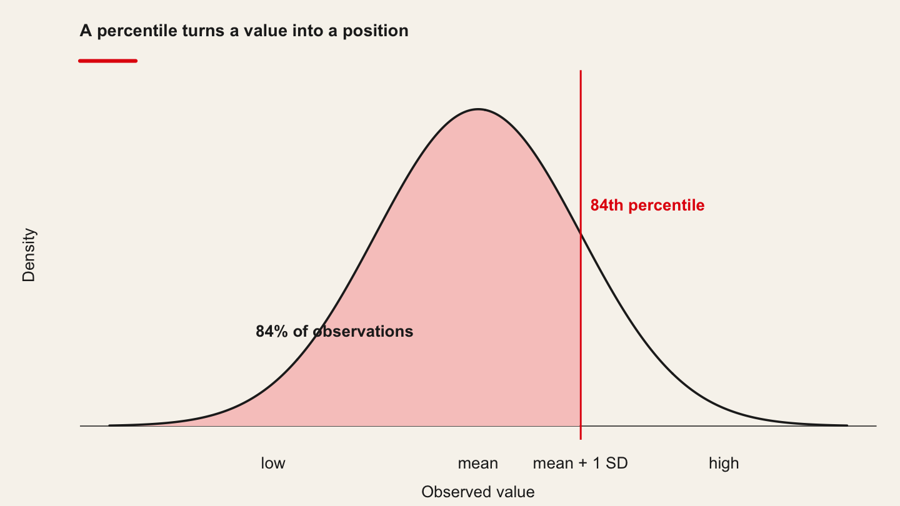
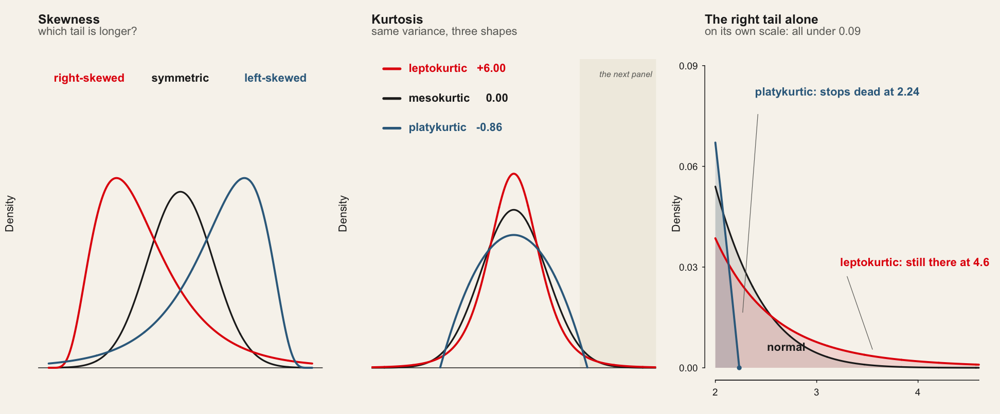

<!-- Imported from https://warin.ca/quant/en/session2_cours/. Content is static so the deck renders without R or Python. -->
## Class Organization {#imported-s02-001 .center .scrollable}

## {#imported-s02-002 .scrollable}

::: panel-tabset
### Class rules

-   **Respect**: Respect other participants and speakers.

-   **Participation**: Participate actively in discussions and activities.

-   **Commitment**: Be committed and involved in the learning process.

-   **Collaboration**: Collaborate with your peers and share your knowledge.

-   **Confidentiality**: Respect the confidentiality of shared information.

### and therefore

-   Cell phones are in backpacks, not on the table.

-   Computers are used for taking notes and following the course, not for personal messages or other activities.

### Schedule

  ----------------------------------------------------------------------------------------
  Session    Day and Time    Building, Room           Instructor    Session Dates
  ---------- --------------- ------------------------ ------------- ------------------
  Session 1  Wed 15:30–18:30 Décelles — Victoriaville Thierry Warin August 26, 2026

  Session 2  Wed 15:30–18:30 Décelles — Victoriaville               September 2, 2026

  Session 3  Wed 15:30–18:30 Décelles — Victoriaville               September 9, 2026

  Session 4  Wed 15:30–18:30 Décelles — Victoriaville               September 16, 2026

  Session 5  Wed 15:30–18:30 Décelles — Victoriaville               September 23, 2026

  Session 6  Wed 15:30–18:30 Asynchronous — no room                 October 7, 2026

  Session 7  Wed 15:30–18:30 Décelles — Victoriaville               October 14, 2026

  Session 8  Wed 15:30–18:30 Décelles — Victoriaville               November 4, 2026

  Session 9  Wed 15:30–18:30 Décelles — Victoriaville               November 11, 2026

  Session 10 Wed 15:30–18:30 Décelles — Victoriaville               November 18, 2026

  Session 11 Wed 15:30–18:30 Décelles — Victoriaville               November 25, 2026

  Session 12 Wed 15:30–18:30 Décelles — Victoriaville               December 2, 2026
  ----------------------------------------------------------------------------------------
:::

## Quote of the day {#imported-s02-003 .center .scrollable}

> It's tough to make predictions, especially about the future

> [Yogi Berra](https://www.goodreads.com/author/quotes/79014.Yogi_Berra)

## Introduction {#imported-s02-004 .center .scrollable background-color="#f0f0f0"}

## {#imported-s02-005 .scrollable}

-   Statistics is a language, constructed by mathematicians.

-   The tools (formulas and processes) are constructs. They do not represent the truth, just the tools to get closer to the truth. They are the **foundations** that we use in our **applications** as a data analyst.

> So, let us spend some time on the foundations first.

## {#imported-s02-006 .scrollable}

> The magic in the data

[Web app](http://shiny.calpoly.sh/Longest_Run/)

## Introduction - Differences between statistics and statistical learning? {#imported-s02-007 .scrollable}

::::: columns
::: {.column style="width:50%;"}
Statistics: decision making under uncertainty.

*Statistics* is that branch of knowledge which deals with the multiplicity of data, its

-   collection,

-   analysis, and

-   interpretation
:::

::: {.column style="width:50%;"}
Statistical learning is a vast set of tools for *understanding data*

-   classified as *supervised learning*: building a statistical model for predicting, or estimating, and output based on one (single) or more (multiple) inputs.

-   classified as *unsupervised learning*: there are inputs, but no supervising output
:::
:::::

> The goal is to understand the models, intuitions, and strengths and weaknesses of the various approaches

## {#imported-s02-008 .scrollable}

:::::: columns
::: {.column style="width:50%;"}
-   scalar, random variable, vector, matrix

-   quantitative values versus qualitative values

    -   quantitative: numerical (continuous or discrete)

    -   qualitative: categorical (nominal or ordinal)
:::

:::: {.column style="width:50%;"}
::: cell
```{mermaid}
graph TB
A[Types of data] --> B[Quantitative]; B --> D{Numerical}
A --> C[Qualitative]; C --> E{Categorical}

D --> F(Continuous)
D --> G(Discrete)

E --> H(Ordinal)
E --> I(Nominal)
```
:::
::::
::::::

## {#imported-s02-009 .scrollable}

---------------------------------------------------------------------------------------------------------
  Numerical                                            Examples                   Visualizations
  ---------------------------------------------------- -------------------------- -------------------------
  Discrete: data have a finite number of values        Number of balls in a jar   Bar charts, line graphs

  Continuous: data have an infinite number of values   Distance, time             Histograms, line graphs
  ---------------------------------------------------------------------------------------------------------

  -----------------------------------------------------------------------------------------------------------------------------------------
  Categorical                                                                                  Examples                    Visualizations
  -------------------------------------------------------------------------------------------- --------------------------- ----------------
  Nominal: identified by particular names or categories and cannot be organized in any order   Gender, colors, locations   Bar charts

  Ordinal: identified by particular names or categories and can be ordered                     Rankings                    Bar charts
  -----------------------------------------------------------------------------------------------------------------------------------------

## {#imported-s02-010 .scrollable}

-   Outcomes associated with random experiments (probabilistic) called *random variables*:

[\\\[ X, Y, Z \\\]]{.math .display}

-   Observed values:

[\\\[ x, y, z \\\]]{.math .display}

Let [\\(X\\)]{.math .inline} be a r.v. taking values in the sample space [\\(S=\\left\\{x\_{1},\\, x\_{2},\\,\\ldots,x\_{k}\\right\\}\\)]{.math .inline}

[\\\[ p(x\_{i})=\\Pr(X=x\_{i}), \\quad i=1,2,\\ldots,k \\\]]{.math .display}

[\\\[ \\sum\_{i=1}\^{k}p(x\_{i}) = p(x\_{1})+p(x\_{2})+\\cdots+p(x\_{k}), = 1 \\\]]{.math .display}

## {#imported-s02-011 .scrollable}

::::: columns
::: {.column style="width:50%;"}
Three Basic Features

-   Center: middle or general tendency

-   Spread: small means tightly clustered, large means highly variable

-   Shape: symmetry versus skewness, kurtosis
:::

::: {.column style="width:50%;"}
Make the difference between a **sample** and a **population**!
:::
:::::

## Measuring the center {#imported-s02-012 .center .scrollable background-color="#f0f0f0"}

## Measuring the center {#imported-s02-013 .scrollable}

In what follows, we will look into the following concepts:

Basics:

-   The sample mean
-   The sample median

Extensions:

-   The trimmed mean
-   The sample quantile
-   The sample percentile

## The basics: the sample mean {#imported-s02-014 .scrollable}

::::: columns
::: {.column style="width:50%;"}
R.V.'s mean

[\\\[ \\mu = \\sum\_{i=1}\^{k} x\_{i} p(x\_{i}) \\\\\\\\ = x\_{1} \\times p(x\_{1}) + \\cdots + x\_{k} \\times p(x\_{k}) \\\]]{.math .display}

-   the mean is a center or average value of [\\((X)\\)]{.math .inline}

-   [\\((\\mu)\\)]{.math .inline} can be any number or decimal

-   [\\((\\mu)\\)]{.math .inline} is the "first moment about the origin"
:::

::: {.column style="width:50%;"}
Sample mean

[\\\[ \\overline{x} = \\frac{x\_{1} + x\_{2} + \\cdots+x\_{n}}{n} \\\\\\\\ = \\frac{1}{n}\\sum\_{i = 1}\^{n} x\_{i} \\\]]{.math .display}

-   Good: natural, easy to compute, nice properties
-   Bad: sensitive to extreme values
:::
:::::

## {#imported-s02-015 .scrollable}

> Wait!

> Greek letters are for the RV and latin letters are for the sample?

## The basics: the sample mean {#imported-s02-016 .scrollable}

:::::::::: columns
::::: {.column style="width:50%;"}
:::: cell
::: {#cb1 .sourceCode .cell-code}
``` {.sourceCode .numberSource .python .number-lines .code-with-copy}
# In the VS Codium terminal, with .venv active:  python
import statsmodels.api as sm

# 21 observations from an ammonia-oxidation plant — ships with statsmodels,
# so there is nothing to download.
mydata = sm.datasets.stackloss.load_pandas().data
stack_loss = mydata["STACKLOSS"]
```
:::
::::

   stack.loss
  ------------
       42
       37
       37
       28
       18
       18
       19
       20
      etc.
:::::

:::::: {.column style="width:50%;"}
::::: cell
::: {#cb2 .sourceCode .cell-code}
``` {.sourceCode .numberSource .python .number-lines .code-with-copy}
stack_loss.mean()
```
:::

::: {.cell-output .cell-output-stdout}
    np.float64(17.523809523809526)
:::
:::::
::::::
::::::::::

## The basics: the sample median {#imported-s02-017 .scrollable}

How to find it

-   sort the data into an increasing sequence of [\\(n\\)]{.math .inline} numbers

-   [\\(\\tilde{x}\\)]{.math .inline} lies in position [\\((n + 1)/2\\)]{.math .inline}

-   Good: resistant to extreme values, easy to describe

-   Bad: not as mathematically tractable, need to sort the data to calculate

::::: cell
::: {#cb4 .sourceCode .cell-code}
``` {.sourceCode .numberSource .python .number-lines .code-with-copy}
stack_loss.median()
```
:::

::: {.cell-output .cell-output-stdout}
    np.float64(15.0)
:::
:::::

## Extensions {#imported-s02-018 .scrollable}

:::::::::::::::: panel-tabset
### The trimmed mean

How to find it

-   "trim" a proportion of data from both ends of the ordered list

-   find the sample mean of what's left

-   Good: also resistant to extreme values, has good properties, too

-   Bad: still need to sort data to get rid of outliers

::::: cell
::: {#cb6 .sourceCode .cell-code}
``` {.sourceCode .numberSource .python .number-lines .code-with-copy}
from scipy import stats

stats.trim_mean(stack_loss, 0.05)
```
:::

::: {.cell-output .cell-output-stdout}
    np.float64(16.789473684210527)
:::
:::::

### The sample quantile

-   Quantile: approximately [\\(100 \\times p\\%\\)]{.math .inline} of the data fall below the value [\\(\\tilde{q}\_{p}\\)]{.math .inline}

::::: cell
::: {#cb8 .sourceCode .cell-code}
``` {.sourceCode .numberSource .python .number-lines .code-with-copy}
stack_loss.quantile(0.75)
```
:::

::: {.cell-output .cell-output-stdout}
    np.float64(19.0)
:::
:::::

So, [\\(75%\\)]{.math .inline} of the data (.75\*21=16) fall below the value [\\(19\\)]{.math .inline}.

::::: cell
::: {#cb10 .sourceCode .cell-code}
``` {.sourceCode .numberSource .python .number-lines .code-with-copy}
stack_loss.quantile([0, 0.25, 0.80])
```
:::

::: {.cell-output .cell-output-stdout}
    0.00     7.0
    0.25    11.0
    0.80    20.0
    Name: STACKLOSS, dtype: float64
:::
:::::

### The sample percentile

-   Percentile: the percentage of observations that fall below a given data point

::: {.cell layout-align="center"}
<figure>
<p></p>
</figure>
:::

::::: cell
::: {#cb12 .sourceCode .cell-code}
``` {.sourceCode .numberSource .python .number-lines .code-with-copy}
stats.norm.cdf(1800, loc=1500, scale=300)
```
:::

::: {.cell-output .cell-output-stdout}
    np.float64(0.8413447460685429)
:::
:::::
::::::::::::::::

## Measuring the spread {#imported-s02-019 .center .scrollable}

## Measures of spread {#imported-s02-020 .scrollable}

In what follows, we will look into the following concepts:

-   The sample variance

-   The sample standard deviation

-   The sample interquartile range (IQR)

## Measures of spread {#imported-s02-021 .scrollable}

::::::::::::::::::::::: panel-tabset
### Variance and STD

The **sample variance** [\\(s\^{2}\\)]{.math .inline}:

[\\\[ s\^{2} = \\frac{1}{n - 1}\\sum\_{i = 1}\^{n}(x\_{i} - \\overline{x})\^{2} \\\]]{.math .display}

The **sample standard deviation** is [\\((s = \\sqrt{s\^{2}})\\)]{.math .inline}

-   Good: tractable, nice mathematical/statistical properties

-   Bad: sensitive to extreme values

:::::: cell
::: {#cb14 .sourceCode .cell-code}
``` {.sourceCode .numberSource .python .number-lines .code-with-copy}
print(stack_loss.var(ddof=1))
print(stack_loss.std(ddof=1))
```
:::

::: {.cell-output .cell-output-stdout}
    103.46190476190478
    10.171622523565489
:::

::: {.cell-output .cell-output-stdout}
    [1] 10.17162
:::
::::::

### Interpretation

::::::: columns
::: {.column style="width:50%;"}
Interpretation of [\\(s\\)]{.math .inline}

The empirical rule:

-   For nearly normally distributed data,

-   about [\\(68\\%\\)]{.math .inline} falls within 1 SD of the mean,

-   about [\\(95\\%\\)]{.math .inline} falls within 2 SD of the mean,

-   about [\\(99.7\\%\\)]{.math .inline} falls within 3 SD of the mean.

-   It is possible for observations to fall 4, 5, or more standard deviations away from the mean, but these occurrences are very rare if the data are nearly normal.
:::

::::: {.column style="width:50%;"}
:::: cell
<div>

<figure>
<p></p>
</figure>

</div>
::::
:::::
:::::::

### Interpretation

::::::: columns
::: {.column style="width:50%;"}
SAT scores are distributed nearly normally with mean 1500 and standard deviation 300.

Following the 68-95-99.7 Rule:

-   [\\(\\sim 68\\%\\)]{.math .inline} of students score between 1200 and 1800 on the SAT.

-   [\\(\\sim 95\\%\\)]{.math .inline} of students score between 900 and 2100 on the SAT.

-   [\\(\\sim 99.7\\%\\)]{.math .inline} of students score between 600 and 2400 on the SAT.
:::

::::: {.column style="width:50%;"}
:::: cell
<div>

<figure>
<p></p>
</figure>

</div>
::::
:::::
:::::::

### IQR

[\\\[ IQR = \\tilde{q}\_{0.75} - \\tilde{q}\_{0.25} \\\]]{.math .display}

::::: cell
::: {#cb17 .sourceCode .cell-code}
``` {.sourceCode .numberSource .python .number-lines .code-with-copy}
stack_loss.quantile(0.75) - stack_loss.quantile(0.25)
```
:::

::: {.cell-output .cell-output-stdout}
    np.float64(8.0)
:::
:::::

-   Good: resistant to outliers (see session 3)

-   Bad: only considers middle [\\(50\\%\\)]{.math .inline} of the data, equivalent to:

::::: cell
::: {#cb19 .sourceCode .cell-code}
``` {.sourceCode .numberSource .python .number-lines .code-with-copy}
stack_loss.quantile([0.25, 0.75])
```
:::

::: {.cell-output .cell-output-stdout}
    0.25    11.0
    0.75    19.0
    Name: STACKLOSS, dtype: float64
:::
:::::
:::::::::::::::::::::::

## Measuring the shape {#imported-s02-022 .center .scrollable background-color="blue!10"}

## Measuring the shape {#imported-s02-023 .scrollable}

In what follows, we will look into the following concepts:

-   Skewness: degree of "symmetry"

-   Kurtosis: degree of "thickness"

## Measuring the shape {#imported-s02-024 .center .scrollable}

{.r-stretch}

## Measuring the shape {#imported-s02-025 .scrollable}

::: panel-tabset
### Skewness/Kurtosis 1

-   Symmetric or skewed

    -   right (positive) and left (negative) skewness

-   Kurtosis

    -   leptokurtic - steep peak, heavy tails

    -   platykurtic - flatter, thin tails

    -   mesokurtic - right in the middle

### Skewness/Kurtosis 2

{.r-stretch}
:::

## {#imported-s02-026 .center .scrollable}

> Wait!

> Why are we looking at the distribution of the sample?

> Is the study of the sample shape/distribution relevant because otherwise the tools designed by the statisticians would not work?

## Measures of shape: sample skewness {#imported-s02-027 .scrollable}

The sample skewness [\\(g\_{1}\\)]{.math .inline}:

[\\\[ g\_{1} = \\frac{1}{n}\\frac{\\sum\_{i = 1}\^{n}(x\_{i} - \\overline{x})\^{3}}{s\^{3}} \\\]]{.math .display}

Things to notice:

-   [\\(-\\infty \< g\_{1} \< \\infty\\)]{.math .inline}

-   sign of [\\(g\_{1}\\)]{.math .inline} indicates direction of skewness [\\(\\pm)\\)]{.math .inline}

## Measures of shape {#imported-s02-028 .scrollable}

::::::::::::::::::: panel-tabset
### Sample skewness

::::: cell
::: {#cb21 .sourceCode .cell-code}
``` {.sourceCode .numberSource .python .number-lines .code-with-copy}
import numpy as np

def skewness(x):
    """g1, exactly as defined on the previous slide."""
    x = np.asarray(x, float)
    xbar, s = x.mean(), x.std(ddof=1)
    return ((x - xbar) ** 3).mean() / s ** 3

skewness(stack_loss)
```
:::

::: {.cell-output .cell-output-stdout}
    np.float64(1.1564007167787318)
:::
:::::

If [\\(\\vert g\_{1} \\vert \> 2\\sqrt{6/n}\\)]{.math .inline}, then the data distribution is **substantially skewed** in the direction of the sign of [\\(g\_{1}\\)]{.math .inline}

::::::: cell
::: {#cb23 .sourceCode .cell-code}
``` {.sourceCode .numberSource .python .number-lines .code-with-copy}
# The same test on course data: GDP per capita across 30 European countries
import pandas as pd
core = pd.read_parquet("data/spine/core.parquet")
gdp = core["gdp_pc_eur"].dropna()

skewness(gdp)
```
:::

::: {.cell-output .cell-output-stdout}
    np.float64(0.8805789352785794)
:::

::: {#cb25 .sourceCode .cell-code}
``` {.sourceCode .numberSource .python .number-lines .code-with-copy}
2 * np.sqrt(6 / len(gdp))
```
:::

::: {.cell-output .cell-output-stdout}
    np.float64(0.2343499700593521)
:::
:::::::

### Sample excess kurtosis 1

The sample excess kurtosis [\\(g\_{2}\\)]{.math .inline}:

[\\\[ g\_{2} = \\frac{1}{n}\\frac{\\sum\_{i = 1}\^{n}(x\_{i} - \\overline{x})\^{4}}{s\^{4}} - 3 \\\]]{.math .display}

Things to note:

-   [\\(-2 \\leq g\_{2} \< \\infty\\)]{.math .inline}

-   [\\(g\_{2} \> 0\\)]{.math .inline} indicates leptokurtosis

-   [\\(g\_{2} \< 0\\)]{.math .inline} indicates platykurtosis

### Sample excess kurtosis 2

::::: cell
::: {#cb27 .sourceCode .cell-code}
``` {.sourceCode .numberSource .python .number-lines .code-with-copy}
def excess_kurtosis(x):
    """g2, with the -3 that puts the normal distribution at zero."""
    x = np.asarray(x, float)
    xbar, s = x.mean(), x.std(ddof=1)
    return ((x - xbar) ** 4).mean() / s ** 4 - 3

excess_kurtosis(stack_loss)
```
:::

::: {.cell-output .cell-output-stdout}
    np.float64(0.13435238060300536)
:::
:::::

If [\\(\\vert g\_{2} \\vert \> 4\\sqrt{6/n}\\)]{.math .inline}, then the data distribution is **substantially kurtic**.

::::::: cell
::: {#cb29 .sourceCode .cell-code}
``` {.sourceCode .numberSource .python .number-lines .code-with-copy}
# Renewable share: symmetric, but far from normal in the tails
ener = pd.read_parquet("data/spine/angle_a_country.parquet")
renew = ener["share_renew"].dropna()

excess_kurtosis(renew)
```
:::

::: {.cell-output .cell-output-stdout}
    np.float64(-0.6560298273186116)
:::

::: {#cb31 .sourceCode .cell-code}
``` {.sourceCode .numberSource .python .number-lines .code-with-copy}
4 * np.sqrt(6 / len(renew))
```
:::

::: {.cell-output .cell-output-stdout}
    np.float64(0.47866161858603057)
:::
:::::::
:::::::::::::::::::

# From data to models {background-color="#E3120B" style="color:#F7F4ED"}

## The question

> **Do more productive European countries have higher income per head?**

Thirty countries, fifteen years, both numbers already in the repository.

::: {.muted}
No download, no API key: `data/spine/core.parquet`.
:::

## Always look first

```python
import pandas as pd
import matplotlib.pyplot as plt

core = pd.read_parquet("data/spine/core.parquet")

# Drop rows missing either variable. subset= matters: without it, a row missing
# any column at all would go, and you would silently lose a third of the panel.
d = core.dropna(subset=["gdp_pc_eur", "productivity_idx"])

# Look before you model. s= is the marker size and alpha= the transparency —
# with 428 points, overlapping markers hide density unless you can see through
# them.
plt.scatter(d["productivity_idx"], d["gdp_pc_eur"], s=12, alpha=0.6)
plt.xlabel("Labour productivity index (EU average = 100)")
plt.ylabel("GDP per capita (EUR)")
plt.show()
```

::: {.warn}
Draw the picture before you fit anything. A straight line through a curved cloud is still a
straight line, and the software will not warn you.
:::

## The model, and what each piece is

$$y_i = \beta_0 + \beta_1 x_i + \varepsilon_i$$

| Symbol | Name | Here |
|---|---|---|
| $y_i$ | outcome | GDP per capita |
| $x_i$ | predictor | productivity index |
| $\beta_0$ | intercept | predicted $y$ when $x = 0$ |
| $\beta_1$ | slope | change in $y$ per unit of $x$ |
| $\varepsilon_i$ | error | what $x_i$ does not explain |

## Choosing the line

$$\min_{\beta_0,\,\beta_1} \sum_{i=1}^{n}\big(y_i - \beta_0 - \beta_1 x_i\big)^2$$

::: {.step}
Squaring makes every miss positive, so misses above and below cannot cancel — and it punishes one
large miss more than several small ones.
:::

::: {.check}
This is the mean, done conditionally. The mean minimises $\sum(x_i - c)^2$; the regression line
minimises the same quantity over *lines*.
:::

## Three lines of Python

```python
import statsmodels.formula.api as smf

# The formula reads "gdp_pc_eur explained by productivity_idx". statsmodels
# adds the intercept for you; write ~ 0 + x if you ever want it suppressed,
# and know that R-squared stops being interpretable when you do.
model = smf.ols("gdp_pc_eur ~ productivity_idx", data=d).fit()

# .params holds the two coefficients. The slope is in euros of GDP per capita
# per one index point — always say the units.
print(model.params)
```

```
Intercept          -86118.1
productivity_idx     1111.3
```

::: {.muted}
Read the `~` as "explained by". `.fit()` does the arithmetic; `model.params` holds the estimates.
:::

## The slope is the sentence you will write

::: {.check}
Comparing two country-years that differ by **one point** of productivity, the more productive one
has on average **€1,111 more** GDP per capita.
:::

Always say the units aloud — euros per index point. **A slope without units is not a finding.**

::: {.warn}
The intercept says a country at productivity 0 would have **−€86,118**. The index runs from 72 to
129 in our data. Do not interpret an intercept you have no data near.
:::

## Fitted values and residuals

Germany, 2022 — productivity 121.2, actual GDP per capita €54,239:

$$\hat y = -86{,}118 + 1{,}111.3 \times 121.2 = 48{,}606$$

$$e = 54{,}239 - 48{,}606 = \mathbf{+5{,}633}$$

::: {.check}
Germany sits **€5,633 above** the line. That residual is everything about German income that
productivity alone does not account for — and reading residuals is most of Session 03.
:::

## How much did the line explain?

```python
# R-squared is the share of variance the line accounts for — and nothing about
# whether the line is the right shape. Session 03 is about that difference.
print(f"R-squared = {model.rsquared:.3f}")
```

```
R-squared = 0.627
```

::: {.step}
$R^2$ is the share of the variation in $y$ the model accounts for: **62.7%**, on a scale from 0 to 1.
:::

::: {.warn}
It does **not** say the model is correct, that the relationship is causal, or that the line will
predict a new country well.
:::

## Two predictors: what "controlling for" means

```python
# Adding a second predictor changes what the first coefficient means: it is now
# the association holding investment fixed, not the raw association. The two
# answer different questions, and the number will move.
model2 = smf.ols("gdp_pc_eur ~ productivity_idx + gfcf_meur", data=d2).fit()
```

```
Intercept          -71211.8
productivity_idx      928.3
gfcf_meur              68.7
R-squared = 0.692
```

::: {.check}
The productivity slope falls **1,111 → 928**, about 16%. It now answers a different question:
comparing country-years **with the same investment**, one point more productivity goes with €928
more income.
:::

## Correlation is not causation

The slope says the two **move together**. It does not say raising productivity by a point *would*
raise income by €928.

::: {.tight}
1. Productivity raises income
2. Higher income buys the capital and training that raise productivity — the arrow points the other way
3. Something else — institutions, education, market size — drives both
:::

::: {.warn}
Nothing in the output distinguishes these. Until Sessions 10–11, write **"is associated with"** —
and mean it.
:::

## Conclusion {#imported-s02-029 .center .scrollable}

## Conclusion {#imported-s02-030 .scrollable}

-   We have seen the basic concepts of exploratory data analysis
-   We have seen the basic concepts of measuring the center, spread and shape of a distribution
-   We have fitted the smallest possible model, and read its slope in units
-   Session 03 asks the next question: **can this regression be trusted?**
