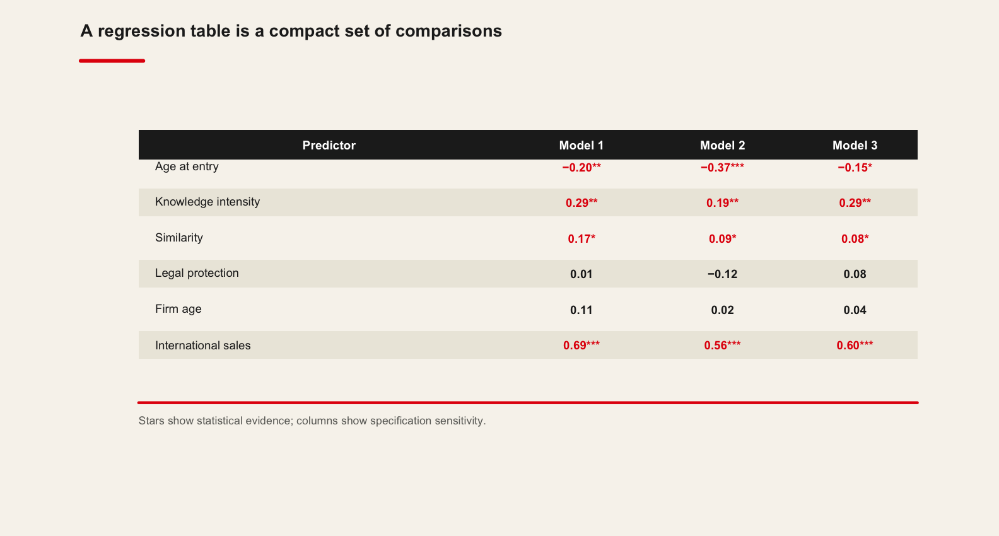
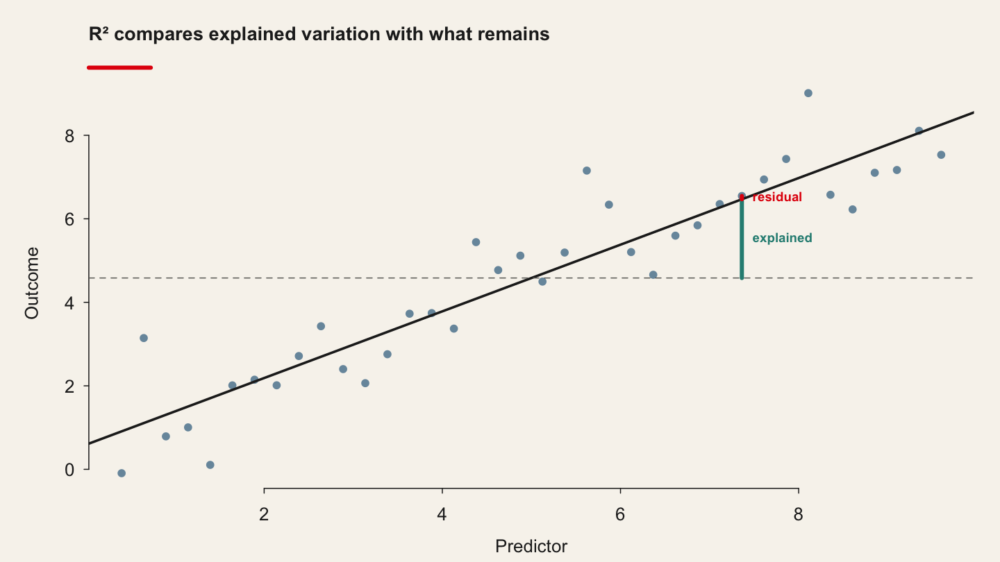
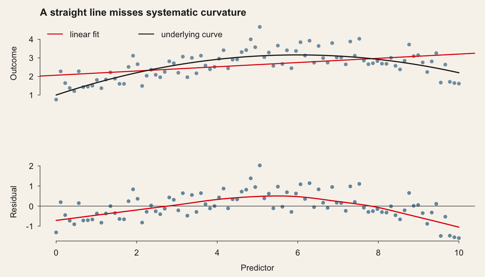
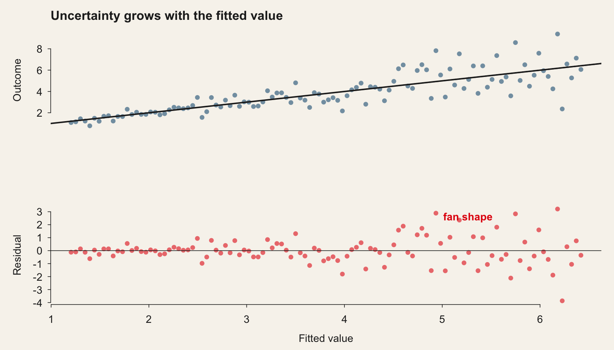
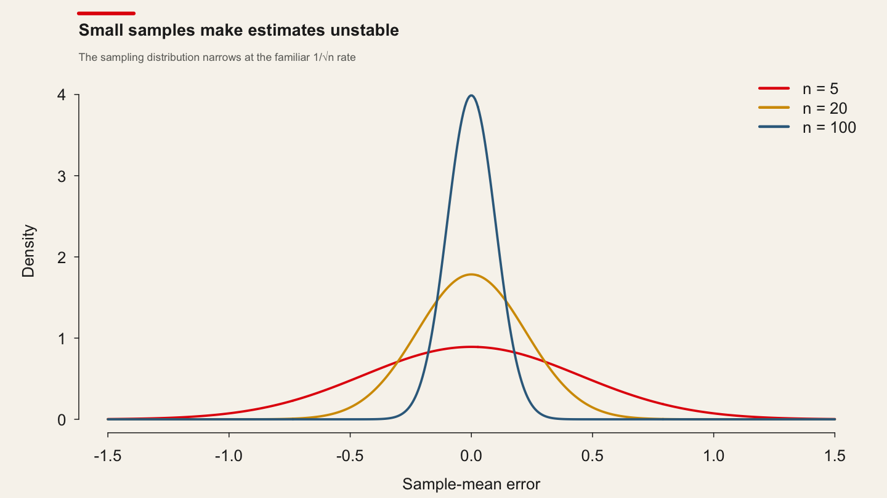

<!-- Source session 4 is taught as course session 3. The code cells below are
     live: they execute against the course data at render time, so the output on
     the slides is the output the students' own machines produce. -->
```{python}
#| label: setup
#| echo: false

import sys, warnings
sys.path.insert(0, "../..")
sys.path.insert(0, "../../slides")
warnings.filterwarnings("ignore")

import numpy as np
import pandas as pd
import matplotlib.pyplot as plt
import statsmodels.formula.api as smf
import qmib

pd.set_option("display.width", 96)
pd.set_option("display.max_columns", 10)

# Matplotlib's default figure is 6.4 x 4.8 inches — a notebook shape, and on a
# 1280x760 slide that already carries a title, a paragraph and a code block it
# runs off the bottom edge. Every live figure in this deck is a wide, short one,
# sized to the space a slide actually has left.
plt.rcParams.update({
    "figure.figsize": (7.4, 2.9),
    "figure.dpi": 110,
    "savefig.bbox": "tight",
    "font.size": 9,
    "axes.titlesize": 10,
    "axes.labelsize": 9,
    "axes.spines.top": False,
    "axes.spines.right": False,
})
```

<!-- BEGIN deck-frontmatter · scripts/build_deck_frontmatter.py -->

## Outline · The hour ahead {.center .scrollable}

1. From data to models
2. Why evaluate a model at all?
3. Adequacy · how much does the line explain?
4. Validity · do the assumptions hold?
5. Robustness · which observations move the answer?
6. Parsimony · comparing candidate models
7. Best practice, and what to take away

## What session 3 is for {.scrollable}
::::: columns

:::: {.column width="33%"}

### The mathematics

- Derive the least-squares slope, and read "controlling for" as a residual regression
- Read **residuals versus fitted** and say what structure it reveals
- Compute **leverage** from the hat matrix, and show it sums to $p$
- Separate an outlier from an influential point with **Cook's distance**
- Compare models on **AIC**, and say why that is not model selection

::::

:::: {.column width="33%"}

### The Python

- Fit a simple and a multiple regression with `smf.ols`, and read `.params`
- Pull diagnostics from a fitted model with `get_influence()`
- Build the four diagnostic plots yourself rather than calling one function
- Compare candidate specifications side by side on AIC and BIC

::::

:::: {.column width="33%"}

### The international business

- Quote a slope **in units** a manager can act on
- Say why a slope is an association, and what more is needed to call it a cause
- Say whether a published coefficient survives its own diagnostics
- Decide what to do about the one country that moves the whole result
- Refuse a model whose residuals show it has missed the structure

::::

:::::

## Your Python so far {.scrollable}

Everything you need to type is on one sheet — how to start Python in VS Codium on
your platform, how to make a file and run it, the DataFrame basics, and every name from sessions 1 to 3, each with a line showing it in use.

> **[Python Cheatsheet · Session 03](https://warint.github.io/quantitative-methods/python-cheatsheet-03.pdf)** (PDF) ·
> in the repository at `03-…/PYTHON-CHEATSHEET.pdf`

::: {.muted}
Print it, or keep it open beside the editor. Nothing on it is examinable; all of it is
assumed.
:::

<!-- END deck-frontmatter -->

## From data to models {.center background-color="#E3120B" style="color:#F7F4ED"}

## The question

> **Do more productive European countries have higher income per head?**

Thirty countries, fifteen years, both numbers already in the repository.

::: {.muted}
No download, no API key: `data/spine/core.parquet`.
:::

## Always look first

```python
import pandas as pd
import matplotlib.pyplot as plt

core = pd.read_parquet("data/spine/core.parquet")

# Drop rows missing either variable. subset= matters: without it, a row missing
# any column at all would go, and you would silently lose a third of the panel.
d = core.dropna(subset=["gdp_pc_eur", "productivity_idx"])

# Look before you model. s= is the marker size and alpha= the transparency —
# with 428 points, overlapping markers hide density unless you can see through
# them.
plt.scatter(d["productivity_idx"], d["gdp_pc_eur"], s=12, alpha=0.6)
plt.xlabel("Labour productivity index (EU average = 100)")
plt.ylabel("GDP per capita (EUR)")
plt.show()
```

::: {.warn}
Draw the picture before you fit anything. A straight line through a curved cloud is still a
straight line, and the software will not warn you.
:::

## The model, and what each piece is

$$y_i = \beta_0 + \beta_1 x_i + \varepsilon_i$$

| Symbol | Name | Here |
|---|---|---|
| $y_i$ | outcome | GDP per capita |
| $x_i$ | predictor | productivity index |
| $\beta_0$ | intercept | predicted $y$ when $x = 0$ |
| $\beta_1$ | slope | change in $y$ per unit of $x$ |
| $\varepsilon_i$ | error | what $x_i$ does not explain |

## Choosing the line

$$\min_{\beta_0,\,\beta_1} \sum_{i=1}^{n}\big(y_i - \beta_0 - \beta_1 x_i\big)^2$$

::: {.step}
Squaring makes every miss positive, so misses above and below cannot cancel — and it punishes one
large miss more than several small ones.
:::

::: {.check}
This is the mean, done conditionally. The mean minimises $\sum(x_i - c)^2$; the regression line
minimises the same quantity over *lines*.
:::

## Three lines of Python

```python
import statsmodels.formula.api as smf

# The formula reads "gdp_pc_eur explained by productivity_idx". statsmodels
# adds the intercept for you; write ~ 0 + x if you ever want it suppressed,
# and know that R-squared stops being interpretable when you do.
model = smf.ols("gdp_pc_eur ~ productivity_idx", data=d).fit()

# .params holds the two coefficients. The slope is in euros of GDP per capita
# per one index point — always say the units.
print(model.params)
```

```
Intercept          -86118.1
productivity_idx     1111.3
```

::: {.muted}
Read the `~` as "explained by". `.fit()` does the arithmetic; `model.params` holds the estimates.
:::

## The slope is the sentence you will write

::: {.check}
Comparing two country-years that differ by **one point** of productivity, the more productive one
has on average **€1,111 more** GDP per capita.
:::

Always say the units aloud — euros per index point. **A slope without units is not a finding.**

::: {.warn}
The intercept says a country at productivity 0 would have **−€86,118**. The index runs from 72 to
129 in our data. Do not interpret an intercept you have no data near.
:::

## Fitted values and residuals

Germany, 2022 — productivity 121.2, actual GDP per capita €54,239:

$$\hat y = -86{,}118 + 1{,}111.3 \times 121.2 = 48{,}606$$

$$e = 54{,}239 - 48{,}606 = \mathbf{+5{,}633}$$

::: {.check}
Germany sits **€5,633 above** the line. That residual is everything about German income that
productivity alone does not account for — and reading residuals is the rest of this hour.
:::

## How much did the line explain?

```python
# R-squared is the share of variance the line accounts for — and nothing about
# whether the line is the right shape. The rest of this hour is that difference.
print(f"R-squared = {model.rsquared:.3f}")
```

```
R-squared = 0.627
```

::: {.step}
$R^2$ is the share of the variation in $y$ the model accounts for: **62.7%**, on a scale from 0 to 1.
:::

::: {.warn}
It does **not** say the model is correct, that the relationship is causal, or that the line will
predict a new country well.
:::

## Two predictors: what "controlling for" means

```python
# The third column has its own holes, so the sample is rebuilt: d2 is not d.
d2 = core.dropna(subset=["gdp_pc_eur", "productivity_idx", "gfcf_meur"])

# Adding a second predictor changes what the first coefficient means: it is now
# the association holding investment fixed, not the raw association. The two
# answer different questions, and the number will move.
model2 = smf.ols("gdp_pc_eur ~ productivity_idx + gfcf_meur", data=d2).fit()
```

```
Intercept          -71211.8
productivity_idx      928.3
gfcf_meur              68.7
R-squared = 0.692
```

::: {.check}
The productivity slope falls **1,111 → 928**, about 16%. It now answers a different question:
comparing country-years **with the same investment**, one point more productivity goes with €928
more income.
:::

## Correlation is not causation

The slope says the two **move together**. It does not say raising productivity by a point *would*
raise income by €928.

::: {.tight}
1. Productivity raises income
2. Higher income buys the capital and training that raise productivity — the arrow points the other way
3. Something else — institutions, education, market size — drives both
:::

::: {.warn}
Nothing in the output distinguishes these. Until Sessions 10–11, write **"is associated with"** —
and mean it.
:::

## Why evaluate a model at all? {.center background-color="#E3120B" style="color:#F7F4ED"}

## What a regression table asks you to believe {#imported-s03-001 .scrollable}

Every number in it is an estimate, and every star is a claim about a population you never
saw. Today is about which of those claims survive.

{.quarto-figure .quarto-figure-center .r-stretch style="width:88.0%"}

## "All models are wrong, but some are useful" {#imported-s03-003 .scrollable}

> --- George Box

-   Regression results must be tested for adequacy, not just reported.\
-   Ignoring diagnostics can lead to:
    -   False significance\
    -   Overconfidence in predictions\
    -   Poor generalization

## The four questions of the hour {#imported-s03-005 .scrollable}

-   Model Accuracy (Adequacy): [\\(R\^2\\)]{.math .inline}, Adjusted [\\(R\^2\\)]{.math .inline}, RSE.
-   Model Validity (Assumptions): Linearity, homoscedasticity, normality of residuals.
-   Model Robustness: Outliers, leverage, Cook's distance (sensitivity to unusual points).
-   Model Parsimony/Selection: AIC, BIC --- and, in session 05, what to do instead of stepwise.

## Adequacy · how much does the line explain? {.center background-color="#E3120B" style="color:#F7F4ED"}

## Adequacy: two things to assess {#imported-s03-007 .scrollable}

::::::::::::: panel-tabset
### Two questions

We can assess the adequacy of

-   the coefficient estimates \[individually\]

-   the model \[the whole\]

### The coefficients

First, assessing the adequacy of the **coefficient estimates**:

We continue the analogy with the estimation of the population mean [\\(\\mu\\)]{.math .inline} of a random variable [\\(Y\\)]{.math .inline}.

A natural question is as follows:

-   how accurate is the sample mean [\\(\\hat{\\mu}\\)]{.math .inline} as an estimate of [\\(\\mu\\)]{.math .inline}?

> We have established that the average of [\\(\\hat{\\mu}\\)]{.math .inline}'s over many data sets will be very close to [\\(\\mu\\)]{.math .inline}, but that a single estimate [\\(\\hat{\\mu}\\)]{.math .inline} may be a substantial **underestimate** or **overestimate** of [\\(\\mu\\)]{.math .inline}.

### Residuals

::::::: columns
::: {.column style="width:50%;"}
**Residual Standard Error**

Residuals are the leftovers from the model fit: Data = Fit + Residual
:::

::::: {.column style="width:50%;"}
:::: cell
<div>

<figure>
<p></p>
</figure>

</div>
::::
:::::
:::::::

### One residual, read

::::::: columns
::: {.column style="width:50%;"}
A residual is the difference between the observed [\\(y_i\\)]{.math .inline} and predicted [\\(\\hat{y}\_i\\)]{.math .inline}.

[\\\[\\epsilon_i = y_i - \\hat{y}\_i\\\]]{.math .display}

-   living in poverty in DC is 5.44% more than predicted.

-   living in poverty in RI is 4.16% less than predicted.
:::

::::: {.column style="width:50%;"}
:::: cell
<div>

<figure>
<p></p>
</figure>

</div>
::::
:::::
:::::::

### Standard error

How far off will that single estimate of [\\(\\hat{\\mu}\\)]{.math .inline} be?

-   In general, we answer this question by computing the standard error of [\\(\\hat{\\mu}\\)]{.math .inline}, written as [\\(SE(\\hat{\\mu})\\)]{.math .inline}.

We have the well-known formula:

[\\\[Var(\\hat{\\mu}) = SE(\\hat{\\mu})\^2 = \\frac{\\sigma\^2}{n}\\\]]{.math .display} where [\\(\\sigma\\)]{.math .inline} is the standard deviation of each of the realizations [\\(y_i\\)]{.math .inline} of [\\(Y\\)]{.math .inline}.

Roughly speaking, the **standard error** tells us the average amount that this estimate [\\(\\hat{\\mu}\\)]{.math .inline} differs from the actual value of [\\(\\mu\\)]{.math .inline}.

The previous equation also tells us how this deviation shrinks with [\\(n\\)]{.math .inline} --- **the more observations** we have, **the smaller the standard error** of [\\(\\hat{\\mu}\\)]{.math .inline}.

### SE of the slope

In a similar vein, we can wonder how close [\\(\\hat{\\beta}\_0\\)]{.math .inline} and [\\(\\hat{\\beta}\_1\\)]{.math .inline} are to the true values [\\(\\beta_0\\)]{.math .inline} and [\\(\\beta_1\\)]{.math .inline}?

-   To compute the standard errors associated with [\\(\\hat{\\beta}\_1\\)]{.math .inline}, it comes down to the following formula:

[\\\[ SE(\\hat{\\beta_1}) \\\]]{.math .display}

### Interval, and test

**Models: Assessing the adequacy of the coefficient estimates**

Standard errors can be used to compute our *confidence intervals*, i.e. that the true value of [\\(\\beta_1\\)]{.math .inline}, will within this interval with a 95% chance:

[\\\[ \\hat{\\beta}\_1 - 1.96 \\times SE(\\hat{\\beta}\_1),\~\\hat{\\beta}\_1 + 1.96 \\times SE(\\hat{\\beta}\_1) \\\]]{.math .display}

Standard errors can also be used for *hypothesis tests*:

[\\\[ H_0:\~\\beta_1=0 \\\]]{.math .display}

[\\\[ H_1:\~\\beta_1 \\neq 0 \\\]]{.math .display}

As already seen, we compute the the t-statistic, which measures the number of standard deviations that [\\(\\hat{\\beta}\_1\\)]{.math .inline} is away from 0 (see p-values from last session):

[\\\[ t=\\frac{\\hat{\\beta}\_1-0}{SE(\\hat{\\beta}\_1)} \\\]]{.math .display}
:::::::::::::

## From residuals to [\\(R\^2\\)]{.math .inline} {#imported-s03-008 .scrollable}

:::::::: panel-tabset
### The whole model

Assessing the **adequacy of the model** now:

Once we have rejected the null hypothesis in favor of the alternative hypothesis, we want to quantify the *extent to which the model fits the data*.

For that, we use:

-   the *residual standard error*, and

-   the [\\(R\^2\\)]{.math .inline} statistic.

### RSE

The RSE is an estimate of the standard deviation of [\\(\\epsilon\\)]{.math .inline}.

> Definition: It is the average amount that the response will deviate from the true regression line.

[\\\[ RSE = \\sqrt{\\frac{RSS}{n-2}} = \\sqrt{\\frac{\\sum\_{i=1}\^{n}(y_i-\\hat{y}\_i)\^2}{n-2}} \\\]]{.math .display}

recall:

[\\\[ RSS= \\sum\_{i=1}\^{n}(y_i-\\hat{y}\_i)\^2 \\\]]{.math .display}

### TSS, and R-squared

::::::: columns
::: {.column style="width:50%;"}
Let's define TSS as the **total sum of squares**.

[\\\[ TSS = \\sum\_{i=1}\^{n}(y_i - \\bar{y})\^2 \\\]]{.math .display}

-   TSS measures the total variance in the response Y.

> Definition: The [\\(R\^2\\)]{.math .inline} statistic is the proportion of variance explained.

To calculate [\\(R\^2\\)]{.math .inline}, we use the formula:

[\\\[R\^2 = \\frac{TSS - RSS}{TSS} = 1 - \\frac{RSS}{TSS}\\\]]{.math .display}

-   It tells us what percent of variability in the dependent variable is explained by the model.

-   The remainder of the variability is explained by variables not included in the model or by inherent randomness in the data.
:::

::::: {.column style="width:50%;"}
:::: cell
<div>

<figure>
<p></p>
</figure>

</div>
::::
:::::
:::::::
::::::::

## Adjusted [\\(R\^2\\)]{.math .inline} and RSE, in Python {#imported-s03-010 .scrollable}

[\\(R\^2\\)]{.math .inline} can never fall when a predictor is added, so on its own it
cannot say whether that predictor earned its place. Two answers:

-   **Adjusted [\\(R\^2\\)]{.math .inline}:** corrects for number of predictors.
-   **RSE (Residual Standard Error):** average deviation from regression line.

```{python}
#| echo: true

import qmib
import statsmodels.formula.api as smf

core = qmib.load("core")
d = core.dropna(subset=["gdp_pc_eur", "productivity_idx"])

# the model we fitted at the top of the hour — now: can it be trusted?
fit = smf.ols("gdp_pc_eur ~ productivity_idx", data=d).fit()

# Adjusted R^2 penalises each extra predictor, so it can fall when you add one.
print(f"R2 {fit.rsquared:.4f}   adjusted {fit.rsquared_adj:.4f}")

# RSE is the typical miss, in euros — the same units as the outcome, which is
# what makes it the more useful of the two to quote to a non-specialist.
import numpy as np
print(f"RSE {np.sqrt(fit.mse_resid):,.0f} EUR per head")
```

Interpretation:

-   Adjusted [\\(R\^2\\)]{.math .inline} can *decrease* if irrelevant variables are added.
-   RSE gives an absolute measure, in units of Y.

## Quiz: reading an [\\(R\^2\\)]{.math .inline} {#imported-s03-011 .scrollable}

::::::::::::: panel-tabset
### Quiz

::::::: columns
::: {.column style="width:50%;"}
Which of the below is the correct interpretation of [\\(R\^2 = 0.38\\)]{.math .inline}?

-   38% of the variability in the % of HG graduates among the 51 states is explained by the model.

-   38% of the variability in the % of residents living in poverty among the 51 states is explained by the model.

-   38% of the time % HS graduates predict % living in poverty correctly.

-   62% of the variability in the % of residents living in poverty among the 51 states is explained by the model.
:::

::::: {.column style="width:50%;"}
:::: cell
<div>

<figure>
<p></p>
</figure>

</div>
::::
:::::
:::::::

### Answer

::::::: columns
::: {.column style="width:50%;"}
Which of the below is the correct interpretation of [\\(R\^2 = 0.38\\)]{.math .inline}?

-   38% of the variability in the % of HG graduates among the 51 states is explained by the model.

-   **38% of the variability in the % of residents living in poverty among the 51 states is explained by the model.**

-   38% of the time % HS graduates predict % living in poverty correctly.

-   62% of the variability in the % of residents living in poverty among the 51 states is explained by the model.
:::

::::: {.column style="width:50%;"}
:::: cell
<div>

<figure>
<p></p>
</figure>

</div>
::::
:::::
:::::::
:::::::::::::

## Validity · do the assumptions hold? {.center background-color="#E3120B" style="color:#F7F4ED"}

## The residual plot is the instrument {#imported-s03-018 .scrollable}

Residual = observed [\\(y_i\\)]{.math .inline} -- predicted [\\(\\hat{y}\_i\\)]{.math .inline}.

-   Residuals contain all the information the model *did not explain*.\
-   Checking them reveals whether assumptions of linear regression hold.

```{python}
#| echo: true

# Residuals vs Fitted: is there structure the straight line missed?
plt.scatter(fit.fittedvalues, fit.resid, s=12, alpha=0.6)
plt.axhline(0, color="black", lw=1)
plt.xlabel("Fitted values"); plt.ylabel("Residuals")
plt.show()
```

## What you are looking for {.scrollable}

Scattered at random around zero is the model behaving. A curve, a funnel or a
drift is the model telling you what it missed.

{.r-stretch}

## Three conditions to check {#imported-s03-013 .scrollable}

-   1.  Linearity
-   2.  Nearly normal residuals
-   3.  Constant variability

## Validity: linearity {#imported-s03-014 .scrollable}

:::::::::: panel-tabset
### The condition

-   The relationship between the explanatory and the dependent variable should be linear.

> Check using a scatterplot of the data, or a residuals plot.

:::: cell
<div>

<figure>
<p></p>
</figure>

</div>
::::

### Anatomy of a residual

**Anatomy of a residuals plot**

::::::: columns
::: {.column style="width:50%;"}
[\\\[\\%\~HSgrad = 81\\%\~\\&\~\\%\~in\~poverty = 10.3\\\]]{.math .display}

[\\\[\\widehat{\\%\~in\~poverty} = 64.68 - 0.62 \\times 81 = 14.46\\\]]{.math .display}

[\\\[\\epsilon = {\\%\~in\~poverty} - \\widehat{\\%\~in\~poverty}\\\]]{.math .display}

[\\\[\\epsilon = 10.3 - 14.46 = -4.16\\\]]{.math .display}

[\\\[\\%\~HSgrad = 86\\%\~\\&\~\\%\~in\~poverty = 16.8\\\]]{.math .display}

[\\\[\\widehat{\\%\~in\~poverty} = 64.68 - 0.62 \\times 86 = 11.36\\\]]{.math .display}

[\\\[\\epsilon = {\\%\~in\~poverty} - \\widehat{\\%\~in\~poverty}\\\]]{.math .display}

[\\\[\\epsilon = 16.8 - 11.36 = 5.44\\\]]{.math .display}
:::

::::: {.column style="width:50%;"}
:::: cell
<div>

<figure>
<p></p>
</figure>

</div>
::::
:::::
:::::::

### What a violation looks like

-   The relationship between predictors and outcome should be linear.
-   Violations show up as **curved patterns** in residuals.

Remedies: add polynomial terms, interactions, or reconsider functional form.
::::::::::

## Validity: nearly normal residuals {#imported-s03-015 .scrollable}

::::::: columns
::: {.column style="width:50%;"}
-   The residuals should be nearly normal.

-   This condition may not be satisfied when there are unusual observations that don't follow the trend of the rest of the data.

> Check using a histogram.
:::

::::: {.column style="width:50%;"}
:::: cell
<div>

<figure>
<p></p>
</figure>

</div>
::::
:::::
:::::::

## Normality, on a Q-Q plot {#imported-s03-016 .scrollable}

-   Errors should be normally distributed.
-   Important for valid t-tests and confidence intervals.

Points on the line are what normality looks like; points peeling away at both
ends are heavy tails.

{.r-stretch}

## Validity: constant variance {#imported-s03-017 .scrollable}

::::::::::: panel-tabset
### The condition, and the test

-   Residuals should have **constant variance** across fitted values.
-   Violation = *heteroscedasticity* (funnel shape).
-   Remedies: transform Y, add missing predictors, or use robust errors.

```{python}
#| echo: true

import matplotlib.pyplot as plt

# Scale-Location: is the spread of the residuals constant?
plt.scatter(fit.fittedvalues, np.sqrt(np.abs(fit.get_influence().resid_studentized_internal)),
            s=12, alpha=0.6)
plt.xlabel("Fitted values"); plt.ylabel("sqrt(|standardised residual|)")
plt.show()
```

### Said the other way round

::::::: columns
::: {.column style="width:50%;"}
-   The variability of points around the least squares line should be roughly constant.

-   This implies that the variability of residuals around the 0 line should be roughly constant as well.

-   Also called homoskedasticity.

> Check using a residuals plot.
:::

::::: {.column style="width:50%;"}
:::: cell
<div>

<figure>
<p></p>
</figure>

</div>
::::
:::::
:::::::
:::::::::::

## Quiz: reading a residual plot {#imported-s03-019 .scrollable}

:::::::::::::::::: panel-tabset
### Quiz 1

::::: columns
::: {.column style="width:50%;"}
What condition is this linear model obviously violating?

-   Constant variability

-   Relationship

-   Normal residuals

-   No extreme outliers
:::

::: {.column style="width:50%;"}
{.quarto-figure .quarto-figure-center style="width:100.0%"}
:::
:::::

### Answer

:::::: columns
::: {.column style="width:50%;"}
What condition is this linear model obviously violating?

-   Constant variability

-   **Relationship**

-   Normal residuals

-   No extreme outliers
:::

:::: {.column style="width:50%;"}
::: {.cell layout-align="center"}
<figure>
<p></p>
</figure>
:::
::::
::::::

### Quiz 2

:::::: columns
::: {.column style="width:50%;"}
What condition is this linear model obviously violating?

-   Constant variability

-   Linear relationship

-   Normal residuals

-   No extreme outliers
:::

:::: {.column style="width:50%;"}
::: {.cell layout-align="center"}
<figure>
<p></p>
</figure>
:::
::::
::::::

### Answer

:::::: columns
::: {.column style="width:50%;"}
What condition is this linear model obviously violating?

-   **Constant variability** = heteroskedastic = non-homoskedastic

-   Linear relationship

-   Normal residuals

-   No extreme outliers
:::

:::: {.column style="width:50%;"}
::: {.cell layout-align="center"}
<figure>
<p></p>
</figure>
:::
::::
::::::
::::::::::::::::::

## Practise the eye {#imported-s03-020 .scrollable}

Guess the correlation, then check. Ten minutes here is worth a chapter.

::: {style="text-align:center"}
[Correlation and Regression Game](http://shiny.calpoly.sh/Corr_Reg_Game/)
:::

## Robustness · which observations move the answer? {.center background-color="#E3120B" style="color:#F7F4ED"}

## Outlier, leverage point, influential point {#imported-s03-022 .scrollable}

-   **Outlier:** unusual Y given X.
-   **Leverage point:** unusual X values.
-   **Influential:** changes regression coefficients significantly.

Visual schematic: regression line with one leverage point pulling the slope.

## Leverage {#imported-s03-023 .scrollable}

-   Leverage measures how far X is from its mean.
-   Average leverage = (p+1)/n.

```{python}
#| echo: true

influence = fit.get_influence()
leverage = influence.hat_matrix_diag

print(f"mean leverage {leverage.mean():.4f}, max {leverage.max():.4f}")
print(f"rule of thumb 2p/n = {2 * 2 / len(d):.4f}")

```

> Leverage matters because a data point with unusual predictor values can pull the regression line toward itself, changing the story the model tells.

## Residuals versus leverage {.scrollable}

The points with the power to move the line.

```{python}
#| echo: true

# Far right = unusual X. High up or low down = badly predicted. The damage is
# done by points that are both, which is why the two are plotted together.
plt.scatter(leverage, influence.resid_studentized_internal, s=12, alpha=0.6)
plt.axvline(2 * 2 / len(d), color="red", ls="--")   # the 2p/n rule of thumb
plt.xlabel("Leverage"); plt.ylabel("Standardised residual")
plt.show()
```

## Cook's Distance {#imported-s03-024 .scrollable}

-   Combines leverage + residual size.
-   High Cook's D = observation heavily influences coefficients.

```{python}
#| echo: true

cooks_d = influence.cooks_distance[0]

print(f"largest Cook's D {cooks_d.max():.4f}")
print(f"above 4/n ({4/len(d):.4f}): {(cooks_d > 4/len(d)).sum()} observations")

```

> Cook's distance matters because it shows which data points, if removed, would noticeably change the model's results.

## One spike per observation {.scrollable}

How much every coefficient would move if that single row were deleted.

```{python}
#| echo: true

# The dashed line is the conventional 4/n screen — a prompt to go and look at
# the row, not a rule for dropping it.
plt.stem(cooks_d)
plt.axhline(4 / len(d), color="red", ls="--")
plt.xlabel("Observation"); plt.ylabel("Cook's distance")
plt.show()
```

## Parsimony · comparing candidate models {.center background-color="#E3120B" style="color:#F7F4ED"}

## Information Criteria --- AIC {#imported-s03-025 .scrollable}

[\\\[ AIC = -2\\log(L) + 2k \\\]]{.math .display}

-   Balances fit with penalty for number of parameters.
-   Lower AIC = better model (relative).

```{python}
#| echo: true

fit.aic
```

> AIC matters because it helps us avoid models that are too complicated by rewarding good fit but punishing unnecessary extra variables.

## Information Criteria --- BIC {#imported-s03-026 .scrollable}

[\\\[ BIC = -2\\log(L) + k\\ln(n) \\\]]{.math .display}

-   Similar to AIC but harsher penalty (depends on n).
-   Favors simpler models for large samples.

> BIC matters because it goes even further than AIC in preferring simpler models, especially when we have a lot of data.

## Choosing a model is not a diagnostic {.scrollable}

AIC and BIC compare models you have already written down. They do not write them down for you.

::: {.warn}
The automated alternative --- **stepwise selection**, which adds and drops predictors by criterion
until nothing improves --- is a *selection procedure*, not a check on a fit. Teaching it beside
Cook's distance would imply it belongs to model checking.
:::

::: {.check}
It opens **session 05** instead, where it does real work: watch its choices fail to survive a
resample, and you have the argument for shrinking coefficients continuously rather than including
or excluding them. That argument is ridge and lasso.
:::

## Best practice, and what to take away {.center background-color="#E3120B" style="color:#F7F4ED"}

## Best Practices {#imported-s03-030 .scrollable}

-   Check residuals first --- assumptions matter.
-   Use multiple fit criteria, not just [\\(R\^2\\)]{.math .inline}.
-   Always investigate influential points.
-   Use AIC/BIC to compare, but remember they are relative.
-   If you selected on a criterion, say so, and treat the inference as exploratory.

Final message: **Balance predictive adequacy, interpretability, and parsimony.**

## Conclusion {#imported-s03-032 .scrollable}

-   We fitted the smallest possible model, and read its slope in units
-   **Adequacy** asked how much it explains; **validity**, whether its assumptions hold;
    **robustness**, which observations are doing the work; **parsimony**, whether a simpler
    model would do as well
-   Not one of the four is answered by the coefficient table alone
-   Session 04 keeps the machinery and changes the outcome: the thing you are predicting
    becomes a **category**

## One more thing... {#imported-s03-033 .scrollable}

After [Wainer's "most dangerous equation"](https://blog.ephorie.de/the-most-dangerous-equation-or-why-small-is-not-beautiful) — the standard error of the mean, and what forgetting it costs.

{.r-stretch}

## References {#imported-s03-034 .center .scrollable}

-   James, G., Witten, D., Hastie, T., & Tibshirani, R. (2021). *An Introduction to Statistical Learning with Applications in R* (2nd ed.). Springer.
-   Kutner, M. H., Nachtsheim, C. J., Neter, J., & Li, W. (2005). *Applied Linear Statistical Models* (5th ed.). McGraw-Hill Irwin.
-   Wooldridge, J. M. (2019). *Introductory Econometrics: A Modern Approach* (7th ed.). Cengage.
