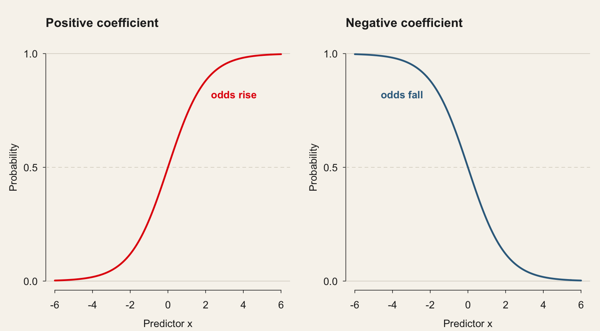

<!-- Source session 5 is taught as course session 4. The code cells are live: they
     execute against the course data at render time, so the output on the slides is
     the output the students' own machines produce. The imported version of this deck
     showed R output under Python code — lm() summaries, 1st Qu., dotted column
     names — because the source was an R course. -->
```{python}
#| label: setup
#| echo: false

import sys, warnings
sys.path.insert(0, "../..")
sys.path.insert(0, "../../slides")
warnings.filterwarnings("ignore")

import numpy as np
import pandas as pd
import statsmodels.formula.api as smf
import qmib

pd.set_option("display.width", 96)
pd.set_option("display.max_columns", 10)

loans = qmib.load("loans")
```

<!-- BEGIN deck-frontmatter · scripts/build_deck_frontmatter.py -->

## Outline · The hour ahead {.center .scrollable}

1. Introduction
2. Let's start with an example
3. The basics of logistic regression
4. Let's use another example
5. Inference and goodness of fit
6. Let's see another example
7. Comparing logistic models
8. Model selection
9. Ordinal logistic regression
10. Multinomial logistic regression
11. Conclusion

## What session 4 is for {.scrollable}
::::: columns

:::: {.column width="33%"}

### The mathematics

- Say why the **linear probability model** fails, and where it fails worst
- Read a coefficient as a **log-odds** and its exponential as an odds ratio
- Compute a fitted probability by hand from $x^\top\hat\beta$
- Compare nested models with a **likelihood-ratio test**
- Separate a **Wald** test from a **likelihood-ratio** test, and report McFadden's pseudo-$R^2$ for what it is

::::

:::: {.column width="33%"}

### The Python

- Fit binary, **ordinal** and **multinomial** logits with `smf.logit`, `OrderedModel`, `sm.MNLogit`
- Turn coefficients into odds ratios and predicted probabilities
- Build the likelihood-ratio test from two models' `.llf`

::::

:::: {.column width="33%"}

### The international business

- Model a categorical business outcome — enter or not, which mode, which grade
- Report an odds ratio to someone who will not read the appendix
- State what the proportional-odds assumption costs when it fails

::::

:::::

## Your Python so far {.scrollable}

The 25 names below came out of sessions 2–3. Today's slides assume them, and add to them. The ones marked arrived last week.

### Load and shape

- `.dropna` — drop rows with missing values
- `.merge` — join two frames on a key
- `.shape` — rows and columns
- `pd.read_parquet` — a parquet file, directly
- `qmib.load` — a course dataset, by name

### Describe

- `.mean / .median` — the two centres, and their gap
- `.quantile` — any quantile, including the median
- `.std / .var` — spread, dividing by $n-1$
- `stats.trim_mean` — the mean after cutting both tails

### Fit

- `.fit()` — estimate the model you specified
- `smf.ols` — least squares, from a formula

### Read the fit

- `.params` — the coefficients, in units of $y$
- `.rsquared` — share of variance explained
- `.mse_resid` — its square root is the RSE, in units · *new last week*
- `.resid / .fittedvalues` — what is left, and what was predicted · *new last week*
- `.rsquared_adj` — penalised for the extra predictor · *new last week*

### Diagnose

- `.cooks_distance` — influence: leverage $\times$ residual · *new last week*
- `.get_influence()` — the whole diagnostic bundle · *new last week*
- `.hat_matrix_diag` — leverage; sums to $p$, always · *new last week*
- `.resid_studentized_internal` — residuals on a common scale · *new last week*

### Choose and validate

- `.aic / .bic` — compare non-nested models · *new last week*

### Plot

- `plt.scatter` — the data, before anything else
- `plt.xlabel / plt.ylabel` — say the units, every time
- `plt.axhline / plt.axvline` — draw the threshold you are judging against · *new last week*
- `plt.stem` — one spike per observation · *new last week*

<!-- END deck-frontmatter -->
## Quote of the day {#imported-s04-001 .scrollable}
> The greatest adventure is what lies ahead. Today and tomorrow are yet to be said. The chances, the changes are all yours to make. The mold of your life is in your hands to break.

[J. R. R. Tolkien](https://en.wikipedia.org/wiki/J._R._R._Tolkien)

## Introduction {#imported-s04-004 .center .scrollable}

## Introduction {#imported-s04-006 .scrollable}

[Link to book](https://bookdown.org/roback/bookdown-BeyondMLR/)

## Introduction {#imported-s04-007 .scrollable}

::: cell
```{dot}
digraph a_nice_graph {

# node definitions with substituted label text
node [shape = box, fontname = Helvetica]
a [label = "Data Science"]
b [label = "Machine Learning"]
c [label = "Reinforcement Learning"]
d [label = "Supervised Learning"]
e [label = "Unsupervised Learning"]
f [label = "Classification"]
g [label = "Regression"]
h [label = "Generative Models"]
i [label = "Discriminative Models"]
j [label = "Logistic Regression"]

# edge definitions with the node IDs
a -> {b}
b -> {c, d, e}
d -> {f, g}
f -> {h, i}
i -> {j}

}
```
:::

## Introduction {#imported-s04-008 .scrollable}

As we saw in the two previous modules, linear regression allows us to model the relationship between a quantitative dependent variable Y and a set of independent variables.

> In this module we extend our modeling capabilities and learn how to model the relationship between a **binary dependent variable Y** (then ordinal, then multinomial) and a set of independent variables.

## Let's start with an example {#imported-s04-009 .center .scrollable}

## Lending Club {#imported-s04-010 .scrollable}

<https://www.lendingclub.com/>

-   Peer-to-peer network

## Lending Club (cont.) {#imported-s04-011 .scrollable}

:::::::::::::::::: panel-tabset
### 1

> Which loans are successfull and which one are not successful?

```{python}
#| echo: true

import qmib

# One call. Downloaded once, then read from the local cache.
loans = qmib.load("loans")
loans.describe()
```

### 2

-   We have data on 9,578 3-year loans that were funded through LendingClub.com between May 2007 and February 2010.

-   We have a variable called "default" that indicates that the loan was not paid back in full (the borrower either defaulted or the loan was "charged off," meaning the borrower was deemed unlikely to ever pay it back).

-   We also have the borrower's FICO (credit) score when they applied for the loan.

-   The dependent variable, [\\(Y\\)]{.math .inline}, we want to model is "default" which measures whether or not the loan defaulted.

It is called a binary variable since it only takes on the values 0 or 1:

-   [\\(default = 0\\)]{.math .inline} indicates loan was paid back.
-   [\\(default = 1\\)]{.math .inline} indicates loan was not paid back.

### 3

When working with a binary dependent variable, a scatter plot is often not that useful.


### 6

> If the only tool we have is a hammer, we are tempted to use it for every problem.

-   Let's see how linear regression would address this problem.

```{python}
#| echo: true

import statsmodels.formula.api as smf

# The linear probability model: a straight line through 0/1 outcomes
m1 = smf.ols("default ~ fico", data=loans).fit()
print(m1.summary())
```

### 8

Some observations:

-   Because the [\\(p-value \< 0.05\\)]{.math .inline}, FICO score is a significant predictor.

-   As FICO increases by 1 point, the average of the dependent variable decreases by [\\(0.001445\\)]{.math .inline}.

> How do we interpret this in the case that Y only takes on 0 or 1 values?

### 9

:::: cell
<div>

<figure>
<p></p>
</figure>

</div>
::::

### 10

> We ran a linear regression, but what exactly are we modeling?

Recall that in the linear regression model we have:

[\\\[ Y \\approx N(\\mu,\~\\sigma\^2) \\\]]{.math .display}

where

[\\\[ \\mu = \\beta_0 + \\beta_1 x \\\]]{.math .display}

That is, the average of Y is modeled as a line.

### 11

The average of Y:

-   When Y only takes on [\\(0\\)]{.math .inline} or [\\(1\\)]{.math .inline} values, the linear regression model has an interesting interpretation.

In this case the linear regression model is equivalent to assuming:

[\\\[ \\pi = P(Y=1)=\\beta_0+\\beta_1x \\\]]{.math .display}

### 12

Let's examine some predicted values from our regression model.

-   FICO score = 650, default probability = 0.25

[\\\[\\hat{y} = 1.187 - 0.001445(650) = 0.25\\\]]{.math .display}

-   FICO score = 825, default probability = -0.005

[\\\[\\hat{y} = 1.187 - 0.001445(825) = -0.005\\\]]{.math .display}

although a FICO score of 825 represents a great credit score, the probability can't be negative.

### Conclusion

-   If we model a binary dependent variable using linear regression, we are modeling probability as a linear relationship with a predictor.

-   Probabilities have to always be between 0 and 1, but the **linear regression model doesn't make this assumption**. So there is no guarantee predictions will make sense.

-   Probabilities computed by linear regressions can be negative or beyond 1.

> Fortunately there is another type of regression model better suited to model probabilities that we discuss now.
::::::::::::::::::

## The basics of logistic regression {#imported-s04-012 .center .scrollable}

## The basics of logistic regression {#imported-s04-013 .scrollable}

::::::::::::: panel-tabset
### LR 1

Recall that a binary dependent variable can take on only one of two values; e.g. [\\(Y = 0\\)]{.math .inline} or [\\(Y = 1\\)]{.math .inline}.

Conventionally [\\(1\\)]{.math .inline} represents a success and [\\(0\\)]{.math .inline} a failure, regardless of the outcome.

Examples of this type of variable in practice are:

-   [\\(Y = 1\\)]{.math .inline} if defaulted on loan, 0 otherwise.

-   [\\(Y = 1\\)]{.math .inline} if made online purchase, 0 otherwise.

-   [\\(Y = 1\\)]{.math .inline} if renewed car lease, 0 otherwise.

-   [\\(Y = 1\\)]{.math .inline} if employee promoted, 0 otherwise.

### LR 2

We showed in the previous segment that when a binary dependent variable is modeled using linear regression, the underlying model being estimated is

[\\\[\\pi = P(Y=1) = \\beta_0 + \\beta_1 x\\\]]{.math .display}

As we saw, issues can arise when making predictions since this model does not prevent probabilities from being larger than 0 or less than 1.

### LR 3

Logistic regression is a way to model a binary dependent variable.

-   The logistic regression model states that:

[\\\[ \\pi = P(Y=1) = \\frac{e\^{(\\beta_0+\\beta_1x)}}{1+e\^{(\\beta_0+\\beta_1x)}} \\\]]{.math .display}

[\\\[ \\pi = P(Y=1) = \\frac{1}{1+e\^{-(\\beta_0+\\beta_1x)}} \\\]]{.math .display}

### LR 4

:::::: columns
::: {.column style="width:50%;"}
The weird looking function is called the logistic function, and its purpose is to ensure that predictions will always be between 0 to 1.

It is called the S-shape function.
:::

:::: {.column style="width:50%;"}
::: {.cell layout-align="center"}
<figure>
<p></p>
</figure>
:::
::::
::::::

### LR 5

The logistic regression model can be estimated by the method of **maximum likelihood estimation**, a common approach for estimating parameters in statistical models.

-   The estimated probability that [\\(Y = 1\\)]{.math .inline} given [\\(x\\)]{.math .inline} is:

[\\\[p = \\frac{1}{1 + e\^{-(b_0 + b_1 x)}}\\\]]{.math .display}

-   [\\(b_0\\)]{.math .inline} is the estimate of [\\(\\beta_0\\)]{.math .inline}.

-   [\\(b_1\\)]{.math .inline} is the estimate of [\\(\\beta_1\\)]{.math .inline}.

### LR 6

For our loan default data, the R output from estimating a logistic regression is as follows:


### LR 8

Using the R output, the estimated equation for the probability of a loan default is:

[\\\[ p = \\frac{1}{1 + e\^{-(6.72 - 0.012 x)}} \\\]]{.math .display}

With this equation we can predict probability of loan default for any FICO score [\\(x\\)]{.math .inline}.

### LR 9

-   Using the estimated equation, if someone's FICO score is 600 the probability of default is:

[\\\[ p = \\frac{1}{1 + e\^{-(6.72 - 0.012 \\times 600)}} = 0.38 \\\]]{.math .display}

-   If someone's FICO score is 850 the probability of default is:

[\\\[ p = \\frac{1}{1 + e\^{-(6.72 - 0.012 \\times 850)}} = 0.03 \\\]]{.math .display}

### LR 10

:::: cell
<div>

<figure>
<p></p>
</figure>

</div>
::::
:::::::::::::

## Let's use another example {#imported-s04-014 .center .scrollable}

## FICO Score {#imported-s04-015 .scrollable}

:::::::::::::::::: panel-tabset
### 1

The estimate [\\(b_1 = - 0.0119\\)]{.math .inline} is difficult to interpret exactly.

But an important question is whether the data provide evidence that [\\(\\beta_1 \\neq 0\\)]{.math .inline}, which would imply that FICO scores are related to the probability of a loan default.

We could construct a confidence interval for [\\(\\beta_1\\)]{.math .inline} using the same approach as we did with linear regression.

[\\\[ b_1 \\pm 1.96 \\times SE(b_1) \\\]]{.math .display}

-   Usually difficult to make sense out of the exact set of values.

-   However, we can assess whether [\\(\\beta_1\\)]{.math .inline} is positive or negative through a confidence interval.

### 2

::::::: columns
::::: {.column style="width:50%;"}
:::::

::: {.column style="width:50%;"}
-   95% confidence interval for [\\(\\beta_1\\)]{.math .inline}:

[\\\[ -.0119 \\pm 1.96 \\times (0.000823) \\\]]{.math .display}

[\\\[ = (-0.0119 - 0.001646, - 0.0119 + 0.001646) \\\]]{.math .display}

[\\\[ = (-0.0135, -0.0103) \\\]]{.math .display}
:::
:::::::

### 3

we are usually interested in the following test:

[\\\[H_0: \\beta_1 = 0\\\]]{.math .display}

[\\\[H_1: \\beta_1 \\neq 0\\\]]{.math .display}

-   If we assume a significance level of [\\(\\alpha = 0.05\\)]{.math .inline}, then because the [\\(p-value \< 0.05\\)]{.math .inline} we can reject the null hypothesis of [\\(\\beta_1 = 0\\)]{.math .inline}.

Therefore FICO score is a statistically significant predictor of the probability of a loan default.

### 4

Estimating [\\(\\pi\\)]{.math .inline}

> A natural type of question to ask is: What is the probability of a loan default for a FICO score of (say) 700?

-   As we have seen in the last segment, we can answer this from the formula of the **point estimate**, where [\\(b_0\\)]{.math .inline} and [\\(b_1\\)]{.math .inline} are the estimates of [\\(\\beta_0\\)]{.math .inline} and [\\(\\beta_1\\)]{.math .inline}, and [\\(x = 700\\)]{.math .inline}:

[\\\[\\pi = P(Y=1) = \\frac{1}{1+e\^{-(\\beta_0+\\beta_1x)}}\\\]]{.math .display}

### 5

Instead of a point estimate of [\\(\\pi\\)]{.math .inline}, [\\(p\\)]{.math .inline}, we can also compute a 95% confidence interval:

[\\\[p \\pm 1.96 \\times SE(b_1)\\\]]{.math .display}

The formula for SE(p) is complex, so we let R do the work:

```{python}
#| echo: true

# The logistic fit this slide predicts from. It is fitted again later for the
# likelihood-ratio test; defining it here keeps the deck runnable in slide
# order, which the imported version was not.
m2 = smf.logit("default ~ fico", data=loans).fit(disp=0)

# get_prediction returns the interval as well as the point estimate. On the
# probability scale that interval is asymmetric — which is correct, and the
# reason not to build it by hand as estimate +/- 1.96 * se.
pred = m2.get_prediction(pd.DataFrame({"fico": [700]})).summary_frame()
print(pred[["predicted", "ci_lower", "ci_upper"]].round(4))
```

The 95% confidence interval for [\\(\\pi\\)]{.math .inline} is (0.161, 0.177).

> We are 95% confident that the probability that a borrower with a FICO score of 700 would default is between 0.161 and 0.177.


### 7

:::: cell
<div>

<figure>
<p></p>
</figure>

</div>
::::
::::::::::::::::::

## Inference and goodness of fit {#imported-s04-016 .center .scrollable}

## Inference and goodness of fit {#imported-s04-017 .scrollable}

:::::: panel-tabset
### IGF 1

In the last segment, we learned how to estimate the coefficients of a simple logistic regression and obtain predictions.

We now focus on:

-   **Hypothesis testing** for the coefficient of a predictor in logistic regression.

-   **Confidence intervals** for probabilities.

-   An **analogous measure** to [\\(R\^2\\)]{.math .inline} in linear regression.

### IGF 2

Again, the simple logistic regression model is given by:

[\\\[ \\pi = P(Y=1) = \\frac{1}{1+e\^{-(\\beta_0+\\beta_1x)}} \\\]]{.math .display}

-   We usually consider both confidence intervals and hypothesis tests for [\\(\\beta_1\\)]{.math .inline} (btw, not [\\(b_1\\)]{.math .inline}).

-   Because the value of [\\(\\beta_1\\)]{.math .inline} is difficult to interpret, we will focus mainly on hypothesis testing for [\\(\\beta_1 = 0\\)]{.math .inline}.

### IGF 3

-   No agreed-upon method for summarizing goodness-of-fit for logistic regression.

-   The difficulty is that the notion of "percent variation explained" by the predictor is not as obvious as with linear regression.

### IGF 4

Various suggestions have been proposed -- we will use the pseudo-R2 measure (due to McFadden).

-   Logistic regression models are fitted using the method of maximum likelihood - i.e. the parameter estimates are those values which maximize the likelihood of the data which have been observed. McFadden's R squared measure is defined as:

[\\\[ R\^{2}\_{\\text{McFadden}} = 1- \\frac{log(L_c)}{log(L\_{\\text{null}})} \\\]]{.math .display}

-   where [\\(L_c\\)]{.math .inline} denotes the (maximized) likelihood value from the current fitted model, and [\\(L\_{\\text{null}}\\)]{.math .inline} denotes the corresponding value but for the null model - the model with only an intercept and no covariates.

### IGF 5

This calculation looks similar to that of [\\(R\^2\\)]{.math .inline} for linear regression.

-   Analysis of goodness-of-fit for loan default logistic regression:

```{python}
#| echo: true

m2 = smf.logit("default ~ fico", data=loans).fit()
null = smf.logit("default ~ 1", data=loans).fit()

# McFadden's pseudo R-squared
pseudo_r2 = 1 - m2.llf / null.llf
print(f"pseudo R2 = {pseudo_r2:.4f}")
```

Value is computed to be 0.0271

-   Very low pseudo-R2 -- roughly 2.7% of the "variation" explained by the FICO score.

-   Generally do not expect high [\\(pseudo-R\^2\\)]{.math .inline} values.

-   Values as high as 0.4 or 0.5 indicate a very good fit for logistic regression.
::::::

## Let's see another example {#imported-s04-018 .center .scrollable}

## Portugal's Red Wines {#imported-s04-019 .scrollable}

-   Analogous to linear regression, logistic regression benefits from using multiple predictors simultaneously.

-   Pros and cons of multiple predictors:

    -   Greater accuracy in predictions

    -   Better use of data

    -   Much more difficult to visualize

    -   With large data, computing-intensive to fit

## Portugal's Red Wines (cont.) {#imported-s04-020 .scrollable}

:::::::::::::::::::::::::::::::::::::: panel-tabset
### Wine 1

Can we use analytics to predict quality from physio-chemical content of red wine?

-   Data were collected on 1599 bottles of Portuguese red wines.

-   Each wine was evaluated by experts; wines were dichotomized into "bad" vs "good" based on quality.

### 2

```{python}
#| echo: true

import qmib

# A second binary outcome, deliberately unlike the loans one: the classes are
# closer to balanced here, so accuracy is a less dishonest measure than it was.
redwines = qmib.load("redwines")
redwines.describe().round(2)
```

### 5

-   We will consider eight predictors listed above of good wine quality (No/Yes) for this example. We will let Y = 1 to represent "Yes" and Y = 0 to represent "No."

```{python}
#| echo: true

# qmib.load() already returns good as 0/1, so no recoding is needed.
redwines["good"].value_counts()
```

### 6

::::::::: columns
::::: {.column style="width:50%;"}
```{python}
#| echo: true

import matplotlib.pyplot as plt

# Boxplots by outcome, before any model. If a predictor's two boxes sit on top
# of one another, no coefficient is going to rescue it — and if they separate
# cleanly, you should expect the model to find that and be suspicious if not.
fig, axes = plt.subplots(1, 3, figsize=(11, 3.4))
for ax, col in zip(axes, ["fixed_acidity", "volatile_acidity", "alcohol"]):
    redwines.boxplot(column=col, by="good", ax=ax)
    ax.set_title(col); ax.set_xlabel("good")
plt.suptitle(""); plt.tight_layout(); plt.show()
```
:::::

::::: {.column style="width:50%;"}
:::: cell
<div>

<figure>
<p></p>
</figure>

</div>
::::
:::::
:::::::::

### 7

We have predictors [\\(x_1, x_2, x_3, \..., x_p\\)]{.math .inline}

Our model for the binary response is:

[\\\[ \\pi = P(Y=1) = \\frac{1}{1+e\^{-(\\beta_0+\\beta_1 x_1 + \\beta_2 x_2 + \... + \\beta_p x_p)}} \\\]]{.math .display}

Same method to estimate the coefficients (i.e., the [\\(\\beta\\)]{.math .inline}s) by maximum likelihood estimation.

Similar goals:

-   Perform statistical inference for the [\\(beta\\)]{.math .inline}s

-   Make probability predictions of the response based on predictor variable values

-   Slight difference comes in the interpretation of coefficients

### 8

```{python}
#| echo: true

# Eight chemical measurements. Note what is absent: price, region, vintage.
# The model can only speak about what is in this list.
predictors = ["fixed_acidity", "volatile_acidity", "residual_sugar", "chlorides",
              "total_sulfur_dioxide", "density", "sulphates", "alcohol"]

w1 = smf.logit("good ~ " + " + ".join(predictors), data=redwines).fit()
print(w1.summary())
```

### 10

The estimated multiple logistic regression is therefore:

[\\\[\\pi = P(Y=1) = \\frac{1}{1+e\^{-(227 + 0.281 x_1 -0.291 x_2 + \... + 0.782 x_p)}}\\\]]{.math .display}

A positive value of a coefficient means:

-   A one-unit increase in the predictor, holding the other predictors fixed, corresponds to an increase in the probability of "success."

A negative value of a coefficient means:

-   A one-unit increase in the predictor, holding the other predictors fixed, corresponds to an decrease in the probability of "success."

### 11

An increase in fixed acidity, residual sugar, sulphates, and alcohol content correspond to higher wine quality, holding all other variables fixed.

An increase in volatile acidity, chlorides, total sulfur dioxide and density correspond to lower wine quality, holding all other variables fixed.

### 13

Interpreting the magnitude of the coefficients:

-   As with simple logistic regression, the actual values of the estimated coefficients do have an interpretation, but they are not straightforward.

> It is more crucial to interpret when a coefficient is positive or negative.

### 14

The coefficients are called the log-odds

```{python}
#| echo: true

# Log-odds: the coefficients as fitted
w1.params
```

### 15

To get the "odds", we just to take the exponential value of the coefficients:

```{python}
#| echo: true

import numpy as np

# Odds ratios: exponentiate. Above 1 raises the odds, below 1 lowers them.
np.exp(w1.params)
```

> For one unit increase in alcohol, the odds of the wine being qualified as good increase by a factor of 2.18.

### 16

To get the predicted probabilities:

```{python}
#| echo: true

# Hold every other predictor at its mean and vary alcohol alone
grid = pd.DataFrame({c: [redwines[c].mean()] * 8 for c in predictors})
grid["alcohol"] = range(8, 16)

grid["p_good"] = w1.predict(grid)
print(grid[["alcohol", "p_good"]].round(3))
```

### 17

To get the predicted probabilities:


### 18

:::: cell
<div>

<figure>
<p></p>
</figure>

</div>
::::

### 19

Also we might want to know whether a coefficient is [\\(0\\)]{.math .inline} (i.e., whether the predictor is important).

Can formally address this question using hypothesis tests:

-   Interpretation: Each predictor individually is significant (at the α = 0.05 level) of wine quality relative to a model with all other predictors included.

There are no simple formulas for confidence intervals for the true probability, π, for a specific set of predictor values. But they are easily computable in R.

### 20

Consider a bottle of wine with the characteristics:

| fixed.acidity \| volatile.acidity \| residual.sugar \| chlorides

\|\|\|-\|\| \| 6.2 \| 0.36 \| 2.2 \| 0.095

| total.sulfur.dioxide \| density \| sulphates \| alcohol

\|-\|\|--\|-\| \| 42 \| 0.9946 \| 0.57 \| 11.7 \|

We can determine that the estimated probability that this wine is of good quality is 0.141.

By the way, this particular wine was rated as "not good" in the actual data set.

### 21

For wines with the following characteristics:

  fixed.acidity   volatile.acidity   residual.sugar   chlorides
  --------------- ------------------ ---------------- -----------
  6.2             0.36               2.2              0.095

  total.sulfur.dioxide   density   sulphates   alcohol
  ---------------------- --------- ----------- ---------
  42                     0.9946    0.57        11.7

A 95% confidence interval for [\\(\\pi\\)]{.math .inline}, the probability wine with these features would be rated good, is:

(0.089, 0.195)

> For wines with the listed physio-chemical composition, we are 95% confident that the probability of a "good" evaluation is between 0.089 and 0.195.

The pseudo-R2 can be computed for multiple logistic regression in the same way as in simple logistic regression.

> For the wine quality logistic regression, the pseudo-R2 is computed to be 0.313.

This suggests that a moderate amount of variability in the binary response can be explained by the physio-chemical predictors.
::::::::::::::::::::::::::::::::::::::

## Comparing logistic models {#imported-s04-021 .center .scrollable}

## Comparing logistic models {#imported-s04-022 .scrollable}

:::::::::::::::::::::::: panel-tabset
### Comparison 1

Recall that the simple logistic regression model used to model Y, a Bernoulli variable with probability of success [\\(\\pi\\)]{.math .inline} is given by:

[\\\[ \\pi = P(Y=1) = \\frac{1}{1+e\^{-(\\beta_0+\\beta_1 x_1 + \\beta_2 x_2 + \... + \\beta_p x_p)}} \\\]]{.math .display}

The estimates for the model then become:

[\\\[ p = P(Y=1) = \\frac{1}{1+e\^{-(b_0+ b_1 x_1 + b_2 x_2 + \... + b_p x_p)}} \\\]]{.math .display}

### 2

Residuals in logistic regression:

-   Residuals in logistic regression can then be calculated just like in linear regression:

[\\\[e = y - p\\\]]{.math .display}

Here, [\\(p\\)]{.math .inline} is the estimated probability of the response taking on the value 1, and [\\(Y\\)]{.math .inline} is either 0 or 1.

This results in the estimated residuals, [\\(e\\)]{.math .inline}, only being able to take on two values for any predicted value.

### 3

::::::::: columns
::::: {.column style="width:50%;"}
Let us use our *loans* dataset.

:::::

::::: {.column style="width:50%;"}
Below is the residual scatter plot for the logistic model predicting loan default from FICO score:

The pattern emerges because of the discreteness in the binary response.

:::: cell
<div>

<figure>
<p></p>
</figure>

</div>
::::
:::::
:::::::::

### 4

::::::::: columns
::::: {.column style="width:50%;"}
Because of this pattern (based on the response being binary), performing model diagnostics in logistic regression is not easy.

Using logistic regression as a predictive model is still valid.

```{python}
#| echo: true

import matplotlib.pyplot as plt

# Predict across the whole FICO range rather than only where data sit, so the
# S-shape is visible instead of implied.
grid = pd.DataFrame({"fico": range(550, 901)})

# alpha=0.2 because 9,578 points at exactly 0 and 1 would otherwise be two
# solid bars, hiding where the mass actually is.
plt.scatter(loans["fico"], loans["default"], s=4, alpha=0.2)
plt.plot(grid["fico"], m2.predict(grid), color="blue", lw=3)
plt.xlabel("FICO"); plt.ylabel("P(default)")
plt.show()
```
:::::

::::: {.column style="width:50%;"}
:::: cell
<div>

<figure>
<p></p>
</figure>

</div>
::::
:::::
:::::::::

### 5

Comparing logistic models is similar to the approach we took with linear regression.

-   If two models are nested, a formal significance test, the chi-squared test [\\(\\chi\^2\\)]{.math .inline}, can be performed.

-   If two models are not nested, then Akaike Information Criterion (AIC) can be compared.

> Backward stepwise regression (using AIC) can be used to select a best predictive model.

### 6

We've seen that FICO score is predictive of whether a borrower defaults on a loan.

> Can we improve our model by using the purpose of the loan as an additional predictor?

The variable 'purpose' has 7 categories, so R will create 6 binary predictors to define it in a logistic regression model.

-   To determine if it is important, a single test for one coefficient is not possible since there are six of them, so we need a different approach.

#### Chi-squared test {#chi-squared-test .unnumbered}

Formally the hypotheses being tested in a chi-squared test in logistic regression are:

-   [\\(H_0\\)]{.math .inline}: the [\\(\\beta\\)]{.math .inline}s associated with the extra variables are all zero

-   [\\(H_1\\)]{.math .inline}: at least one of the extra [\\(\\beta\\)]{.math .inline}s is not zero.

> A large chi-squared statistic is in favor of the alternative hypothesis.

-   If the [\\(p-value\\)]{.math .inline} is small, then there is evidence to suggest that the extra variables are important.

-   The chi-squared test in logistic regression is the analog to the F-test in linear regression.

#### Chi-squared test {#chi-squared-test-1 .unnumbered}

Comparing two models to predict defaulted loans in R:

```{python}
#| echo: true

# Two nested models: m3 is m2 plus the loan purpose. C() tells the formula that
# purpose is categorical, so it becomes a set of indicator columns rather than
# being read as a number — the most common silent error in formula syntax.
m2 = smf.logit("default ~ fico", data=loans).fit()
m3 = smf.logit("default ~ fico + C(purpose)", data=loans).fit()
```

```{python}
#| echo: true

from scipy import stats

# Likelihood-ratio test: does purpose earn its extra parameters?
lr = 2 * (m3.llf - m2.llf)
df = int(m3.df_model - m2.df_model)
print(f"chi2 = {lr:.2f}, df = {df}, p = {stats.chi2.sf(lr, df):.6f}")
```

### 9


The chi-squared test has a very small p-value (certainly less than 0.0001).

> We can conclude that the purpose for their loan is an important predictor (beyond just FICO score).
::::::::::::::::::::::::

## Model selection {#imported-s04-023 .center .scrollable}

## Model selection {#imported-s04-024 .scrollable}

::::::::::::: panel-tabset
### Stepwise 1

Stepwise model selection can be used in logistic regression (just like in linear regression) using AIC as the criterion to choose the best predictive model.

The algorithm is the same. For backwards selection:

-   Start with the 'full' model

-   Remove the variable that would result in an model that improves AIC the most

-   Continue removing variables, one at a time, until AIC cannot be improved (smallest AIC).

### 2

To predict whether a borrower defaults on a loan, let's start with a 'full model' that uses the following predictors:

-   FICO score

-   Debt to income ratio (dti)

-   Annual income (on the log scale)

-   Interest rate

-   Purpose (7 categories: credit card, educational, etc.)

### 3

```{python}
#| echo: true

# Compare candidate models on AIC rather than running an automatic search:
# it is clearer what you chose, and why.
candidates = [
    "default ~ fico",
    "default ~ fico + int_rate",
    "default ~ fico + int_rate + log_annual_inc + dti",
]
for formula in candidates:
    m = smf.logit(formula, data=loans).fit(disp=0)
    print(f"AIC {m.aic:9.1f}   {formula}")
```

### 5

AIC was calculated to be 8067.1.

Looks like 'dti' is unimportant. Let's see what gets removed after performing a backward stepwise approach

### 8

Removing 'dti' improved the AIC slightly (8067.1 to 8066.99).

We stop after dropping 'dti' because all other models with one fewer predictor have higher AIC.

Notice: 'purpose', with its six binary variables, is either entirely included or not included at all.
:::::::::::::

## Ordinal logistic regression {#imported-s04-025 .center .scrollable}

## Ordinal logistic regression {#imported-s04-026 .scrollable}

::::::::::::::::::::::::::::::: panel-tabset
### OLR 1

A study looks at factors that influence the decision of whether to apply to graduate school. College juniors are asked if they are unlikely, somewhat likely, or very likely to apply to graduate school. Hence, our outcome variable has three categories.

-   Data on parental educational status, whether the undergraduate institution is public or private, and current GPA is also collected. The researchers have reason to believe that the "distances" between these three points are not equal.

-   For example, the "distance" between "unlikely" and "somewhat likely" may be shorter than the distance between "somewhat likely" and "very likely".

```{python}
#| echo: true

import qmib

# An ordered outcome: how likely a student says they are to apply to graduate
# school. Unlikely < somewhat likely < very likely — an ordering the data carry
# and that a plain multinomial model would throw away.
dat = qmib.load("ologit")
dat.head()
```

### 2

::::::::::: columns
:::::: {.column style="width:50%;"}
```{python}
#| echo: true

# Three ordered categories and three predictors. Look at `apply` before
# modelling it: the ordering of those labels is the entire reason an ordinal
# model applies rather than a multinomial one.
dat.head()
```
::::::

:::::: {.column style="width:50%;"}
```{python}
#| echo: true

# Cross-tabulate before fitting. A cell with almost no observations is where an
# ordinal model will produce a large coefficient and a larger standard error.
pd.crosstab([dat["public"], dat["pared"]], dat["apply"])
```
::::::
:::::::::::

### 3

```{python}
#| echo: true

# Keep the order — "unlikely" < "somewhat likely" < "very likely".
# An ordinal model needs the ordering, not just the labels.
order = ["unlikely", "somewhat likely", "very likely"]
dat["apply_c"] = pd.Categorical(dat["apply"], categories=order, ordered=True)
```

### 4

:::: cell
<div>

<figure>
<p></p>
</figure>

</div>
::::

### 5

```{python}
#| echo: true

from statsmodels.miscmodels.ordinal_model import OrderedModel

# One slope per predictor and two cutpoints, not three separate models. The
# single slope is the proportional-odds restriction: the effect is assumed the
# same at every cut. It is testable, and it is usually assumed instead.
om = OrderedModel(dat["apply_c"], dat[["pared", "public", "gpa"]],
                  distr="logit").fit(method="bfgs", disp=0)
print(om.summary())
```

### 7

```{python}
#| echo: true

# Proportional-odds ratios
np.exp(om.params[["pared", "public", "gpa"]])
```

Parental Education

-   For students whose parents did attend college, the **odds** of being **more likely** (i.e., **very or somewhat likely versus unlikely**) to apply is 2.85 times (i.e., increases 185%) that of students whose parents did not go to college, holding constant all other variables.

-   For students whose parents did not attend college, the **odds** of being **less likely** to apply (i.e., **unlikely versus somewhat or very likely**) is 2.85 times that of students whose parents did go to college, holding constant all other variables.

### 8


School Type

-   For students in public school, the **odds** of being **more likely** (i.e., very or somewhat likely versus unlikely) to apply is 5.71% lower \[i.e., (1 -0.943) x 100%\] than private school students, holding constant all other variables.

-   For students in private school, the **odds** of being **more likely** to apply is 1.06 times \[i.e., 1/0.943\] that of public school students, holding constant all other variables (positive odds ratio).

-   For students in private school, the **odds** of being **less likely** to apply (i.e., unlikely versus somewhat or very likely) is 5.71% lower than public school students, holding constant all other variables.

-   For students in public school, the **odds** of being **less likely** to apply is 1.06 times that of private school students, holding constant all other variables (positive odds ratio).

### 9


GPA

-   For every one unit increase in student's GPA the **odds** of being **more likely** to apply (very or somewhat likely versus unlikely) is multiplied 1.85 times (i.e., increases 85%), holding constant all other variables.

-   For every one unit decrease in student's GPA the **odds** of being **less likely** to apply (unlikely versus somewhat or very likely) is multiplied 1.85 times, holding constant all other variables.
:::::::::::::::::::::::::::::::

## Multinomial logistic regression {#imported-s04-027 .center .scrollable}

## Multinomial logistic regression {#imported-s04-028 .scrollable}

::::::::::::::::::::::::: panel-tabset
### MLR 1

People's occupational choices might be influenced by their parents' occupations and their own education level.

We can study the relationship of one's occupation choice with education level and father's occupation. The occupational choices will be the outcome variable which consists of categories of occupations.

```{python}
#| echo: true

import qmib

# An unordered outcome: which programme a student is in. There is no sense in
# which vocation is "more" than general, so the ordinal machinery above does
# not apply and the multinomial model is the right one.
ml = qmib.load("hsbdemo")
ml.describe()
```

### 3

-   The data set contains variables on 200 students.

-   The outcome variable is [\\(prog\\)]{.math .inline}, program type. The predictor variables are social economic status, [\\(ses\\)]{.math .inline}, a three-level categorical variable and writing score, [\\(write\\)]{.math .inline}, a continuous variable.

```{python}
#| echo: true

# Unordered outcome this time: academic, general, vocation have no natural
# ranking, so the ordinal model above would impose one that is not there.
pd.crosstab(ml["ses"], ml["prog"])
```


### 4

First, we need to choose the level of our outcome that we wish to use as our baseline and specify this in the relevel function.

```{python}
#| echo: true

import statsmodels.api as sm

# The first level of a Categorical becomes the reference, so every coefficient
# below reads "relative to academic". Reorder this list and every number
# changes meaning, with nothing in the output to warn you.
levels = ["academic", "general", "vocation"]
ml["prog_c"] = pd.Categorical(ml["prog"], categories=levels).codes

X = pd.get_dummies(ml[["ses"]].astype(str))[["ses_low", "ses_high"]].astype(float)
X["write"] = ml["write"].astype(float)
X = sm.add_constant(X)
```

Then, we run our model using multinom. The multinom package does not include p-value calculation for the regression coefficients, so we calculate p-values using Wald tests (here z-tests).

```{python}
#| echo: true

import statsmodels.api as sm

# MNLogit estimates J-1 sets of coefficients at once — here two, each against
# the academic baseline. Every number that follows is a comparison with that
# baseline, which is why naming it is not optional when reporting.
mn = sm.MNLogit(ml["prog_c"], X).fit(disp=0)
print(mn.summary())
```

### 6

```{python}
#| echo: true

# z-tests come with the summary in statsmodels
mn.summary()
```

### 7

The model summary output has a block of coefficients and a block of standard errors. Each of these blocks has one row of values corresponding to a model equation. Focusing on the block of coefficients, we can look at the first row comparing prog = "general" to our baseline prog = "academic" and the second row comparing prog = "vocation" to our baseline prog = "academic". If we consider our coefficients from the first row to be and our coefficients from the second row to be , we can write our model equations:

[\\\[ ln\\left(\\frac{P(prog=general)}{P(prog=academic)}\\right) = b\_{10} + b\_{11}(ses=2) + b\_{12}(ses=3) + b\_{13}write \\\]]{.math .display}

[\\\[ ln\\left(\\frac{P(prog=vocation)}{P(prog=academic)}\\right) = b\_{20} + b\_{21}(ses=2) + b\_{22}(ses=3) + b\_{23}write \\\]]{.math .display}

### 8

[\\(b\_{13}\\)]{.math .inline}: A one-unit increase in the variable write is associated with the decrease in the log odds of being in general program vs. academic program in the amount of .058

[\\(b\_{23}\\)]{.math .inline}: A one-unit increase in the variable write is associated with the decrease in the log odds of being in vocation program vs. academic program. in the amount of .1136

[\\(b\_{12}\\)]{.math .inline}: The log odds of being in general program vs. in academic program will decrease by 1.163 if moving from ses="low" to ses="high"

[\\(b\_{11}\\)]{.math .inline}: The log odds of being in general program vs. in academic program will decrease by 0.533 if moving from ses="low"to ses="middle", although this coefficient is not significant.

[\\(b\_{22}\\)]{.math .inline}: The log odds of being in vocation program vs. in academic program will decrease by 0.983 if moving from ses="low" to ses="high"

[\\(b\_{21}\\)]{.math .inline}: The log odds of being in vocation program vs. in academic program will increase by 0.291 if moving from ses="low" to ses="middle", although this coefficient is not significant.

### 9

```{python}
#| echo: true

# Column 0 is general vs academic; column 1 is vocation vs academic
np.exp(mn.params)
```

-   The odds (also called the relative risk ratio) for a one-unit increase in the variable [\\(write\\)]{.math .inline} is [\\(.9437\\)]{.math .inline} for being in general program vs. academic program.

-   The odds (relative risk ratio) switching from [\\(ses = 1\\)]{.math .inline} to [\\(3\\)]{.math .inline} is [\\(.3126\\)]{.math .inline} for being in general program vs. academic program.
:::::::::::::::::::::::::

## Conclusion {#imported-s04-029 .center .scrollable}

## Conclusion {#imported-s04-030 .scrollable}

-   Logistic regression extends linear regression to binary, ordinal, and multinomial outcomes.

-   The logistic function constrains predicted probabilities between 0 and 1.

-   Coefficients are interpreted through odds and odds ratios, rather than direct changes in means.

-   Inference relies on likelihood-based methods (Wald tests, likelihood ratio tests) instead of variance decomposition.

-   Model fit can be evaluated using measures such as McFadden's pseudo-R².

-   Competing models can be compared via χ² tests for nested models and AIC for non-nested models, with stepwise procedures as an option.

-   Applications to credit risk and wine quality illustrated the interpretive and practical uses of logistic regression.

-   Ordinal and multinomial extensions allow richer modeling of categorical outcomes in business research.

-   Successful application requires attention to assumptions, data quality, and validity of interpretations.

## Conclusion - Key Takeaways {#imported-s04-031 .scrollable}

1.  Logistic regression provides a robust framework for modeling binary and categorical outcomes, ensuring probabilities are always between 0 and 1.

2.  Inference and model fit rely on likelihood-based methods (Wald tests, χ² tests, AIC, pseudo-R²), rather than variance decomposition.

3.  Extensions to ordinal and multinomial logit models allow richer analysis of categorical responses in applied business research.
