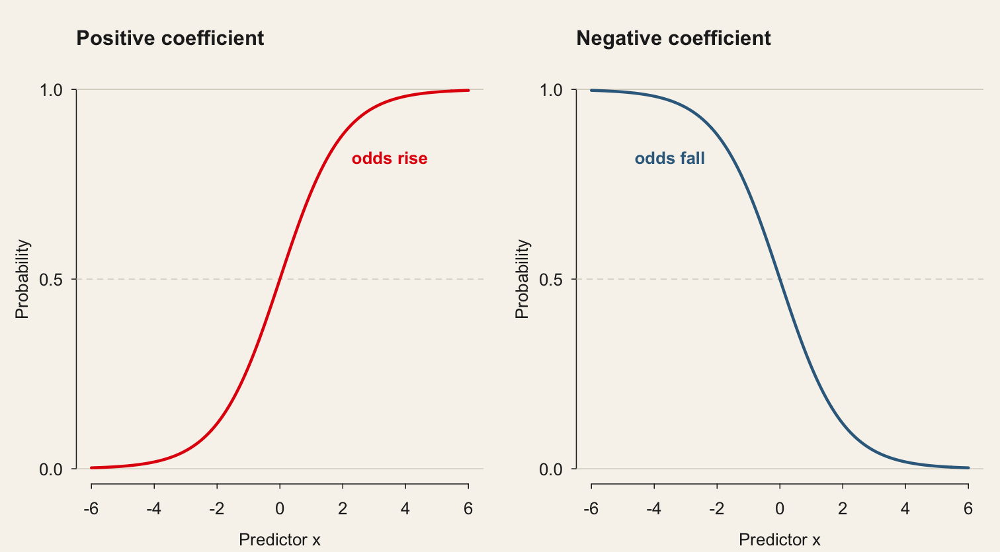

<!-- Source session 5 is taught as course session 4. The code cells are live: they
     execute against the course data at render time, so the output on the slides is
     the output the students' own machines produce. The imported version of this deck
     showed R output under Python code — lm() summaries, 1st Qu., dotted column
     names — because the source was an R course. -->
```{python}
#| label: setup
#| echo: false

import sys, warnings
sys.path.insert(0, "../..")
sys.path.insert(0, "../../slides")
warnings.filterwarnings("ignore")

import numpy as np
import pandas as pd
import statsmodels.formula.api as smf
import qmib

pd.set_option("display.width", 96)
pd.set_option("display.max_columns", 10)

loans = qmib.load("loans")
```

<!-- BEGIN deck-frontmatter · scripts/build_deck_frontmatter.py -->

## Outline · The hour ahead {.center .scrollable}

1. Introduction
2. Let's start with an example
3. The basics of logistic regression
4. Let's see another example
5. Ordinal logistic regression
6. Multinomial logistic regression
7. Conclusion
8. Appendices

## What session 4 is for {.scrollable}
::::: columns

:::: {.column width="33%"}

### The mathematics

- Say why the **linear probability model** fails, and where it fails worst
- Read a coefficient as a **log-odds** and its exponential as an odds ratio
- Compute a fitted probability by hand from $x^\top\hat\beta$
- Separate a **Wald** test from a **likelihood-ratio** test, and report McFadden's pseudo-$R^2$ for what it is

::::

:::: {.column width="33%"}

### The Python

- Fit binary, **ordinal** and **multinomial** logits with `smf.logit`, `OrderedModel`, `sm.MNLogit`
- Turn coefficients into odds ratios and predicted probabilities
- Build the likelihood-ratio test from two models' `.llf`

::::

:::: {.column width="33%"}

### The international business

- Model a categorical business outcome — enter or not, which mode, which grade
- Report an odds ratio to someone who will not read the appendix
- State what the proportional-odds assumption costs when it fails

::::

:::::

## Your Python so far {.scrollable}

Everything you need to type is on one sheet — how to start Python in VS Codium on
your platform, how to make a file and run it, the DataFrame basics, and every name from sessions 1 to 4, each with a line showing it in use.

> **[Python Cheatsheet · Session 04](https://warint.github.io/quantitative-methods/python-cheatsheet-04.pdf)** (PDF) ·
> in the repository at `04-…/PYTHON-CHEATSHEET.pdf`

::: {.muted}
Print it, or keep it open beside the editor. Nothing on it is examinable; all of it is
assumed.
:::

<!-- END deck-frontmatter -->

## Quote of the day {#imported-s04-001 .scrollable}
> The greatest adventure is what lies ahead. Today and tomorrow are yet to be said. The chances, the changes are all yours to make. The mold of your life is in your hands to break.

[J. R. R. Tolkien](https://en.wikipedia.org/wiki/J._R._R._Tolkien)

## Introduction {#imported-s04-004 .center .scrollable}

## Introduction {#imported-s04-006 .scrollable}

[Link to book](https://bookdown.org/roback/bookdown-BeyondMLR/)

## Introduction {#imported-s04-007 .scrollable}

::: cell
```{dot}
digraph a_nice_graph {

# node definitions with substituted label text
node [shape = box, fontname = Helvetica]
a [label = "Data Science"]
b [label = "Machine Learning"]
c [label = "Reinforcement Learning"]
d [label = "Supervised Learning"]
e [label = "Unsupervised Learning"]
f [label = "Classification"]
g [label = "Regression"]
h [label = "Generative Models"]
i [label = "Discriminative Models"]
j [label = "Logistic Regression"]

# edge definitions with the node IDs
a -> {b}
b -> {c, d, e}
d -> {f, g}
f -> {h, i}
i -> {j}

}
```
:::

## Introduction {#imported-s04-008 .scrollable}

As we saw in the two previous modules, linear regression allows us to model the relationship between a quantitative dependent variable Y and a set of independent variables.

> In this module we extend our modeling capabilities and learn how to model the relationship between a **binary dependent variable Y** (then ordinal, then multinomial) and a set of independent variables.

## Let's start with an example {#imported-s04-009 .center .scrollable}

## Lending Club {#imported-s04-010 .scrollable}

<https://www.lendingclub.com/>

-   Peer-to-peer network

## Lending Club (cont.) {#imported-s04-011 .scrollable}

:::::::::::::::::: panel-tabset
### 1

> Which loans are successfull and which one are not successful?

```{python}
#| echo: true

import qmib

# One call. Downloaded once, then read from the local cache.
loans = qmib.load("loans")
loans.describe()
```

### 2

-   We have data on 9,578 3-year loans that were funded through LendingClub.com between May 2007 and February 2010.

-   We have a variable called "default" that indicates that the loan was not paid back in full (the borrower either defaulted or the loan was "charged off," meaning the borrower was deemed unlikely to ever pay it back).

-   We also have the borrower's FICO (credit) score when they applied for the loan.

-   The dependent variable, [\\(Y\\)]{.math .inline}, we want to model is "default" which measures whether or not the loan defaulted.

It is called a binary variable since it only takes on the values 0 or 1:

-   [\\(default = 0\\)]{.math .inline} indicates loan was paid back.
-   [\\(default = 1\\)]{.math .inline} indicates loan was not paid back.

### 3

When working with a binary dependent variable, a scatter plot is often not that useful.


### 4

> If the only tool we have is a hammer, we are tempted to use it for every problem.

-   Let's see how linear regression would address this problem.

```{python}
#| echo: true

import statsmodels.formula.api as smf

# The linear probability model: a straight line through 0/1 outcomes
m1 = smf.ols("default ~ fico", data=loans).fit()
print(m1.summary().tables[1])          # the coefficient table
```

### 5

Some observations:

-   Because the [\\(p-value \< 0.05\\)]{.math .inline}, FICO score is a significant predictor.

-   As FICO increases by 1 point, the average of the dependent variable decreases by [\\(0.001445\\)]{.math .inline}.

> How do we interpret this in the case that Y only takes on 0 or 1 values?

### 6

:::: cell
<div>

<figure>
<p></p>
</figure>

</div>
::::

### 7

> We ran a linear regression, but what exactly are we modeling?

Recall that in the linear regression model we have:

[\\\[ Y \\approx N(\\mu,\~\\sigma\^2) \\\]]{.math .display}

where

[\\\[ \\mu = \\beta_0 + \\beta_1 x \\\]]{.math .display}

That is, the average of Y is modeled as a line.

### 8

The average of Y:

-   When Y only takes on [\\(0\\)]{.math .inline} or [\\(1\\)]{.math .inline} values, the linear regression model has an interesting interpretation.

In this case the linear regression model is equivalent to assuming:

[\\\[ \\pi = P(Y=1)=\\beta_0+\\beta_1x \\\]]{.math .display}

### 9

Let's examine some predicted values from our regression model.

-   FICO score = 650, default probability = 0.25

[\\\[\\hat{y} = 1.187 - 0.001445(650) = 0.25\\\]]{.math .display}

-   FICO score = 825, default probability = -0.005

[\\\[\\hat{y} = 1.187 - 0.001445(825) = -0.005\\\]]{.math .display}

although a FICO score of 825 represents a great credit score, the probability can't be negative.

### Conclusion

-   If we model a binary dependent variable using linear regression, we are modeling probability as a linear relationship with a predictor.

-   Probabilities have to always be between 0 and 1, but the **linear regression model doesn't make this assumption**. So there is no guarantee predictions will make sense.

-   Probabilities computed by linear regressions can be negative or beyond 1.

> Fortunately there is another type of regression model better suited to model probabilities that we discuss now.
::::::::::::::::::

## The basics of logistic regression {#imported-s04-012 .center .scrollable}

## The basics of logistic regression {#imported-s04-013 .scrollable}

::::::::::::: panel-tabset
### LR 1

Recall that a binary dependent variable can take on only one of two values; e.g. [\\(Y = 0\\)]{.math .inline} or [\\(Y = 1\\)]{.math .inline}.

Conventionally [\\(1\\)]{.math .inline} represents a success and [\\(0\\)]{.math .inline} a failure, regardless of the outcome.

Examples of this type of variable in practice are:

-   [\\(Y = 1\\)]{.math .inline} if defaulted on loan, 0 otherwise.

-   [\\(Y = 1\\)]{.math .inline} if made online purchase, 0 otherwise.

-   [\\(Y = 1\\)]{.math .inline} if renewed car lease, 0 otherwise.

-   [\\(Y = 1\\)]{.math .inline} if employee promoted, 0 otherwise.

### LR 2

We showed in the previous segment that when a binary dependent variable is modeled using linear regression, the underlying model being estimated is

[\\\[\\pi = P(Y=1) = \\beta_0 + \\beta_1 x\\\]]{.math .display}

As we saw, issues can arise when making predictions since this model does not prevent probabilities from being larger than 0 or less than 1.

### LR 3

Logistic regression is a way to model a binary dependent variable.

-   The logistic regression model states that:

[\\\[ \\pi = P(Y=1) = \\frac{e\^{(\\beta_0+\\beta_1x)}}{1+e\^{(\\beta_0+\\beta_1x)}} \\\]]{.math .display}

[\\\[ \\pi = P(Y=1) = \\frac{1}{1+e\^{-(\\beta_0+\\beta_1x)}} \\\]]{.math .display}

### LR 4

:::::: columns
::: {.column style="width:50%;"}
The weird looking function is called the logistic function, and its purpose is to ensure that predictions will always be between 0 to 1.

It is called the S-shape function.
:::

:::: {.column style="width:50%;"}
::: {.cell layout-align="center"}
<figure>
<p></p>
</figure>
:::
::::
::::::

### LR 5

The logistic regression model can be estimated by the method of **maximum likelihood estimation**, a common approach for estimating parameters in statistical models.

-   The estimated probability that [\\(Y = 1\\)]{.math .inline} given [\\(x\\)]{.math .inline} is:

[\\\[p = \\frac{1}{1 + e\^{-(b_0 + b_1 x)}}\\\]]{.math .display}

-   [\\(b_0\\)]{.math .inline} is the estimate of [\\(\\beta_0\\)]{.math .inline}.

-   [\\(b_1\\)]{.math .inline} is the estimate of [\\(\\beta_1\\)]{.math .inline}.

### LR 6 · Log-odds

For our loan default data, the logistic regression in Python:

```{python}
#| echo: true

# Fit the logistic regression. The coefficients come out as log-odds.
m2 = smf.logit("default ~ fico", data=loans).fit(disp=0)
m2.params.round(4)
```

The estimated equation, on the **log-odds** scale:

$$
\ln\left(\frac{p}{1-p}\right) = 6.719 - 0.0119\,\text{fico}
$$

One more FICO point lowers the log-odds of default by 0.0119. True, but hard to picture — so we convert.

### LR 7 · Odds

Exponentiate the coefficient to get the **odds ratio**:

```{python}
#| echo: true

# Log-odds -> odds ratio: take the exponential of each coefficient
np.exp(m2.params["fico"]).round(4)
```

-   $e^{-0.0119} = 0.988$: each extra FICO point multiplies the odds of default by 0.988 — the odds are about **1.2% lower**, ceteris paribus.
-   Over 100 points: $e^{100 \times (-0.0119)} = 0.305$ — the odds of default are about **70% lower**.

### LR 8 · Predicted probability

Odds are not probabilities. For a probability, put the **whole** linear predictor $b_0 + b_1 x$ through the logistic function:

$$
p = \frac{e^{b_0 + b_1 x}}{1 + e^{b_0 + b_1 x}}
$$

-   FICO 650: $b_0 + b_1 x = 6.719 - 0.011877 \times 650 = -1.001$, so $p = \dfrac{e^{-1.001}}{1 + e^{-1.001}} = 0.27$
-   FICO 800: $6.719 - 0.011877 \times 800 = -2.783$, so $p = \dfrac{e^{-2.783}}{1 + e^{-2.783}} = 0.06$

```{python}
#| echo: true

# predict() does the same calculation for you
m2.predict(pd.DataFrame({"fico": [650, 700, 800]})).round(3)   # inside the data: 612 to 827
```

With this equation we can predict the probability of default for any FICO score — and, unlike the linear model, it can never fall below 0 or rise above 1.

### LR 9

:::: cell
<div>

<figure>
<p></p>
</figure>

</div>
::::
:::::::::::::

## Let's see another example {#imported-s04-018 .center .scrollable}

## Portugal's Red Wines {#imported-s04-020 .scrollable}

:::::::::::::::::::::::::::::::::::::: panel-tabset
### Wine 1 · The data

Can we use analytics to predict quality from the physio-chemical content of red wine?

-   Data were collected on 1,599 bottles of Portuguese red wines.

-   Each wine was evaluated by experts and classed "bad" ($Y = 0$) or "good" ($Y = 1$).

```{python}
#| echo: true

# qmib.load() already returns good as 0/1, so no recoding is needed.
# About one wine in seven is good: the classes are far from balanced.
redwines = qmib.load("redwines")
redwines["good"].value_counts()
```

### Wine 2 · The equation

Eight predictors $x_1, \dots, x_8$ instead of one. The model is the same, with more terms:

$$
\ln\left(\frac{p}{1-p}\right) = \beta_0 + \beta_1 x_1 + \beta_2 x_2 + \cdots + \beta_8 x_8,
\qquad p = P(\text{good} = 1)
$$

-   Estimated the same way, by **maximum likelihood**: the nine coefficients are chosen jointly so that the good and bad ratings we observe are as probable as possible.

-   Each $\beta_j$ is the change in the log-odds of a good rating for a one-unit increase in $x_j$, **holding the other seven constant**.

### Wine 3 · The code

```{python}
#| echo: true

# Eight chemical measurements; price, region and vintage are absent
predictors = ["fixed_acidity", "volatile_acidity", "residual_sugar", "chlorides",
              "total_sulfur_dioxide", "density", "sulphates", "alcohol"]

w1 = smf.logit("good ~ " + " + ".join(predictors), data=redwines).fit(disp=0)
print(w1.summary())
```

### Wine 4 · Log-odds → odds

The coefficients are **log-odds**; exponentiate them to get **odds ratios**:

```{python}
#| echo: true

# Log-odds as fitted, and their exponentials. Above 1 raises the odds, below 1
# lowers them. The intercept is left out: e^b0 is the odds when all x are zero.
b = w1.params.drop("Intercept")
pd.DataFrame({"log-odds": b, "odds ratio": np.exp(b)}).round(3)
```

-   Alcohol: $b = 0.782$, $e^{0.782} = 2.19$. "A one-point increase in alcohol content multiplies the odds of a good rating by 2.19 — 119% higher — ceteris paribus."

-   Total sulfur dioxide: $b = -0.014$, $e^{-0.014} = 0.986$. Each extra mg/L lowers the odds of a good rating by about 1.4%, ceteris paribus.

-   Density and chlorides show 0.000: a one-unit change is far outside what these variables do in the data. Rescale a predictor before reading its odds ratio.

### Wine 5 · Probabilities

The odds ratio is the same everywhere; the change in **probability** is not. To get probabilities, apply $p = e^{X\beta} / (1 + e^{X\beta})$ to the whole linear predictor — which is what `predict()` does:

```{python}
#| echo: true

# Hold every other predictor at its mean and vary alcohol alone
grid = pd.DataFrame({c: [redwines[c].mean()] * 8 for c in predictors})
grid["alcohol"] = range(8, 16)

grid["p_good"] = w1.predict(grid)
print(grid[["alcohol", "p_good"]].round(3))
```

::: {.muted}
Boxplots, the signs of the coefficients, significance, a confidence interval for one bottle and the pseudo-$R^2$: Appendix B.
:::
::::::::::::::::::::::::::::::::::::::

## Ordinal logistic regression {#imported-s04-025 .center .scrollable}

## Ordinal logistic regression {#imported-s04-026 .scrollable}

::::::::::::::::::::::::::::::: panel-tabset
### OLR 1 · The data

A study looks at factors that influence the decision of whether to apply to graduate school. College juniors are asked if they are unlikely, somewhat likely, or very likely to apply. The outcome has three **ordered** categories, and the "distances" between them need not be equal.

The predictors are `pared` (1 if at least one parent went to graduate school), `public` (1 if the undergraduate institution is public) and `gpa`.

```{python}
#| echo: true

import qmib

# An ordered outcome: how likely a student says they are to apply to graduate
# school. Unlikely < somewhat likely < very likely — an ordering the data carry
# and that a plain multinomial model would throw away.
dat = qmib.load("ologit")
dat.head()
```

### OLR 2 · The equation

With $J = 3$ ordered categories, the ordinal logit models the **cumulative** log-odds — the chance of being *at or below* each cut:

$$
\ln\left(\frac{P(Y \le j)}{P(Y > j)}\right) = c_j - (\beta_1\,\text{pared} + \beta_2\,\text{public} + \beta_3\,\text{gpa}), \qquad j = 1, 2
$$

-   $J - 1 = 2$ **cutpoints** $c_1 < c_2$ play the role of the intercept, one per cut.

-   **One** $\beta$ per predictor, shared by both cuts: the **proportional-odds** assumption.

-   Because of the minus sign, a **positive** $\beta$ pushes students **up** the scale.

-   Estimated by **maximum likelihood**: the cutpoints and the $\beta$s are chosen jointly so that the answers we observe are as probable as possible.

### OLR 3 · The code

```{python}
#| echo: true

from statsmodels.miscmodels.ordinal_model import OrderedModel
# Keep the order: unlikely < somewhat likely < very likely
order = ["unlikely", "somewhat likely", "very likely"]
dat["apply_c"] = pd.Categorical(dat["apply"], categories=order, ordered=True)
om = OrderedModel(dat["apply_c"], dat[["pared", "public", "gpa"]], distr="logit").fit(method="bfgs", disp=0)
print(om.summary())
```

The first three rows are the $\beta$s, in log-odds. The last two are the cutpoints, on a scale explained in Appendix C.

### OLR 4 · Log-odds → odds

The coefficients are **log-odds** — here, of being in a higher category:

```{python}
#| echo: true

# Log-odds: the slopes as fitted (the cutpoints are left out)
om.params[["pared", "public", "gpa"]].round(3)
```

Exponentiate them to get **proportional-odds ratios**:

```{python}
#| echo: true

# Proportional-odds ratios
np.exp(om.params[["pared", "public", "gpa"]]).round(3)
```

-   `pared`: $b = 1.048$, $e^{1.048} = 2.85$. For students whose parents attended graduate school, the odds of being **more likely** to apply are 2.85 times those of other students (185% higher), ceteris paribus.

-   "More likely" means **either** cut — very or somewhat likely versus unlikely, and very likely versus the rest. Proportional odds makes it the same 2.85 at both.

-   `gpa`: $e^{0.616} = 1.85$. One more GPA point multiplies those odds by 1.85 (85% higher), ceteris paribus.

### OLR 5 · Probabilities

Odds are not probabilities. With $\eta = x^\top\beta$ and $F(z) = e^{z} / (1 + e^{z})$:

$$
P(Y \le j) = F(c_j - \eta), \qquad
P(Y = j) = P(Y \le j) - P(Y \le j - 1)
$$

Each category's probability is a **difference** of cumulative ones. `predict()` does this for you:

```{python}
#| echo: true

# The same student, and an otherwise identical one whose parents did not
# go to graduate school. Columns: unlikely, somewhat likely, very likely.
new = pd.DataFrame({"pared": [1, 0], "public": [0, 0], "gpa": [3.0, 3.0]})
pd.DataFrame(np.asarray(om.predict(new)), columns=order, index=["pared=1", "pared=0"]).round(3)
```

Moving `pared` from 0 to 1 takes $P(\text{very likely})$ from 0.079 to 0.197 and $P(\text{unlikely})$ from 0.588 to 0.334. One coefficient moves the whole distribution up the scale.

::: {.muted}
The data in detail, the cutpoints, the computation by hand, `public`, and a check of proportional odds: Appendix C.
:::
:::::::::::::::::::::::::::::::

## Multinomial logistic regression {#imported-s04-027 .center .scrollable}

## Multinomial logistic regression {#imported-s04-028 .scrollable}

::::::::::::::::::::::::: panel-tabset
### MLR 1 · The data

People's occupational choices might be influenced by their parents' occupations and their own education level. Here the choice is a high-school programme — academic, general or vocational — and the question is how it relates to family socio-economic status and writing ability.

-   200 students. The outcome is `prog`, programme type, with **no natural order**.
-   The predictors are `ses`, socio-economic status (low, middle, high), and `write`, a writing score.

```{python}
#| echo: true

# Unordered: vocation is not "more" than general, so the model is multinomial
ml = qmib.load("hsbdemo")
ml.describe()
```

### MLR 2 · The equation

With $J = 3$ unordered categories, pick one as the **baseline** — here academic, the most common. The model writes $J - 1 = 2$ log-odds equations, each comparing one category **with the baseline**:

$$
\ln\left(\frac{P(\text{general})}{P(\text{academic})}\right) = b_{10} + b_{11}\,\text{middle} + b_{12}\,\text{high} + b_{13}\,\text{write}
$$

$$
\ln\left(\frac{P(\text{vocation})}{P(\text{academic})}\right) = b_{20} + b_{21}\,\text{middle} + b_{22}\,\text{high} + b_{23}\,\text{write}
$$

-   **Every predictor gets its own coefficient in every equation**: 2 equations × 4 parameters = 8 parameters.

-   The two equations are estimated **together**, by **maximum likelihood**, not as two separate binary logits. That is what keeps the three probabilities summing to one.

-   `middle` and `high` are indicators; `ses = low` is their reference category.

### MLR 3 · The code

```{python}
#| echo: true

import statsmodels.api as sm
# Code 0 (academic) is the baseline: every coefficient reads "relative to academic"
levels = ["academic", "general", "vocation"]
ml["prog_c"] = pd.Categorical(ml["prog"], categories=levels).codes
# Leave ses_low out, so low SES is the reference the other two are compared with
X = pd.get_dummies(ml[["ses"]].astype(str))[["ses_middle", "ses_high"]].astype(float)
X["write"] = ml["write"].astype(float)
X = sm.add_constant(X)
# Two sets of coefficients at once, each against the academic baseline
mn = sm.MNLogit(ml["prog_c"], X).fit(disp=0)
print(mn.summary().tables[1])          # the coefficient table
```

`prog_c=1` is general vs academic; `prog_c=2` is vocation vs academic. Academic has no block: its coefficients are fixed at zero.

### MLR 4 · Log-odds → relative risk ratios

The coefficients are **log-odds relative to the baseline**. Exponentiated, they are **relative risk ratios** (RRR): $e^{b}$ multiplies the ratio $P(\text{category}) / P(\text{academic})$.

```{python}
#| echo: true

# Log-odds and RRR, for general vs academic and vocation vs academic
pd.concat({"log-odds": mn.params, "RRR": np.exp(mn.params)}, axis=1) \
  .set_axis(["log-odds: general", "log-odds: vocation", "RRR: general", "RRR: vocation"], axis=1).round(3)
```

-   `write`: $b = -0.058$, $e^{-0.058} = 0.944$. Each extra point lowers the general-to-academic ratio by 5.6%, ceteris paribus.
-   `ses` low → high: $b = -1.163$, $e^{-1.163} = 0.313$ for general vs academic — about a third.

Say "relative to academic" every time.

### MLR 5 · Probabilities

Odds are not probabilities. Each category gets a linear index, $\eta_{\text{general}}$ and $\eta_{\text{vocation}}$, with $\eta_{\text{academic}} = 0$ for the baseline. Each probability is its exponentiated index over the sum of all three (the **softmax**):

$$
P(Y = j) = \frac{e^{\eta_j}}{e^{0} + e^{\eta_{\text{general}}} + e^{\eta_{\text{vocation}}}}
$$

```{python}
#| echo: true

# Middle-SES students: the average writer (52.8), then across the range
grid = pd.DataFrame({"const": 1.0, "ses_middle": 1.0, "ses_high": 0.0,
                     "write": [52.775, 35, 45, 55, 65]})
out = pd.DataFrame(mn.predict(grid).values, columns=levels, index=grid["write"])
out.round(3)
```

::: {.muted}
A coefficient moves a category **against the baseline**, not its own probability — so report probabilities too. More in Appendix D.
:::
:::::::::::::::::::::::::

## Conclusion {#imported-s04-029 .center .scrollable}

## Conclusion {#imported-s04-030 .scrollable}

-   Logistic regression extends linear regression to binary, ordinal, and multinomial outcomes.

-   The logistic function constrains predicted probabilities between 0 and 1.

-   Coefficients are interpreted through odds and odds ratios, rather than direct changes in means.

-   Inference relies on likelihood-based methods (Wald tests, likelihood ratio tests) instead of variance decomposition.

-   Model fit can be evaluated using measures such as McFadden's pseudo-R².

-   A set of coefficients, such as all the levels of one categorical predictor, is tested jointly with a likelihood-ratio (χ²) test.

-   Applications to credit risk and wine quality illustrated the interpretive and practical uses of logistic regression.

-   Ordinal and multinomial extensions allow richer modeling of categorical outcomes in business research.

-   Successful application requires attention to assumptions, data quality, and validity of interpretations.

## Conclusion - Key Takeaways {#imported-s04-031 .scrollable}

1.  Logistic regression provides a robust framework for modeling binary and categorical outcomes, ensuring probabilities are always between 0 and 1.

2.  Inference and model fit rely on likelihood-based methods (Wald tests, likelihood-ratio χ² tests, pseudo-R²), rather than variance decomposition.

3.  Extensions to ordinal and multinomial logit models allow richer analysis of categorical responses in applied business research.


## Before the next session {.scrollable}

::: {.warn}
**Required:** the next session's article, its Dataverse package, and the
self-check. That is the pre-session deck.
:::

::: {.step}
**Optional:** the **QMIB Lab** for this session — a knowledge check on the hour
you have just sat through: **[warin.ca/qmib-labs](https://warin.ca/qmib-labs/qmib-lab-04.html)**
:::

::: {.muted}
Never a prerequisite, never marked for correctness. A completed report counts
toward participation because attempting it is the engagement being measured.
:::

## Appendices {#s04-appendices .center .scrollable}

::: {.muted}
What the slides leave out, kept for reading after the session.
:::

## Appendix A · FICO score: inference and intervals {#s04-appendix-a .scrollable}

::::::::::::::::::::: panel-tabset
### A1 · Confidence interval for β₁

The estimate [\\(b_1 = - 0.0119\\)]{.math .inline} is difficult to interpret exactly.

But an important question is whether the data provide evidence that [\\(\\beta_1 \\neq 0\\)]{.math .inline}, which would imply that FICO scores are related to the probability of a loan default.

We could construct a confidence interval for [\\(\\beta_1\\)]{.math .inline} using the same approach as we did with linear regression.

[\\\[ b_1 \\pm 1.96 \\times SE(b_1) \\\]]{.math .display}

-   Usually difficult to make sense out of the exact set of values.

-   However, we can assess whether [\\(\\beta_1\\)]{.math .inline} is positive or negative through a confidence interval.

### A2 · The interval, computed

::::::: columns
::::: {.column style="width:50%;"}
:::::

::: {.column style="width:50%;"}
-   95% confidence interval for [\\(\\beta_1\\)]{.math .inline}:

[\\\[ -.0119 \\pm 1.96 \\times (0.000823) \\\]]{.math .display}

[\\\[ = (-0.0119 - 0.001646, - 0.0119 + 0.001646) \\\]]{.math .display}

[\\\[ = (-0.0135, -0.0103) \\\]]{.math .display}
:::
:::::::

### A3 · Testing β₁ = 0

we are usually interested in the following test:

[\\\[H_0: \\beta_1 = 0\\\]]{.math .display}

[\\\[H_1: \\beta_1 \\neq 0\\\]]{.math .display}

-   If we assume a significance level of [\\(\\alpha = 0.05\\)]{.math .inline}, then because the [\\(p-value \< 0.05\\)]{.math .inline} we can reject the null hypothesis of [\\(\\beta_1 = 0\\)]{.math .inline}.

Therefore FICO score is a statistically significant predictor of the probability of a loan default.

### A4 · Estimating π

Estimating [\\(\\pi\\)]{.math .inline}

> A natural type of question to ask is: What is the probability of a loan default for a FICO score of (say) 700?

-   As we have seen in the last segment, we can answer this from the formula of the **point estimate**, where [\\(b_0\\)]{.math .inline} and [\\(b_1\\)]{.math .inline} are the estimates of [\\(\\beta_0\\)]{.math .inline} and [\\(\\beta_1\\)]{.math .inline}, and [\\(x = 700\\)]{.math .inline}:

[\\\[\\pi = P(Y=1) = \\frac{1}{1+e\^{-(\\beta_0+\\beta_1x)}}\\\]]{.math .display}

### A5 · Interval for a probability

Instead of a point estimate of [\\(\\pi\\)]{.math .inline}, [\\(p\\)]{.math .inline}, we can also compute a 95% confidence interval:

[\\\[p \\pm 1.96 \\times SE(b_1)\\\]]{.math .display}

The formula for SE(p) is complex, so we let Python do the work:

```{python}
#| echo: true

# The logistic fit this slide predicts from. It is fitted again later for the
# likelihood-ratio test; defining it here keeps the deck runnable in slide
# order, which the imported version was not.
m2 = smf.logit("default ~ fico", data=loans).fit(disp=0)

# get_prediction returns the interval as well as the point estimate. On the
# probability scale that interval is asymmetric — which is correct, and the
# reason not to build it by hand as estimate +/- 1.96 * se.
pred = m2.get_prediction(pd.DataFrame({"fico": [700]})).summary_frame()
print(pred[["predicted", "ci_lower", "ci_upper"]].round(4))
```

The 95% confidence interval for [\\(\\pi\\)]{.math .inline} is (0.161, 0.177).

> We are 95% confident that the probability that a borrower with a FICO score of 700 would default is between 0.161 and 0.177.

### A6 · The fitted curve

:::: cell
<div>

<figure>
<p></p>
</figure>

</div>
::::
:::::::::::::::::::::

## Appendix B · Portugal's red wines: more detail {#s04-appendix-b .scrollable}

::::::::::::::::::::: panel-tabset
### B1 · Why several predictors

-   Analogous to linear regression, logistic regression benefits from using multiple predictors simultaneously.

-   Pros and cons of multiple predictors:

    -   Greater accuracy in predictions

    -   Better use of data

    -   Much more difficult to visualize

    -   With large data, computing-intensive to fit

### B2 · Descriptive statistics

```{python}
#| echo: true

import qmib

# Every variable at a glance, before any model
redwines = qmib.load("redwines")
redwines.describe().round(2)
```

### B3 · Boxplots by outcome

::::::::: columns
::::: {.column style="width:50%;"}
```{python}
#| echo: true

import matplotlib.pyplot as plt

# Boxplots by outcome, before any model. If a predictor's two boxes sit on top
# of one another, no coefficient is going to rescue it — and if they separate
# cleanly, you should expect the model to find that and be suspicious if not.
fig, axes = plt.subplots(1, 3, figsize=(11, 3.4))
for ax, col in zip(axes, ["fixed_acidity", "volatile_acidity", "alcohol"]):
    redwines.boxplot(column=col, by="good", ax=ax)
    ax.set_title(col); ax.set_xlabel("good")
plt.suptitle(""); plt.tight_layout(); plt.show()
```
:::::

::::: {.column style="width:50%;"}
:::: cell
<div>

<figure>
<p></p>
</figure>

</div>
::::
:::::
:::::::::

### B4 · Signs of the coefficients

The estimated multiple logistic regression is therefore:

[\\\[\\pi = P(Y=1) = \\frac{1}{1+e\^{-(227 + 0.281 x_1 -2.913 x_2 + \... + 0.782 x_p)}}\\\]]{.math .display}

A positive value of a coefficient means:

-   A one-unit increase in the predictor, holding the other predictors fixed, corresponds to an increase in the probability of "success."

A negative value of a coefficient means:

-   A one-unit increase in the predictor, holding the other predictors fixed, corresponds to a decrease in the probability of "success."

### B5 · Reading the signs

An increase in fixed acidity, residual sugar, sulphates, and alcohol content correspond to higher wine quality, holding all other variables fixed.

An increase in volatile acidity, chlorides, total sulfur dioxide and density correspond to lower wine quality, holding all other variables fixed.

### B6 · The magnitudes

Interpreting the magnitude of the coefficients:

-   As with simple logistic regression, the actual values of the estimated coefficients do have an interpretation, but they are not straightforward.

> It is more crucial to interpret when a coefficient is positive or negative.

### B7 · Predicted probabilities, plotted

:::: cell
<div>

<figure>
<p></p>
</figure>

</div>
::::

### B8 · Significance

Also we might want to know whether a coefficient is [\\(0\\)]{.math .inline} (i.e., whether the predictor is important).

Can formally address this question using hypothesis tests:

-   Interpretation: Each predictor individually is significant (at the α = 0.05 level) of wine quality relative to a model with all other predictors included.

There are no simple formulas for confidence intervals for the true probability, π, for a specific set of predictor values. But they are easily computed in Python.

### B9 · One bottle, with an interval

Consider a bottle of wine with these characteristics:

| fixed acidity | volatile acidity | residual sugar | chlorides | total sulfur dioxide | density | sulphates | alcohol |
|---|---|---|---|---|---|---|---|
| 6.2 | 0.36 | 2.2 | 0.095 | 42 | 0.9946 | 0.57 | 11.7 |

```{python}
#| echo: true

# One bottle: its predicted probability of a good rating, with a 95% interval
bottle = pd.DataFrame({"fixed_acidity": [6.2], "volatile_acidity": [0.36],
                       "residual_sugar": [2.2], "chlorides": [0.095],
                       "total_sulfur_dioxide": [42], "density": [0.9946],
                       "sulphates": [0.57], "alcohol": [11.7]})
w1.get_prediction(bottle).summary_frame()[["predicted", "ci_lower", "ci_upper"]].round(3)
```

The estimated probability that this wine is good is 0.142, with a 95% confidence interval of (0.097, 0.202). This particular wine was rated "not good" in the data.

> For wines with this physio-chemical composition, we are 95% confident that the probability of a "good" evaluation is between 0.097 and 0.202.

### B10 · Pseudo-R²

The pseudo-$R^2$ is computed for multiple logistic regression in the same way as in simple logistic regression:

```{python}
#| echo: true

# McFadden's pseudo R-squared, from the two maximised log-likelihoods
w0 = smf.logit("good ~ 1", data=redwines).fit(disp=0)
print(f"pseudo R2 = {1 - w1.llf / w0.llf:.3f}")
```

A moderate amount of the variability in the binary response is explained by the physio-chemical predictors.
:::::::::::::::::::::

## Appendix C · Ordinal logistic regression: more detail {#s04-appendix-c .scrollable}

::::::::::::::::::::: panel-tabset
### C1 · The data, cross-tabulated

::::::::::: columns
:::::: {.column style="width:50%;"}
```{python}
#| echo: true

# Three ordered categories. Most students sit in the bottom one, which is
# why "unlikely" dominates every predicted distribution that follows.
dat["apply"].value_counts()
```
::::::

:::::: {.column style="width:50%;"}
```{python}
#| echo: true

# Cross-tabulate before fitting. A cell with almost no observations is where an
# ordinal model will produce a large coefficient and a larger standard error.
pd.crosstab([dat["public"], dat["pared"]], dat["apply"])
```
::::::
:::::::::::

The predictors are `pared` (1 if at least one parent went to graduate school), `public` (1 if the undergraduate institution is public) and `gpa`.

### C2 · GPA by category

```{python}
#| echo: true

# Mean GPA rises with each category — the pattern the model will summarise.
dat.groupby("apply_c", observed=True)["gpa"].mean().round(3)
```

### C3 · Reading the output: the cutpoints

**Reading the output.** The first three rows are the $\beta$s, on the log-odds scale. Each `z` is `coef / std err`, and its p-value is a Wald test of $\beta = 0$:

-   `pared` (1.048, $p < 0.001$) and `gpa` (0.616, $p = 0.018$) are significant; `public` ($-0.059$, $p = 0.84$) is not.

The last two rows are the cutpoints — but **not both on the same scale**. statsmodels keeps them in order by estimating the first cutpoint directly and the *log of the gap* to the next one:

$$
c_1 = 2.204, \qquad c_2 = c_1 + e^{0.740} = 2.204 + 2.096 = 4.299
$$

```{python}
#| echo: true

# The cutpoints on the scale the model uses, with -inf and +inf at the ends
om.model.transform_threshold_params(om.params)
```

There is no separate intercept: $c_1$ and $c_2$ are the intercepts.

### C4 · A probability by hand

**Computing a probability by hand.** Take a student whose parents went to graduate school (`pared = 1`), at a private institution (`public = 0`), with a GPA of 3.0.

1.  The linear index: $\eta = 1.048(1) - 0.059(0) + 0.616(3.0) = 2.895$
2.  The cumulative probabilities, with $F(z) = 1/(1+e^{-z})$:
    -   $P(Y \le \text{unlikely}) = F(c_1 - \eta) = F(2.204 - 2.895) = F(-0.692) = 0.334$
    -   $P(Y \le \text{somewhat}) = F(c_2 - \eta) = F(4.299 - 2.895) = F(1.404) = 0.803$
3.  Each category's probability is a **difference** of cumulative ones:
    -   $P(\text{unlikely}) = 0.334$
    -   $P(\text{somewhat likely}) = 0.803 - 0.334 = 0.469$
    -   $P(\text{very likely}) = 1 - 0.803 = 0.197$

### C5 · School type

School Type

-   $e^{-0.059} = 0.943$. For students at a public institution, the **odds** of being **more likely** to apply are 5.7% lower \[i.e., (1 − 0.943) × 100%\] than for private-institution students, holding constant all other variables.

-   Equivalently, private-institution students have odds of being more likely to apply that are $1/0.943 = 1.06$ times those of public-institution students.

-   But the confidence interval for $\beta_2$ is $(-0.64, 0.53)$ and $p = 0.84$: the data cannot tell a 5.7% difference from none. **Report it as no detectable effect**, not as a 5.7% effect.

### C6 · GPA in detail

GPA

-   $e^{0.616} = 1.85$. For every one-point increase in GPA, the **odds** of being **more likely** to apply (at either cut) are multiplied by 1.85 (i.e., increase 85%), holding constant all other variables.

-   A full GPA point is a big move here — the standard deviation of `gpa` is 0.40. For a 0.4-point increase the odds ratio is $e^{0.616 \times 0.4} = 1.28$.

-   Odds ratios multiply **odds**, not probabilities. How much a probability moves depends on where the student starts, which is why the predicted probabilities in OLR 5 are the better thing to show a reader.

### C7 · Is proportional odds plausible?

**Is proportional odds plausible?** Fit a separate binary logit at each cut and compare the slopes. If the assumption holds, they should be close.

```{python}
#| echo: true

# Cut 1: somewhat or very likely vs unlikely. Cut 2: very likely vs the rest.
codes = dat["apply_c"].cat.codes
cuts = pd.DataFrame({
    f"cut {k}": smf.logit("y ~ pared + public + gpa",
                          data=dat.assign(y=(codes >= k).astype(int))).fit(disp=0).params
    for k in (1, 2)
})
cuts.assign(ordinal=om.params[["pared", "public", "gpa"]]).round(3).drop(index="Intercept")
```

-   `pared` and `gpa` are close across the two cuts, and the ordinal slope sits between them.

-   `public` changes sign ($-0.20$ vs $0.54$), but neither is significant and cut 2 has only 40 students above it. The single ordinal slope averages over that.

-   If a slope really differs across cuts, one number is the wrong summary. A generalized ordered logit, or a multinomial logit, lets it vary.
:::::::::::::::::::::

## Appendix D · Multinomial logistic regression: more detail {#s04-appendix-d .scrollable}

::::::::::::::::::::: panel-tabset
### D1 · The data, cross-tabulated

```{python}
#| echo: true

# Unordered outcome this time: academic, general, vocation have no natural
# ranking, so the ordinal model above would impose one that is not there.
pd.crosstab(ml["ses"], ml["prog"], margins=True)
```

### D2 · Reading the output

**Reading the output.** The summary has one block per equation. `prog_c=1` is general vs academic (the $b_{1k}$); `prog_c=2` is vocation vs academic (the $b_{2k}$). Code 0, academic, has no block: its coefficients are fixed at zero.

Substituting the estimates:

$$
\ln\left(\frac{P(\text{general})}{P(\text{academic})}\right) = 2.852 - 0.533\,\text{middle} - 1.163\,\text{high} - 0.058\,\text{write}
$$

$$
\ln\left(\frac{P(\text{vocation})}{P(\text{academic})}\right) = 5.218 + 0.291\,\text{middle} - 0.983\,\text{high} - 0.114\,\text{write}
$$

The header of `print(mn.summary())` gives the fit of the model as a whole: log-likelihood $-179.98$ against $-204.10$ for the intercept-only model, McFadden's pseudo-$R^2$ = 0.118, and a likelihood-ratio p-value of $10^{-8}$ for all six slopes jointly.

### D3 · Every coefficient

**Interpreting the coefficients** — each one is a change in the log odds of one programme **relative to academic**:

-   $b_{13} = -0.058$: a one-point increase in `write` lowers the log odds of general vs academic by 0.058 ($p = 0.007$).

-   $b_{23} = -0.114$: a one-point increase in `write` lowers the log odds of vocation vs academic by 0.114 ($p < 0.001$).

-   $b_{12} = -1.163$: moving from low to high SES lowers the log odds of general vs academic by 1.163 ($p = 0.024$).

-   $b_{11} = -0.533$: moving from low to middle SES lowers the log odds of general vs academic by 0.533, although this coefficient is not significant ($p = 0.23$).

-   $b_{22} = -0.983$: moving from low to high SES lowers the log odds of vocation vs academic by 0.983, significant only at the 10% level ($p = 0.099$).

-   $b_{21} = 0.291$: moving from low to middle SES raises the log odds of vocation vs academic by 0.291, although this coefficient is not significant ($p = 0.54$).

Say "relative to academic" every time. Nothing here compares general with vocation directly; that is $b_{2k} - b_{1k}$.

### D4 · Does SES matter at all?

**Does SES matter at all?** SES has four coefficients — two indicators in two equations — so no single z-test answers that. Use a **likelihood-ratio test**: fit the model with and without SES, and compare their maximised log-likelihoods.

$$LR = 2\,(\ell_{\text{full}} - \ell_{\text{restricted}}) \sim \chi^2_{q}$$

where $q$ is the number of coefficients dropped — here four. A large $LR$ means the dropped coefficients were doing work. It is the logistic analogue of the $F$-test for nested linear models.

```{python}
#| echo: true

from scipy import stats

# Drop both SES indicators from both equations and compare log-likelihoods
mn_noses = sm.MNLogit(ml["prog_c"], X.drop(columns=["ses_middle", "ses_high"])).fit(disp=0)
lr = 2 * (mn.llf - mn_noses.llf)
df = int(mn.df_model - mn_noses.df_model)
print(f"chi2 = {lr:.2f}, df = {df}, p = {stats.chi2.sf(lr, df):.4f}")
```

With $p \approx 0.026$, SES improves the model jointly, even though three of its four coefficients are not individually significant at 5%.

### D5 · Probabilities by hand

**Computing probabilities by hand.** Take a middle-SES student with the average writing score, 52.8.

1.  One linear index per equation, and zero for the baseline:
    -   general: $\eta_1 = 2.852 - 0.533 - 0.058(52.8) = -0.738$
    -   vocation: $\eta_2 = 5.218 + 0.291 - 0.114(52.8) = -0.486$
    -   academic: $\eta_0 = 0$
2.  Each probability is its exponentiated index over the sum of all three (the **softmax**):

$$
P(\text{academic}) = \frac{1}{1 + e^{-0.738} + e^{-0.486}} = \frac{1}{1 + 0.478 + 0.615} = 0.478
$$

$$
P(\text{general}) = \frac{0.478}{2.093} = 0.228, \qquad P(\text{vocation}) = \frac{0.615}{2.093} = 0.294
$$

### D6 · Coefficients are not probability effects

**Coefficients are not probability effects.** $b_{13}$ is negative, yet in the table, $P(\text{general})$ *rises* from 0.192 to 0.232 as `write` goes from 35 to 45, and only then falls.

-   The reason: `write` lowers the vocation-to-academic ratio twice as fast as the general-to-academic ratio. As the weakest writers move out of vocation, some of them land in general.

-   A coefficient tells you how one category moves **against the baseline**. How that category's own probability moves depends on all the equations at once.

> Report predicted probabilities — or their changes — alongside the coefficients. A reader who sees only $b_{13} < 0$ will conclude that better writers are always less likely to be in the general programme, and the model does not say that.
:::::::::::::::::::::
