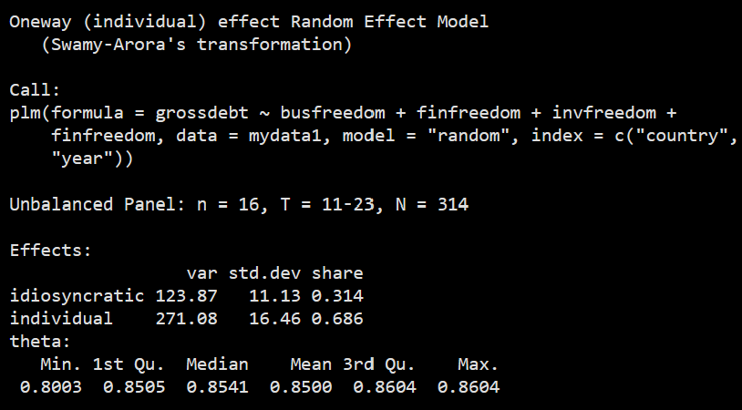
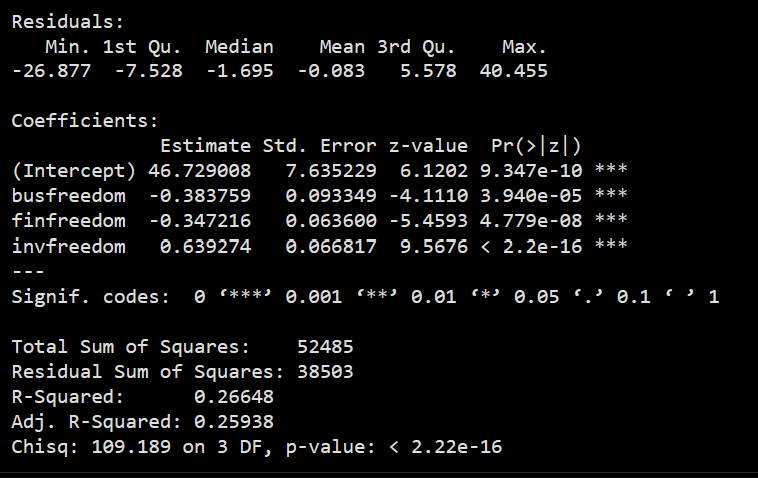
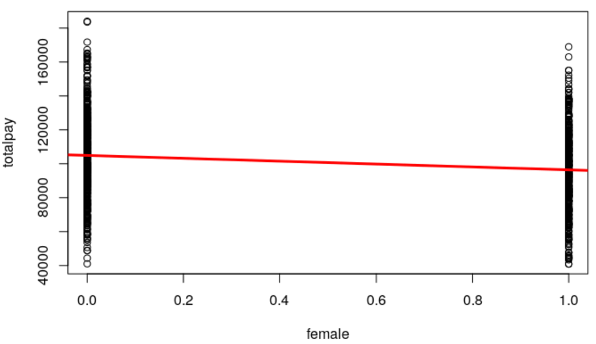
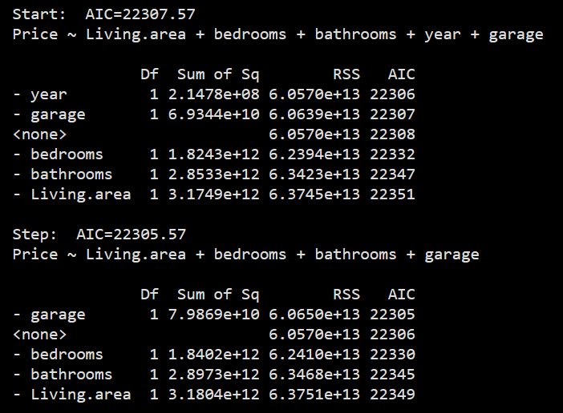
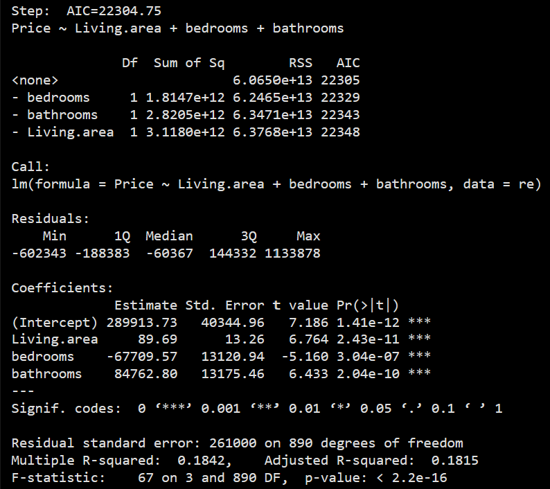
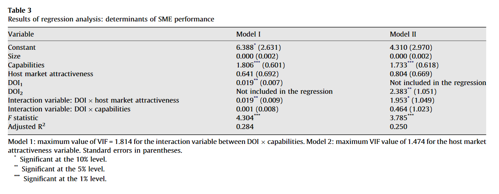

<!-- Imported from https://warin.ca/quant/en/session6_cours/. The code cells below are live: they execute
     against the course data at render time, so the output on the slides is the
     output the students' own machines produce. -->
```{python}
#| label: setup
#| echo: false

import sys, warnings
sys.path.insert(0, "../..")
sys.path.insert(0, "../../slides")
warnings.filterwarnings("ignore")

import numpy as np
import pandas as pd
import matplotlib.pyplot as plt
import qmib

pd.set_option("display.width", 96)
pd.set_option("display.max_columns", 10)
```

<!-- BEGIN deck-frontmatter · scripts/build_deck_frontmatter.py -->

## Outline · The hour ahead {.center .scrollable}

1. Quote of the day
2. Where we left off
3. Over to you
4. Getting your hands dirty with Money Ball
5. Panel data analysis
6. Step 1. Running a TSCS model
7. Step 2. Fixed effects versus random effects
8. To go further
9. To go further (cont.)
10. Binary and categorical independent variables
11. Binary and categorical independent variables (cont.)
12. The R deck uses totalpay; here it is income plus bonus (cont.)
13. Dummy variables for each level of education (cont.)
14. Interaction terms
15. Interaction terms (cont.)
16. age * female expands to age + female + age:female — the interaction (cont.)
17. Comparing models
18. Comparing models (cont.)
19. Lower AIC is better. The comparison only makes sense on the same rows. (cont.)
20. Automatic model selection
21. Python has no step(); choose among candidates explicitly. (cont.)
22. Conclusion

## What session 6 is for {.scrollable}
::::: columns

:::: {.column width="33%"}

### The mathematics

- State what a **panel** is, and why pooling understates uncertainty
- Distinguish **fixed** from **random** effects, and say what each assumes
- Read an **interaction** as a slope that differs between groups
- Compare non-nested models on information criteria rather than an $F$-test
- Use the **Hausman test** to choose between fixed and random effects, and say what it assumes
- Name the two pitfalls this session is really about — **multicollinearity** and **overfitting**

::::

:::: {.column width="33%"}

### The Python

- Fit pooled, fixed-effects and two-way models, and cluster the errors
- Write a quadratic and an interaction in a formula, and interpret them in units
- Put three specifications in one table and let the reader see the spread

::::

:::: {.column width="33%"}

### The international business

- Separate within-country change from between-country difference
- Say which specification your identifying variation can actually support
- Report the estimate *and* the specification, because neither means much alone

::::

:::::

## Your Python so far {.scrollable}

The 48 names below came out of sessions 2–5. Today's slides assume them, and add to them. The ones marked are the newest, from session 5.

### Load and shape

- `.dropna` — drop rows with missing values
- `.merge` — join two frames on a key
- `.shape` — rows and columns
- `pd.read_parquet` — a parquet file, directly
- `qmib.load` — a course dataset, by name
- `pd.get_dummies` — categories to indicator columns
- `StandardScaler` — standardise before you penalise · *new in session 5*
- `make_pipeline` — so the scaler is fitted on train only · *new in session 5*

### Describe

- `.mean / .median` — the two centres, and their gap
- `.quantile` — any quantile, including the median
- `.std / .var` — spread, dividing by $n-1$
- `stats.trim_mean` — the mean after cutting both tails
- `.value_counts` — how unbalanced is the outcome
- `pd.crosstab` — a contingency table in one call

### Fit

- `.fit()` — estimate the model you specified
- `smf.ols` — least squares, from a formula
- `OrderedModel` — ordered categories, proportional odds
- `sm.MNLogit` — unordered categories, one baseline
- `sm.add_constant` — the intercept, when there is no formula
- `smf.logit` — binary outcome, from a formula
- `Ridge / Lasso / ElasticNet` — the three penalties · *new in session 5*

### Read the fit

- `.params` — the coefficients, in units of $y$
- `.rsquared` — share of variance explained
- `.mse_resid` — its square root is the RSE, in units
- `.resid / .fittedvalues` — what is left, and what was predicted
- `.rsquared_adj` — penalised for the extra predictor
- `.get_prediction` — with an interval, via `.summary_frame()`
- `.predict` — fitted probabilities, not classes
- `np.exp` — a log-odds becomes an odds ratio
- `.coef_ / .alpha_` — scikit-learn's spelling of `.params` · *new in session 5*

### Diagnose

- `.cooks_distance` — influence: leverage $\times$ residual
- `.get_influence()` — the whole diagnostic bundle
- `.hat_matrix_diag` — leverage; sums to $p$, always
- `.resid_studentized_internal` — residuals on a common scale

### Choose and validate

- `.aic / .bic` — compare non-nested models
- `.llf` — log-likelihood, for the LR test
- `stats.chi2.sf` — the $p$-value of that test
- `KFold` — and do it $k$ times · *new in session 5*
- `RidgeCV / LassoCV / ElasticNetCV` — $\lambda$ by cross-validation · *new in session 5*
- `lasso_path` — the whole coefficient path · *new in session 5*
- `mean_squared_error` — score it on the held-out part · *new in session 5*
- `np.logspace` — a grid that is even in $\log\lambda$ · *new in session 5*
- `train_test_split` — hold something back · *new in session 5*

### Plot

- `plt.scatter` — the data, before anything else
- `plt.xlabel / plt.ylabel` — say the units, every time
- `plt.axhline / plt.axvline` — draw the threshold you are judging against
- `plt.stem` — one spike per observation
- `plt.subplots` — several panels, one figure

<!-- END deck-frontmatter -->

## Quote of the day {#imported-s06-001 .scrollable}
> True education is a kind of never ending story --- a matter of continual beginnings, of habitual fresh starts, of persistent newness.
>
> [J. R. R. Tolkien](https://en.wikipedia.org/wiki/J._R._R._Tolkien){target="_blank"}

## Where we left off {#imported-s06-002 .scrollable}
> Latest session
>
> from a sample to a predicted value
>
> model accuracy
>
> model validity

## Over to you {#imported-s06-007 .scrollable}
> Wait!
>
> I want to do it myself!

## Getting your hands dirty with Money Ball {#imported-s06-008 .scrollable}
> Getting your hands dirty with Money Ball

::: center
:::

## Getting your hands dirty with Money Ball {#imported-s06-009 .scrollable}

> Homework: Be the hero
>
> in your RStudio sessions, follow these steps [here](https://warin.ca/shiny/course-MQ-en/moneyball/){target="_blank"}

## 1\. Panel data analysis {#imported-s06-010 .scrollable}

## 1\. Panel data analysis {#imported-s06-011 .scrollable}

#### Foundations of panel data

-   Step 1. Estimating a time-series cross-section model

-   Step 2. The question of fixed effects

#### Advanced validity solutions (beyond the scope of this course) {#advanced-validity-solutions-beyond-the-scope-of-this-course-}

-   Step 3. Unbalanced panels

-   Step 4. Panel data\'s shape

## Step 1. Running a TSCS model {#imported-s06-012 .scrollable}

```{python}
#| echo: true

import qmib

# Country panel: government debt and economic-freedom indices
mydata1 = qmib.load("panel")
mydata1.head()
```

## Step 1. Running a TSCS model {#imported-s06-013 .scrollable}

::::: panel-tabset
### Code

```{python}
#| echo: true

from linearmodels.panel import RandomEffects
import pandas as pd

# A panel needs a two-level index: entity, then time
cols = ["grossdebt", "busfreedom", "finfreedom", "invfreedom"]
panel = mydata1.dropna(subset=cols).set_index(["country", "year"])
y = panel["grossdebt"]
X = panel[["busfreedom", "finfreedom", "invfreedom"]]

re_model = RandomEffects(y, X).fit()
```

Also, remember how useful this command can be:

```{python}
#| echo: true

help(RandomEffects)
```

### Code 2

```{python}
#| echo: true

print(re_model)
```

::: pull-left
{style="display: block; margin: auto;" width="100%"}
:::

::: pull-right
{style="display: block; margin: auto;" width="100%"}
:::
:::::

## Step 2. Fixed effects versus random effects {#imported-s06-014 .scrollable}

::: panel-tabset
### Principles

In terms of estimation techniques, we need to use time-series cross-section based techniques. First, we need to go through a couple of checkings. Among the first ones, we need to see whether we need a fixed-effects or a random-effects model.

FE explore the relationship between predictor and outcome variables within an entity (country, person, company, etc.).

Each entity has its own individual characteristics that may or may not influence the predictor variables (for example, being a male or female could influence the opinion toward certain issue; or the political system of a particular country could have some effect on trade or GDP; or the business practices of a company may influence its stock price).

When using FE we assume that something within the individual may impact or bias the predictor or outcome variables and we need to control for this. This is the rationale behind the assumption of the correlation between entity's error term and predictor variables.

FE remove the effect of those time-invariant characteristics so we can assess the net effect of the independent variable on the outcome variable.

### Code

Another important assumption of the FE model is that those time-invariant characteristics are unique to the individual and should not be correlated with other individual characteristics.

Each entity is different therefore the entity's error term and the constant (which captures individual characteristics) should not be correlated with the others. If the error terms are correlated, then FE is no suitable since inferences may not be correct and you need to model that relationship (probably using random-effects), this is the main rationale for the Hausman test.

```{python}
#| echo: true

from linearmodels.panel import PanelOLS

# Fixed effects: one intercept per country, absorbed rather than estimated.
# Only within-country variation identifies the slopes now.
fixed = PanelOLS(y, X, entity_effects=True).fit()
print(fixed)
```

## Step 2. Fixed effects versus random effects {.scrollable}

The two estimators disagree. The **Hausman test** asks whether the disagreement
is larger than sampling noise — and if it is, random effects is inconsistent.

```{python}
#| echo: true

import numpy as np
from scipy import stats

# H = (b_FE - b_RE)' [Var(b_FE) - Var(b_RE)]^-1 (b_FE - b_RE), distributed chi2
# with one degree of freedom per coefficient under the null. Note pinv, not inv:
# the difference of two estimated covariance matrices is near-singular.
diff  = fixed.params - re_model.params
vdiff = fixed.cov - re_model.cov
H = float(diff.values @ np.linalg.pinv(vdiff.values) @ diff.values)
pval = 1 - stats.chi2.cdf(H, len(diff))

for k in fixed.params.index:
    print(f"{k:12}  FE {fixed.params[k]:8.3f}   RE {re_model.params[k]:8.3f}"
          f"   diff {diff[k]:8.3f}")
print(f"\nHausman H = {H:.2f} on {len(diff)} df,  p = {pval:.4f}")
```

::: {.warn}
Rejecting tells you random effects is **wrong** here — not that fixed effects is
right. What it leaves you with is an estimator that uses only within-country
variation, and therefore cannot answer a question about differences *between*
countries.
:::

Considering the results of the Hausman test with a \\(p-value \>0.05\\), we need a random effects model.
:::

## 2\. To go further {#imported-s06-015 .scrollable}

## 2\. To go further (cont.) {#imported-s06-016 .scrollable}

#### 2.1 Quadratic effects {#2-1-quadratic-effects-detail}

::::: panel-tabset
### Example

::: pull-left
Let's go to the real estate data. Let's see if selling price is related to Living.area. First visualize this relationship:

```{python}
#| echo: true

import qmib
import statsmodels.formula.api as smf

re_data = qmib.load("realestate")
re1 = smf.ols("price ~ living_area", data=re_data).fit()
```
:::

::: pull-right

:::

### Results 1

```{python}
#| echo: true

print(re1.summary())
```

### 2

A one square foot increase in Living.area is associated with a \$114 increase in Price, on average.

**What can we do if we suspect that this association accelerates (is not linear) as Living.area increases?**

-   A linear regression model with a quadratic effect allows for us to model associations that are non-linear.

A quadratic effects regression model is a regression model that has one of the independent variable squared.

-   Thus the mean of the dependent variable \\(Y\\) can be modeled with predictor x1 as:

\$\$\\mu = \\beta_0 + \\beta_1 x_1 + \\beta_2 x_1\^2\$\$

\\(\\beta_2\\) measures the amount of non-linearity in the relationship between \\(Y\\) and \\(x_1\\).

If \\(\\beta_2\\) is zero, then the relationship simplifies to a linear one.

So we can perform a \\(t-test\\) for \\(\\beta_2\\) to determine if the relationship is non-linear in this fashion.

### 3

Let's fit a regression model to predict Price from both \\(Living.area\\) and \\(Living.area\^2\\).

```{python}
#| echo: true

re2 = smf.ols("price ~ living_area + I(living_area**2)", data=re_data).fit()
print(re2.summary())   # the quadratic term is very significant
```

### 4

Since quadratic effect is positive and the trend is positive for all reasonable values of Living.area, then we can say the association **accelerates** as Living.area increases.

The \\(t-test\\) associated with \\(\\beta_2 = .04083\\) is very significant (p-value = 0.00001), and thus the quadratic effect is important.

This model predicts Price better than just a linear one!

The name 'linear' regression is actually a little misleading.

It is called **linear regression** because the coefficients are linear terms, but the independent variable can be transformed in any fashion: \\(x_2\\), \\(log(x)\\), etc.

Thus linear regression is actually quite powerful and flexible to model other associations, which is why it is used so often in practice.
:::::

## 2.2 Binary and categorical independent variables {#imported-s06-017 .scrollable}

## 2.2 Binary and categorical independent variables (cont.) {#imported-s06-018 .scrollable}

#### 2.2 Binary and categorical independent variables {#2-2-binary-and-categorical-independent-variables}

::: panel-tabset
### Definitions

In this section, we show how to analyze regression equations when one or more independent variables are categorical. The key to the analysis is to express categorical variables as dummy variables.

##### What is a Dummy Variable? {#what-is-a-dummy-variable-}

A dummy variable (aka, an indicator variable) is a numeric variable that represents categorical data, such as gender, race, political affiliation, etc.

Technically, dummy variables are dichotomous, quantitative variables. Their range of values is small; they can take on only two quantitative values. As a practical matter, regression results are easiest to interpret when dummy variables are limited to two specific values, \\(1\\) or \\(0\\). Typically, \\(1\\) represents the presence of a qualitative attribute, and \\(0\\) represents the absence.

#### How Many Dummy Variables? {#how-many-dummy-variables-}

The number of dummy variables required to represent a particular categorical variable depends on the number of values that the categorical variable can assume. To represent a categorical variable that can assume \\(k\\) different values, a researcher would need to define \\(k - 1\\) dummy variables.

### Example

For example, suppose we are interested in political affiliation, a categorical variable that might assume three values - Republican, Democrat, or Independent.

We could represent political affiliation with two dummy variables:

\$\$X_1 = 1,\~if\~Republican;\~X_1 = 0,\~otherwise.\$\$

\$\$X_2 = 1,\~if\~Democrat;\~X_2 = 0,\~otherwise.\$\$

In this example, notice that we don\'t have to create a dummy variable to represent the \"Independent\" category of political affiliation.

If \\(X_1=0\\) and \\(X_2=0\\), we know the voter is neither Republican nor Democrat. Therefore, voter must be Independent.

```{python}
#| echo: true

glassdoor = qmib.load("glassdoor")

# The R deck uses totalpay; here it is income plus bonus
glassdoor["totalpay"] = glassdoor["income"] + glassdoor["bonus"]
glassdoor.head()
```

### Code

```{python}
#| echo: true

import matplotlib.pyplot as plt

glassdoor["female"] = (glassdoor["gender"].str.lower() == "female").astype(int)
glassdoor.boxplot(column="totalpay", by="female")
plt.suptitle(""); plt.show()

lm1 = smf.ols("totalpay ~ female", data=glassdoor).fit()
```

{style="display: block; margin: auto;" width="60%"}

### Results

```{python}
#| echo: true

print(lm1.summary())
```

### Lessons

**Avoid the Dummy Variable Trap**

-   When defining dummy variables, a common mistake is to define too many variables. If a categorical variable can take on k values, it is tempting to define \\(k\\) dummy variables.

-   Resist this urge. Remember, you only need \\(k - 1\\) dummy variables.

> A \\(k\^{th}\\) dummy variable is redundant; it carries no new information.
>
> And it creates a severe multicollinearity problem for the analysis.

Using \\(k\\) dummy variables when only \\(k - 1\\) dummy variables are required is known as the dummy variable trap.
:::

## The R deck uses totalpay; here it is income plus bonus (cont.) {#imported-s06-019 .scrollable}

::: panel-tabset
### Example

**How to Interpret Dummy Variables**

Once a categorical variable has been recoded as a dummy variable, the dummy variable can be used in regression analysis just like any other quantitative variable.

For example, suppose we wanted to assess the relationship between household income and political affiliation (i.e., Republican, Democrat, or Independent). The regression equation might be:

\$\$Income = \\beta_0 + \\beta_1 X_1+ \\beta_2 X_2\$\$

where \\(\\beta_0\\), \\(\\beta_1\\), and \\(\\beta_2\\) are regression coefficients. \\(X_1\\) and \\(X_2\\) are regression coefficients defined as:

\$\$X_1 = 1,\~if\~Republican;\~X_1=0,\~otherwise.\$\$ \$\$X_2 = 1,\~if\~Democrat;\~X_2 = 0,\~otherwise.\$\$

The value of the categorical variable that is not represented explicitly by a dummy variable is called the reference group. In this example, the reference group consists of Independent voters.

### Principles

In this analysis, each dummy variable is compared with the **reference group**.

In this example, a **positive regression coefficient** means that income is higher for the dummy variable political affiliation than for the reference group; a **negative regression coefficient** means that income is lower.

If the regression coefficient is statistically significant, the income discrepancy with the reference group is also statistically significant.

#### Categorical variables

Another possible predictor in the dataset is 'education', which has 4 categories: high school, college, masters, and phd (highest degree attained).

##### How can we incorporate this variable into a linear regression model? {#how-can-we-incorporate-this-variable-into-a-linear-regression-model-}

If we define a new variable where 1 = high school, 2 = college, etc. and use it as a predictor in a regression model, then we incorrectly assume the step in pay from 1 to 2 (high school to college) is equivalent to a step in pay from 2 to 3 (college to masters).

By creating 3 binary independent variable to represent the 4 groups, we can estimate the mean salary for each group separately.

```{python}
#| echo: true

# Dummy variables for each level of education
glassdoor["college"] = (glassdoor["education"] == "College").astype(int)
glassdoor["masters"] = (glassdoor["education"] == "Masters").astype(int)
glassdoor["phd"]     = (glassdoor["education"] == "PhD").astype(int)
```

### Model

We use the following regression to model the mean of total pay:

\$\$\\mu = \\beta_0 + \\beta_1 x_1 + \\beta_2 x_2 + \\beta_3 x_3\$\$

```{python}
#| echo: true

fit2 = smf.ols("totalpay ~ college + masters + phd", data=glassdoor).fit()
print(fit2.summary())
```

### Interpretation

**Interpretation of the intercept:** the mean pay for the high school group is the lowest at just under \$95,000.

What is the mean pay for employees with a masters degree?

Click here for answer

\$\$94,871 + 9,187 = \\\$104,058\$\$

R will perform linear regression automatically if you provide the categorical predictor:

-   here 'pay \~ education'.

R will create the binary independent variable behind the scene, but may not choose the reference group you like.

R chooses the reference group to be the one that is first in alphabetical order. You can override the default choice by R.

Here R chooses college to be the reference group, and all the \\(\\beta\\) estimates are in reference to it.

But the group means are all estimated the same as before. For the masters degree group:

\$\$Ans: 98,673 + 5,386 = \$104,058.\$\$
:::

## Dummy variables for each level of education (cont.) {#imported-s06-020 .scrollable}

::: panel-tabset
### Prediction

We may want to predict **pay** based on **gender, education, and age** all at once:

The estimate \\(10633.59\\) for phd now represents the extra pay for employees with a phd relative to a high school degree while controlling for age and gender.

\$\$\\mu = \\beta_0 + \\beta_1 x_1 + \\beta_2 x_2 + \\beta_3 x_3\$\$

where \\(x_1\\) is the indicator for 'college', \\(x_2\\) for 'masters', and \\(x_3\\) for 'phd'.

The group that is left out is called the **reference group**.

For the model with one categorical predictor, the intercept represents the mean of the reference group (the 'high school' group here).

Note:

In Python you rarely build these by hand: `pd.get_dummies(glassdoor, columns=["education"], drop_first=True)` makes the same columns in one call, and a formula like `totalpay ~ C(education)` makes them implicitly.

### results

```{python}
#| echo: true

lm3 = smf.ols("totalpay ~ female + college + masters + phd + age", data=glassdoor).fit()
print(lm3.summary())
```
:::

## 2.3 Interaction terms {#imported-s06-021 .scrollable}

## 2.3 Interaction terms (cont.) {#imported-s06-022 .scrollable}

#### 2.3 Interaction terms {#2-3-interaction-terms-detail}

::::: panel-tabset
### Context

Let's look at a multiple regression to predict Y = bonus of employees based on \\(x_1 = age\\) and an \\(x_2 =female\\):

```{python}
#| echo: true

fit5 = smf.ols("bonus ~ age + female", data=glassdoor).fit()
print(fit5.summary())
```

\"A 1-year increase in age is associated with a 58.15 dollar decrease in bonus pay, controlling for gender.\"

Key: this assumes the magnitude of the effect is the same for men as it is for women!

#### How can we allow for the relationship of bonus pay with age to be different for men and women? {#how-can-we-allow-for-the-relationship-of-bonus-pay-with-age-to-be-different-for-men-and-women-}

An interaction term is used to allow for the association between one predictor and the dependent variable to vary based on the levels of a categorical predictor.

Note: the two independent variable could be unrelated with each other but still have an interaction effect on the dependent variable.

To incorporate this into a regression model, we use the product of the two independent variable we think have an interaction effect.

The model for the mean of the dependent variable, Y, can be written as:

\$\$\\mu = \\beta_0 + \\beta_1 x_1 +\\beta_2 x_2 + \\beta_3 (x_1 \\times x_2)\$\$

\\(\\beta_3\\) measures this interaction effect. If \\(\\beta_3 = 0\\), then the effects of \\(x_1\\) and \\(x_2\\) do not 'interact.'

We can perform a \\(t-test\\) to see if this interaction effect is significant.

### Code

Let's look at a multiple regression **to predict bonus of employees based on age, an indicator for female, and the interaction between the two**:

```{python}
#| echo: true

# age * female expands to age + female + age:female — the interaction
fit6 = smf.ols("bonus ~ age * female", data=glassdoor).fit()
print(fit6.summary())
```

### Interpretation

This model can be broken down into two cases: the **estimated bonus pay for men** and **separately for women**.

For men (female = 0), the model becomes:

\$\$\\hat y = 8570.98 - 51.45(age) + 698.33(0) - 15.38(age \\times 0)\$\$

\$\$\\hat y = 8570.98 - 51.45(age)\$\$

For women (female = 1), the model becomes:

\$\$\\hat y = 8570.98 - 51.45(age) + 698.33(1) - 15.38(age \\times 1)\$\$

\$\$\\hat y = 8570.98 + 698.33 - (51.45 + 15.38)(age)\$\$

\$\$\\hat y = 9269.31 - 66.83(age)\$\$

### Wow!

::: pull-left

:::

::: pull-right
Men (blue):

\$\$\\hat y = 8570.98 - 51.45 (age)\$\$

Women (red):

\$\$\\hat y = 9269.31 - 66.83(age)\$\$
:::
:::::

## age * female expands to age + female + age:female — the interaction (cont.) {#imported-s06-023 .scrollable}

::: panel-tabset
### Conclusion 1

What can we conclude?

```{python}
#| echo: true

# An interaction is two slopes reported as one number plus a difference.
# `age` is now the slope for men; add the interaction for the women's slope.
b = fit6.params
print(f"slope in age, men    : {b['age']:8.2f}  per year")
print(f"slope in age, women  : {b['age'] + b['age:female']:8.2f}  per year")
print(f"difference           : {b['age:female']:8.2f}  <- the interaction")
print(f"p on the difference  : {fit6.pvalues['age:female']:8.4f}")
```

### 2

Bonus pay is negatively associated with age for men with a \\(p-value \< 0.0001\\).

The \\(-15.379\\) estimate for the interaction term means this relationship is more severe for women, but is not significant \\(p-value = 0.0592\\).

Be careful interpreting the positive coefficient for female:

-   this is the estimate when \\(age = 0\\), which is difficult to interpret in this model.

### 3
:::

## 3\. Comparing models {#imported-s06-024 .scrollable}

## 3\. Comparing models (cont.) {#imported-s06-025 .scrollable}

#### 3.1 Comparing models done with lm() {#3-1-comparing-models-done-with-lm-}

::::: panel-tabset
### Models

Let's consider 2 models **to predict the mean selling price of homes** in the real estate data set:

::: pull-left
Model A:

\$\$\\mu = \\beta_0 + \\beta_1(beds)\$\$
:::

::: pull-right
Model B:

\$\$\\mu = \\beta_0 + \\beta_1(beds) + \\beta_2(baths) + \\beta_3(area)\$\$

> What is the main difference in the interpretation of \\(\\beta_1\\) in each of these models?

Click here for answer

It is the effect of beds on mean price, controlling for number of baths and living area in Model B (uncontrolled in Model A).
:::

### Code model A

```{python}
#| echo: true

model_a = smf.ols("price ~ bedrooms", data=re_data).fit()
print(model_a.summary())
```

### Code model B

```{python}
#| echo: true

model_b = smf.ols("price ~ bedrooms + bathrooms + living_area", data=re_data).fit()
print(model_b.summary())
```

### Warning

Notice the coefficient for bedrooms switched signs, and is significant in both models.

> What does this tell us?

Click here for answer

Number of bedrooms is correlated with the other independent variable. This is called multicollinearity.

> So which model is 'correct'?

Click here for answer

Both! There is really no such thing as a single correct model, only useful models. And both models are useful. - Model A suggests that adding a bedroom to a house is associated with a higher selling price. - Model B suggests that adding a bedroom without adding bathrooms or to the size of the living area is associated with a lower selling price. Both models provide insight into how these variables relate.
:::::

## 3\. Comparing models (cont.) {#imported-s06-026 .scrollable}

::: panel-tabset
### F-test 1

\\(F-test\\) to compare **nested models**.

> Two models are nested if all of the variables in the smaller model are also in the larger model.

To formally compare two nested models, an F-test can be used to determine if the added variables provide extra predictive power.

The **F-test** is essentially testing if the improvement in \\(R\^2\\) is significant (better than chance alone: if the added variables were truly unrelated to the dependent variable).

### 2

In the multiple linear regression model setup, the F-test measures the potential relationship between the dependent variable and ALL the independent variables:

\$\$H_0: \\beta_1=\\beta_2=\...=\\beta_n=0\$\$

\$\$H_1:\~at\~least\~one\~\\beta_j\~is\~non\~zero.\$\$

Thus hypothesis test is performed by computing the \\(F-statistics\\):

\$\$F=\\frac{(TSS-RSS)}{RSS} = \\frac{TSS}{RSS} - 1\$\$

where \\(TSS=\\sum(y_i-\\bar{y})\^2\\) and \\(RSS=\\sum(y_i-\\hat{y})\^2\\).

It is an analysis in fact of variance. Well, guess what? There is way to do it.

Click here for answer

The F-test is based on something called the analysis of variance (ANOVA) of the residuals in regression.

### 3

If the p-value is small, then there is evidence to suggest that the extra variables are important.

Comparing Model A and Model B from before:

Click here for answer

The F-test has a very small p-value (certainly less than 0.0001). We can conclude that at least one of the two added variables, bathrooms and Living.area, provide added predictive ability.

### 4

If two models are **not nested**, then the Akaike's Information Criterion (AIC) is often used to determine which model is a better predictive one.

The basic idea is that it adds a penalty factor to \\(1 -- R\^2\\) of a regression model based on the number of independent variable in the model.

The lower the AIC for a model, the better.

Let's consider a third model to predict the mean selling price of homes:

\$\$\\mu + \\beta_0 + \\beta(area) + \\beta_2(area\^2) + \\beta_3(bathrooms) + \\beta_4(bathrooms\^2)\$\$

Model C is not nested with either Model A (using bedrooms as a predictor alone) or Model B (using bedrooms, bathrooms, and area as independent variable).

### 5

```{python}
#| echo: true

model_c = smf.ols("price ~ living_area + I(living_area**2) + bathrooms + I(bathrooms**2)",
                  data=re_data).fit()
print(model_c.summary())
```

### 6

Here is the R output for calculating AIC for these 3 models:

```{python}
#| echo: true

# Lower AIC is better. The comparison only makes sense on the same rows.
for name, m in [("A", model_a), ("B", model_b), ("C", model_c)]:
    print(f"model {name}:  AIC {m.aic:10.1f}   adj R2 {m.rsquared_adj:.4f}")
```

Click here for answer

Model B has the lowest AIC, Model A has the highest AIC, and Model C is in between. Model B would be chosen as the best predictive model.

Note: 'df' here represents the number of independent variable + 2.
:::

## Lower AIC is better. The comparison only makes sense on the same rows. (cont.) {#imported-s06-027 .scrollable}

#### 3.2 Comparing models for TSCS {#3-2-comparing-models-for-tscs}

::: panel-tabset
### Nested models

```{python}
#| echo: true

# An F-test for nested models: does B earn its extra terms over A?
print(model_b.compare_f_test(model_a))
```

### Non-nested models

```{python}
#| echo: true

# Non-nested models are compared on information criteria, not an F-test
print(f"AIC  B {model_b.aic:.1f}   C {model_c.aic:.1f}")
```
:::

## Automatic model selection {#imported-s06-028 .scrollable}

::::::: panel-tabset
### Context

In many applications there are **many possible independent variables** from which to build a model.

> Finding a good model becomes quite time consuming.

If we want to consider quadratic effects, interactions, etc., then this becomes an even more burdensome task.

A best predictive model (in linear regression) is **one that performs best at predicting the dependent variable for data that have not been observed yet** (called **out-of-sample prediction**).

Models that have **too many independent variable in them will tend to perform well with the data at hand, but much poorer for future observations**.

> This phenomenon is called **overfitting**.

### Principles

To **prevent overfitting**, we should choose the **independent variables that provide strong predictive power, and remove the independent variables that are poor**.

To do this, we scan many potential models built upon various subsets of the independent variable, and choose the best model among all of them.

We will use AIC as the measure to make this determination.

### Stepwise

::: pull-left
One approach to build a best predictive model from many potential independent variable is through an approach called **stepwise regression**.

One approach is **backward stepwise regression:**

> start with the largest model (the model with all possible independent variable) and iteratively remove the worst predictor, one at a time, until all of the remaining independent variable provide explanatory power.
:::

::: pull-right
1.  Start with the model with all independent variable.

2.  Consider all models with one fewer predictor.

3.  For each model, calculate AIC.

4.  'Step' to the model with one fewer predictor that has the lowest AIC (if lower than the current model).

5.  Iterate steps 2-4 until no more variables can be removed to improve AIC.
:::

### Code

R prints out all of the steps in the backward stepwise command. This is just the first step:

```{python}
#| echo: true

# Python has no step(); choose among candidates explicitly.
predictors = ["living_area", "bedrooms", "bathrooms", "year", "garage"]
for k in range(1, len(predictors) + 1):
    formula = "price ~ " + " + ".join(predictors[:k])
    m = smf.ols(formula, data=re_data).fit()
    print(f"AIC {m.aic:10.1f}   {formula}")
```

::: pull-left
{style="display: block; margin: auto;" width="80%"}
:::

::: pull-right
{style="display: block; margin: auto;" width="80%"}
:::
:::::::

## Python has no step(); choose among candidates explicitly. (cont.) {#imported-s06-029 .scrollable}

::: panel-tabset
### Results

Here the best predictive model (of those considered) is the model with Living.area, bedrooms, and bathrooms as independent variables.

> This approach does not perform an exhaustive search: there could be a model with a lower AIC that was never considered. But the resulting model is a good one.

Note: the model with the lowest AIC is not guaranteed to be the best predictive model, but it is likely to be pretty close.

There are **2 situations** in which automatic variable selection is typically used:

-   A final best predictive model is built from a **long' list of potential independent variables** (like performed here with the real estate data).

-   A single variable is of interest (like the effect of gender in the pay data set) and you want to build a model to control for all possible **confounders**. A best model is built from all of the other independent variables, and then gender is added to see if its effect is significant.

### Principles

When you perform **automatic stepwise regression**, you should report model estimates and \\(R\^2\\).

-   You should **not report** the \\(p-values\\) from the regression output table.

This is a very subtle issue: we have considered many models so \\(p-values\\) lose their interpretation.

This is related to the idea of **p-hacking**:

-   searching through many independent variables and only reporting the significant ones.
:::

## Conclusion {#imported-s06-030 .scrollable}

## Conclusion {#imported-s06-031 .scrollable}

In 5 sessions, we have covered all the relevant information and most important information to understand at 100% a table like this one:

{style="display: block; margin: auto;" width="100%"}
