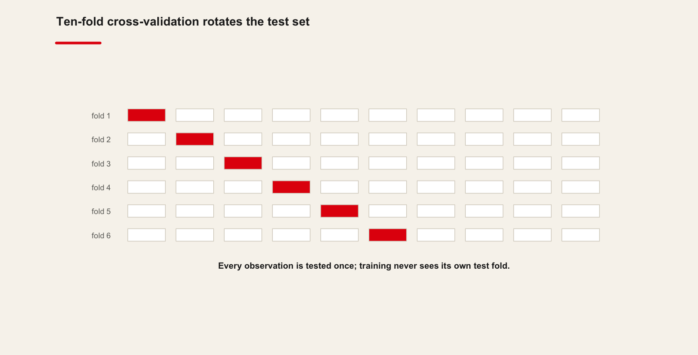
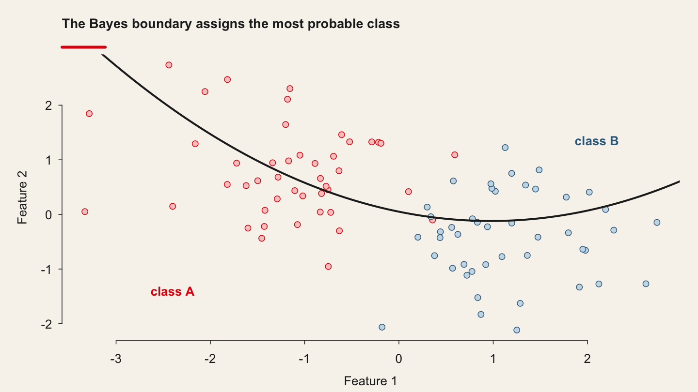
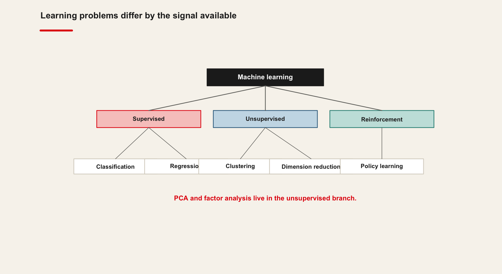
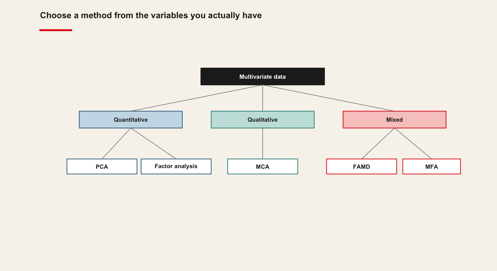
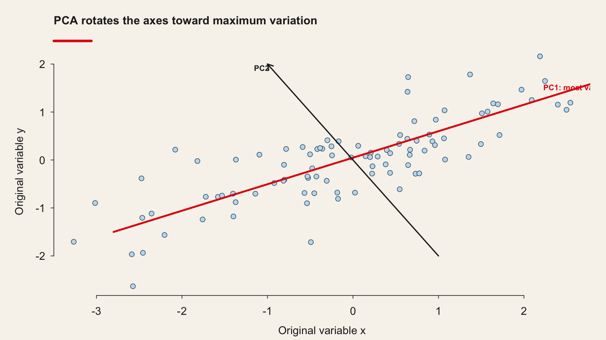
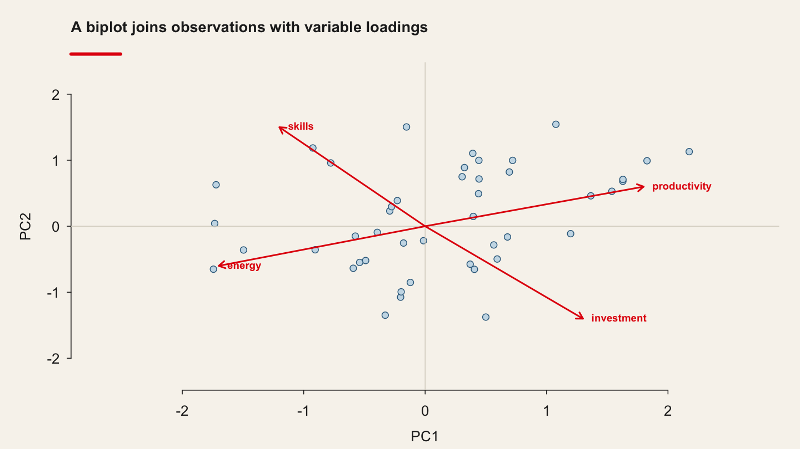

<!-- Imported from https://warin.ca/quant/en/session7_cours/. Content is static so the deck renders without R or Python. -->
## {#imported-s07-001 .scrollable}

> \"If you live 5 minutes away from Bill Gates, I bet you are rich.\"

## {#imported-s07-002 .scrollable}

Al-Eryani, Mohammad F. \"Transfer Pricing Determinants of U.S. Multinationals\", Journal of International Business Studies, vol. 21, no. 3 ISSN: 0047-2506

## Outline {#imported-s07-003 .scrollable}

## outline {#imported-s07-004 .scrollable}

1.  Introduction

2.  Principal Component Analysis

3.  Factor Analysis

4.  Applications

-   The Netflix Recommender System

-   FAMD: The Wine Data

-   Factor Analysis for Questionnaires

1.  Comparison and Interpretation: When to Use PCA vs. Factor Analysis

## Introduction {#imported-s07-005 .scrollable}

## {#imported-s07-006 .scrollable}

![](data:image/svg+xml;base64,PHN2ZyBzdHlsZT0id2lkdGg6IDEwMCU7IGhlaWdodDogMTAwJTsiIHZpZXdib3g9IjAuMDAgMC4wMCA1MTMuNjQgNDA0LjAwIiB4bWxucz0iaHR0cDovL3d3dy53My5vcmcvMjAwMC9zdmciIHhtbG5zOnhsaW5rPSJodHRwOi8vd3d3LnczLm9yZy8xOTk5L3hsaW5rIj4KPGcgY2xhc3M9ImdyYXBoIiBpZD0iZ3JhcGgwIiB0cmFuc2Zvcm09InNjYWxlKDEgMSkgcm90YXRlKDApIHRyYW5zbGF0ZSg0IDQwMCkiPgo8dGl0bGU+YV9uaWNlX2dyYXBoPC90aXRsZT4KPHBvbHlnb24gZmlsbD0iI2ZmZmZmZiIgcG9pbnRzPSItNCw0IC00LC00MDAgNTA5LjY0MzcsLTQwMCA1MDkuNjQzNyw0IC00LDQiIHN0cm9rZT0idHJhbnNwYXJlbnQiPjwvcG9seWdvbj4KPCEtLSBhIC0tPgo8ZyBjbGFzcz0ibm9kZSIgaWQ9Im5vZGUxIj4KPHRpdGxlPmE8L3RpdGxlPgo8cG9seWdvbiBmaWxsPSJub25lIiBwb2ludHM9IjMwNS40MjY2LC0zOTYgMjA1LjkzOCwtMzk2IDIwNS45MzgsLTM2MCAzMDUuNDI2NiwtMzYwIDMwNS40MjY2LC0zOTYiIHN0cm9rZT0iIzAwMDAwMCI+PC9wb2x5Z29uPgo8dGV4dCBmaWxsPSIjMDAwMDAwIiBmb250LWZhbWlseT0iSGVsdmV0aWNhLHNhbnMtU2VyaWYiIGZvbnQtc2l6ZT0iMTQuMDAiIHRleHQtYW5jaG9yPSJtaWRkbGUiIHg9IjI1NS42ODIzIiB5PSItMzczLjgiPkRhdGEgU2NpZW5jZTwvdGV4dD4KPC9nPgo8IS0tIGIgLS0+CjxnIGNsYXNzPSJub2RlIiBpZD0ibm9kZTIiPgo8dGl0bGU+YjwvdGl0bGU+Cjxwb2x5Z29uIGZpbGw9Im5vbmUiIHBvaW50cz0iMzE5LjQzMzUsLTMyNCAxOTEuOTMxMSwtMzI0IDE5MS45MzExLC0yODggMzE5LjQzMzUsLTI4OCAzMTkuNDMzNSwtMzI0IiBzdHJva2U9IiMwMDAwMDAiPjwvcG9seWdvbj4KPHRleHQgZmlsbD0iIzAwMDAwMCIgZm9udC1mYW1pbHk9IkhlbHZldGljYSxzYW5zLVNlcmlmIiBmb250LXNpemU9IjE0LjAwIiB0ZXh0LWFuY2hvcj0ibWlkZGxlIiB4PSIyNTUuNjgyMyIgeT0iLTMwMS44Ij5NYWNoaW5lIExlYXJuaW5nPC90ZXh0Pgo8L2c+CjwhLS0gYSYjNDU7Jmd0O2IgLS0+CjxnIGNsYXNzPSJlZGdlIiBpZD0iZWRnZTEiPgo8dGl0bGU+YS0mZ3Q7YjwvdGl0bGU+CjxwYXRoIGQ9Ik0yNTUuNjgyMywtMzU5LjgzMTRDMjU1LjY4MjMsLTM1Mi4xMzEgMjU1LjY4MjMsLTM0Mi45NzQzIDI1NS42ODIzLC0zMzQuNDE2NiIgZmlsbD0ibm9uZSIgc3Ryb2tlPSIjMDAwMDAwIiAvPgo8cG9seWdvbiBmaWxsPSIjMDAwMDAwIiBwb2ludHM9IjI1OS4xODI0LC0zMzQuNDEzMiAyNTUuNjgyMywtMzI0LjQxMzMgMjUyLjE4MjQsLTMzNC40MTMzIDI1OS4xODI0LC0zMzQuNDEzMiIgc3Ryb2tlPSIjMDAwMDAwIj48L3BvbHlnb24+CjwvZz4KPCEtLSBjIC0tPgo8ZyBjbGFzcz0ibm9kZSIgaWQ9Im5vZGUzIj4KPHRpdGxlPmM8L3RpdGxlPgo8cG9seWdvbiBmaWxsPSJub25lIiBwb2ludHM9IjE2NS41NDczLC0yNTIgLS4xODI3LC0yNTIgLS4xODI3LC0yMTYgMTY1LjU0NzMsLTIxNiAxNjUuNTQ3MywtMjUyIiBzdHJva2U9IiMwMDAwMDAiPjwvcG9seWdvbj4KPHRleHQgZmlsbD0iIzAwMDAwMCIgZm9udC1mYW1pbHk9IkhlbHZldGljYSxzYW5zLVNlcmlmIiBmb250LXNpemU9IjE0LjAwIiB0ZXh0LWFuY2hvcj0ibWlkZGxlIiB4PSI4Mi42ODIzIiB5PSItMjI5LjgiPlJlaW5mb3JjZW1lbnQgTGVhcm5pbmc8L3RleHQ+CjwvZz4KPCEtLSBiJiM0NTsmZ3Q7YyAtLT4KPGcgY2xhc3M9ImVkZ2UiIGlkPSJlZGdlMiI+Cjx0aXRsZT5iLSZndDtjPC90aXRsZT4KPHBhdGggZD0iTTIxMi4wMjcxLC0yODcuODMxNEMxODguNzg2NSwtMjc4LjE1OSAxNjAuMDI1NSwtMjY2LjE4OTEgMTM1LjUzLC0yNTUuOTk0NCIgZmlsbD0ibm9uZSIgc3Ryb2tlPSIjMDAwMDAwIiAvPgo8cG9seWdvbiBmaWxsPSIjMDAwMDAwIiBwb2ludHM9IjEzNi42MDA4LC0yNTIuNjQ5MSAxMjYuMDIzNiwtMjUyLjAzOCAxMzMuOTExMSwtMjU5LjExMTcgMTM2LjYwMDgsLTI1Mi42NDkxIiBzdHJva2U9IiMwMDAwMDAiPjwvcG9seWdvbj4KPC9nPgo8IS0tIGQgLS0+CjxnIGNsYXNzPSJub2RlIiBpZD0ibm9kZTQiPgo8dGl0bGU+ZDwvdGl0bGU+Cjxwb2x5Z29uIGZpbGw9Im5vbmUiIHBvaW50cz0iMzI4LjA1MywtMjUyIDE4My4zMTE2LC0yNTIgMTgzLjMxMTYsLTIxNiAzMjguMDUzLC0yMTYgMzI4LjA1MywtMjUyIiBzdHJva2U9IiMwMDAwMDAiPjwvcG9seWdvbj4KPHRleHQgZmlsbD0iIzAwMDAwMCIgZm9udC1mYW1pbHk9IkhlbHZldGljYSxzYW5zLVNlcmlmIiBmb250LXNpemU9IjE0LjAwIiB0ZXh0LWFuY2hvcj0ibWlkZGxlIiB4PSIyNTUuNjgyMyIgeT0iLTIyOS44Ij5TdXBlcnZpc2VkIExlYXJuaW5nPC90ZXh0Pgo8L2c+CjwhLS0gYiYjNDU7Jmd0O2QgLS0+CjxnIGNsYXNzPSJlZGdlIiBpZD0iZWRnZTMiPgo8dGl0bGU+Yi0mZ3Q7ZDwvdGl0bGU+CjxwYXRoIGQ9Ik0yNTUuNjgyMywtMjg3LjgzMTRDMjU1LjY4MjMsLTI4MC4xMzEgMjU1LjY4MjMsLTI3MC45NzQzIDI1NS42ODIzLC0yNjIuNDE2NiIgZmlsbD0ibm9uZSIgc3Ryb2tlPSIjMDAwMDAwIiAvPgo8cG9seWdvbiBmaWxsPSIjMDAwMDAwIiBwb2ludHM9IjI1OS4xODI0LC0yNjIuNDEzMiAyNTUuNjgyMywtMjUyLjQxMzMgMjUyLjE4MjQsLTI2Mi40MTMzIDI1OS4xODI0LC0yNjIuNDEzMiIgc3Ryb2tlPSIjMDAwMDAwIj48L3BvbHlnb24+CjwvZz4KPCEtLSBlIC0tPgo8ZyBjbGFzcz0ibm9kZSIgaWQ9Im5vZGU1Ij4KPHRpdGxlPmU8L3RpdGxlPgo8cG9seWdvbiBmaWxsPSJub25lIiBwb2ludHM9IjUwNS42MDUxLC0yNTIgMzQ1Ljc1OTUsLTI1MiAzNDUuNzU5NSwtMjE2IDUwNS42MDUxLC0yMTYgNTA1LjYwNTEsLTI1MiIgc3Ryb2tlPSIjMDAwMDAwIj48L3BvbHlnb24+Cjx0ZXh0IGZpbGw9IiMwMDAwMDAiIGZvbnQtZmFtaWx5PSJIZWx2ZXRpY2Esc2Fucy1TZXJpZiIgZm9udC1zaXplPSIxNC4wMCIgdGV4dC1hbmNob3I9Im1pZGRsZSIgeD0iNDI1LjY4MjMiIHk9Ii0yMjkuOCI+VW5zdXBlcnZpc2VkIExlYXJuaW5nPC90ZXh0Pgo8L2c+CjwhLS0gYiYjNDU7Jmd0O2UgLS0+CjxnIGNsYXNzPSJlZGdlIiBpZD0iZWRnZTQiPgo8dGl0bGU+Yi0mZ3Q7ZTwvdGl0bGU+CjxwYXRoIGQ9Ik0yOTguNTgwNSwtMjg3LjgzMTRDMzIxLjQxOCwtMjc4LjE1OSAzNDkuNjgwMywtMjY2LjE4OTEgMzczLjc1MSwtMjU1Ljk5NDQiIGZpbGw9Im5vbmUiIHN0cm9rZT0iIzAwMDAwMCIgLz4KPHBvbHlnb24gZmlsbD0iIzAwMDAwMCIgcG9pbnRzPSIzNzUuMjQ5NCwtMjU5LjE2MDggMzgzLjA5MjYsLTI1Mi4wMzggMzcyLjUxOTQsLTI1Mi43MTUxIDM3NS4yNDk0LC0yNTkuMTYwOCIgc3Ryb2tlPSIjMDAwMDAwIj48L3BvbHlnb24+CjwvZz4KPCEtLSBmIC0tPgo8ZyBjbGFzcz0ibm9kZSIgaWQ9Im5vZGU2Ij4KPHRpdGxlPmY8L3RpdGxlPgo8cG9seWdvbiBmaWxsPSJub25lIiBwb2ludHM9IjI0OS4xMjc5LC0xODAgMTUwLjIzNjcsLTE4MCAxNTAuMjM2NywtMTQ0IDI0OS4xMjc5LC0xNDQgMjQ5LjEyNzksLTE4MCIgc3Ryb2tlPSIjMDAwMDAwIj48L3BvbHlnb24+Cjx0ZXh0IGZpbGw9IiMwMDAwMDAiIGZvbnQtZmFtaWx5PSJIZWx2ZXRpY2Esc2Fucy1TZXJpZiIgZm9udC1zaXplPSIxNC4wMCIgdGV4dC1hbmNob3I9Im1pZGRsZSIgeD0iMTk5LjY4MjMiIHk9Ii0xNTcuOCI+Q2xhc3NpZmljYXRpb248L3RleHQ+CjwvZz4KPCEtLSBkJiM0NTsmZ3Q7ZiAtLT4KPGcgY2xhc3M9ImVkZ2UiIGlkPSJlZGdlNSI+Cjx0aXRsZT5kLSZndDtmPC90aXRsZT4KPHBhdGggZD0iTTI0MS41NTExLC0yMTUuODMxNEMyMzUuMTAxMiwtMjA3LjUzODYgMjI3LjMzNzgsLTE5Ny41NTcgMjIwLjI1NzEsLTE4OC40NTMzIiBmaWxsPSJub25lIiBzdHJva2U9IiMwMDAwMDAiIC8+Cjxwb2x5Z29uIGZpbGw9IiMwMDAwMDAiIHBvaW50cz0iMjIyLjkwNTksLTE4Ni4xNTggMjE0LjAwMzcsLTE4MC40MTMzIDIxNy4zODA0LC0xOTAuNDU1NiAyMjIuOTA1OSwtMTg2LjE1OCIgc3Ryb2tlPSIjMDAwMDAwIj48L3BvbHlnb24+CjwvZz4KPCEtLSBnIC0tPgo8ZyBjbGFzcz0ibm9kZSIgaWQ9Im5vZGU3Ij4KPHRpdGxlPmc8L3RpdGxlPgo8cG9seWdvbiBmaWxsPSJub25lIiBwb2ludHM9IjM1My45Njk0LC0xODAgMjY3LjM5NTIsLTE4MCAyNjcuMzk1MiwtMTQ0IDM1My45Njk0LC0xNDQgMzUzLjk2OTQsLTE4MCIgc3Ryb2tlPSIjMDAwMDAwIj48L3BvbHlnb24+Cjx0ZXh0IGZpbGw9IiMwMDAwMDAiIGZvbnQtZmFtaWx5PSJIZWx2ZXRpY2Esc2Fucy1TZXJpZiIgZm9udC1zaXplPSIxNC4wMCIgdGV4dC1hbmNob3I9Im1pZGRsZSIgeD0iMzEwLjY4MjMiIHk9Ii0xNTcuOCI+UmVncmVzc2lvbjwvdGV4dD4KPC9nPgo8IS0tIGQmIzQ1OyZndDtnIC0tPgo8ZyBjbGFzcz0iZWRnZSIgaWQ9ImVkZ2U2Ij4KPHRpdGxlPmQtJmd0O2c8L3RpdGxlPgo8cGF0aCBkPSJNMjY5LjU2MTEsLTIxNS44MzE0QzI3NS44OTU5LC0yMDcuNTM4NiAyODMuNTIwNywtMTk3LjU1NyAyOTAuNDc0OSwtMTg4LjQ1MzMiIGZpbGw9Im5vbmUiIHN0cm9rZT0iIzAwMDAwMCIgLz4KPHBvbHlnb24gZmlsbD0iIzAwMDAwMCIgcG9pbnRzPSIyOTMuMzI3NSwtMTkwLjQ4NDcgMjk2LjYxNjYsLTE4MC40MTMzIDI4Ny43NjQ4LC0xODYuMjM1MyAyOTMuMzI3NSwtMTkwLjQ4NDciIHN0cm9rZT0iIzAwMDAwMCI+PC9wb2x5Z29uPgo8L2c+CjwhLS0gaCAtLT4KPGcgY2xhc3M9Im5vZGUiIGlkPSJub2RlOCI+Cjx0aXRsZT5oPC90aXRsZT4KPHBvbHlnb24gZmlsbD0ibm9uZSIgcG9pbnRzPSIxODYuNjUwMSwtMTA4IDUyLjcxNDUsLTEwOCA1Mi43MTQ1LC03MiAxODYuNjUwMSwtNzIgMTg2LjY1MDEsLTEwOCIgc3Ryb2tlPSIjMDAwMDAwIj48L3BvbHlnb24+Cjx0ZXh0IGZpbGw9IiMwMDAwMDAiIGZvbnQtZmFtaWx5PSJIZWx2ZXRpY2Esc2Fucy1TZXJpZiIgZm9udC1zaXplPSIxNC4wMCIgdGV4dC1hbmNob3I9Im1pZGRsZSIgeD0iMTE5LjY4MjMiIHk9Ii04NS44Ij5HZW5lcmF0aXZlIE1vZGVsczwvdGV4dD4KPC9nPgo8IS0tIGYmIzQ1OyZndDtoIC0tPgo8ZyBjbGFzcz0iZWRnZSIgaWQ9ImVkZ2U3Ij4KPHRpdGxlPmYtJmd0O2g8L3RpdGxlPgo8cGF0aCBkPSJNMTc5LjQ5NDksLTE0My44MzE0QzE2OS44MzA5LC0xMzUuMTMzNyAxNTguMTAyNywtMTI0LjU3ODMgMTQ3LjYwMDcsLTExNS4xMjY1IiBmaWxsPSJub25lIiBzdHJva2U9IiMwMDAwMDAiIC8+Cjxwb2x5Z29uIGZpbGw9IiMwMDAwMDAiIHBvaW50cz0iMTQ5LjYzNzYsLTExMi4yNTEgMTM5Ljg2MzIsLTEwOC4xNjI4IDE0NC45NTQ4LC0xMTcuNDU0IDE0OS42Mzc2LC0xMTIuMjUxIiBzdHJva2U9IiMwMDAwMDAiPjwvcG9seWdvbj4KPC9nPgo8IS0tIGkgLS0+CjxnIGNsYXNzPSJub2RlIiBpZD0ibm9kZTkiPgo8dGl0bGU+aTwvdGl0bGU+Cjxwb2x5Z29uIGZpbGw9Im5vbmUiIHBvaW50cz0iMzU2Ljc4MDUsLTEwOCAyMDQuNTg0MSwtMTA4IDIwNC41ODQxLC03MiAzNTYuNzgwNSwtNzIgMzU2Ljc4MDUsLTEwOCIgc3Ryb2tlPSIjMDAwMDAwIj48L3BvbHlnb24+Cjx0ZXh0IGZpbGw9IiMwMDAwMDAiIGZvbnQtZmFtaWx5PSJIZWx2ZXRpY2Esc2Fucy1TZXJpZiIgZm9udC1zaXplPSIxNC4wMCIgdGV4dC1hbmNob3I9Im1pZGRsZSIgeD0iMjgwLjY4MjMiIHk9Ii04NS44Ij5EaXNjcmltaW5hdGl2ZSBNb2RlbHM8L3RleHQ+CjwvZz4KPCEtLSBmJiM0NTsmZ3Q7aSAtLT4KPGcgY2xhc3M9ImVkZ2UiIGlkPSJlZGdlOCI+Cjx0aXRsZT5mLSZndDtpPC90aXRsZT4KPHBhdGggZD0iTTIyMC4xMjIsLTE0My44MzE0QzIzMC4wMDI4LC0xMzUuMDQ4NSAyNDIuMDE0NywtMTI0LjM3MTIgMjUyLjcyNzMsLTExNC44NDg5IiBmaWxsPSJub25lIiBzdHJva2U9IiMwMDAwMDAiIC8+Cjxwb2x5Z29uIGZpbGw9IiMwMDAwMDAiIHBvaW50cz0iMjU1LjEwMDMsLTExNy40MjI0IDI2MC4yNDkxLC0xMDguMTYyOCAyNTAuNDQ5NywtMTEyLjE5MDYgMjU1LjEwMDMsLTExNy40MjI0IiBzdHJva2U9IiMwMDAwMDAiPjwvcG9seWdvbj4KPC9nPgo8IS0tIGogLS0+CjxnIGNsYXNzPSJub2RlIiBpZD0ibm9kZTEwIj4KPHRpdGxlPmo8L3RpdGxlPgo8cG9seWdvbiBmaWxsPSJub25lIiBwb2ludHM9IjM0OS44MTE0LC0zNiAyMTEuNTUzMiwtMzYgMjExLjU1MzIsMCAzNDkuODExNCwwIDM0OS44MTE0LC0zNiIgc3Ryb2tlPSIjMDAwMDAwIj48L3BvbHlnb24+Cjx0ZXh0IGZpbGw9IiMwMDAwMDAiIGZvbnQtZmFtaWx5PSJIZWx2ZXRpY2Esc2Fucy1TZXJpZiIgZm9udC1zaXplPSIxNC4wMCIgdGV4dC1hbmNob3I9Im1pZGRsZSIgeD0iMjgwLjY4MjMiIHk9Ii0xMy44Ij5Mb2dpc3RpYyBSZWdyZXNzaW9uPC90ZXh0Pgo8L2c+CjwhLS0gaSYjNDU7Jmd0O2ogLS0+CjxnIGNsYXNzPSJlZGdlIiBpZD0iZWRnZTkiPgo8dGl0bGU+aS0mZ3Q7ajwvdGl0bGU+CjxwYXRoIGQ9Ik0yODAuNjgyMywtNzEuODMxNEMyODAuNjgyMywtNjQuMTMxIDI4MC42ODIzLC01NC45NzQzIDI4MC42ODIzLC00Ni40MTY2IiBmaWxsPSJub25lIiBzdHJva2U9IiMwMDAwMDAiIC8+Cjxwb2x5Z29uIGZpbGw9IiMwMDAwMDAiIHBvaW50cz0iMjg0LjE4MjQsLTQ2LjQxMzIgMjgwLjY4MjMsLTM2LjQxMzMgMjc3LjE4MjQsLTQ2LjQxMzMgMjg0LjE4MjQsLTQ2LjQxMzIiIHN0cm9rZT0iIzAwMDAwMCI+PC9wb2x5Z29uPgo8L2c+CjwvZz4KPC9zdmc+)

## Introduction {#imported-s07-007 .scrollable}

::: panel-tabset
### Concepts

  Color (nm)   Alcohol (%)   Beer or Wine?
  ------------ ------------- ---------------
  610          5             Beer
  599          13            Wine
  693          14            Wine

-   Labels

-   training / testing

### Types of ML

-   supervised / unsupervised (or self-supervised) / reinforcement learning

-   System 1 (fast, intuitive) / System 2 (slow, analytical) (D. Kahneman)
:::

## {#imported-s07-008 .scrollable}

::: panel-tabset
### Theory

![](data:image/svg+xml;base64,PHN2ZyBzdHlsZT0id2lkdGg6IDEwMCU7IGhlaWdodDogMTAwJTsiIHZpZXdib3g9IjAuMDAgMC4wMCAxMzQuOTYgMjYwLjAwIiB4bWxucz0iaHR0cDovL3d3dy53My5vcmcvMjAwMC9zdmciIHhtbG5zOnhsaW5rPSJodHRwOi8vd3d3LnczLm9yZy8xOTk5L3hsaW5rIj4KPGcgY2xhc3M9ImdyYXBoIiBpZD0iZ3JhcGgwIiB0cmFuc2Zvcm09InNjYWxlKDEgMSkgcm90YXRlKDApIHRyYW5zbGF0ZSg0IDI1NikiPgo8dGl0bGU+YV9uaWNlX2dyYXBoPC90aXRsZT4KPHBvbHlnb24gZmlsbD0iI2ZmZmZmZiIgcG9pbnRzPSItNCw0IC00LC0yNTYgMTMwLjk1ODYsLTI1NiAxMzAuOTU4Niw0IC00LDQiIHN0cm9rZT0idHJhbnNwYXJlbnQiPjwvcG9seWdvbj4KPCEtLSBhIC0tPgo8ZyBjbGFzcz0ibm9kZSIgaWQ9Im5vZGUxIj4KPHRpdGxlPmE8L3RpdGxlPgo8cG9seWdvbiBmaWxsPSJub25lIiBwb2ludHM9IjEyNi44MDIsLTI1MiAyOS40Mjk0LC0yNTIgMjkuNDI5NCwtMjE2IDEyNi44MDIsLTIxNiAxMjYuODAyLC0yNTIiIHN0cm9rZT0iIzAwMDAwMCI+PC9wb2x5Z29uPgo8dGV4dCBmaWxsPSIjMDAwMDAwIiBmb250LWZhbWlseT0iSGVsdmV0aWNhLHNhbnMtU2VyaWYiIGZvbnQtc2l6ZT0iMTQuMDAiIHRleHQtYW5jaG9yPSJtaWRkbGUiIHg9Ijc4LjExNTciIHk9Ii0yMjkuOCI+VHJhaW5pbmcgZGF0YTwvdGV4dD4KPC9nPgo8IS0tIGIgLS0+CjxnIGNsYXNzPSJub2RlIiBpZD0ibm9kZTIiPgo8dGl0bGU+YjwvdGl0bGU+Cjxwb2x5Z29uIGZpbGw9Im5vbmUiIHBvaW50cz0iNzIuMjMwOCwtMTgwIDE4LjAwMDYsLTE4MCAxOC4wMDA2LC0xNDQgNzIuMjMwOCwtMTQ0IDcyLjIzMDgsLTE4MCIgc3Ryb2tlPSIjMDAwMDAwIj48L3BvbHlnb24+Cjx0ZXh0IGZpbGw9IiMwMDAwMDAiIGZvbnQtZmFtaWx5PSJIZWx2ZXRpY2Esc2Fucy1TZXJpZiIgZm9udC1zaXplPSIxNC4wMCIgdGV4dC1hbmNob3I9Im1pZGRsZSIgeD0iNDUuMTE1NyIgeT0iLTE1Ny44Ij5Nb2RlbDwvdGV4dD4KPC9nPgo8IS0tIGEmIzQ1OyZndDtiIC0tPgo8ZyBjbGFzcz0iZWRnZSIgaWQ9ImVkZ2UxIj4KPHRpdGxlPmEtJmd0O2I8L3RpdGxlPgo8cGF0aCBkPSJNNjkuNzg4NCwtMjE1LjgzMTRDNjYuMTQyNywtMjA3Ljg3NzEgNjEuNzg0OCwtMTk4LjM2OSA1Ny43NTMsLTE4OS41NzIzIiBmaWxsPSJub25lIiBzdHJva2U9IiMwMDAwMDAiIC8+Cjxwb2x5Z29uIGZpbGw9IiMwMDAwMDAiIHBvaW50cz0iNjAuOTAzNCwtMTg4LjA0NTYgNTMuNTU1MSwtMTgwLjQxMzMgNTQuNTQsLTE5MC45NjIyIDYwLjkwMzQsLTE4OC4wNDU2IiBzdHJva2U9IiMwMDAwMDAiPjwvcG9seWdvbj4KPC9nPgo8IS0tIGMgLS0+CjxnIGNsYXNzPSJub2RlIiBpZD0ibm9kZTMiPgo8dGl0bGU+YzwvdGl0bGU+Cjxwb2x5Z29uIGZpbGw9Im5vbmUiIHBvaW50cz0iNzguMzQ3NCwtMTA4IC0uMTE2LC0xMDggLS4xMTYsLTcyIDc4LjM0NzQsLTcyIDc4LjM0NzQsLTEwOCIgc3Ryb2tlPSIjMDAwMDAwIj48L3BvbHlnb24+Cjx0ZXh0IGZpbGw9IiMwMDAwMDAiIGZvbnQtZmFtaWx5PSJIZWx2ZXRpY2Esc2Fucy1TZXJpZiIgZm9udC1zaXplPSIxNC4wMCIgdGV4dC1hbmNob3I9Im1pZGRsZSIgeD0iMzkuMTE1NyIgeT0iLTg1LjgiPlByZWRpY3Rpb248L3RleHQ+CjwvZz4KPCEtLSBiJiM0NTsmZ3Q7YyAtLT4KPGcgY2xhc3M9ImVkZ2UiIGlkPSJlZGdlMiI+Cjx0aXRsZT5iLSZndDtjPC90aXRsZT4KPHBhdGggZD0iTTQzLjYwMTYsLTE0My44MzE0QzQyLjk1OTksLTEzNi4xMzEgNDIuMTk2OSwtMTI2Ljk3NDMgNDEuNDgzOCwtMTE4LjQxNjYiIGZpbGw9Im5vbmUiIHN0cm9rZT0iIzAwMDAwMCIgLz4KPHBvbHlnb24gZmlsbD0iIzAwMDAwMCIgcG9pbnRzPSI0NC45Njg2LC0xMTguMDg4IDQwLjY1MDEsLTEwOC40MTMzIDM3Ljk5MjgsLTExOC42Njk0IDQ0Ljk2ODYsLTExOC4wODgiIHN0cm9rZT0iIzAwMDAwMCI+PC9wb2x5Z29uPgo8L2c+CjwhLS0gZCAtLT4KPGcgY2xhc3M9Im5vZGUiIGlkPSJub2RlNCI+Cjx0aXRsZT5kPC90aXRsZT4KPHBvbHlnb24gZmlsbD0ibm9uZSIgcG9pbnRzPSI5OS4xMTU3LC0zNiA0NS4xMTU3LC0zNiA0NS4xMTU3LDAgOTkuMTE1NywwIDk5LjExNTcsLTM2IiBzdHJva2U9IiMwMDAwMDAiPjwvcG9seWdvbj4KPHRleHQgZmlsbD0iIzAwMDAwMCIgZm9udC1mYW1pbHk9IkhlbHZldGljYSxzYW5zLVNlcmlmIiBmb250LXNpemU9IjE0LjAwIiB0ZXh0LWFuY2hvcj0ibWlkZGxlIiB4PSI3Mi4xMTU3IiB5PSItMTMuOCI+VGVzdDwvdGV4dD4KPC9nPgo8IS0tIGMmIzQ1OyZndDtkIC0tPgo8ZyBjbGFzcz0iZWRnZSIgaWQ9ImVkZ2UzIj4KPHRpdGxlPmMtJmd0O2Q8L3RpdGxlPgo8cGF0aCBkPSJNNDcuNDQzLC03MS44MzE0QzUxLjA4ODcsLTYzLjg3NzEgNTUuNDQ2NiwtNTQuMzY5IDU5LjQ3ODQsLTQ1LjU3MjMiIGZpbGw9Im5vbmUiIHN0cm9rZT0iIzAwMDAwMCIgLz4KPHBvbHlnb24gZmlsbD0iIzAwMDAwMCIgcG9pbnRzPSI2Mi42OTE0LC00Ni45NjIyIDYzLjY3NjMsLTM2LjQxMzMgNTYuMzI4LC00NC4wNDU2IDYyLjY5MTQsLTQ2Ljk2MjIiIHN0cm9rZT0iIzAwMDAwMCI+PC9wb2x5Z29uPgo8L2c+CjwhLS0gZCYjNDU7Jmd0O2EgLS0+CjxnIGNsYXNzPSJlZGdlIiBpZD0iZWRnZTQiPgo8dGl0bGU+ZC0mZ3Q7YTwvdGl0bGU+CjxwYXRoIGQ9Ik03OC41MTA1LC0zNi4yMzUzQzgxLjgwMDMsLTQ2LjU4MTMgODUuNDU5OSwtNTkuODUyNiA4Ny4xMTU3LC03MiA5My40NzMyLC0xMTguNjQwNyA4Ny42OTU3LC0xNzMuNDE5OCA4Mi45MTcsLTIwNS44MzgyIiBmaWxsPSJub25lIiBzdHJva2U9IiMwMDAwMDAiIC8+Cjxwb2x5Z29uIGZpbGw9IiMwMDAwMDAiIHBvaW50cz0iNzkuNDI1NywtMjA1LjUxMzEgODEuMzUzNywtMjE1LjkzMSA4Ni4zNDMyLC0yMDYuNTg0NyA3OS40MjU3LC0yMDUuNTEzMSIgc3Ryb2tlPSIjMDAwMDAwIj48L3BvbHlnb24+CjwvZz4KPC9nPgo8L3N2Zz4=)

### Practice

![](data:image/svg+xml;base64,PHN2ZyBzdHlsZT0id2lkdGg6IDEwMCU7IGhlaWdodDogMTAwJTsiIHZpZXdib3g9IjAuMDAgMC4wMCAxNzguMDQgMjYwLjAwIiB4bWxucz0iaHR0cDovL3d3dy53My5vcmcvMjAwMC9zdmciIHhtbG5zOnhsaW5rPSJodHRwOi8vd3d3LnczLm9yZy8xOTk5L3hsaW5rIj4KPGcgY2xhc3M9ImdyYXBoIiBpZD0iZ3JhcGgwIiB0cmFuc2Zvcm09InNjYWxlKDEgMSkgcm90YXRlKDApIHRyYW5zbGF0ZSg0IDI1NikiPgo8dGl0bGU+YV9uaWNlX2dyYXBoPC90aXRsZT4KPHBvbHlnb24gZmlsbD0iI2ZmZmZmZiIgcG9pbnRzPSItNCw0IC00LC0yNTYgMTc0LjAzNzgsLTI1NiAxNzQuMDM3OCw0IC00LDQiIHN0cm9rZT0idHJhbnNwYXJlbnQiPjwvcG9seWdvbj4KPCEtLSBhIC0tPgo8ZyBjbGFzcz0ibm9kZSIgaWQ9Im5vZGUxIj4KPHRpdGxlPmE8L3RpdGxlPgo8cG9seWdvbiBmaWxsPSJub25lIiBwb2ludHM9IjE3MC4wNTY3LC0yNTIgLS4wMTg5LC0yNTIgLS4wMTg5LC0yMTYgMTcwLjA1NjcsLTIxNiAxNzAuMDU2NywtMjUyIiBzdHJva2U9IiMwMDAwMDAiPjwvcG9seWdvbj4KPHRleHQgZmlsbD0iIzAwMDAwMCIgZm9udC1mYW1pbHk9IkhlbHZldGljYSxzYW5zLVNlcmlmIiBmb250LXNpemU9IjE0LjAwIiB0ZXh0LWFuY2hvcj0ibWlkZGxlIiB4PSI4NS4wMTg5IiB5PSItMjI5LjgiPkNvbG9yOiA2NjAsIEFsY29ob2w6IDEyJTwvdGV4dD4KPC9nPgo8IS0tIGIgLS0+CjxnIGNsYXNzPSJub2RlIiBpZD0ibm9kZTIiPgo8dGl0bGU+YjwvdGl0bGU+Cjxwb2x5Z29uIGZpbGw9Im5vbmUiIHBvaW50cz0iNzkuMTM0LC0xODAgMjQuOTAzOCwtMTgwIDI0LjkwMzgsLTE0NCA3OS4xMzQsLTE0NCA3OS4xMzQsLTE4MCIgc3Ryb2tlPSIjMDAwMDAwIj48L3BvbHlnb24+Cjx0ZXh0IGZpbGw9IiMwMDAwMDAiIGZvbnQtZmFtaWx5PSJIZWx2ZXRpY2Esc2Fucy1TZXJpZiIgZm9udC1zaXplPSIxNC4wMCIgdGV4dC1hbmNob3I9Im1pZGRsZSIgeD0iNTIuMDE4OSIgeT0iLTE1Ny44Ij5Nb2RlbDwvdGV4dD4KPC9nPgo8IS0tIGEmIzQ1OyZndDtiIC0tPgo8ZyBjbGFzcz0iZWRnZSIgaWQ9ImVkZ2UxIj4KPHRpdGxlPmEtJmd0O2I8L3RpdGxlPgo8cGF0aCBkPSJNNzYuNjkxNiwtMjE1LjgzMTRDNzMuMDQ1OSwtMjA3Ljg3NzEgNjguNjg4LC0xOTguMzY5IDY0LjY1NjIsLTE4OS41NzIzIiBmaWxsPSJub25lIiBzdHJva2U9IiMwMDAwMDAiIC8+Cjxwb2x5Z29uIGZpbGw9IiMwMDAwMDAiIHBvaW50cz0iNjcuODA2NiwtMTg4LjA0NTYgNjAuNDU4MywtMTgwLjQxMzMgNjEuNDQzMiwtMTkwLjk2MjIgNjcuODA2NiwtMTg4LjA0NTYiIHN0cm9rZT0iIzAwMDAwMCI+PC9wb2x5Z29uPgo8L2c+CjwhLS0gYyAtLT4KPGcgY2xhc3M9Im5vZGUiIGlkPSJub2RlMyI+Cjx0aXRsZT5jPC90aXRsZT4KPHBvbHlnb24gZmlsbD0ibm9uZSIgcG9pbnRzPSI4NS4yNTA2LC0xMDggNi43ODcyLC0xMDggNi43ODcyLC03MiA4NS4yNTA2LC03MiA4NS4yNTA2LC0xMDgiIHN0cm9rZT0iIzAwMDAwMCI+PC9wb2x5Z29uPgo8dGV4dCBmaWxsPSIjMDAwMDAwIiBmb250LWZhbWlseT0iSGVsdmV0aWNhLHNhbnMtU2VyaWYiIGZvbnQtc2l6ZT0iMTQuMDAiIHRleHQtYW5jaG9yPSJtaWRkbGUiIHg9IjQ2LjAxODkiIHk9Ii04NS44Ij5QcmVkaWN0aW9uPC90ZXh0Pgo8L2c+CjwhLS0gYiYjNDU7Jmd0O2MgLS0+CjxnIGNsYXNzPSJlZGdlIiBpZD0iZWRnZTIiPgo8dGl0bGU+Yi0mZ3Q7YzwvdGl0bGU+CjxwYXRoIGQ9Ik01MC41MDQ4LC0xNDMuODMxNEM0OS44NjMxLC0xMzYuMTMxIDQ5LjEwMDEsLTEyNi45NzQzIDQ4LjM4NywtMTE4LjQxNjYiIGZpbGw9Im5vbmUiIHN0cm9rZT0iIzAwMDAwMCIgLz4KPHBvbHlnb24gZmlsbD0iIzAwMDAwMCIgcG9pbnRzPSI1MS44NzE4LC0xMTguMDg4IDQ3LjU1MzMsLTEwOC40MTMzIDQ0Ljg5NiwtMTE4LjY2OTQgNTEuODcxOCwtMTE4LjA4OCIgc3Ryb2tlPSIjMDAwMDAwIj48L3BvbHlnb24+CjwvZz4KPCEtLSBkIC0tPgo8ZyBjbGFzcz0ibm9kZSIgaWQ9Im5vZGU0Ij4KPHRpdGxlPmQ8L3RpdGxlPgo8cG9seWdvbiBmaWxsPSJub25lIiBwb2ludHM9IjEwNi4wMTg5LC0zNiA1Mi4wMTg5LC0zNiA1Mi4wMTg5LDAgMTA2LjAxODksMCAxMDYuMDE4OSwtMzYiIHN0cm9rZT0iIzAwMDAwMCI+PC9wb2x5Z29uPgo8dGV4dCBmaWxsPSIjMDAwMDAwIiBmb250LWZhbWlseT0iSGVsdmV0aWNhLHNhbnMtU2VyaWYiIGZvbnQtc2l6ZT0iMTQuMDAiIHRleHQtYW5jaG9yPSJtaWRkbGUiIHg9Ijc5LjAxODkiIHk9Ii0xMy44Ij5XaW5lPC90ZXh0Pgo8L2c+CjwhLS0gYyYjNDU7Jmd0O2QgLS0+CjxnIGNsYXNzPSJlZGdlIiBpZD0iZWRnZTMiPgo8dGl0bGU+Yy0mZ3Q7ZDwvdGl0bGU+CjxwYXRoIGQ9Ik01NC4zNDYyLC03MS44MzE0QzU3Ljk5MTksLTYzLjg3NzEgNjIuMzQ5OCwtNTQuMzY5IDY2LjM4MTYsLTQ1LjU3MjMiIGZpbGw9Im5vbmUiIHN0cm9rZT0iIzAwMDAwMCIgLz4KPHBvbHlnb24gZmlsbD0iIzAwMDAwMCIgcG9pbnRzPSI2OS41OTQ2LC00Ni45NjIyIDcwLjU3OTUsLTM2LjQxMzMgNjMuMjMxMiwtNDQuMDQ1NiA2OS41OTQ2LC00Ni45NjIyIiBzdHJva2U9IiMwMDAwMDAiPjwvcG9seWdvbj4KPC9nPgo8IS0tIGQmIzQ1OyZndDthIC0tPgo8ZyBjbGFzcz0iZWRnZSIgaWQ9ImVkZ2U0Ij4KPHRpdGxlPmQtJmd0O2E8L3RpdGxlPgo8cGF0aCBkPSJNODUuNDEzNywtMzYuMjM1M0M4OC43MDM1LC00Ni41ODEzIDkyLjM2MzEsLTU5Ljg1MjYgOTQuMDE4OSwtNzIgMTAwLjM3NjQsLTExOC42NDA3IDk0LjU5ODksLTE3My40MTk4IDg5LjgyMDIsLTIwNS44MzgyIiBmaWxsPSJub25lIiBzdHJva2U9IiMwMDAwMDAiIC8+Cjxwb2x5Z29uIGZpbGw9IiMwMDAwMDAiIHBvaW50cz0iODYuMzI4OSwtMjA1LjUxMzEgODguMjU2OSwtMjE1LjkzMSA5My4yNDY0LC0yMDYuNTg0NyA4Ni4zMjg5LC0yMDUuNTEzMSIgc3Ryb2tlPSIjMDAwMDAwIj48L3BvbHlnb24+CjwvZz4KPC9nPgo8L3N2Zz4=)
:::

## Introduction {#imported-s07-009 .scrollable}

::: pull-left
1.  Gathering data

2.  Pre-processing

3.  Choosing a model

4.  Training the model / K-fold cross-validation

5.  Evaluation

6.  Hyper-parameter tuning

7.  Out-of-sample Prediction
:::

::: pull-right
{style="display: block; margin: auto;" width="100%"}
:::

## Introduction {#imported-s07-010 .scrollable}

::::: panel-tabset
### Question

-   A set of principles that can be applied to regression or classification

> What is the difference between regression and classification models?

### Answer

::: pull-left

:::

::: pull-right
{style="display: block; margin: auto;" width="100%"}
:::
:::::

## Introduction {#imported-s07-011 .scrollable}

{style="display: block; margin: auto;" width="100%"}

## Multivariate statistics {#imported-s07-012 .scrollable}

::::: panel-tabset
### Visual

{style="display: block; margin: auto;" width="88%"}

### Definition

Multivariate Statistics is a group of statistical methods that focus on studying multiple variables together while focusing on the variation that those variables have in common.

> Definition: Multivariate Statistics deals with the treatment of data sets with a large number of dimensions.

Its goals are therefore different from supervised modeling, but also different from segmentation and clustering models.

### Options

There are many models in the family of Multivariate Statistics.

::: pull-left
1.  PCA
:::

::: pull-right
1.  Factor Analysis
:::
:::::

## Principal Component Analysis {#imported-s07-013 .scrollable}

## Principal Component Analysis {#imported-s07-014 .scrollable}

Interesting book: [https://shainarace.github.io/LinearAlgebra/pca.html](https://shainarace.github.io/LinearAlgebra/pca.html){target="_blank"}

## Principal Component Analysis {#imported-s07-015 .scrollable}

::: panel-tabset
### Issues

-   Modern datasets often have a very large number of variables. This makes it **difficult to inspect each of the variables individually**, due to the practical fact that the human mind cannot easily digest data on such a large scale.

-   When a dataset contains a large number of variables, there is often a **serious amount of overlap between those variables**.

-   The components that are found by **PCA are ordered from the highest information content to the lowest information content**.

### Solution

PCA is a statistical method that allows you to "regroup" your variables into a smaller number of variables, called **components**.

This regrouping is done based on variation that is common to multiple variables.
:::

## Principal Component Analysis {#imported-s07-016 .scrollable}

::::: panel-tabset
### Goal

The goal of PCA is to regroup variables in such a way that the first (newly created) component contains a maximum of variation.

-   The second component contains the second-largest amount of variation, etc.

The last component logically contains the smallest amount of variation.

Thanks to this ordering of components, it is made possible **to retain only a few of the newly created components, while still retaining a maximum amount of variation**.

> We can then use the components rather than the original variables for data exploration.

### Visuals

::: pull-left
{style="display: block; margin: auto;" width="88%"}
:::

::: pull-right
{style="display: block; margin: auto;" width="88%"}
:::
:::::

## {#imported-s07-017 .scrollable}

::::: panel-tabset
### Variance

::: pull-left
The mathematical definition of the PCA problem is to find a **linear combination of the original variables with maximum variance**.

This means that we are going to create a (new) component. Let's call it \\(z\\). This z is going to be computed based on our original variables \\((X_1, X_2, ...)\\) multiplied by a weight for each of our variables \\((u_1, u_2, ...)\\).

This can be written as \\(z = Xu\\).

\[We apply it to cross-section data. For time-series cross-section data, we can use the superPCA package. Not exam material!\]
:::

::: pull-right
{style="display: block; margin: auto;" width="100%"}
:::

### Hyperplanes
:::::

## Mathematical Model --- Maximize variance of the new components {#imported-s07-018 .scrollable}

::: panel-tabset
### Goal

The mathematical goal is to find the values for \\(u\\) that will maximize the variance of \\(z\\), with a constraint of unit length on \\(u\\).

> This problem is mathematically called a constrained optimization using Lagrange Multiplier, but in practice, we use computers to do the whole PCA operation at once.

This can also be described as applying matrix decomposition to the correlation matrix of the original variables.

PCA is efficient in finding the components that maximize variance.

This is great if we are interested in **reducing the number of variables while keeping a maximum of variance**.

### Conditions

**Sometimes, however, we are not purely interested in maximizing variance: we might want to give the most useful interpretations to our newly defined dimensions.**

And this is not always easiest with the solution found by a PCA.

> We can then apply Factor Analysis: an alternative to PCA that has a little bit more flexibility.

-   PCA only works with numeric data

-   Categorical data must be encoded as numeric data (e.g. \"one-hot encoding techniques\" = creating dummies from factors, see fastDummies package in R)

-   Numeric data must be scaled (otherwise your PCA will be misleading)
:::

## {#imported-s07-019 .scrollable}

## The Netflix\'s Recommender System through a PCA {#imported-s07-020 .scrollable}

## Netflix\'s Recommender System {#imported-s07-021 .scrollable}

These files contain metadata for all 45,000 movies listed in the Full MovieLens Dataset. The dataset consists of movies released on or before July 2017.

Data points include cast, crew, plot keywords, budget, revenue, posters, release dates, languages, production companies, countries, TMDB vote counts and vote averages.

``` r
if(!require(devtools)) install.packages("devtools")
devtools::install_github("kassambara/factoextra")

if(!require(FactoMineR)) install.packages("FactoMineR")
```

## {#imported-s07-022 .scrollable}

**Step 1: Collecting the data**

::: panel-tabset
### Code

``` r
library(tidyverse)
movies <- readr::read_csv("https://www.warin.ca/datalake/courses_data/qmibr/session9/movies_metadata.csv")
df <- movies %>%

  # select features
  select(budget, popularity, revenue, runtime, vote_average, vote_count)
head(df)
```

### Output

    ## # A tibble: 6 × 6
    ##     budget popularity   revenue runtime vote_average vote_count
    ##      <dbl>      <dbl>     <dbl>   <dbl>        <dbl>      <dbl>
    ## 1 30000000      21.9  373554033      81          7.7       5415
    ## 2 65000000      17.0  262797249     104          6.9       2413
    ## 3        0      11.7          0     101          6.5         92
    ## 4 16000000       3.86  81452156     127          6.1         34
    ## 5        0       8.39  76578911     106          5.7        173
    ## 6 60000000      17.9  187436818     170          7.7       1886
:::

## Netflix\'s Recommender System {#imported-s07-023 .scrollable}

**Step 2: Computing the principal components**

``` r
library("FactoMineR")
res.pca <- PCA(df,  graph = FALSE)
```

Extract eigenvalues/variances:

``` r
library(factoextra)
# Extract eigenvalues/variances
get_eig(res.pca)
```

    ##       eigenvalue variance.percent cumulative.variance.percent
    ## Dim.1  2.9648202        49.413669                    49.41367
    ## Dim.2  1.1123203        18.538672                    67.95234
    ## Dim.3  0.8495029        14.158382                    82.11072
    ## Dim.4  0.5969400         9.949000                    92.05972
    ## Dim.5  0.3121479         5.202466                    97.26219
    ## Dim.6  0.1642686         2.737811                   100.00000

## {#imported-s07-024 .scrollable}

::: panel-tabset
### Code

``` r
# Visualize eigenvalues/variances
fviz_screeplot(res.pca, addlabels = TRUE, ylim = c(0, 50))
```

### Output


:::

## Netflix\'s recommender System {#imported-s07-025 .scrollable}

**Step 3: Which variables contribute to the principal components?**

Extract the results for variables

``` r
# Extract the results for variables
var <- get_pca_var(res.pca)
var
```

    ## Principal Component Analysis Results for variables
    ##  ===================================================
    ##   Name       Description                                    
    ## 1 "$coord"   "Coordinates for the variables"                
    ## 2 "$cor"     "Correlations between variables and dimensions"
    ## 3 "$cos2"    "Cos2 for the variables"                       
    ## 4 "$contrib" "contributions of the variables"

## {#imported-s07-026 .scrollable}

::: panel-tabset
### Coordinates

``` r
# Coordinates of variables
head(var$coord)
```

    ##                  Dim.1       Dim.2       Dim.3        Dim.4       Dim.5
    ## budget       0.8522103 -0.13304377  0.07422541 -0.271273387  0.40273289
    ## popularity   0.7161100  0.06520202 -0.10264410  0.678737307  0.10574635
    ## revenue      0.9098097 -0.16064597  0.01395941 -0.190795959 -0.10578536
    ## runtime      0.2218354  0.70334681  0.67473039 -0.004130231 -0.02787541
    ## vote_average 0.2012077  0.74767729 -0.61399549 -0.152273281  0.01639361
    ## vote_count   0.8990523 -0.10413067 -0.03180020 -0.055309149 -0.35571834

### Contributions

``` r
# Contribution of variables
head(var$contrib)
```

    ##                  Dim.1      Dim.2       Dim.3        Dim.4      Dim.5
    ## budget       24.496003  1.5913261  0.64854535 12.327746737 51.9605486
    ## popularity   17.296617  0.3822014  1.24023256 77.174311867  3.5823690
    ## revenue      27.919188  2.3201164  0.02293871  6.098284291  3.5850123
    ## runtime       1.659829 44.4743043 53.59147040  0.002857709  0.2489328
    ## vote_average  1.365497 50.2572249 44.37777244  3.884335489  0.0860971
    ## vote_count   27.262866  0.9748269  0.11904054  0.512463908 40.5370401
:::

## {#imported-s07-027 .scrollable}

::: panel-tabset
### Code

``` r
# Control variable colors using their contributions
## look at axes = c(1, 2), you can look at other dimensions as well c(3, 4), etc.
fviz_pca_var(res.pca, axes = c(1, 2), col.var="contrib",
             gradient.cols = c("#00AFBB", "#E7B800", "#FC4E07"),
             repel = TRUE # Avoid text overlapping
             )
```

### Output


:::

## {#imported-s07-028 .scrollable}

::: panel-tabset
### Code

``` r
# Contributions of variables to PC1
fviz_contrib(res.pca, choice = "var", axes = 1, top = 10)
```

### Output


:::

## {#imported-s07-029 .scrollable}

::: panel-tabset
### Code

``` r
# Contributions of variables to PC2
fviz_contrib(res.pca, choice = "var", axes = 2, top = 10)
```

### Output


:::

## {#imported-s07-030 .scrollable}

**Step 4: Which \"variables\"individuals\" contribute to the principal components?**

::: panel-tabset
### Results for individuals

``` r
# Extract the results for individuals
ind <- get_pca_ind(res.pca)
ind
```

    ## Principal Component Analysis Results for individuals
    ##  ===================================================
    ##   Name       Description                       
    ## 1 "$coord"   "Coordinates for the individuals" 
    ## 2 "$cos2"    "Cos2 for the individuals"        
    ## 3 "$contrib" "contributions of the individuals"

### Coordinates for individuals

``` r
# Coordinates of individuals
head(ind$coord)
```

    ##        Dim.1      Dim.2       Dim.3      Dim.4      Dim.5
    ## 1 10.7468471 -1.3765037 -1.49270196 -0.1115660 -6.2270208
    ## 2  7.3279480 -0.7093316 -0.33807210 -0.5969450 -0.7600249
    ## 3  0.4544490  0.5957983 -0.35789264  1.3256214  0.1630035
    ## 4  1.0356193  0.5232758  0.52046056 -0.4126039  0.3728671
    ## 5  0.9074839  0.1562641  0.08868175  0.6146029 -0.2909026
    ## 6  6.3403964  1.0646766  0.62588178 -0.0882128 -0.1072013
:::

## {#imported-s07-031 .scrollable}

::: panel
[Code]{.panel-name}

``` r
# Graph of individuals
# 1. Use repel = TRUE to avoid overplotting
fviz_pca_ind(res.pca, axes = c(1, 2), col.ind = "cos2",
             gradient.cols = c("#00AFBB", "#E7B800", "#FC4E07"),
             repel = TRUE # Avoid text overlapping (slow if many points)
             )
```
:::

::: panel
[Output]{.panel-name}


:::

## {#imported-s07-032 .scrollable}

::: panel
[Code]{.panel-name}

``` r
# Biplot of individuals and variables
fviz_pca_biplot(res.pca, axes = c(1, 2), repel = TRUE)
```
:::

::: panel
[Output]{.panel-name}


:::

## Factor analysis {#imported-s07-033 .scrollable}

## Factor analysis {#imported-s07-034 .scrollable}

::: panel-tabset
### Visual

{style="display: block; margin: auto;" width="88%"}

### Definition

Just like PCA, Factor Analysis is also a model that allows reducing information in a larger number of variables into a smaller number of variables. In Factor Analysis we call those **latent variables**.

> Definition: Factor Analysis tries to find latent variables that make sense to us. We can rotate the solution until we find latent variables that have a clear interpretation and "make sense".

Factor Analysis is based on a model called the common factor model. It starts from the principle that there a certain number of factors in a data set, and that each of the measured variables captures a part of one or more of those factors.

### Common Factor Model

We could imagine having students who are overall good in languages, but bad in technical subjects. In this case, we could try to find a latent variable for language ability and a second latent variable for technical ability.

We now have latent variables that measure the general ability of a student for Language and Technical subjects. But it would still be possible that some students are great at languages overall, but that they are just bad at German.

This is why the **Common Factor Model** has specific factors: they measure the impact of one specific measured variable on the measured variable.

> We could describe it as "Ability for learning German while taking into account the general ability for learning languages".
:::

## {#imported-s07-035 .scrollable}

::: panel-tabset
### Latent variables

Where the PCA model is more of a pragmatic approach, in Factor Analysis we are hypothesizing that latent variables exist.

In a case with two latent variables, we can compute our original variables \\(X\\) by attributing one part of its variation to our first common latent variable (let's call it \\(k_1\\)), part to the second common latent variable (\\(k_2\\)), and part to a specific factor (specific to this variable; called \\(d\\)).

### Mathematics

In a case with 4 original variables, the Factor Analysis model would be as follows:

\$\$X_1 = c\_{11} \* k_1 + c\_{12} \* k_2 + d_1\$\$

\$\$X_2 = c\_{21} \* k_1 + c\_{22} \* k_2 + d_2\$\$

\$\$X_3 = c\_{31} \* k_1 + c\_{32} \* k_2 + d_3\$\$

\$\$X_4 = c\_{41} \* k_1 + c\_{42} \* k_2 + d_4\$\$

\\(c\\) are each coefficient of the coefficient matrix, which are the values that we need to estimate.
:::

## Two examples : the wine data and the cars questionnaire {#imported-s07-036 .scrollable}

## FAMD: the wine data {#imported-s07-037 .scrollable}

## FAMD: the wine data {#imported-s07-038 .scrollable}

::: panel-tabset
### Code

``` r
library("FactoMineR")
library(factoextra)
# Compute FAMD
 data(wine)
 head(wine)

 # Compute Multiple Factor Analysis
 res.famd <- FAMD(wine[, c(1, 2, 16, 22, 29, 28, 30, 31)], graph = FALSE)
```

### Output

    ##           Label      Soil Odor.Intensity.before.shaking
    ## 2EL      Saumur      Env1                         3.074
    ## 1CHA     Saumur      Env1                         2.964
    ## 1FON Bourgueuil      Env1                         2.857
    ## 1VAU     Chinon      Env2                         2.808
    ## 1DAM     Saumur Reference                         3.607
    ## 2BOU Bourgueuil Reference                         2.857
    ##      Aroma.quality.before.shaking Fruity.before.shaking Flower.before.shaking
    ## 2EL                         3.000                 2.714                 2.280
    ## 1CHA                        2.821                 2.375                 2.280
    ## 1FON                        2.929                 2.560                 1.960
    ## 1VAU                        2.593                 2.417                 1.913
    ## 1DAM                        3.429                 3.154                 2.154
    ## 2BOU                        3.111                 2.577                 2.040
    ##      Spice.before.shaking Visual.intensity Nuance Surface.feeling
    ## 2EL                 1.960            4.321  4.000           3.269
    ## 1CHA                1.680            3.222  3.000           2.808
    ## 1FON                2.077            3.536  3.393           3.000
    ## 1VAU                2.160            2.893  2.786           2.538
    ## 1DAM                2.040            4.393  4.036           3.385
    ## 2BOU                2.077            4.464  4.259           3.407
    ##      Odor.Intensity Quality.of.odour Fruity Flower Spice Plante Phenolic
    ## 2EL           3.407            3.308  2.885  2.320 1.840  2.000    1.650
    ## 1CHA          3.370            3.000  2.560  2.440 1.739  2.000    1.381
    ## 1FON          3.250            2.929  2.769  2.192 2.250  1.750    1.250
    ## 1VAU          3.160            2.880  2.391  2.083 2.167  2.304    1.476
    ## 1DAM          3.536            3.360  3.160  2.231 2.148  1.762    1.600
    ## 2BOU          3.179            3.385  2.800  2.240 2.148  1.750    1.476
    ##      Aroma.intensity Aroma.persistency Aroma.quality Attack.intensity Acidity
    ## 2EL            3.259             2.963         3.200            2.963   2.107
    ## 1CHA           2.962             2.808         2.926            3.036   2.107
    ## 1FON           3.077             2.800         3.077            3.222   2.179
    ## 1VAU           2.542             2.583         2.478            2.704   3.179
    ## 1DAM           3.615             3.296         3.462            3.464   2.571
    ## 2BOU           3.214             3.148         3.321            3.286   2.393
    ##      Astringency Alcohol Balance Smooth Bitterness Intensity Harmony
    ## 2EL        2.429   2.500   3.250  2.731      1.926     2.857   3.143
    ## 1CHA       2.179   2.654   2.926  2.500      1.926     2.893   2.964
    ## 1FON       2.250   2.643   3.321  2.679      2.000     3.074   3.143
    ## 1VAU       2.185   2.500   2.333  1.680      1.963     2.462   2.038
    ## 1DAM       2.536   2.786   3.464  3.036      2.071     3.643   3.643
    ## 2BOU       2.643   2.857   3.286  2.857      2.179     3.464   3.500
    ##      Overall.quality Typical
    ## 2EL            3.393   3.250
    ## 1CHA           3.214   3.036
    ## 1FON           3.536   3.179
    ## 1VAU           2.464   2.250
    ## 1DAM           3.741   3.444
    ## 2BOU           3.643   3.393
:::

## {#imported-s07-039 .scrollable}

::: panel-tabset
### Code

``` r
# Eigenvalues/variances of dimensions
fviz_screeplot(res.famd)# Graph of variables
```

### Output


:::

## {#imported-s07-040 .scrollable}

::: panel-tabset
### Code

``` r
fviz_famd_var(res.famd)
```

### Output


:::

## {#imported-s07-041 .scrollable}

::: panel-tabset
### Code

``` r
fviz_famd_var(res.famd, "quanti.var", repel = TRUE, col.var = "black") # Just the quantitative data
```

### Output


:::

## {#imported-s07-042 .scrollable}

::: panel-tabset
### Code

``` r
fviz_famd_var(res.famd, "quali.var", col.var = "black") # Just the qualitative data
```

### Output


:::

## {#imported-s07-043 .scrollable}

::: panel-tabset
### Code

``` r
fviz_famd_ind(res.famd, col.ind = "cos2",
  gradient.cols = c("#00AFBB", "#E7B800", "#FC4E07"),
  repel = TRUE)
```

### Output


:::

## Factor Analysis for Questionnaires {#imported-s07-044 .scrollable}

## Factor Analysis for Questionnaires {#imported-s07-045 .scrollable}

``` r
if(!require(GPArotation)) install.packages("GPArotation")
if(!require(psych)) install.packages("psych")
data <- readr::read_csv("https://www.warin.ca/datalake/courses_data/qmibr/session9/EFA.csv")
head(data)
```

    ## # A tibble: 6 × 14
    ##   Price Safety Exterior_Looks Space_comfort Technology After_Sales_Service
    ##   <dbl>  <dbl>          <dbl>         <dbl>      <dbl>               <dbl>
    ## 1     4      4              5             4          3                   4
    ## 2     3      5              3             3          4                   4
    ## 3     4      4              3             4          5                   5
    ## 4     4      4              4             3          3                   4
    ## 5     5      5              4             4          5                   4
    ## 6     4      4              5             3          4                   5
    ## # ℹ 8 more variables: Resale_Value <dbl>, Fuel_Type <dbl>,
    ## #   Fuel_Efficiency <dbl>, Color <dbl>, Maintenance <dbl>, Test_drive <dbl>,
    ## #   Product_reviews <dbl>, Testimonials <dbl>

## Factor Analysis for Questionnaires {#imported-s07-046 .scrollable}

::: panel-tabset
### Code

``` r
parallel <- fa.parallel(data, fm = 'minres', fa = 'fa')
```

### Output


    ## Parallel analysis suggests that the number of factors =  4  and the number of components =  NA
:::

## {#imported-s07-047 .scrollable}

::: panel-tabset
### Code

``` r
threefactor <- fa(data, nfactors = 3, rotate = "oblimin", fm = "minres")
print(threefactor$loadings, cutoff = 0.3)
```

### Output

    ## 
    ## Loadings:
    ##                     MR1    MR2    MR3   
    ## Price                0.444              
    ## Safety                      0.311       
    ## Exterior_Looks                          
    ## Space_comfort               0.832       
    ## Technology                  0.342       
    ## After_Sales_Service         0.460       
    ## Resale_Value         0.599              
    ## Fuel_Type                   0.573       
    ## Fuel_Efficiency      0.655              
    ## Color                0.464              
    ## Maintenance          0.668              
    ## Test_drive                         0.328
    ## Product_reviews      0.424              
    ## Testimonials                       0.742
    ## 
    ##                  MR1   MR2   MR3
    ## SS loadings    2.015 1.605 0.972
    ## Proportion Var 0.144 0.115 0.069
    ## Cumulative Var 0.144 0.259 0.328
:::

## {#imported-s07-048 .scrollable}

::: panel-tabset
### Code

``` r
fourfactor <- fa(data, nfactors = 4, rotate = "oblimin", fm = "minres")
print(fourfactor, cutoff = 0.3)
```

### Output

    ## Factor Analysis using method =  minres
    ## Call: fa(r = data, nfactors = 4, rotate = "oblimin", fm = "minres")
    ## Standardized loadings (pattern matrix) based upon correlation matrix
    ##                       MR1   MR2   MR4   MR3   h2   u2 com
    ## Price                0.54  0.12 -0.08 -0.05 0.30 0.70 1.2
    ## Safety              -0.33  0.36  0.11 -0.25 0.23 0.77 3.0
    ## Exterior_Looks       0.12  0.07 -0.55  0.28 0.34 0.66 1.6
    ## Space_comfort       -0.04  0.78 -0.13  0.08 0.67 0.33 1.1
    ## Technology           0.01  0.36  0.06  0.02 0.13 0.87 1.1
    ## After_Sales_Service  0.10  0.54  0.18 -0.05 0.33 0.67 1.3
    ## Resale_Value         0.73 -0.14 -0.02 -0.16 0.57 0.43 1.2
    ## Fuel_Type            0.01  0.57 -0.01 -0.12 0.32 0.68 1.1
    ## Fuel_Efficiency      0.43  0.23  0.31  0.16 0.47 0.53 2.7
    ## Color                0.07 -0.06  0.73  0.13 0.61 0.39 1.1
    ## Maintenance          0.56  0.08  0.21  0.01 0.44 0.56 1.3
    ## Test_drive           0.11  0.16  0.01  0.36 0.20 0.80 1.6
    ## Product_reviews      0.34  0.15  0.05  0.36 0.32 0.68 2.4
    ## Testimonials        -0.19 -0.01  0.06  0.68 0.51 0.49 1.2
    ## 
    ##                        MR1  MR2  MR4  MR3
    ## SS loadings           1.69 1.65 1.10 0.98
    ## Proportion Var        0.12 0.12 0.08 0.07
    ## Cumulative Var        0.12 0.24 0.32 0.39
    ## Proportion Explained  0.31 0.30 0.20 0.18
    ## Cumulative Proportion 0.31 0.62 0.82 1.00
    ## 
    ##  With factor correlations of 
    ##      MR1   MR2   MR4  MR3
    ## MR1 1.00  0.05  0.27 0.00
    ## MR2 0.05  1.00 -0.02 0.21
    ## MR4 0.27 -0.02  1.00 0.12
    ## MR3 0.00  0.21  0.12 1.00
    ## 
    ## Mean item complexity =  1.6
    ## Test of the hypothesis that 4 factors are sufficient.
    ## 
    ## df null model =  91  with the objective function =  2.97 0.3 with Chi Square =  247.71
    ## df of  the model are 41  and the objective function was  0.57 
    ##  0.3
    ## The root mean square of the residuals (RMSR) is  0.05 
    ## The df corrected root mean square of the residuals is  0.07 
    ##  0.3
    ## The harmonic n.obs is  90 with the empirical chi square  38.46  with prob <  0.58 
    ##  0.3The total n.obs was  90  with Likelihood Chi Square =  46.2  with prob <  0.27 
    ##  0.3
    ## Tucker Lewis Index of factoring reliability =  0.922
    ## RMSEA index =  0.036  and the 90 % confidence intervals are  0 0.085 0.3
    ## BIC =  -138.29
    ## Fit based upon off diagonal values = 0.94
    ## Measures of factor score adequacy             
    ##                                                    MR1  MR2  MR4  MR3
    ## Correlation of (regression) scores with factors   0.87 0.88 0.84 0.80
    ## Multiple R square of scores with factors          0.76 0.77 0.70 0.64
    ## Minimum correlation of possible factor scores     0.51 0.55 0.40 0.28
:::

## Factor Analysis for Questionnaires {#imported-s07-049 .scrollable}

::: panel-tabset
### Code

``` r
fa.diagram(fourfactor)
```

### Output


:::

## Factor Analysis for Questionnaires {#imported-s07-050 .scrollable}

::: pull-left

:::

::: pull-right
Naming the factors:

MR1 = Economic value

MR2 = Functional benefits

MR3 = Credibility

MR4 = Aesthetics
:::

## When to use PCA and when to use Factor Analysis? {#imported-s07-051 .scrollable}

::: panel-tabset
### PCA vs FA

-   PCA allows us to find the components that contain the maximum amount of information in fewer variables. This makes it a great tool for **dimension reduction**.

-   PCA on the other hand is used in cases where we want to retain the largest amount of variation in the smallest number of variables possible.

> PCA is much used in data preparation for Machine Learning tasks, where we want to help the Machine Learning model by already "summarising" the data in an easier to digest form.

### FA vs PCA

-   Then as a consequence, the mathematics behind the two methods are, while close to each other, not exactly the same. Although both methods use decomposition, they differ in the details.

-   This also causes the fact that Factor Analysis has an additional possibility for rotation of the final solution, while PCA does not. Different Applications

-   As Factor Analysis is more flexible for interpretation, due to the possibility of rotation of the solution, it is very valuable in studies for marketing and psychology.

PCA's advantage is that it allows for dimension reduction while still keeping a maximum amount of information in a data set. This is often used to simplify exploratory analyses or to prepare data for Machine Learning pipelines.
:::
