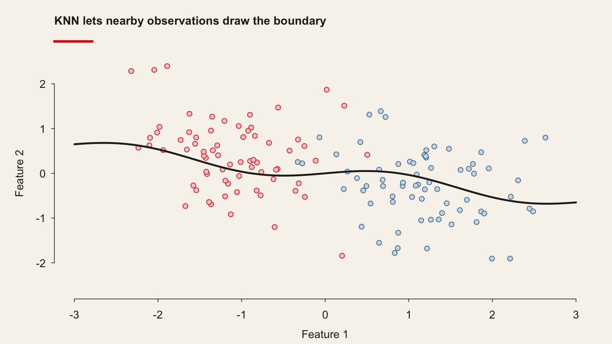
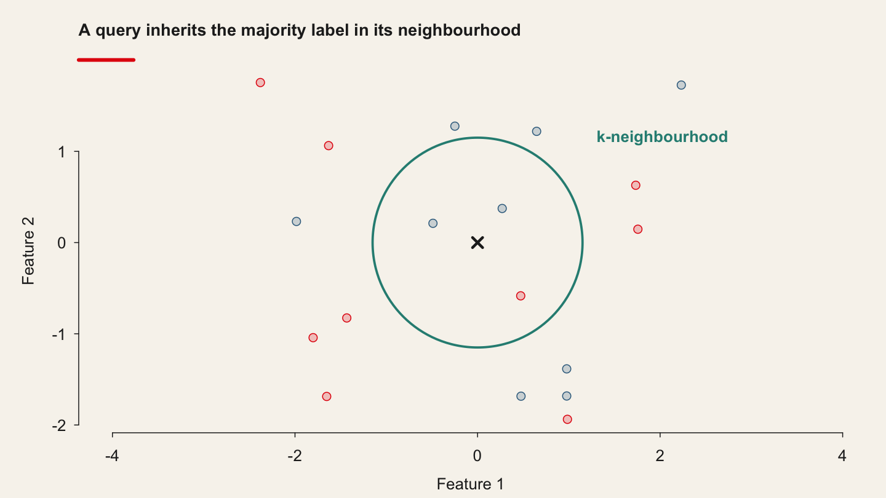
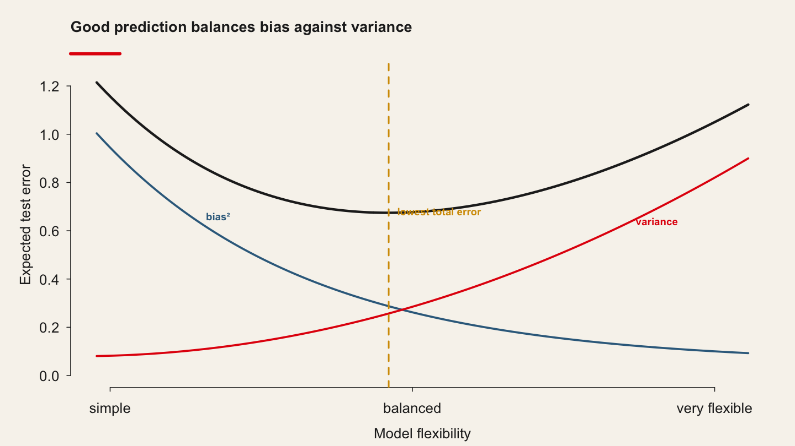
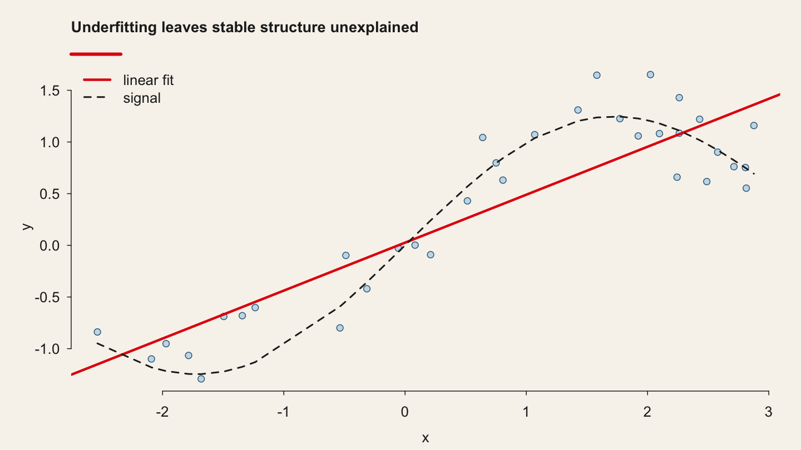
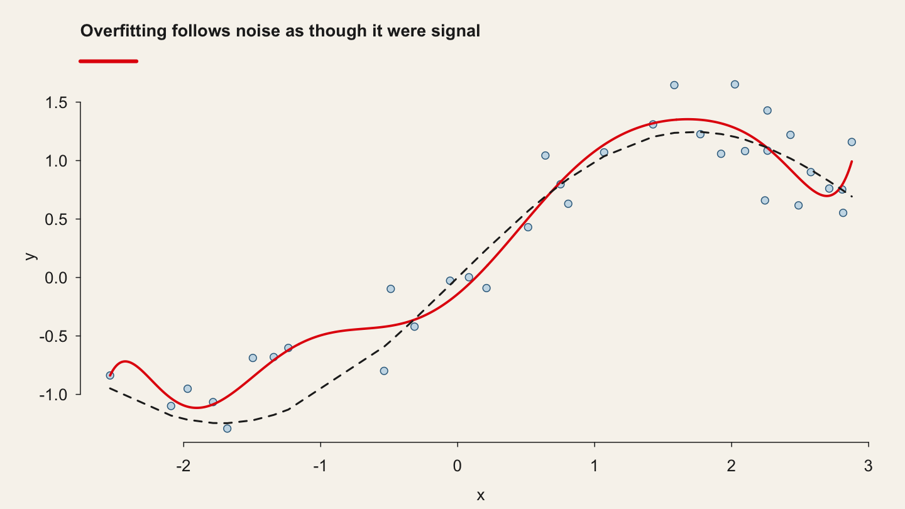
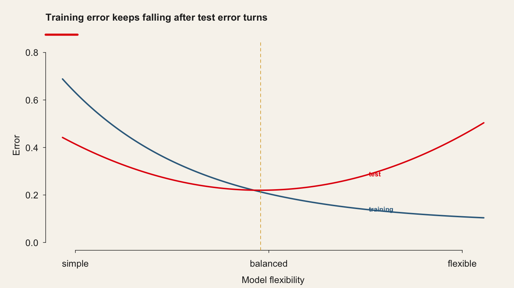
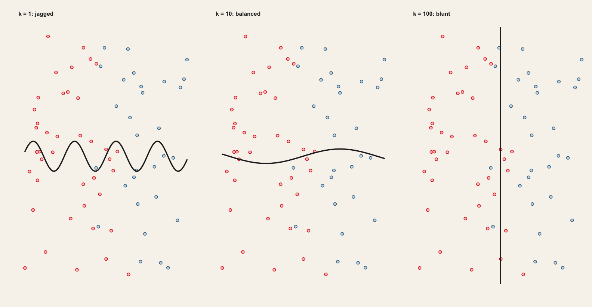
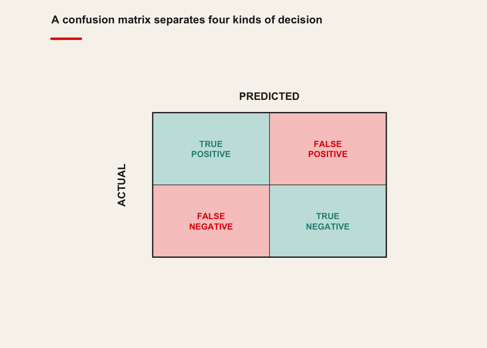

<!-- Imported from https://warin.ca/quant/en/session8_cours/. The code cells below are live: they execute
     against the course data at render time, so the output on the slides is the
     output the students' own machines produce. -->
```{python}
#| label: setup
#| echo: false

import sys, warnings
sys.path.insert(0, "../..")
sys.path.insert(0, "../../slides")
warnings.filterwarnings("ignore")

import numpy as np
import pandas as pd
import matplotlib.pyplot as plt
import qmib

pd.set_option("display.width", 96)
pd.set_option("display.max_columns", 10)
```

<!-- BEGIN deck-frontmatter · scripts/build_deck_frontmatter.py -->

## Outline · The hour ahead {.center .scrollable}

1. Quote of the day
2. Bias — Variance Trade-off
3. Classification
4. Classification (cont.)
5. The Bayes Classifier
6. The Bayes Classifier (cont.)
7. Watch a decision boundary being built
8. Four things to try, and what each one shows
9. What step 4 was really about
10. K-Nearest Neighbors
11. K-Nearest Neighbors (cont.)
12. KNN by hand (you are the algorithm)
13. KNN by hand (you are the algorithm) (cont.)
14. KNN by hand
15. KNN in code (you are no longer the algorithm)
16. Machine Learning: using KNN as an example
17. Smarket: 1,250 daily S&P 500 returns. ISLR ships it as a CSV. (cont.)
18. Train on everything before 2005, test on 2005 — a time split, not a random one (cont.)
19. KNN has no coefficients — importance is measured by scrambling a column (cont.)
20. The confusion matrix, and the accuracy that goes with it (cont.)
21. Big lessons from ML
22. Big lessons
23. Big lessons (cont.)

## What session 8 is for {.scrollable}
::::: columns

:::: {.column width="33%"}

### The mathematics

- State the **Bayes classifier** and say why no rule can beat it
- Find nearest neighbours **by hand** from a Euclidean distance
- Decompose test error into **squared bias, variance and irreducible error**
- Say what happens to KNN as the number of predictors grows

::::

:::: {.column width="33%"}

### The Python

- Standardise, split, and choose $k$ by cross-validation
- Measure a classifier with **AUC** rather than accuracy alone
- Fit the simple alternative too, and let it win if it does

::::

:::: {.column width="33%"}

### The international business

- Classify firms or countries when you have no theory of the boundary
- Say why a flexible method that scores 0.51 has told you something
- Justify complexity against a simpler model that was actually fitted

::::

:::::

## Your Python so far {.scrollable}

The 61 names below came out of sessions 2–7. Today's slides assume them, and add to them. The ones marked are the newest, from session 7.

### Load and shape

- `.dropna` — drop rows with missing values
- `.merge` — join two frames on a key
- `.shape` — rows and columns
- `pd.read_parquet` — a parquet file, directly
- `qmib.load` — a course dataset, by name
- `pd.get_dummies` — categories to indicator columns
- `StandardScaler` — standardise before you penalise
- `make_pipeline` — so the scaler is fitted on train only

### Describe

- `.mean / .median` — the two centres, and their gap
- `.quantile` — any quantile, including the median
- `.std / .var` — spread, dividing by $n-1$
- `stats.trim_mean` — the mean after cutting both tails
- `.value_counts` — how unbalanced is the outcome
- `pd.crosstab` — a contingency table in one call
- `np.linalg.eigvalsh` — eigenvalues of a symmetric matrix · *new in session 7*

### Fit

- `.fit()` — estimate the model you specified
- `smf.ols` — least squares, from a formula
- `OrderedModel` — ordered categories, proportional odds
- `sm.MNLogit` — unordered categories, one baseline
- `sm.add_constant` — the intercept, when there is no formula
- `smf.logit` — binary outcome, from a formula
- `Ridge / Lasso / ElasticNet` — the three penalties
- `I(x**2)` — a quadratic term, inside a formula
- `PanelOLS` — fixed effects, entity intercepts absorbed
- `RandomEffects` — the other panel estimator, and its assumption
- `a * b` — interaction — expands to `a + b + a:b`
- `Factor` — statsmodels' factor analysis, by maximum likelihood · *new in session 7*
- `PCA` — components, on standardised columns · *new in session 7*
- `prince.FAMD` — when the columns are mixed numeric and categorical · *new in session 7*

### Read the fit

- `.params` — the coefficients, in units of $y$
- `.rsquared` — share of variance explained
- `.mse_resid` — its square root is the RSE, in units
- `.resid / .fittedvalues` — what is left, and what was predicted
- `.rsquared_adj` — penalised for the extra predictor
- `.get_prediction` — with an interval, via `.summary_frame()`
- `.predict` — fitted probabilities, not classes
- `np.exp` — a log-odds becomes an odds ratio
- `.coef_ / .alpha_` — scikit-learn's spelling of `.params`
- `.components_` — the loadings — variables on components · *new in session 7*
- `.explained_variance_ratio_` — what the scree plot is drawn from · *new in session 7*
- `.rotate('varimax')` — same fit, readable loadings — and no new evidence · *new in session 7*

### Diagnose

- `.cooks_distance` — influence: leverage $\times$ residual
- `.get_influence()` — the whole diagnostic bundle
- `.hat_matrix_diag` — leverage; sums to $p$, always
- `.resid_studentized_internal` — residuals on a common scale

### Choose and validate

- `.aic / .bic` — compare non-nested models
- `.llf` — log-likelihood, for the LR test
- `stats.chi2.sf` — the $p$-value of that test
- `KFold` — and do it $k$ times
- `RidgeCV / LassoCV / ElasticNetCV` — $\lambda$ by cross-validation
- `lasso_path` — the whole coefficient path
- `mean_squared_error` — score it on the held-out part
- `np.logspace` — a grid that is even in $\log\lambda$
- `train_test_split` — hold something back
- `.compare_f_test` — an F-test, for nested models only
- `np.linalg.pinv` — pseudo-inverse, for the Hausman statistic

### Plot

- `plt.scatter` — the data, before anything else
- `plt.xlabel / plt.ylabel` — say the units, every time
- `plt.axhline / plt.axvline` — draw the threshold you are judging against
- `plt.stem` — one spike per observation
- `plt.subplots` — several panels, one figure

<!-- END deck-frontmatter -->

## Quote of the day {#imported-s08-001 .scrollable}
> \"If you live 5 minutes away from Bill Gates, I bet you are rich.\"

## Bias--Variance Trade-off {#imported-s08-002 .scrollable}

{style="display: block; margin: auto;" width="78%"}

## Bias--Variance Trade-off {#imported-s08-003 .scrollable}

{style="display: block; margin: auto;" width="78%"}

## Bias--Variance Trade-off {#imported-s08-004 .scrollable}

{style="display: block; margin: auto;" width="78%"}

## Bias--Variance Trade-off {#imported-s08-005 .scrollable}

{style="display: block; margin: auto;" width="78%"}

## Bias--Variance Trade-off {#imported-s08-006 .scrollable}

{style="display: block; margin: auto;" width="78%"}

## Bias--Variance Trade-off {#imported-s08-007 .scrollable}

{style="display: block; margin: auto;" width="78%"}

## Classification {#imported-s08-008 .scrollable}

## Classification (cont.) {#imported-s08-009 .scrollable}

::: panel-tabset
### Principle

Thus far, our discussion of model accuracy has been focused on the **regression setting**.

But many of the concepts that we have encountered, such as the bias-variance trade-off, transfer over to the classification setting with only some modifications due to the fact that [[[[y]{#MJXp-Span-3 .MJXp-mi .MJXp-italic style="margin-right: 0.05em;"}[i]{#MJXp-Span-4 .MJXp-mi .MJXp-italic .MJXp-script style="vertical-align: -0.4em;"}]{#MJXp-Span-2 .MJXp-msubsup}]{#MJXp-Span-1 .MJXp-math}]{.MathJax_Preview style="color: inherit;"} is no longer numerical.

> Suppose that we seek to estimate [[[f]{#MJXp-Span-6 .MJXp-mi .MJXp-italic}]{#MJXp-Span-5 .MJXp-math}]{.MathJax_Preview style="color: inherit;"} on the basis of training observations [[[[(]{#MJXp-Span-9 .MJXp-mo style="margin-left: 0em; margin-right: 0em;"}[[x]{#MJXp-Span-11 .MJXp-mi .MJXp-italic style="margin-right: 0.05em;"}[1]{#MJXp-Span-12 .MJXp-mn .MJXp-script style="vertical-align: -0.4em;"}]{#MJXp-Span-10 .MJXp-msubsup}[,]{#MJXp-Span-13 .MJXp-mo style="margin-left: 0em; margin-right: 0.222em;"}[[y]{#MJXp-Span-15 .MJXp-mi .MJXp-italic style="margin-right: 0.05em;"}[1]{#MJXp-Span-16 .MJXp-mn .MJXp-script style="vertical-align: -0.4em;"}]{#MJXp-Span-14 .MJXp-msubsup}[)]{#MJXp-Span-17 .MJXp-mo style="margin-left: 0em; margin-right: 0em;"}[,]{#MJXp-Span-18 .MJXp-mo style="margin-left: 0em; margin-right: 0.222em;"}[.]{#MJXp-Span-19 .MJXp-mo style="margin-left: 0em; margin-right: 0.222em;"}[.]{#MJXp-Span-20 .MJXp-mo style="margin-left: 0em; margin-right: 0.222em;"}[.]{#MJXp-Span-21 .MJXp-mo style="margin-left: 0em; margin-right: 0.222em;"}[,]{#MJXp-Span-22 .MJXp-mo style="margin-left: 0em; margin-right: 0.222em;"}[(]{#MJXp-Span-23 .MJXp-mo style="margin-left: 0em; margin-right: 0em;"}[[x]{#MJXp-Span-25 .MJXp-mi .MJXp-italic style="margin-right: 0.05em;"}[n]{#MJXp-Span-26 .MJXp-mi .MJXp-italic .MJXp-script style="vertical-align: -0.4em;"}]{#MJXp-Span-24 .MJXp-msubsup}[,]{#MJXp-Span-27 .MJXp-mo style="margin-left: 0em; margin-right: 0.222em;"}[[y]{#MJXp-Span-29 .MJXp-mi .MJXp-italic style="margin-right: 0.05em;"}[n]{#MJXp-Span-30 .MJXp-mi .MJXp-italic .MJXp-script style="vertical-align: -0.4em;"}]{#MJXp-Span-28 .MJXp-msubsup}[)]{#MJXp-Span-31 .MJXp-mo style="margin-left: 0em; margin-right: 0em;"}]{#MJXp-Span-8 .MJXp-mrow}]{#MJXp-Span-7 .MJXp-math}]{.MathJax_Preview style="color: inherit;"}, where now [[[[y]{#MJXp-Span-34 .MJXp-mi .MJXp-italic style="margin-right: 0.05em;"}[1]{#MJXp-Span-35 .MJXp-mn .MJXp-script style="vertical-align: -0.4em;"}]{#MJXp-Span-33 .MJXp-msubsup}[,]{#MJXp-Span-36 .MJXp-mo style="margin-left: 0em; margin-right: 0.222em;"}[.]{#MJXp-Span-37 .MJXp-mo style="margin-left: 0em; margin-right: 0.222em;"}[.]{#MJXp-Span-38 .MJXp-mo style="margin-left: 0em; margin-right: 0.222em;"}[.]{#MJXp-Span-39 .MJXp-mo style="margin-left: 0em; margin-right: 0.222em;"}[,]{#MJXp-Span-40 .MJXp-mo style="margin-left: 0em; margin-right: 0.222em;"}[[y]{#MJXp-Span-42 .MJXp-mi .MJXp-italic style="margin-right: 0.05em;"}[n]{#MJXp-Span-43 .MJXp-mi .MJXp-italic .MJXp-script style="vertical-align: -0.4em;"}]{#MJXp-Span-41 .MJXp-msubsup}]{#MJXp-Span-32 .MJXp-math}]{.MathJax_Preview style="color: inherit;"} are qualitative.

-   The most common approach for quantifying the accuracy of our estimate [[[[[[[ˆ]{#MJXp-Span-48 .MJXp-mo style="margin-left: 0px; margin-right: 0px;"}]{style="margin-bottom: -0.92em;"}[f]{#MJXp-Span-47 .MJXp-mi .MJXp-italic}]{.MJXp-over}]{#MJXp-Span-46 .MJXp-munderover}]{#MJXp-Span-45 .MJXp-mrow}]{#MJXp-Span-44 .MJXp-math}]{.MathJax_Preview style="color: inherit;"} is the training *error rate*, the proportion of mistakes that are made if we apply error rate our estimate [[[[[[[ˆ]{#MJXp-Span-53 .MJXp-mo style="margin-left: 0px; margin-right: 0px;"}]{style="margin-bottom: -0.92em;"}[f]{#MJXp-Span-52 .MJXp-mi .MJXp-italic}]{.MJXp-over}]{#MJXp-Span-51 .MJXp-munderover}]{#MJXp-Span-50 .MJXp-mrow}]{#MJXp-Span-49 .MJXp-math}]{.MathJax_Preview style="color: inherit;"} to the training observations [[[[[[[ˆ]{#MJXp-Span-58 .MJXp-mo style="margin-left: 0px; margin-right: 0px;"}]{style="margin-bottom: -0.92em;"}[f]{#MJXp-Span-57 .MJXp-mi .MJXp-italic}]{.MJXp-over}]{#MJXp-Span-56 .MJXp-munderover}]{#MJXp-Span-55 .MJXp-mrow}]{#MJXp-Span-54 .MJXp-math}]{.MathJax_Preview style="color: inherit;"}:

[[[[[1]{#MJXp-Span-61 .MJXp-mn}]{.MJXp-box}[[[]{.MJXp-rule style="height: 1em; border-top-width: medium; border-top-style: none; border-top-color: currentcolor; border-bottom: 1px solid; margin: 0.1em 0px;"}[[n]{#MJXp-Span-62 .MJXp-mi .MJXp-italic}]{.MJXp-box}]{.MJXp-denom}]{.MJXp-box style="margin-top: -0.9em;"}]{#MJXp-Span-60 .MJXp-mfrac style="vertical-align: 0.25em;"}[[[[n]{#MJXp-Span-69 .MJXp-mi .MJXp-italic style="margin-right: 0px; margin-left: 0px;"}]{.MJXp-script}[[∑]{.MJXp-largeop}]{#MJXp-Span-64 .MJXp-mo style="margin-left: 0.111em; margin-right: 0.167em;"}]{.MJXp-over}[[[i]{#MJXp-Span-66 .MJXp-mi .MJXp-italic}[=]{#MJXp-Span-67 .MJXp-mo}[1]{#MJXp-Span-68 .MJXp-mn}]{#MJXp-Span-65 .MJXp-mrow style="margin-left: 0px;"}]{.MJXp-script}]{#MJXp-Span-63 .MJXp-munderover}[I]{#MJXp-Span-70 .MJXp-mi .MJXp-italic}[[[(]{.MJXp-right .MJXp-scale7 style="font-size: 1.978em; margin-left: -0.05em;"}]{#MJXp-Span-72 .MJXp-mo style="margin-left: 0em; margin-right: 0em; vertical-align: -0.244em;"}[[y]{#MJXp-Span-74 .MJXp-mi .MJXp-italic style="margin-right: 0.05em;"}[i]{#MJXp-Span-75 .MJXp-mi .MJXp-italic .MJXp-script style="vertical-align: -0.4em;"}]{#MJXp-Span-73 .MJXp-msubsup}[≠]{#MJXp-Span-76 .MJXp-mo style="margin-left: 0.333em; margin-right: 0.333em;"}[[[[[[ˆ]{#MJXp-Span-81 .MJXp-mo style="margin-left: 0px; margin-right: 0px;"}]{style="margin-bottom: -1.17em;"}[y]{#MJXp-Span-80 .MJXp-mi .MJXp-italic}]{.MJXp-over}]{#MJXp-Span-79 .MJXp-munderover}]{#MJXp-Span-78 .MJXp-mrow style="margin-right: 0.05em;"}[i]{#MJXp-Span-82 .MJXp-mi .MJXp-italic .MJXp-script style="vertical-align: -0.4em;"}]{#MJXp-Span-77 .MJXp-msubsup}[[)]{.MJXp-right .MJXp-scale7 style="font-size: 1.978em; margin-left: -0.05em;"}]{#MJXp-Span-83 .MJXp-mo style="margin-left: 0em; margin-right: 0em; vertical-align: -0.244em;"}]{#MJXp-Span-71 .MJXp-mrow}]{#MJXp-Span-59 .MJXp-math .MJXp-display}]{.MathJax_Preview style="color: inherit;"}

Here [[[[[[[[ˆ]{#MJXp-Span-89 .MJXp-mo style="margin-left: 0px; margin-right: 0px;"}]{style="margin-bottom: -1.17em;"}[y]{#MJXp-Span-88 .MJXp-mi .MJXp-italic}]{.MJXp-over}]{#MJXp-Span-87 .MJXp-munderover}]{#MJXp-Span-86 .MJXp-mrow style="margin-right: 0.05em;"}[i]{#MJXp-Span-90 .MJXp-mi .MJXp-italic .MJXp-script style="vertical-align: -0.4em;"}]{#MJXp-Span-85 .MJXp-msubsup}]{#MJXp-Span-84 .MJXp-math}]{.MathJax_Preview style="color: inherit;"} is the predicted class label for the *i*th observation using [[[[[[[ˆ]{#MJXp-Span-95 .MJXp-mo style="margin-left: 0px; margin-right: 0px;"}]{style="margin-bottom: -0.92em;"}[f]{#MJXp-Span-94 .MJXp-mi .MJXp-italic}]{.MJXp-over}]{#MJXp-Span-93 .MJXp-munderover}]{#MJXp-Span-92 .MJXp-mrow}]{#MJXp-Span-91 .MJXp-math}]{.MathJax_Preview style="color: inherit;"}. And [[[I]{#MJXp-Span-97 .MJXp-mi .MJXp-italic}[(]{#MJXp-Span-98 .MJXp-mo style="margin-left: 0em; margin-right: 0em;"}[[y]{#MJXp-Span-100 .MJXp-mi .MJXp-italic style="margin-right: 0.05em;"}[i]{#MJXp-Span-101 .MJXp-mi .MJXp-italic .MJXp-script style="vertical-align: -0.4em;"}]{#MJXp-Span-99 .MJXp-msubsup}[≠]{#MJXp-Span-102 .MJXp-mo style="margin-left: 0.333em; margin-right: 0.333em;"}[[[[[[ˆ]{#MJXp-Span-107 .MJXp-mo style="margin-left: 0px; margin-right: 0px;"}]{style="margin-bottom: -1.17em;"}[y]{#MJXp-Span-106 .MJXp-mi .MJXp-italic}]{.MJXp-over}]{#MJXp-Span-105 .MJXp-munderover}]{#MJXp-Span-104 .MJXp-mrow style="margin-right: 0.05em;"}[i]{#MJXp-Span-108 .MJXp-mi .MJXp-italic .MJXp-script style="vertical-align: -0.4em;"}]{#MJXp-Span-103 .MJXp-msubsup}[)]{#MJXp-Span-109 .MJXp-mo style="margin-left: 0em; margin-right: 0em;"}]{#MJXp-Span-96 .MJXp-math}]{.MathJax_Preview style="color: inherit;"} is an *indicator variable* that equals 1 if [[[(]{#MJXp-Span-111 .MJXp-mo style="margin-left: 0em; margin-right: 0em;"}[[y]{#MJXp-Span-113 .MJXp-mi .MJXp-italic style="margin-right: 0.05em;"}[i]{#MJXp-Span-114 .MJXp-mi .MJXp-italic .MJXp-script style="vertical-align: -0.4em;"}]{#MJXp-Span-112 .MJXp-msubsup}[≠]{#MJXp-Span-115 .MJXp-mo style="margin-left: 0.333em; margin-right: 0.333em;"}[[[[[[ˆ]{#MJXp-Span-120 .MJXp-mo style="margin-left: 0px; margin-right: 0px;"}]{style="margin-bottom: -1.17em;"}[y]{#MJXp-Span-119 .MJXp-mi .MJXp-italic}]{.MJXp-over}]{#MJXp-Span-118 .MJXp-munderover}]{#MJXp-Span-117 .MJXp-mrow style="margin-right: 0.05em;"}[i]{#MJXp-Span-121 .MJXp-mi .MJXp-italic .MJXp-script style="vertical-align: -0.4em;"}]{#MJXp-Span-116 .MJXp-msubsup}[)]{#MJXp-Span-122 .MJXp-mo style="margin-left: 0em; margin-right: 0em;"}]{#MJXp-Span-110 .MJXp-math}]{.MathJax_Preview style="color: inherit;"} and 0 if [[[(]{#MJXp-Span-124 .MJXp-mo style="margin-left: 0em; margin-right: 0em;"}[[y]{#MJXp-Span-126 .MJXp-mi .MJXp-italic style="margin-right: 0.05em;"}[i]{#MJXp-Span-127 .MJXp-mi .MJXp-italic .MJXp-script style="vertical-align: -0.4em;"}]{#MJXp-Span-125 .MJXp-msubsup}[=]{#MJXp-Span-128 .MJXp-mo style="margin-left: 0.333em; margin-right: 0.333em;"}[[[[[[ˆ]{#MJXp-Span-133 .MJXp-mo style="margin-left: 0px; margin-right: 0px;"}]{style="margin-bottom: -1.17em;"}[y]{#MJXp-Span-132 .MJXp-mi .MJXp-italic}]{.MJXp-over}]{#MJXp-Span-131 .MJXp-munderover}]{#MJXp-Span-130 .MJXp-mrow style="margin-right: 0.05em;"}[i]{#MJXp-Span-134 .MJXp-mi .MJXp-italic .MJXp-script style="vertical-align: -0.4em;"}]{#MJXp-Span-129 .MJXp-msubsup}[)]{#MJXp-Span-135 .MJXp-mo style="margin-left: 0em; margin-right: 0em;"}]{#MJXp-Span-123 .MJXp-math}]{.MathJax_Preview style="color: inherit;"}.

### The test error

[[[[[1]{#MJXp-Span-138 .MJXp-mn}]{.MJXp-box}[[[]{.MJXp-rule style="height: 1em; border-top-width: medium; border-top-style: none; border-top-color: currentcolor; border-bottom: 1px solid; margin: 0.1em 0px;"}[[n]{#MJXp-Span-139 .MJXp-mi .MJXp-italic}]{.MJXp-box}]{.MJXp-denom}]{.MJXp-box style="margin-top: -0.9em;"}]{#MJXp-Span-137 .MJXp-mfrac style="vertical-align: 0.25em;"}[[[[n]{#MJXp-Span-146 .MJXp-mi .MJXp-italic style="margin-right: 0px; margin-left: 0px;"}]{.MJXp-script}[[∑]{.MJXp-largeop}]{#MJXp-Span-141 .MJXp-mo style="margin-left: 0.111em; margin-right: 0.167em;"}]{.MJXp-over}[[[i]{#MJXp-Span-143 .MJXp-mi .MJXp-italic}[=]{#MJXp-Span-144 .MJXp-mo}[1]{#MJXp-Span-145 .MJXp-mn}]{#MJXp-Span-142 .MJXp-mrow style="margin-left: 0px;"}]{.MJXp-script}]{#MJXp-Span-140 .MJXp-munderover}[I]{#MJXp-Span-147 .MJXp-mi .MJXp-italic}[[[(]{.MJXp-right .MJXp-scale7 style="font-size: 1.978em; margin-left: -0.05em;"}]{#MJXp-Span-149 .MJXp-mo style="margin-left: 0em; margin-right: 0em; vertical-align: -0.244em;"}[[y]{#MJXp-Span-151 .MJXp-mi .MJXp-italic style="margin-right: 0.05em;"}[i]{#MJXp-Span-152 .MJXp-mi .MJXp-italic .MJXp-script style="vertical-align: -0.4em;"}]{#MJXp-Span-150 .MJXp-msubsup}[≠]{#MJXp-Span-153 .MJXp-mo style="margin-left: 0.333em; margin-right: 0.333em;"}[[[[[[ˆ]{#MJXp-Span-158 .MJXp-mo style="margin-left: 0px; margin-right: 0px;"}]{style="margin-bottom: -1.17em;"}[y]{#MJXp-Span-157 .MJXp-mi .MJXp-italic}]{.MJXp-over}]{#MJXp-Span-156 .MJXp-munderover}]{#MJXp-Span-155 .MJXp-mrow style="margin-right: 0.05em;"}[i]{#MJXp-Span-159 .MJXp-mi .MJXp-italic .MJXp-script style="vertical-align: -0.4em;"}]{#MJXp-Span-154 .MJXp-msubsup}[[)]{.MJXp-right .MJXp-scale7 style="font-size: 1.978em; margin-left: -0.05em;"}]{#MJXp-Span-160 .MJXp-mo style="margin-left: 0em; margin-right: 0em; vertical-align: -0.244em;"}]{#MJXp-Span-148 .MJXp-mrow}]{#MJXp-Span-136 .MJXp-math .MJXp-display}]{.MathJax_Preview style="color: inherit;"}

If [[[I]{#MJXp-Span-162 .MJXp-mi .MJXp-italic}[(]{#MJXp-Span-163 .MJXp-mo style="margin-left: 0em; margin-right: 0em;"}[[y]{#MJXp-Span-165 .MJXp-mi .MJXp-italic style="margin-right: 0.05em;"}[i]{#MJXp-Span-166 .MJXp-mi .MJXp-italic .MJXp-script style="vertical-align: -0.4em;"}]{#MJXp-Span-164 .MJXp-msubsup}[≠]{#MJXp-Span-167 .MJXp-mo style="margin-left: 0.333em; margin-right: 0.333em;"}[[[[[[ˆ]{#MJXp-Span-172 .MJXp-mo style="margin-left: 0px; margin-right: 0px;"}]{style="margin-bottom: -1.17em;"}[y]{#MJXp-Span-171 .MJXp-mi .MJXp-italic}]{.MJXp-over}]{#MJXp-Span-170 .MJXp-munderover}]{#MJXp-Span-169 .MJXp-mrow style="margin-right: 0.05em;"}[i]{#MJXp-Span-173 .MJXp-mi .MJXp-italic .MJXp-script style="vertical-align: -0.4em;"}]{#MJXp-Span-168 .MJXp-msubsup}[)]{#MJXp-Span-174 .MJXp-mo style="margin-left: 0em; margin-right: 0em;"}]{#MJXp-Span-161 .MJXp-math}]{.MathJax_Preview style="color: inherit;"} = 0 then the [[[[i]{#MJXp-Span-177 .MJXp-mi .MJXp-italic style="margin-right: 0.05em;"}[[t]{#MJXp-Span-179 .MJXp-mi .MJXp-italic}[h]{#MJXp-Span-180 .MJXp-mi .MJXp-italic}]{#MJXp-Span-178 .MJXp-mrow .MJXp-script style="vertical-align: 0.5em;"}]{#MJXp-Span-176 .MJXp-msubsup}]{#MJXp-Span-175 .MJXp-math}]{.MathJax_Preview style="color: inherit;"} observation was classified correctly by our variable classification method; otherwise it was misclassified.

Hence this equation computes the fraction of incorrect classifications.

The equation is referred to as the *training error* rate because it is computed based on the data that was used to train our classifier.

> As in the error regression setting, we are most interested in the error rates that result from applying our classifier to test observations that were not used in training.

The *test error* rate associated with a set of test observations of the form *test error* [[[(]{#MJXp-Span-182 .MJXp-mo style="margin-left: 0em; margin-right: 0em;"}[[x]{#MJXp-Span-184 .MJXp-mi .MJXp-italic style="margin-right: 0.05em;"}[0]{#MJXp-Span-185 .MJXp-mn .MJXp-script style="vertical-align: -0.4em;"}]{#MJXp-Span-183 .MJXp-msubsup}[,]{#MJXp-Span-186 .MJXp-mo style="margin-left: 0em; margin-right: 0.222em;"}[[y]{#MJXp-Span-188 .MJXp-mi .MJXp-italic style="margin-right: 0.05em;"}[0]{#MJXp-Span-189 .MJXp-mn .MJXp-script style="vertical-align: -0.4em;"}]{#MJXp-Span-187 .MJXp-msubsup}[)]{#MJXp-Span-190 .MJXp-mo style="margin-left: 0em; margin-right: 0em;"}]{#MJXp-Span-181 .MJXp-math}]{.MathJax_Preview style="color: inherit;"} is given by:

[[[A]{#MJXp-Span-192 .MJXp-mi .MJXp-italic}[v]{#MJXp-Span-193 .MJXp-mi .MJXp-italic}[e]{#MJXp-Span-194 .MJXp-mi .MJXp-italic}[(]{#MJXp-Span-195 .MJXp-mo style="margin-left: 0em; margin-right: 0em;"}[I]{#MJXp-Span-196 .MJXp-mi .MJXp-italic}[(]{#MJXp-Span-197 .MJXp-mo style="margin-left: 0em; margin-right: 0em;"}[[y]{#MJXp-Span-199 .MJXp-mi .MJXp-italic style="margin-right: 0.05em;"}[0]{#MJXp-Span-200 .MJXp-mn .MJXp-script style="vertical-align: -0.4em;"}]{#MJXp-Span-198 .MJXp-msubsup}[≠]{#MJXp-Span-201 .MJXp-mo style="margin-left: 0.333em; margin-right: 0.333em;"}[[[[[[ˆ]{#MJXp-Span-206 .MJXp-mo style="margin-left: 0px; margin-right: 0px;"}]{style="margin-bottom: -1.17em;"}[y]{#MJXp-Span-205 .MJXp-mi .MJXp-italic}]{.MJXp-over}]{#MJXp-Span-204 .MJXp-munderover}]{#MJXp-Span-203 .MJXp-mrow style="margin-right: 0.05em;"}[0]{#MJXp-Span-207 .MJXp-mn .MJXp-script style="vertical-align: -0.4em;"}]{#MJXp-Span-202 .MJXp-msubsup}[)]{#MJXp-Span-208 .MJXp-mo style="margin-left: 0em; margin-right: 0em;"}[)]{#MJXp-Span-209 .MJXp-mo style="margin-left: 0em; margin-right: 0em;"}]{#MJXp-Span-191 .MJXp-math .MJXp-display}]{.MathJax_Preview style="color: inherit;"}

where [[[[[[[[ˆ]{#MJXp-Span-215 .MJXp-mo style="margin-left: 0px; margin-right: 0px;"}]{style="margin-bottom: -1.17em;"}[y]{#MJXp-Span-214 .MJXp-mi .MJXp-italic}]{.MJXp-over}]{#MJXp-Span-213 .MJXp-munderover}]{#MJXp-Span-212 .MJXp-mrow style="margin-right: 0.05em;"}[0]{#MJXp-Span-216 .MJXp-mn .MJXp-script style="vertical-align: -0.4em;"}]{#MJXp-Span-211 .MJXp-msubsup}]{#MJXp-Span-210 .MJXp-math}]{.MathJax_Preview style="color: inherit;"} is the predicted class label that results from applying the classifier to the test observation with predictor [[[[x]{#MJXp-Span-219 .MJXp-mi .MJXp-italic style="margin-right: 0.05em;"}[0]{#MJXp-Span-220 .MJXp-mn .MJXp-script style="vertical-align: -0.4em;"}]{#MJXp-Span-218 .MJXp-msubsup}]{#MJXp-Span-217 .MJXp-math}]{.MathJax_Preview style="color: inherit;"}. A good classifier is one for which the test error is smallest.
:::

## The Bayes Classifier {#imported-s08-010 .scrollable}

::::: panel-tabset
### The Bayes classifier

It is possible to show that the test error rate given in is minimized, on average, by a very simple classifier that *assigns each observation to the most likely class, given its predictor values*.

In other words, we should simply assign a test observation with predictor vector [[[[x]{#MJXp-Span-223 .MJXp-mi .MJXp-italic style="margin-right: 0.05em;"}[0]{#MJXp-Span-224 .MJXp-mn .MJXp-script style="vertical-align: -0.4em;"}]{#MJXp-Span-222 .MJXp-msubsup}]{#MJXp-Span-221 .MJXp-math}]{.MathJax_Preview style="color: inherit;"} to the class [[[j]{#MJXp-Span-226 .MJXp-mi .MJXp-italic}]{#MJXp-Span-225 .MJXp-math}]{.MathJax_Preview style="color: inherit;"} for which:

[[[Pr]{#MJXp-Span-228 .MJXp-mo}]{#MJXp-Span-227 .MJXp-math}]{.MathJax_Preview style="color: inherit;"}

is largest.

> Note that this equation is a *conditional probability*: it is the probability conditional that [Y = j]{.MathJax_Preview}, given the observed predictor vector [x_0]{.MathJax_Preview}.

This very simple classifier is called the **Bayes classifier**.

In a two-class problem where there are only two possible response values, say *class 1* or *class 2*, the Bayes classifier corresponds to predicting class one if [\\Pr\\left(Y=j\\ \|\\ X\\ =x_0\\right) \> 0.5]{.MathJax_Preview}, and class two otherwise.

### Example

::: pull-left
A simulated data set consisting of 100 observations in each of two groups, indicated in blue and in orange.

The purple dashed line represents the Bayes decision boundary.

The orange background grid indicates the region in which a test observation will be assigned to the orange class, and the blue background grid indicates the region in which a test observation will be assigned to the blue class.

This figure provides an example using a simulated data set in a two-dimensional space consisting of predictors [X_1]{.MathJax_Preview} and [X_2]{.MathJax_Preview}.
:::

::: pull-right
{style="display: block; margin: auto;" width="100%"}
:::
:::::

## The Bayes Classifier (cont.) {#imported-s08-011 .scrollable}

> \"If you live 5 minutes away from Bill Gates, I bet you are rich.\"

## Watch a decision boundary being built {#playground}

Everything on the last four slides — a boundary, a class region, the cost of
flexibility — can be watched happening, in a browser, in about four minutes.

::: {.step}
**[playground.tensorflow.org](https://playground.tensorflow.org/#activation=tanh&batchSize=10&dataset=circle&regDataset=reg-plane&learningRate=0.03&regularizationRate=0&noise=0&networkShape=4,2&seed=0.69510&showTestData=false&discretize=false&percTrainData=50&x=true&y=true&xTimesY=false&xSquared=false&ySquared=false&cosX=false&sinX=false&cosY=false&sinY=false&collectStats=false&problem=classification&initZero=false&hideText=false)** — the link is pre-set to the exercise
below. Press the play button.
:::

The problem is two concentric rings, and the inputs are only $X_1$ and $X_2$ —
the raw coordinates, nothing engineered.

::: {.muted}
It is a neural network rather than anything this course fits, and that does not
matter here. What is on screen is a decision boundary and a test error, which
are the two objects of this session.
:::

## Four things to try, and what each one shows

::: {.step}
**1 · Remove both hidden layers**, leaving the inputs wired straight to the
output. Run it. The boundary is a **straight line**, and it cannot separate a
ring from its centre — the error stalls near 0.5. This is the limit that made
session 4's logistic regression a line, and it is why we need something else.
:::

::: {.step}
**2 · Put the layers back and run it again.** A closed curve forms. Nothing told
it to draw a circle; the hidden units composed one out of straight pieces. That
is what "flexible" buys you.
:::

::: {.step}
**3 · Now add capacity** — eight neurons in each of four layers. Watch the two
loss numbers separate: **training loss keeps falling while test loss turns
upward**, and the boundary starts bulging toward individual points. You are
watching variance, live. It is the same curve as $k$ getting too small in the
next section.
:::

::: {.step}
**4 · Reset, and instead tick the $X_1^2$ and $X_2^2$ input features.** Now even
*no* hidden layer separates the rings almost perfectly — because $X_1^2 + X_2^2$
is the radius, and in that coordinate the problem was always linear.
:::

## What step 4 was really about

::: {.tight}
You can buy the non-linearity with **model flexibility**, or with **a feature you
thought of yourself**. They are substitutes.
:::

::: {.check}
The second is cheaper, more stable and easier to defend — when you can think of
the feature. Knowing that $X_1^2 + X_2^2$ is a radius is subject knowledge, not
statistics, and it is the part a model cannot supply for you.
:::

::: {.warn}
Which is the session's argument in one sentence: **complexity is what you spend
when understanding runs out.** Session 5 penalised that spending; session 6 wrote
the non-linearity in by hand as a quadratic; this session measures what it costs
when you cannot.
:::

## K-Nearest Neighbors {#imported-s08-012 .scrollable}

::: panel-tabset
### K-Nearest Neightbors

In theory we would always like to predict qualitative responses using the Bayes classifier.

But for real data, we do not know the conditional distribution of [Y]{.MathJax_Preview} given [X]{.MathJax_Preview}, and so computing the Bayes classifier is impossible.

Therefore, the Bayes classifier serves as an unattainable gold standard against which to compare other methods.

Many approaches attempt to estimate the conditional distribution of [Y]{.MathJax_Preview} given [X]{.MathJax_Preview}, and then classify a given observation to the class with highest estimated probability.

> One such method is the K-nearest neighbors (KNN) classifier.

### Mathematics

Given a positive integer [K]{.MathJax_Preview} and a test observation [x_0]{.MathJax_Preview}, the KNN classifier first identifies the neighbors [K]{.MathJax_Preview} points in the training data that are closest to [x_0]{.MathJax_Preview}, represented by [N_0]{.MathJax_Preview}.

It then estimates the conditional probability for class [j]{.MathJax_Preview} as the fraction of points in [N_0]{.MathJax_Preview} whose response values equal [j]{.MathJax_Preview}:

[Pr\\left(Y=j\\ \|\\ X\\ =x_0\\right) = \\frac{1}{K}\\sum\_{i∈N_0}I\\left(y_i =j\\right)]{.MathJax_Preview}

Finally, KNN applies Bayes rule and classifies the test observation [x_0]{.MathJax_Preview} to the class with the largest probability.
:::

## K-Nearest Neighbors (cont.) {#imported-s08-013 .scrollable}

::::: panel-tabset
### Goal

::: pull-left
Our goal is to make a prediction for the point labeled by the black cross. Suppose that we choose [K = 3]{.MathJax_Preview}.

Then KNN will first identify the three observations that are closest to the cross. This neighborhood is shown as a circle.

It consists of two blue points and one orange point, resulting in estimated probabilities of [2/3]{.MathJax_Preview} for the blue class and [1/3]{.MathJax_Preview} for the orange class.

Hence KNN will predict that the black cross belongs to the blue class.

Right-hand panel of the figure: we have applied the KNN approach with [K = 3]{.MathJax_Preview} at all of the possible values for [X_1]{.MathJax_Preview} and [X_2]{.MathJax_Preview}, and have drawn in the corresponding KNN decision boundary.
:::

::: pull-right
{style="display: block; margin: auto;" width="100%"}
:::

### Example

{style="display: block; margin: auto;" width="78%"}
:::::

## K-Nearest Neighbors (cont.) {#imported-s08-014 .scrollable}

::::::: panel-tabset
### Efficiency

::: pull-left
Despite the fact that it is a very simple approach, KNN can often produce classifiers that are surprisingly close to the optimal Bayes classifier.

This figure displays the KNN decision boundary, using [K = 10]{.MathJax_Preview}, when applied to the larger simulated data set from the first figure.

The Bayes decision boundary is shown as a purple dashed line. The KNN and Bayes decision boundaries are very similar.
:::

::: pull-right
{style="display: block; margin: auto;" width="100%"}
:::

### Choice of K

::: pull-left
The choice of [K]{.MathJax_Preview} has a drastic effect on the KNN classifier obtained.

This figure displays two KNN fits to the simulated data , using [K = 1]{.MathJax_Preview} and [K = 100]{.MathJax_Preview}. When [K = 1]{.MathJax_Preview}, the decision boundary is overly flexible and finds patterns in the data that don't correspond to the Bayes decision boundary.

This corresponds to a classifier that has low bias but very high variance.

As [K]{.MathJax_Preview} grows, the method becomes less flexible and produces a decision boundary that is close to linear.

This corresponds to a low-variance but high-bias classifier.
:::

::: pull-right
{style="display: block; margin: auto;" width="100%"}
:::
:::::::

## K-Nearest Neighbors (cont.) {#imported-s08-015 .scrollable}

::::::: panel-tabset
### Goal

::: pull-left
Just as in the regression setting, there is not a strong relationship between the training error rate and the test error rate. With [K = 1]{.MathJax_Preview}, the KNN training error rate is 0, but the test error rate may be quite high.

In general, as we use more flexible classification methods, the training error rate will decline but the test error rate may not.
:::

::: pull-right
{style="display: block; margin: auto;" width="100%"}
:::

### Errors

::: pull-left
The KNN training error rate (blue, 200 observations) and test error rate (orange, 5,000 observations) on the data from the first figure, as the level of flexibility (assessed using [1/K]{.MathJax_Preview}) increases.

The black dashed line indicates the Bayes error rate.

The jumpiness of the curves is due to the small size of the training data set.

Choosing the correct level of flexibility is critical to the success of any statistical learning method.

The bias-variance tradeoff, and the resulting U-shape in the test error, can make this a difficult task.
:::

::: pull-right
{style="display: block; margin: auto;" width="100%"}
:::
:::::::

## KNN by hand (you are the algorithm) {#imported-s08-016 .scrollable}

## KNN by hand (you are the algorithm) (cont.) {#imported-s08-017 .scrollable}

::::::: panel-tabset
### Example

The table provides a training data set containing six observations, three predictors, and one qualitative response variable.

::: pull-left
Suppose we wish to use this data set to make a prediction for [Y]{.MathJax_Preview} when [X_1 = X_2 = X_3 = 0]{.MathJax_Preview} using [K]{.MathJax_Preview}-nearest neighbors.

-   Compute the Euclidean distance between each observation and the test point, [X_1 = X_2 = X_3 = 0]{.MathJax_Preview}.

[d(a,b) = d(b,a) = \\sqrt{\\sum\_{i=1}\^{p}(a_i - b_i)\^2}]{.MathJax_Preview}
:::

::: pull-right
        \`[X\_{1}]{.MathJax_Preview}\`   \`[X\_{2}]{.MathJax_Preview}\`   \`[X\_{3}]{.MathJax_Preview}\` \`[Y]{.MathJax_Preview}\`
  --- -------------------------------- -------------------------------- -------------------------------- ---------------------------
  1                                  0                                3                                0 Red
  2                                  2                                0                                0 Red
  3                                  0                                1                                3 Red
  4                                  0                                1                                2 Green
  5                                 -1                                0                                1 Green
  6                                  1                                1                                1 Red
:::

### Euclidean distance

::: pull-left
[d(a,b) = d(b,a) = \\sqrt{\\sum\_{i=1}\^{p}(a_i - b_i)\^2}]{.MathJax_Preview}

```{python}
#| echo: true

import numpy as np

# Six observations in three dimensions — we will find the nearest neighbours by hand
obs = np.array([
    [0,  3, 0],
    [2,  0, 0],
    [0,  1, 3],
    [0,  1, 2],
    [-1, 0, 1],
    [1,  1, 1],
])
test = np.array([0, 0, 0])

# Euclidean distance from the test point to each observation
dist = np.sqrt(((obs - test) ** 2).sum(axis=1))
for i, d in enumerate(dist, 1):
    print(f"obs{i}: {d:.3f}")
```
:::

::: pull-right
        \`[X\_{1}]{.MathJax_Preview}\`   \`[X\_{2}]{.MathJax_Preview}\`   \`[X\_{3}]{.MathJax_Preview}\` \`[Y]{.MathJax_Preview}\`     \`[d(X, Z)]{.MathJax_Preview}\`
  --- -------------------------------- -------------------------------- -------------------------------- --------------------------- ---------------------------------
  1                                  0                                3                                0 Red                                                    3.0000
  2                                  2                                0                                0 Red                                                    2.0000
  3                                  0                                1                                3 Red                                                    3.1623
  4                                  0                                1                                2 Green                                                  2.2361
  5                                 -1                                0                                1 Green                                                  1.4142
  6                                  1                                1                                1 Red                                                    1.7321
:::
:::::::

## KNN by hand {#imported-s08-018 .scrollable}

::: panel-tabset
### Question

-   What is our prediction with [K = 1]{.MathJax_Preview}? Why?

> Green, since the single nearest neighbor to [Z]{.MathJax_Preview} is observation 5.

### Solution

        \`[X\_{1}]{.MathJax_Preview}\`   \`[X\_{2}]{.MathJax_Preview}\`   \`[X\_{3}]{.MathJax_Preview}\` \`[Y]{.MathJax_Preview}\`                                                                                                                     \`[d(X, Z)]{.MathJax_Preview}\`
  --- -------------------------------- -------------------------------- -------------------------------- --------------------------------------------------------------------------------------------------------------------------------------------- ----------------------------------------------------------------------------------------------------------------------------------------------
  1                                  0                                3                                0 Red                                                                                                                                           3
  2                                  2                                0                                0 Red                                                                                                                                           2
  3                                  0                                1                                3 Red                                                                                                                                           3.1623
  4                                  0                                1                                2 Green                                                                                                                                         2.2361
  5                                 -1                                0                                1 [Green]{style=" font-weight: bold;    border-radius: 4px; padding-right: 4px; padding-left: 4px; background-color: lightgreen !important;"}   [1.4142]{style=" font-weight: bold;    border-radius: 4px; padding-right: 4px; padding-left: 4px; background-color: lightgreen !important;"}
  6                                  1                                1                                1 Red                                                                                                                                           1.7321
:::

## KNN by hand {#imported-s08-019 .scrollable}

::: panel-tabset
### Question

-   What is our prediction with [K = 3]{.MathJax_Preview}? Why?

> Red, since the three nearest neighbors to [Z]{.MathJax_Preview} are observations 5, 6 and 2; two are "Red".

### Solution

        \`[X\_{1}]{.MathJax_Preview}\`   \`[X\_{2}]{.MathJax_Preview}\`   \`[X\_{3}]{.MathJax_Preview}\` \`[Y]{.MathJax_Preview}\`                                                                                                                     \`[d(X, Z)]{.MathJax_Preview}\`
  --- -------------------------------- -------------------------------- -------------------------------- --------------------------------------------------------------------------------------------------------------------------------------------- ----------------------------------------------------------------------------------------------------------------------------------------------
  1                                  0                                3                                0 Red                                                                                                                                           3
  2                                  2                                0                                0 [Red]{style=" font-weight: bold;    border-radius: 4px; padding-right: 4px; padding-left: 4px; background-color: lightgreen !important;"}     [2]{style=" font-weight: bold;    border-radius: 4px; padding-right: 4px; padding-left: 4px; background-color: lightgreen !important;"}
  3                                  0                                1                                3 Red                                                                                                                                           3.1623
  4                                  0                                1                                2 Green                                                                                                                                         2.2361
  5                                 -1                                0                                1 [Green]{style=" font-weight: bold;    border-radius: 4px; padding-right: 4px; padding-left: 4px; background-color: lightgreen !important;"}   [1.4142]{style=" font-weight: bold;    border-radius: 4px; padding-right: 4px; padding-left: 4px; background-color: lightgreen !important;"}
  6                                  1                                1                                1 [Red]{style=" font-weight: bold;    border-radius: 4px; padding-right: 4px; padding-left: 4px; background-color: lightgreen !important;"}     [1.7321]{style=" font-weight: bold;    border-radius: 4px; padding-right: 4px; padding-left: 4px; background-color: lightgreen !important;"}
:::

## KNN by hand {#imported-s08-020 .scrollable}

-   If the Bayes decision boundary in this problem is highly nonlinear, then would we expect the best value for [K]{.MathJax_Preview} to be large or small? Why?

Solution

We would expect a small K to perform better for a nonlinear decision boundary. A small \`[K]{.MathJax_Preview}\` would be more 'flexible' and the KNN boundary would be pulled in different directions easier, whereas a large K would have a 'smoothing' effect and produce a more linear boundary (hence, a worse classifier), because it takes more points into account.

## KNN in code (you are no longer the algorithm) {#imported-s08-021 .scrollable}

## Machine Learning: using KNN as an example {#imported-s08-022 .scrollable}

-   How does an AI work?

> The KNN mathematics, now integrated in an algorithm, what does it change?

## Machine Learning: using KNN as an example {#imported-s08-023 .scrollable}

::: panel-tabset
### Data collection

```{python}
#| echo: true

# Smarket: 1,250 daily S&P 500 returns, 2001-2005, from ISLR. Loaded through
# qmib so it is downloaded once and then read from the local cache — the deck
# must render in a room with no internet, and the URL the R course used is dead.
smarket = qmib.load("smarket")
smarket.head()
```

### Data description

We have a labeled dataset here about the stock market. A data frame with 1250 observations on the following 9 variables.

  Variable                        Description
  ------------------------------- -----------------------------------------------------------------------------------------------------------------
  [Year]{.MathJax_Preview}        The year that the observation was recorded
  [Lag_1]{.MathJax_Preview}       Percentage return for previous day
  [Lag_2]{.MathJax_Preview}       Percentage return for 2 days previous
  [Lag_n]{.MathJax_Preview}       Percentage return for [n]{.MathJax_Preview} days previous
  [Direction]{.MathJax_Preview}   A factor with levels Down and Up indicating whether the market had a positive or negative return on a given day

Pre-processing means that we will create the train and the test datasets (they will be called train and test). We also need to consider a variable with the labeled value, here \"Direction\" (it is a factor with the \"up\" and \"down\" values).
:::

## Smarket: 1,250 daily S&P 500 returns. ISLR ships it as a CSV. (cont.) {#imported-s08-024 .scrollable}

::: panel-tabset
### Steps

We will now perform KNN.

1.  A matrix containing the predictors associated with the training data, labeled `train`{.remark-inline-code} below.

2.  A matrix containing the predictors associated with the data for which we wish to make predictions, labeled `test`{.remark-inline-code} below.

3.  A vector containing the class labels for the training observations, labeled `Direction`{.remark-inline-code} below.

4.  A value for [K]{.MathJax_Preview}, the number of nearest neighbors to be used by the classifier (will be determined automatically).

### Confusion Matrix

{style="display: block; margin: auto;" width="72%"}

### Interpretation

Based on the above confusion matrix, we can calculate the following values and prepare for plotting the ROC curve.

[Accuracy = \\frac{TP+TN}{TP+FP+TN+FN}]{.MathJax_Preview}

[TPR / Recall / Sensitivity = \\frac{TP}{TP+FN}]{.MathJax_Preview}

[Precision = \\frac{TP}{TP+FP}]{.MathJax_Preview}

[Specificity = \\frac{TN}{TN+FP}]{.MathJax_Preview}

[False\~Postitive\~Rate = 1 --- Specificity = \\frac{FP}{TN+FP}]{.MathJax_Preview}

[F1\~Score =\\frac{2\*TP}{2\*TP+FP+FN}= (Precision \* Recall) / (Precision + Recall)]{.MathJax_Preview}

### Pre-processing

Scaling/normalization:

[x\_{normalized} = \\frac{x - x\_{min}}{x\_{max} - x\_{min}}]{.MathJax_Preview}

Centering/standardization:

[x\_{standardized} = \\frac{x - \\mu}{\\sigma}]{.MathJax_Preview}
:::

## Smarket: 1,250 daily S&P 500 returns. ISLR ships it as a CSV. (cont.) {#imported-s08-025 .scrollable}

::: panel-tabset
### Steps

1.  Data collection

2.  Model training with or without cross-validation and pre-processing of data

3.  Model testing

4.  Prediction on user\'s data

### Step 1: Data collection

```{python}
#| echo: true

# Train on everything before 2005, test on 2005 — a time split, not a random
# one. Shuffling would let tomorrow's market help predict yesterday's, which is
# leakage: the model would score well and be worthless.
train = smarket[smarket["year"] < 2005]
test  = smarket[smarket["year"] == 2005]

print(f"train {len(train)} days (2001-2004)   test {len(test)} days (2005)")
train.head()
```
:::

## Train on everything before 2005, test on 2005 — a time split, not a random one (cont.) {#imported-s08-026 .scrollable}

::: panel-tabset
### Step 2: Code

```{python}
#| echo: true

from sklearn.neighbors import KNeighborsClassifier
from sklearn.model_selection import GridSearchCV
from sklearn.pipeline import make_pipeline
from sklearn.preprocessing import StandardScaler

X_tr, y_tr = train[["lag1", "lag2"]], train["direction"]
X_te, y_te = test[["lag1", "lag2"]],  test["direction"]

# KNN needs standardised inputs: distance is meaningless in mixed units, and
# whichever column happens to have the larger numbers would decide every
# neighbour. The scaler goes INSIDE the pipeline so it is refitted on the
# training part of each CV fold — fitting it once on everything would leak the
# test fold's mean and standard deviation into training.
pipe = make_pipeline(StandardScaler(), KNeighborsClassifier())
grid = GridSearchCV(pipe, {"kneighborsclassifier__n_neighbors": range(1, 26)}, cv=5)
modelknn = grid.fit(X_tr, y_tr)

print(f"best k = {modelknn.best_params_['kneighborsclassifier__n_neighbors']}")
```

or with k-fold cross-validation:

```{python}
#| echo: true

# A wider search, over odd k only — an even k can tie on a two-class problem.
wide = GridSearchCV(
    make_pipeline(StandardScaler(), KNeighborsClassifier()),
    {"kneighborsclassifier__n_neighbors": range(1, 102, 2)},
    cv=3).fit(X_tr, y_tr)

best_k = wide.best_params_["kneighborsclassifier__n_neighbors"]
print(f"best k over 1..101 = {best_k},  CV accuracy = {wide.best_score_:.4f}")
print(f"always predicting the majority class = {y_tr.value_counts(normalize=True).max():.4f}")
print("\nThe search picks a large k, and it barely beats the constant rule.")
```

### Step 2: Output

### Step 2: Plot

```{python}
#| echo: true

import matplotlib.pyplot as plt

# Read the k values back off the fitted search rather than retyping the range,
# so the axis cannot silently disagree with what was actually fitted.
ks = [p["kneighborsclassifier__n_neighbors"] for p in modelknn.cv_results_["params"]]
scores = modelknn.cv_results_["mean_test_score"]

plt.figure(figsize=(7, 3.6))
plt.plot(ks, scores, "o-")
plt.axhline(y_tr.value_counts(normalize=True).max(), color="red", ls="--",
            label="majority class")
plt.xlabel("k (number of neighbours)"); plt.ylabel("CV accuracy")
plt.legend(); plt.tight_layout(); plt.show()
```


### Step 2: TL;DR

Best tuning:

```{python}
#| echo: true

# Small k = low bias, high variance: the boundary follows single observations.
# Large k = high bias, low variance: it flattens toward the majority class.
# The chosen k is where that trade-off bottomed out on held-out folds.
modelknn.best_params_
```

Variable importance?

```{python}
#| echo: true

from sklearn.inspection import permutation_importance

# KNN has no coefficients, so importance is measured by scrambling a column and
# seeing how much accuracy falls. Measured on the TEST set: on training data a
# flexible model can look important about noise it has memorised.
imp = permutation_importance(modelknn, X_te, y_te, n_repeats=10, random_state=0)
for name, m, s in zip(X_te.columns, imp.importances_mean, imp.importances_std):
    print(f"{name}: {m:+.4f}  (sd {s:.4f})")
print("\nBoth are near zero, and a negative mean is not a paradox —")
print("it says scrambling the column *helped*, which is what noise does.")
```
:::

## KNN has no coefficients — importance is measured by scrambling a column (cont.) {#imported-s08-027 .scrollable}

::: panel-tabset
### Step 3: Test

Let us predict the Direction, and see what it does predict indeed.

```{python}
#| echo: true

knn_predict = modelknn.predict(X_te)

# Put the prediction beside the truth and look at the first few days.
df_knn_predict = test.assign(knn_predict=knn_predict)
df_knn_predict[["year", "lag1", "lag2", "direction", "knn_predict"]].head()
```

```{python}
#| echo: true

knn_predict[:6]
```

### Step 3: Code - Test

Since we have the actual labels with in the test\$Direction variable for the test dataset, we will be able to check the performance of the prediction on the test dataset. Let\'s produce the confusion matrix based on the optimal parameters from the knnfit with the new dataset called test_final:

```{python}
#| echo: true

from sklearn.metrics import confusion_matrix, classification_report

# The confusion matrix, and the accuracy that goes with it.
labels = ["Down", "Up"]
cm = confusion_matrix(y_te, knn_predict, labels=labels)
print(pd.DataFrame(cm, index=[f"true {l}" for l in labels],
                   columns=[f"pred {l}" for l in labels]).to_string())
print()
print(classification_report(y_te, knn_predict))

# The number to compare against is not 50%: it is the majority class.
base = y_te.value_counts(normalize=True).max()
acc = (knn_predict == y_te).mean()
print(f"KNN accuracy {acc:.4f}   always-predict-{y_te.mode()[0]} {base:.4f}")
```

### Step 3: Output - Test
:::

## The confusion matrix, and the accuracy that goes with it (cont.) {#imported-s08-028 .scrollable}

::: panel-tabset
### Step 4: Prediction - Code

Here we will perform a **point estimate** prediction. You can use your own features to see what the model will predict\...

```{python}
#| echo: true

# The whole workflow, in the order it is actually written: load, split, build a
# pipeline, search k by cross-validation, then — and only then — touch the test
# set. Everything above was this, one step at a time.
smarket = qmib.load("smarket")
train = smarket[smarket["year"] < 2005]
test  = smarket[smarket["year"] == 2005]

workflow = GridSearchCV(
    make_pipeline(StandardScaler(), KNeighborsClassifier()),
    {"kneighborsclassifier__n_neighbors": range(1, 102, 2)},
    cv=3).fit(train[["lag1", "lag2"]], train["direction"])

print(f"chosen k = {workflow.best_params_['kneighborsclassifier__n_neighbors']}, "
      f"test accuracy = {workflow.score(test[['lag1','lag2']], test['direction']):.4f}")
```

### Step 4: Output

### Step 4: Visual

{style="display: block; margin: auto;" width="100%"}
:::

## The confusion matrix, and the accuracy that goes with it (cont.) {#imported-s08-029 .scrollable}

You survived your second session on Machine Learning! Congrats!

## The confusion matrix, and the accuracy that goes with it (cont.) {#imported-s08-030 .scrollable}

You survived your second session on Machine Learning! Congrats!

> Wait! I am not an expert! I will never be!!!
>
> I only know the K-Nearest-Neighbor classification technique!!!

## The confusion matrix, and the accuracy that goes with it (cont.) {#imported-s08-031 .scrollable}

You survived your second session on Machine Learning! Congrats!

> Wait! I am not an expert! I will never be!!!
>
> I only know the K-Nearest-Neighbor classification technique!!!

OK, let\'s step back first\...

## Big lessons from ML {#imported-s08-032 .scrollable}

## Big lessons {#imported-s08-033 .scrollable}

-   Machine Learning is about:

    -   regressions

    -   classifications

-   Machine Learning is about:

    -   a process: the 7 principles of ML (see the previous session)

-   You can run the lm(), glm(), plm() in the context of ML: k-fold cross validation, training/testing, predictions

-   ML aims at:

    -   reducing the model and data biases in **sampling with regards to the populations**

    -   as such, it is a **GIGANTIC improvement** of current quantitative studies

## Big lessons (cont.) {#imported-s08-034 .scrollable}

::: panel-tabset
### Neural Network - Not exam material

```{python}
#| echo: true

# Classification example: the iris data, which ships with scikit-learn
from sklearn.datasets import load_iris

iris = load_iris(as_frame=True)
TrainData, TrainClasses = iris.data, iris.target

knn_iris = GridSearchCV(
    make_pipeline(StandardScaler(), KNeighborsClassifier()),
    {"kneighborsclassifier__n_neighbors": range(1, 16)}, cv=10).fit(TrainData, TrainClasses)

print(f"best k = {knn_iris.best_params_}, accuracy = {knn_iris.best_score_:.3f}")
```

### ML Regression

```{python}
#| echo: true

# Regression example. scikit-learn's California housing would download at
# runtime, so this uses the course's own house-price data instead — the same
# frame session 6 fitted OLS to, which makes the two directly comparable.
from sklearn.neighbors import KNeighborsRegressor
from sklearn.model_selection import cross_val_score
from sklearn.linear_model import LinearRegression

houses = qmib.load("realestate").dropna()
Xh = houses[["living_area", "bedrooms", "bathrooms", "year", "garage"]]
yh = houses["price"]

for name, mdl in [("KNN, k=5", make_pipeline(StandardScaler(), KNeighborsRegressor(5))),
                  ("KNN, k=25", make_pipeline(StandardScaler(), KNeighborsRegressor(25))),
                  ("linear regression", LinearRegression())]:
    rmse = -cross_val_score(mdl, Xh, yh, cv=5,
                            scoring="neg_root_mean_squared_error").mean()
    print(f"{name:20} RMSE {rmse:10,.0f}")

print(f"\nprice sd = {yh.std():,.0f} — the number any model has to beat")
```

### glmboost

```{python}
#| echo: true

# scikit-learn parallelises with n_jobs — no cluster setup required. The same
# search as before, across every core rather than one.
knn_par = GridSearchCV(
    make_pipeline(StandardScaler(), KNeighborsClassifier()),
    {"kneighborsclassifier__n_neighbors": range(1, 26)},
    cv=5, n_jobs=-1).fit(X_tr, y_tr)

print(f"best k = {knn_par.best_params_['kneighborsclassifier__n_neighbors']}, "
      f"CV accuracy = {knn_par.best_score_:.4f}")
```

### RF

```{python}
#| echo: true

# A random forest, also parallelised, for comparison with KNN.
from sklearn.ensemble import RandomForestClassifier

rf = RandomForestClassifier(n_estimators=500, n_jobs=-1, random_state=0)
forest = cross_val_score(rf, X_tr, y_tr, cv=5).mean()

print(f"forest CV accuracy = {forest:.4f}")
print(f"KNN    CV accuracy = {knn_par.best_score_:.4f}")
print(f"majority class     = {y_tr.value_counts(normalize=True).max():.4f}")
print("\nFive hundred trees, every core busy, and nothing has beaten the")
print("constant rule. The lesson is not about the method — it is that this")
print("problem may carry no signal at these two lags, and no amount of")
print("compute manufactures one.")
```
:::
