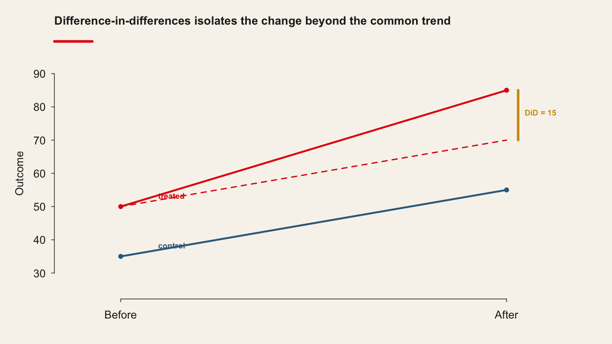
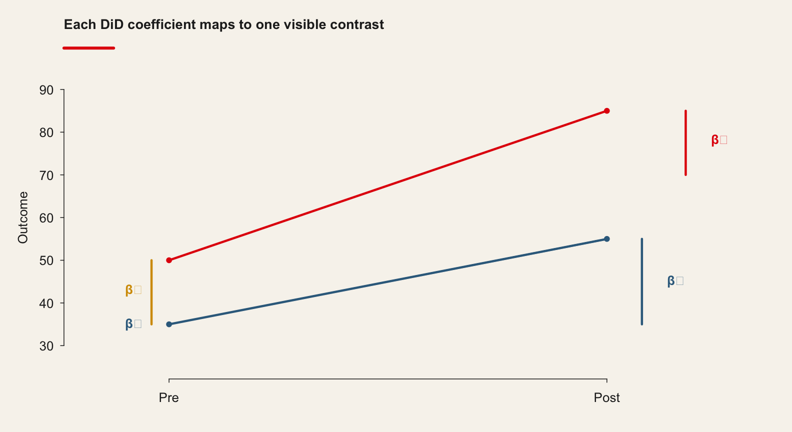
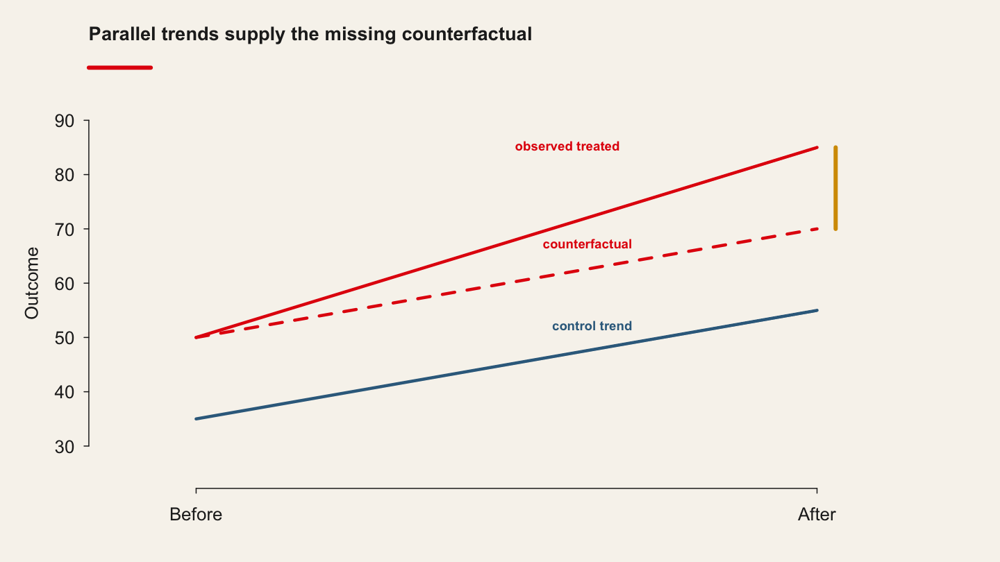

<!-- Imported from https://warin.ca/quant/en/session11_cours/. Content is static so the deck renders without R or Python. -->
## {#imported-s11-001 .scrollable}

**Learning objectives**

-   Understand the scope of a difference-in-difference (DiD) model
-   Understand when a DiD design is appropriate
-   Understand how to structure data before estimating a DiD model
-   Identify and interpret the key coefficients in a DiD regression
-   Understand the parallel trends assumption
-   Apply a DiD model to data in R

## The key concept {#imported-s11-002 .center .scrollable}

## {#imported-s11-003 .scrollable}

The difference-in-difference model is used to estimate the effect of a policy intervention or treatment by comparing changes over time in an outcome for a treated group to changes over time for a comparison (control) group.

1.  It measures how the mean of an outcome changes before and after treatment for the treatment group.
2.  It compares this change with the mean change over time for a control group that is not exposed to the treatment.

We observe average outcomes for two groups, before and after the intervention.

## {#imported-s11-004 .scrollable}

Difference in difference model

{.r-stretch}

## {#imported-s11-005 .scrollable}

The DiD estimator is the difference between the average change in the treatment group and the average change in the control group:

[\\\[ (\\text{Treatment_post} - \\text{Treatment_pre}) - (\\text{Control_post} - \\text{Control_pre}) = \\widehat{\\text{DiD}} \\\]]{.math .display}

Using the values in :

[\\\[ (85 - 50) - (55 - 35) = 15 \\\]]{.math .display}

## {#imported-s11-006 .scrollable}

A more detailed representation is shown in the following table.

Difference in difference, an example

{.r-stretch}

The red number in the bottom-right cell represents the DiD estimator. When this estimator is different from zero, the treatment is interpreted as having an effect.

## {#imported-s11-007 .scrollable}

In this simple DiD setup:

> -   We work with grouped data, comparing a treatment and a control group.
> -   Coefficients represent group means and differences between group means; there is no time trend slope as in a standard time series regression.

## The statistical model {#imported-s11-008 .scrollable}

A basic DiD model can be written as:

[\\\[ Y = \\beta_0 + \\beta_1 \\cdot \\text{Treatment} + \\beta_2 \\cdot \\text{Post} + \\beta_3 \\cdot (\\text{Treatment} \\times \\text{Post}) + e \\\]]{.math .display}

Where:

-   Y.  is the outcome variable.
-   `Treatment` is a dummy variable equal to 1 for units in the treatment group and 0 for the control group.
-   `Post` is a dummy variable equal to 1 for the post-treatment period and 0 for the pre-treatment period.
-   `Treatment × Post` is an interaction term, equal to 1 only for treated units observed after the intervention.

## {#imported-s11-009 .scrollable}

A schematic dataset for a simple DiD design is:

  Subject   Outcome   Treatment   Post   Treatment × Post
  --------- --------- ----------- ------ ------------------
  1         74        1           1      1
  1         46        1           0      0
  2         96        1           1      1
  2         54        1           0      0
  3         50        0           1      0
  3         30        0           0      0
  4         60        0           1      0
  4         40        0           0      0

Two units belong to the treatment group and two units to the control group. For each unit there is one observation before and one observation after the treatment.

## The coefficients {#imported-s11-010 .scrollable}

We can estimate a simple DiD model corresponding to

  **Dependent variable:** Outcome   Estimate      Std. Error
  --------------------------------- ------------- ------------
  **Intercept (B0)**                35.00\*\*\*   (0.00)
  **Treatment (B1)**                15.00\*\*\*   (0.00)
  **Post-treatment (B2)**           20.00\*\*\*   (0.00)
  **Diff in Diff (B3)**             15.00\*\*\*   (0.00)

**Note:** p\<0.1; p\<0.05; p\<0.01

## {#imported-s11-011 .scrollable}

Each coefficient corresponds to a group mean or a difference between group means.

-   [\\(\\beta_0\\)]{.math .inline} is the average outcome of the control group before treatment.

<figure>

<figcaption>Difference in difference, beta 0</figcaption>
</figure>

-   [\\(\\beta_1\\)]{.math .inline} is the difference between the treatment and control group in the pre-treatment period. In the example, [\\(\\beta_1 = 15\\)]{.math .inline}, so [\\(\\beta_0 + \\beta_1 = 50\\)]{.math .inline}, the pre-treatment mean for the treatment group.

<figure>

<figcaption>Difference in difference, beta 1</figcaption>
</figure>

-   [\\(\\beta_2\\)]{.math .inline} captures the change in the average outcome of the control group from the pre-treatment to the post-treatment period. The post-treatment mean for the control group is [\\(\\beta_0 + \\beta_2\\)]{.math .inline}.

<figure>

<figcaption>Difference in difference, beta 2</figcaption>
</figure>

{.r-stretch}

-   [\\(\\beta_3\\)]{.math .inline} is the DiD estimator: it measures how much the average outcome in the treatment group changes in the post-treatment period relative to what would have happened in the absence of treatment.

## {#imported-s11-012 .scrollable}

Diff-in-Diff, beta 3

To obtain the post-treatment mean for the treatment group, we add:

[\\\[ \\beta_0 + \\beta_1 + \\beta_2 + \\beta_3 \\\]]{.math .display}

Each coefficient corresponds to a distinct hypothesis:

  --------------------------------------------------------------------------------------------------------------------------
  Coefficient                       Hypothesis
  --------------------------------- ----------------------------------------------------------------------------------------
  [\\(\\beta_0\\)]{.math .inline}   Is the average outcome of the control group before treatment different from 0?

  [\\(\\beta_1\\)]{.math .inline}   Is the pre-treatment difference between treatment and control groups different from 0?

  [\\(\\beta_2\\)]{.math .inline}   Is the change over time in the control group different from 0?

  [\\(\\beta_3\\)]{.math .inline}   DiD estimator: does the treatment have an effect?
  --------------------------------------------------------------------------------------------------------------------------

## The counterfactual {#imported-s11-013 .scrollable}

To interpret [\\(\\beta_3\\)]{.math .inline}, it is useful to consider the counterfactual.

The counterfactual is the outcome the treatment group would have experienced in the absence of the policy intervention. In the DiD framework, the counterfactual is inferred from the time trend observed in the control group.

## {#imported-s11-014 .scrollable}

DID counterfactual

{.r-stretch}

## {#imported-s11-015 .scrollable}

Using the simple four-cell example:

[\\\[ (\\text{Treatment_post} - \\text{Treatment_pre}) = (\\text{Control_post} - \\text{Control_pre}) \\\\ (X - 50) = (55 - 35) \\\\ (X - 50) = 20 \\\\ X = 20 + 50 = 70 \\\]]{.math .display}

So the counterfactual outcome for the treatment group in the post-treatment period is 70.

## {#imported-s11-016 .scrollable}

Using the regression coefficients, the counterfactual can also be written as:

[\\\[ \\text{Counterfactual} = \\beta_0 + \\beta_1 + \\beta_2 \\\]]{.math .display}

Counterfactual, betas

## A Difference-in-Difference model {#imported-s11-017 .center .scrollable}

## {#imported-s11-018 .scrollable}

Figure 1: A housing project in New York

{.r-stretch}

Governments at different levels subsidize housing projects to create affordable dwellings. This policy has gained prominence as housing costs have increased in many cities.

Critics of such programs often argue that the construction of affordable housing may reduce nearby property values. Possible mechanisms include:

-   Neighborhood preferences for proximity to high-income households
-   Congestion effects due to higher local population
-   Architectural mismatch between new projects and the existing housing stock

## {#imported-s11-019 .scrollable}

A DiD design can be used to examine whether housing projects reduce nearby house prices, as in Ellen et al. (2007).

We simulate data on housing prices for:

-   Houses located close to a subsidized housing project (treatment group)
-   Houses located far from such projects (control group)

## {#imported-s11-020 .scrollable}

Prices are observed before and after the construction of the subsidized housing site.

> **Research question:** Do affordable housing projects reduce the prices of nearby houses?
>
> **Hypothesis:** Houses near subsidized housing projects experience a larger decrease in prices over time.

## Data {#imported-s11-021 .scrollable}

::::: cell
::: {#cb1 .sourceCode .cell-code}
``` {.sourceCode .numberSource .r .number-lines .code-with-copy}
data <- data.frame(
  House_Price = c(
    213679.8, 229355.4, 190580.1, 188669.0, 253573.7,
    320094.0, 188525.7, 282998.4, 184424.0, 290409.4
  ),
  Group = c(0, 0, 1, 1, 0, 0, 1, 1, 0, 0),
  Post_Treatment = c(0, 1, 0, 1, 0, 1, 0, 1, 0, 1)
)

data
```
:::

::: {.cell-output .cell-output-stdout}
       House_Price Group Post_Treatment
    1     213679.8     0              0
    2     229355.4     0              1
    3     190580.1     1              0
    4     188669.0     1              1
    5     253573.7     0              0
    6     320094.0     0              1
    7     188525.7     1              0
    8     282998.4     1              1
    9     184424.0     0              0
    10    290409.4     0              1
:::
:::::

Variables:

-   `House_Price`: house price
-   `Group`: 1 if close to a subsidized housing site, 0 otherwise
-   `Post_Treatment`: 1 if observed after the site opens, 0 otherwise

## Analysis {#imported-s11-022 .scrollable}

The DiD regression is:

[\\\[ Y = \\beta_0 + \\beta_1 \\cdot \\text{Group} + \\beta_2 \\cdot \\text{Post_Treatment} + \\beta_3 \\cdot (\\text{Group} \\times \\text{Post_Treatment}) + e \\\]]{.math .display}

:::: cell
::: {#cb3 .sourceCode .cell-code}
``` {.sourceCode .numberSource .r .number-lines .code-with-copy}
# Example structure (assuming `data` already exists)
reg_housing <- lm(
  House_Price ~ Group * Post_Treatment,
  data = data
)

stargazer(
  reg_housing,
  type            = "text",
  dep.var.labels  = "Housing prices",
  column.labels   = c(""),
  covariate.labels = c(
    "Intercept (B0)",
    "Treatment group (B1)",
    "Post-treatment (B2)",
    "Diff in Diff (B3)"
  ),
  omit.stat       = "all",
  digits          = 2,
  intercept.bottom = FALSE
)
```
:::
::::

## {#imported-s11-023 .scrollable}

:::: cell
::: {.cell-output .cell-output-stdout}
    ================================================
                             Dependent variable:    
                         ---------------------------
                               Housing prices       
                                                    
    ------------------------------------------------
    Intercept (B0)              217,225.80***       
                                 (24,879.25)        
                                                    
    Treatment group (B1)         -27,672.93         
                                 (39,337.54)        
                                                    
    Post-treatment (B2)           62,727.10         
                                 (35,184.57)        
                                                    
    Diff in Diff (B3)            -16,446.30         
                                 (55,631.68)        
                                                    
    ================================================
    ================================================
    Note:                *p<0.1; **p<0.05; ***p<0.01
:::
::::

## {#imported-s11-024 .scrollable}

Illustrative table (as in the original document):

-   Intercept ([\\(\\beta_0\\)]{.math .inline}): 216,672.60
-   Treatment group ([\\(\\beta_1\\)]{.math .inline}): 16,461.22
-   Post-treatment ([\\(\\beta_2\\)]{.math .inline}): 35,230.86
-   Diff in Diff ([\\(\\beta_3\\)]{.math .inline}): 34,066.02

## Discussion of the results {#imported-s11-025 .scrollable}

With the housing example, the main questions are:

-   Is the average price in the control group at time 1 different from zero?
-   Did the treatment and control groups differ in average price at time 1?
-   Did the control group experience a significant change in average price between time 1 and time 2?
-   Does the treatment group at time 2 differ from its counterfactual?

## {#imported-s11-026 .scrollable}

Interpretation (following the original text):

-   [\\(\\beta_0\\)]{.math .inline} is statistically different from zero: average control-group price at time 1 is 216,672.60.
-   [\\(\\beta_1\\)]{.math .inline} is statistically different from zero: treatment-group houses cost 16,461.22 more than control-group houses at time 1. The average price in the treatment group is 233,133.80.
-   [\\(\\beta_2\\)]{.math .inline} is statistically different from zero: prices in the control group increase by 35,230.86, reaching 251,903.5 at time 2.
-   [\\(\\beta_3\\)]{.math .inline} is statistically different from zero: the treatment group's prices increase by 34,066.02 more than they would have in the absence of treatment.

## The counterfactual {#imported-s11-027 .scrollable}

Using the coefficients, the counterfactual for the treatment group at time 2 is:

[\\\[ \\text{Counterfactual} = \\beta_0 + \\beta_1 + \\beta_2 = 216,672.6 + 16,461.2 + 35,230.9 = 268,364.7 \\\]]{.math .display}

Because the intervention occurred, the observed average price is:

[\\\[ 268,364.7 + 34,066.0 = 302,430.7 \\\]]{.math .display}

## {#imported-s11-028 .scrollable}

These values are summarized graphically:

Results from the working example

## Instrumental Variables: Your turn! {#imported-s11-029 .center .scrollable}

## {#imported-s11-030 .scrollable}

-   <https://rpubs.com/Sternonyos/913599>

::::: cell
::: {#cb5 .sourceCode .cell-code}
``` {.sourceCode .numberSource .r .number-lines .code-with-copy}
data <- data.frame(
  Treatment = c(1, 0, 1, 1, 1, 0, 0, 1, 0, 1),
  age        = c(75, 62, 60, 60, 57, 55, 50, 48, 60, 51),
  sex        = c(1, 2, 1, 2, 2, 2, 2, 2, 1, 2),
  education  = c(3, 2, 1, 2, 1, 1, 1, 2, 2, 2),
  marital    = c(4, 4, 4, 4, 4, 4, 4, 4, 3, 3),
  information= c(1, 1, 1, 1, 1, 1, 1, 1, 1, 1),
  income     = c(3000, 3000, 11000, 1000, 1000, 4000, 3000, 2000, 2000, 3000),
  newvar     = c(1.45, 1.00, 1.45, 1.45, 1.45, 1.00, 1.00, 1.45, 1.00, 1.45),
  info_index = c(
    2.2967648, -0.6487551, 1.5254940, 1.5254940, 1.3712398,
    -0.7515912, -0.8250455, 0.9084774, -0.6781368, 1.0627315
  )
)

data
```
:::

::: {.cell-output .cell-output-stdout}
       Treatment age sex education marital information income newvar info_index
    1          1  75   1         3       4           1   3000   1.45  2.2967648
    2          0  62   2         2       4           1   3000   1.00 -0.6487551
    3          1  60   1         1       4           1  11000   1.45  1.5254940
    4          1  60   2         2       4           1   1000   1.45  1.5254940
    5          1  57   2         1       4           1   1000   1.45  1.3712398
    6          0  55   2         1       4           1   4000   1.00 -0.7515912
    7          0  50   2         1       4           1   3000   1.00 -0.8250455
    8          1  48   2         2       4           1   2000   1.45  0.9084774
    9          0  60   1         2       3           1   2000   1.00 -0.6781368
    10         1  51   2         2       3           1   3000   1.45  1.0627315
:::
:::::

## Conclusion {#imported-s11-031 .center .scrollable}

## {#imported-s11-032 .scrollable}

-   The difference-in-difference model is a powerful tool for estimating causal effects in observational data.
-   It relies on the parallel trends assumption, which must be carefully considered and validated.
-   Proper data structuring and interpretation of coefficients are crucial for accurate analysis.
-   DiD models can be extended to include multiple time periods, covariates, and more complex designs.
-   Always visualize your data and results to ensure the validity of your findings.
-   IV models are another tool for causal inference when endogeneity is a concern.
-   Continue practicing with real-world datasets to solidify your understanding of these methods.

## {#imported-s11-033 .scrollable}

-   You have now an incredible toolbox to analyse social and business phenomena! I am really proud of you! You will change the world!
