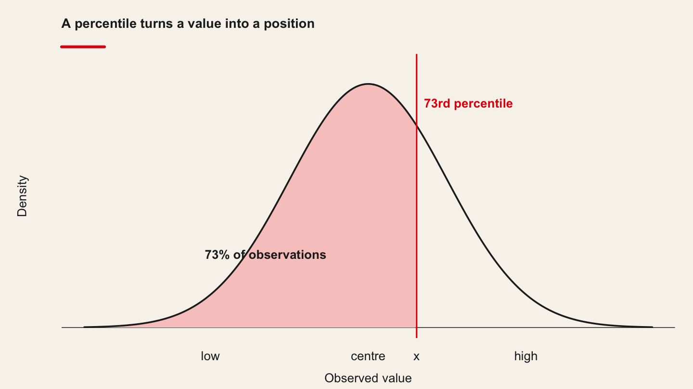
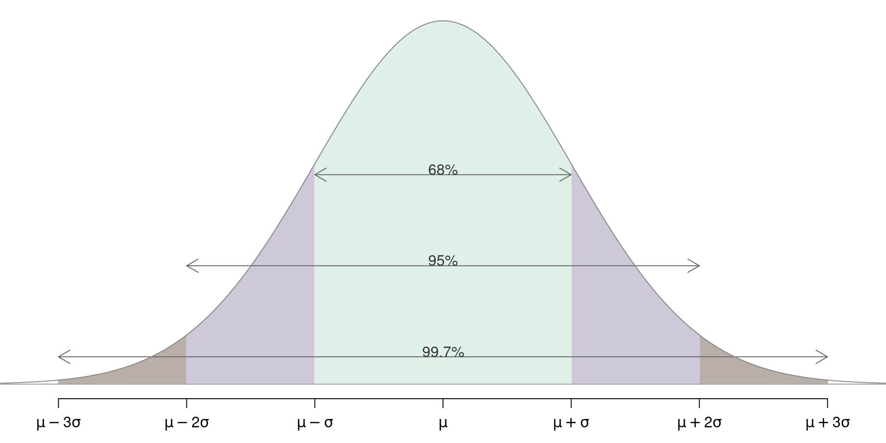
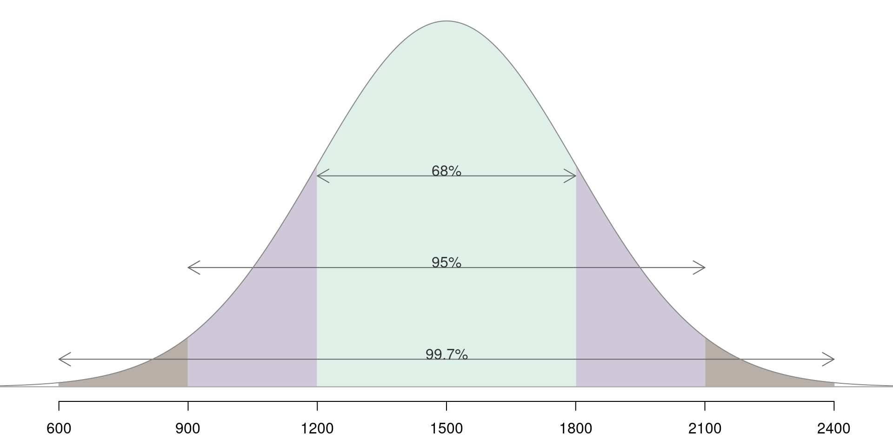
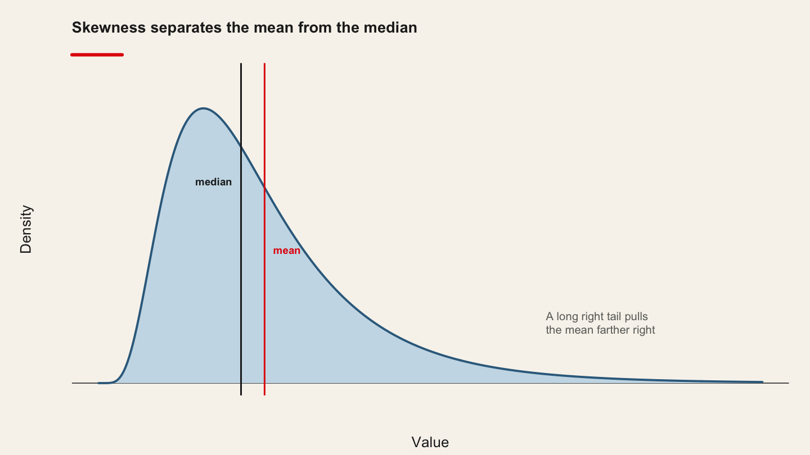
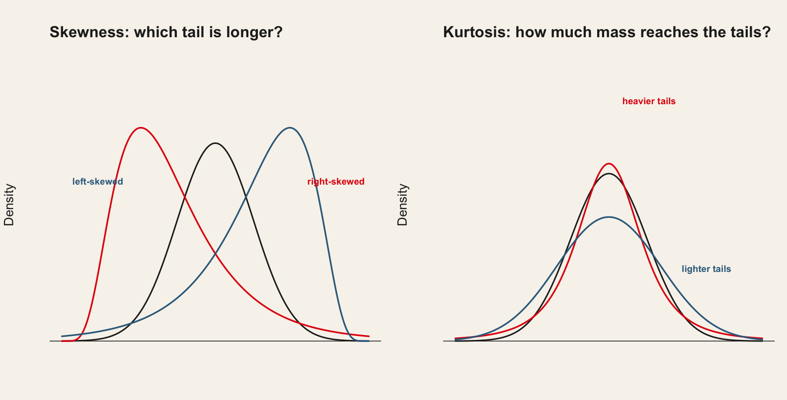

::: {.chapter-meta}
[Lecture slides](https://warint.github.io/quantitative-methods/session-02-lecture.html) · [Pre-session slides](https://warint.github.io/quantitative-methods/session-02-pre-session.html) · [Practice slides](https://warint.github.io/quantitative-methods/session-02-practice.html)
:::

> **Before you model anything, what does the data actually look like?**


| | |
|---|---|
| **Theme of the practice** | Which summary of your key variable would you defend in print? |
| **Reading** | Fraiberger et al. (2021), *Media sentiment and international asset prices* · [article](https://doi.org/10.1016/j.jinteco.2021.103526) |
| **Replication package** | [10.7910/DVN/QNKFJF](https://doi.org/10.7910/DVN/QNKFJF) |
| **Data** | `qmib.load("core")` — the course spine — thirty European countries, 2010–2024 |


## Before the session

> **[Open the pre-session slides](https://warint.github.io/quantitative-methods/session-02-pre-session.html)** ·
> source: [`MATH60033A-S02-Pre-Session.qmd`](https://github.com/warint/quantitative-methods/blob/main/MATH60033A-S02-Pre-Session.qmd)

> Complete **all four steps** before class. Expect 90–120 minutes, plus 45 for the git setup below.

| | Before class | Used in the practice for |
|---|---|---|
| **1** | Read the paper | reproducing one of its results |
| **2** | Get **both** datasets | that, and profiling your own angle |
| **3** | Set up git and your group repository | pushing your work, this session and every session after |

---

### ⚠️ Session 2 only — set up git and your group repository

Before the four steps, work through
**[`setup-git-and-github.md`](setup.qmd#git-and-github)**. Budget 45 minutes.

From this session onward you are assessed as a group, and your commit history is one of the four
records used to check that all three members did the work. That record only exists if git knows
who you are.

You must arrive with a private group repository that your teammates **and the instructor** can
see, and with at least one commit pushed from your own machine.

Slides: [`slides-github-and-teamwork.qmd`](https://github.com/warint/quantitative-methods/blob/main/slides-github-and-teamwork.qmd)

---

### Step 1 — Reading

**Fraiberger et al. (2021), *Media sentiment and international asset prices***
[Read the article](https://doi.org/10.1016/j.jinteco.2021.103526)

You reproduce one of its results in the first twenty minutes of the practice, so read it with that
in mind.

Read for the **argument**, not for coverage. Annotate four things:

| | |
|---|---|
| **1** | The research question, in one sentence |
| **2** | How they build the sentiment measure |
| **3** | The strongest single piece of evidence |
| **4** | One limitation you would raise as a referee |

*Optional background:* **ISLR ch. 2** — <https://www.statlearning.com/> — for the vocabulary
Session 02 uses.

---

### Step 2 — Concepts to review

Refresh these before class; we will use them without re-deriving them.

- **Mean and median.** The mean is the balance point; the median is the middle of the ordering.
- **Variance and standard deviation.** $s^2 = \frac{1}{n-1}\sum_i (x_i - \bar x)^2$ — note the $n-1$.
- **Quantiles.** $\tilde q_p$ is the value below which about $100p\%$ of the data falls.
- **A straight line.** $y = \beta_0 + \beta_1 x$: what the intercept and the slope each mean.

If any of these is unfamiliar, work through it with your local LLM *before* class, and bring your
worked notes.

---

### Step 3 — Get both datasets

The practice uses **two**, and both should be on your machine before you arrive.

#### a) The paper's replication package

This is what you reproduce in the first twenty minutes.

**Harvard Dataverse: [10.7910/DVN/QNKFJF](https://doi.org/10.7910/DVN/QNKFJF)**

Download once and unzip into `02-exploratory-data-analysis/data/replication/`. That folder is
git-ignored, so nothing large is committed. Keep the authors' own structure and README.

#### b) The course data, for your own angle

This is what you apply the method to in the second half. It is **already cleaned and cached** —
one line, nothing to download.

| Group | Angle | Your file | Unit | Columns |
|---|---|---|---|---|
| **G01** | A | `angle_a_country.parquet` | country × time | [dictionary](https://github.com/warint/quantitative-methods/blob/main/data/spine/dictionaries/G01.md) |
| **G02** | A | `angle_a_sector.parquet` | country × sector × time | [dictionary](https://github.com/warint/quantitative-methods/blob/main/data/spine/dictionaries/G02.md) |
| **G03** | B | `angle_b_occupation.parquet` | occupation × country × time | [dictionary](https://github.com/warint/quantitative-methods/blob/main/data/spine/dictionaries/G03.md) |
| **G04** | B | `angle_b_sector.parquet` | sector × country × time | [dictionary](https://github.com/warint/quantitative-methods/blob/main/data/spine/dictionaries/G04.md) |
| **G05** | C | `angle_c_country.parquet` | country × time | [dictionary](https://github.com/warint/quantitative-methods/blob/main/data/spine/dictionaries/G05.md) |
| **G06** | C | `angle_c_sector_size.parquet` | country × sector × size × time | [dictionary](https://github.com/warint/quantitative-methods/blob/main/data/spine/dictionaries/G06.md) |
| **G07** | D | `angle_d_partner.parquet` | reporter × partner × time | [dictionary](https://github.com/warint/quantitative-methods/blob/main/data/spine/dictionaries/G07.md) |
| **G08** | D | `angle_d_product.parquet` | reporter × product × time | [dictionary](https://github.com/warint/quantitative-methods/blob/main/data/spine/dictionaries/G08.md) |
| **G09** | E | `angle_e_centralbank.parquet` | document | [dictionary](https://github.com/warint/quantitative-methods/blob/main/data/spine/dictionaries/G09.md) |
| **G10** | E | `angle_e_national.parquet` | document | [dictionary](https://github.com/warint/quantitative-methods/blob/main/data/spine/dictionaries/G10.md) |

```python
import qmib

core = qmib.load("core")                 # shared by every group
mine = qmib.load("angle_c_country")      # YOUR file — see the table above
df   = core.merge(mine, on=["geo", "time"], how="inner")   # not for angle E

print(core.shape, mine.shape, df.shape)
```

> `qmib.load()` resolves the local cache first, so after the first run the practice works with the
> wifi off. `qmib.catalog()` lists everything available.

**Before class:** load your file, join it to `core`, and pick the **three variables** your research
question depends on most — the outcome, and the two you most expect to explain it. Write down one
sentence on why you chose each. That is what you profile in the practice.

> Read your [data dictionary](https://github.com/warint/quantitative-methods/blob/main/data/spine/dictionaries/) first. Its **Traps** section lists
> the things that have cost somebody a week, and its **First look** items take ten minutes. Knowing
> that a series is survey-based, breaks in 2021, or is structurally absent before a given year is
> part of your answer — not a footnote.
>
> ⚠️ The spine currently holds **teaching fixtures**: real schema, real coverage, real flags and
> real pathologies, generated from a known structure. Every method behaves as it would on the
> genuine sources, but no number in them is a fact about Europe. See
> [`PROVENANCE.md`](https://github.com/warint/quantitative-methods/blob/main/data/spine/PROVENANCE.md).

<details>
<summary>Teaching dataset for the method exercise (optional)</summary>

**Ames Housing (2,930 residential sales, 79 features)**

Source: OpenML / scikit-learn `fetch_openml`
URL: <https://www.openml.org/d/42165>

Download once and cache locally:

```python
from sklearn.datasets import fetch_openml
ames = fetch_openml(name="house_prices", as_frame=True, parser="auto")
ames.frame.to_parquet("data/ames.parquet")
```

Everything after the first run reads the local parquet file. **No network access is needed during
the practice.**

Use this if you want to see the method work on known ground before turning it on your own angle.
The result you report must come from **your project**.

</details>

---

### Step 4 — Self-check

Answer these **in writing** before class. You will not hand them in, but the lecture assumes you
have attempted them. If you cannot answer one, bring the question.

1. Show that if $P = X(X^\top X)^{-1}X^\top$ then $P^2 = P$ and $P^\top = P$.
2. What is the trace of the hat matrix, and why does that number have a name you already know?
3. If two columns of $X$ are perfectly collinear, what fails - and does the *fitted value* $\hat y$ still exist?
4. Why does adding a variable never decrease $R^2$? Answer geometrically, not algebraically.

---

### Using your local LLM on the preparation

Your local model is a study partner, not an answer key. Ask it to *explain*, to *quiz you*, and to
*argue against you*. Verify everything it says against the reading.

Prompts that work well for this session:

- "I get a LinAlgError: Singular matrix. Explain what this means about the geometry of my design matrix, without giving me code."
- "Walk me through the Frisch-Waugh-Lovell theorem using a two-regressor example with numbers."
- "Explain the difference between numpy.linalg.inv, numpy.linalg.solve and numpy.linalg.lstsq in terms of numerical stability."

> **Standing rule for this course.** Whenever you use the LLM in a deliverable, you must be able to
> say what you checked and how. An unverified claim from a language model has the same evidential
> status as an unverified claim from a stranger.

---

[Back to session 02](session-02.qmd)

## The lecture

::: {.muted}
Delivered from [the slides](https://warint.github.io/quantitative-methods/session-02-lecture.html). What follows is the same material as prose.
:::

<!-- Imported from https://warin.ca/quant/en/session2_cours/. Content is static so the deck renders without R or Python. -->
### Class Organization


::: panel-tabset
#### Class rules

-   **Respect**: Respect other participants and speakers.

-   **Participation**: Participate actively in discussions and activities.

-   **Commitment**: Be committed and involved in the learning process.

-   **Collaboration**: Collaborate with your peers and share your knowledge.

-   **Confidentiality**: Respect the confidentiality of shared information.

#### and therefore

-   Cell phones are in backpacks, not on the table.

-   Computers are used for taking notes and following the course, not for personal messages or other activities.

#### Schedule

  ----------------------------------------------------------------------------------------------------------
  Session      Day and Time          Building, Room                     Instructor      Session Dates
  ------------ --------------------- ---------------------------------- --------------- --------------------
  Session 1    Wed 3:30PM - 6:30PM   C-Ste-Cath, Serge-Saucier          Thierry Warin   August 27, 2025

  Session 2    Wed 3:30PM - 6:30PM   C-Ste-Cath, Student Associations                   September 3, 2025

  Session 3    Wed 3:30PM - 6:30PM   C-Ste-Cath, Serge-Saucier                          September 10, 2025

  Session 4    Wed 3:30PM - 6:30PM   C-Ste-Cath, Serge-Saucier                          September 17, 2025

  Session 5    Wed 3:30PM - 6:30PM   C-Ste-Cath, Serge-Saucier                          September 24, 2025

  Session 6    Wed 3:30PM - 6:30PM   Synchronous with Africa                            October 1, 2025

  Session 7    Wed 3:30PM - 6:30PM   Synchronous with Africa                            October 8, 2025

  Session 8    Wed 3:30PM - 6:30PM   C-Ste-Cath, Rona                                   November 5, 2025

  Session 9    Wed 3:30PM - 6:30PM   C-Ste-Cath, Rona                                   November 12, 2025

  Session 10   Wed 3:30PM - 6:30PM   C-Ste-Cath, Rona                                   November 19, 2025

  Session 11   Wed 3:30PM - 6:30PM   C-Ste-Cath, Rona                                   November 26, 2025

  Session 12   Wed 3:30PM - 6:30PM   C-Ste-Cath, Rona                                   December 3, 2025
  ----------------------------------------------------------------------------------------------------------
:::

### Quote of the day

> It's tough to make predictions, especially about the future

> [Yogi Berra](https://www.goodreads.com/author/quotes/79014.Yogi_Berra)

### Introduction


-   Statistics is a language, constructed by mathematicians.

-   The tools (formulas and processes) are constructs. They do not represent the truth, just the tools to get closer to the truth. They are the **foundations** that we use in our **applications** as a data analyst.

> So, let us spend some time on the foundations first.


> The magic in the data

[Web app](http://shiny.calpoly.sh/Longest_Run/)

### Introduction - Differences between statistics and statistical learning?

::::: columns
::: {.column style="width:50%;"}
Statistics: decision making under uncertainty.

*Statistics* is that branch of knowledge which deals with the multiplicity of data, its

-   collection,

-   analysis, and

-   interpretation
:::

::: {.column style="width:50%;"}
Statistical learning is a vast set of tools for *understanding data*

-   classified as *supervised learning*: building a statistical model for predicting, or estimating, and output based on one (single) or more (multiple) inputs.

-   classified as *unsupervised learning*: there are inputs, but no supervising output
:::
:::::

> The goal is to understand the models, intuitions, and strengths and weaknesses of the various approaches


:::::: columns
::: {.column style="width:50%;"}
-   scalar, random variable, vector, matrix

-   quantitative values versus qualitative values

    -   quantitative: numerical (continuous or discrete)

    -   qualitative: categorical (nominal or ordinal)
:::

:::: {.column style="width:50%;"}
::: cell
```{mermaid}
graph TB
A[Types of data] --> B[Quantitative]; B --> D{Numerical}
A --> C[Qualitative]; C --> E{Categorical}

D --> F(Continuous)
D --> G(Discrete)

E --> H(Ordinal)
E --> I(Nominal)
```
:::
::::
::::::


---------------------------------------------------------------------------------------------------------
  Numerical                                            Examples                   Visualizations
  ---------------------------------------------------- -------------------------- -------------------------
  Discrete: data have a finite number of values        Number of balls in a jar   Bar charts, line graphs

  Continuous: data have an infinite number of values   Distance, time             Histograms, line graphs
  ---------------------------------------------------------------------------------------------------------

  -----------------------------------------------------------------------------------------------------------------------------------------
  Categorical                                                                                  Examples                    Visualizations
  -------------------------------------------------------------------------------------------- --------------------------- ----------------
  Nominal: identified by particular names or categories and cannot be organized in any order   Gender, colors, locations   Bar charts

  Ordinal: identified by particular names or categories and can be ordered                     Rankings                    Bar charts
  -----------------------------------------------------------------------------------------------------------------------------------------


-   Outcomes associated with random experiments (probabilistic) called *random variables*:

$$ X, Y, Z $$

-   Observed values:

$$ x, y, z $$

Let $X$ be a r.v. taking values in the sample space $S=\left\{x\_{1},\, x\_{2},\,\ldots,x\_{k}\right\}$

$$ p(x\_{i})=\Pr(X=x\_{i}), \quad i=1,2,\ldots,k $$

$$ \sum\_{i=1}^{k}p(x\_{i}) = p(x\_{1})+p(x\_{2})+\cdots+p(x\_{k}), = 1 $$


::::: columns
::: {.column style="width:50%;"}
Three Basic Features

-   Center: middle or general tendency

-   Spread: small means tightly clustered, large means highly variable

-   Shape: symmetry versus skewness, kurtosis
:::

::: {.column style="width:50%;"}
Make the difference between a **sample** and a **population**!
:::
:::::

### Measuring the center

### Measuring the center

In what follows, we will look into the following concepts:

Basics:

-   The sample mean
-   The sample median

Extensions:

-   The trimmed mean
-   The sample quantile
-   The sample percentile

### The basics: the sample mean

::::: columns
::: {.column style="width:50%;"}
R.V.'s mean

$$ \mu = \sum\_{i=1}^{k} x\_{i} p(x\_{i}) \\\\ = x\_{1} \times p(x\_{1}) + \cdots + x\_{k} \times p(x\_{k}) $$

-   the mean is a center or average value of $(X)$

-   $(\mu)$ can be any number or decimal

-   $(\mu)$ is the "first moment about the origin"
:::

::: {.column style="width:50%;"}
Sample mean

$$ \overline{x} = \frac{x\_{1} + x\_{2} + \cdots+x\_{n}}{n} \\\\ = \frac{1}{n}\sum\_{i = 1}^{n} x\_{i} $$

-   Good: natural, easy to compute, nice properties
-   Bad: sensitive to extreme values
:::
:::::


> Wait!

> Greek letters are for the RV and latin letters are for the sample?

### The basics: the sample mean

:::::::::: columns
::::: {.column style="width:50%;"}
:::: cell
``` {.sourceCode .numberSource .python .number-lines .code-with-copy}
# In the VS Codium terminal, with .venv active:  python
import statsmodels.api as sm

# 21 observations from an ammonia-oxidation plant — ships with statsmodels,
# so there is nothing to download.
mydata = sm.datasets.stackloss.load_pandas().data
stack_loss = mydata["STACKLOSS"]
```
::::

   stack.loss
  ------------
       42
       37
       37
       28
       18
       18
       19
       20
      etc.
:::::

:::::: {.column style="width:50%;"}
::::: cell
``` {.sourceCode .numberSource .python .number-lines .code-with-copy}
stack_loss.mean()
```

```text
np.float64(17.523809523809526)
```
:::::
::::::
::::::::::

### The basics: the sample median

How to find it

-   sort the data into an increasing sequence of $n$ numbers

-   $\tilde{x}$ lies in position $(n + 1)/2$

-   Good: resistant to extreme values, easy to describe

-   Bad: not as mathematically tractable, need to sort the data to calculate

::::: cell
``` {.sourceCode .numberSource .python .number-lines .code-with-copy}
stack_loss.median()
```

```text
np.float64(15.0)
```
:::::

### Extensions

:::::::::::::::: panel-tabset
#### The trimmed mean

How to find it

-   "trim" a proportion of data from both ends of the ordered list

-   find the sample mean of what's left

-   Good: also resistant to extreme values, has good properties, too

-   Bad: still need to sort data to get rid of outliers

::::: cell
``` {.sourceCode .numberSource .python .number-lines .code-with-copy}
from scipy import stats

stats.trim_mean(stack_loss, 0.05)
```

```text
np.float64(16.789473684210527)
```
:::::

#### The sample quantile

-   Quantile: approximately $100 \times p\%$ of the data fall below the value $\tilde{q}\_{p}$

::::: cell
``` {.sourceCode .numberSource .python .number-lines .code-with-copy}
stack_loss.quantile(0.75)
```

```text
np.float64(19.0)
```
:::::

So, $75%$ of the data (.75\*21=16) fall below the value $19$.

::::: cell
``` {.sourceCode .numberSource .python .number-lines .code-with-copy}
stack_loss.quantile([0, 0.25, 0.80])
```

```text
0.00     7.0
0.25    11.0
0.80    20.0
Name: STACKLOSS, dtype: float64
```
:::::

#### The sample percentile

-   Percentile: the percentage of observations that fall below a given data point

<figure>
<p></p>
</figure>

::::: cell
``` {.sourceCode .numberSource .python .number-lines .code-with-copy}
stats.norm.cdf(1800, loc=1500, scale=300)
```

```text
np.float64(0.8413447460685429)
```
:::::
::::::::::::::::

### Measuring the spread

### Measures of spread

In what follows, we will look into the following concepts:

-   The sample variance

-   The sample standard deviation

-   The sample interquartile range (IQR)

### Measures of spread

::::::::::::::::::::::: panel-tabset
#### Variance and STD

The **sample variance** $s^{2}$:

$$ s^{2} = \frac{1}{n - 1}\sum\_{i = 1}^{n}(x\_{i} - \overline{x})^{2} $$

The **sample standard deviation** is $(s = \sqrt{s^{2}})$

-   Good: tractable, nice mathematical/statistical properties

-   Bad: sensitive to extreme values

:::::: cell
``` {.sourceCode .numberSource .python .number-lines .code-with-copy}
print(stack_loss.var(ddof=1))
print(stack_loss.std(ddof=1))
```

```text
103.46190476190478
10.171622523565489
```

```text
[1] 10.17162
```
::::::

#### Interpretation

::::::: columns
::: {.column style="width:50%;"}
Interpretation of $s$

The empirical rule:

-   For nearly normally distributed data,

-   about $68\%$ falls within 1 SD of the mean,

-   about $95\%$ falls within 2 SD of the mean,

-   about $99.7\%$ falls within 3 SD of the mean.

-   It is possible for observations to fall 4, 5, or more standard deviations away from the mean, but these occurrences are very rare if the data are nearly normal.
:::

::::: {.column style="width:50%;"}
:::: cell
<div>

<figure>
<p></p>
</figure>

</div>
::::
:::::
:::::::

#### Interpretation

::::::: columns
::: {.column style="width:50%;"}
SAT scores are distributed nearly normally with mean 1500 and standard deviation 300.

Following the 68-95-99.7 Rule:

-   $\sim 68\%$ of students score between 1200 and 1800 on the SAT.

-   $\sim 95\%$ of students score between 900 and 2100 on the SAT.

-   $\sim 99.7\%$ of students score between 600 and 2400 on the SAT.
:::

::::: {.column style="width:50%;"}
:::: cell
<div>

<figure>
<p></p>
</figure>

</div>
::::
:::::
:::::::

#### IQR

$$ IQR = \tilde{q}\_{0.75} - \tilde{q}\_{0.25} $$

::::: cell
``` {.sourceCode .numberSource .python .number-lines .code-with-copy}
stack_loss.quantile(0.75) - stack_loss.quantile(0.25)
```

```text
np.float64(8.0)
```
:::::

-   Good: resistant to outliers (see session 3)

-   Bad: only considers middle $50\%$ of the data, equivalent to:

::::: cell
``` {.sourceCode .numberSource .python .number-lines .code-with-copy}
stack_loss.quantile([0.25, 0.75])
```

```text
0.25    11.0
0.75    19.0
Name: STACKLOSS, dtype: float64
```
:::::
:::::::::::::::::::::::

### Measuring the shape

### Measuring the shape

In what follows, we will look into the following concepts:

-   Skewness: degree of "symmetry"

-   Kurtosis: degree of "thickness"

### Measuring the shape

{.r-stretch}

### Measuring the shape

::: panel-tabset
#### Skewness/Kurtosis 1

-   Symmetric or skewed

    -   right (positive) and left (negative) skewness

-   Kurtosis

    -   leptokurtic - steep peak, heavy tails

    -   platykurtic - flatter, thin tails

    -   mesokurtic - right in the middle

#### Skewness/Kurtosis 2

{.r-stretch}
:::


> Wait!

> Why are we looking at the distribution of the sample?

> Is the study of the sample shape/distribution relevant because otherwise the tools designed by the statisticians would not work?

### Measures of shape: sample skewness

The sample skewness $g\_{1}$:

$$ g\_{1} = \frac{1}{n}\frac{\sum\_{i = 1}^{n}(x\_{i} - \overline{x})^{3}}{s^{3}} $$

Things to notice:

-   $-\infty < g\_{1} < \infty$

-   sign of $g\_{1}$ indicates direction of skewness $\pm)$

### Measures of shape

::::::::::::::::::: panel-tabset
#### Sample skewness

::::: cell
``` {.sourceCode .numberSource .python .number-lines .code-with-copy}
import numpy as np

def skewness(x):
    """g1, exactly as defined on the previous slide."""
    x = np.asarray(x, float)
    xbar, s = x.mean(), x.std(ddof=1)
    return ((x - xbar) ** 3).mean() / s ** 3

skewness(stack_loss)
```

```text
np.float64(1.1564007167787318)
```
:::::

If $\vert g\_{1} \vert > 2\sqrt{6/n}$, then the data distribution is **substantially skewed** in the direction of the sign of $g\_{1}$

::::::: cell
``` {.sourceCode .numberSource .python .number-lines .code-with-copy}
# The same test on course data: GDP per capita across 30 European countries
import pandas as pd
core = pd.read_parquet("data/spine/core.parquet")
gdp = core["gdp_pc_eur"].dropna()

skewness(gdp)
```

```text
np.float64(0.8805789352785794)
```

``` {.sourceCode .numberSource .python .number-lines .code-with-copy}
2 * np.sqrt(6 / len(gdp))
```

```text
np.float64(0.2343499700593521)
```
:::::::

#### Sample excess kurtosis 1

The sample excess kurtosis $g\_{2}$:

$$ g\_{2} = \frac{1}{n}\frac{\sum\_{i = 1}^{n}(x\_{i} - \overline{x})^{4}}{s^{4}} - 3 $$

Things to note:

-   $-2 \leq g\_{2} < \infty$

-   $g\_{2} > 0$ indicates leptokurtosis

-   $g\_{2} < 0$ indicates platykurtosis

#### Sample excess kurtosis 2

::::: cell
``` {.sourceCode .numberSource .python .number-lines .code-with-copy}
def excess_kurtosis(x):
    """g2, with the -3 that puts the normal distribution at zero."""
    x = np.asarray(x, float)
    xbar, s = x.mean(), x.std(ddof=1)
    return ((x - xbar) ** 4).mean() / s ** 4 - 3

excess_kurtosis(stack_loss)
```

```text
np.float64(0.13435238060300536)
```
:::::

If $\vert g\_{2} \vert > 4\sqrt{6/n}$, then the data distribution is **substantially kurtic**.

::::::: cell
``` {.sourceCode .numberSource .python .number-lines .code-with-copy}
# Renewable share: symmetric, but far from normal in the tails
ener = pd.read_parquet("data/spine/angle_a_country.parquet")
renew = ener["share_renew"].dropna()

excess_kurtosis(renew)
```

```text
np.float64(-0.6560298273186116)
```

``` {.sourceCode .numberSource .python .number-lines .code-with-copy}
4 * np.sqrt(6 / len(renew))
```

```text
np.float64(0.47866161858603057)
```
:::::::
:::::::::::::::::::

## From data to models

### The question

> **Do more productive European countries have higher income per head?**

Thirty countries, fifteen years, both numbers already in the repository.

::: {.muted}
No download, no API key: `data/spine/core.parquet`.
:::

### Always look first

```python
import pandas as pd
import matplotlib.pyplot as plt

core = pd.read_parquet("data/spine/core.parquet")
d = core.dropna(subset=["gdp_pc_eur", "productivity_idx"])

plt.scatter(d["productivity_idx"], d["gdp_pc_eur"], s=12, alpha=0.6)
plt.xlabel("Labour productivity index (EU average = 100)")
plt.ylabel("GDP per capita (EUR)")
plt.show()
```

::: {.warn}
Draw the picture before you fit anything. A straight line through a curved cloud is still a
straight line, and the software will not warn you.
:::

### The model, and what each piece is

$$y_i = \beta_0 + \beta_1 x_i + \varepsilon_i$$

| Symbol | Name | Here |
|---|---|---|
| $y_i$ | outcome | GDP per capita |
| $x_i$ | predictor | productivity index |
| $\beta_0$ | intercept | predicted $y$ when $x = 0$ |
| $\beta_1$ | slope | change in $y$ per unit of $x$ |
| $\varepsilon_i$ | error | what $x_i$ does not explain |

### Choosing the line

$$\min_{\beta_0,\,\beta_1} \sum_{i=1}^{n}\big(y_i - \beta_0 - \beta_1 x_i\big)^2$$

::: {.step}
Squaring makes every miss positive, so misses above and below cannot cancel — and it punishes one
large miss more than several small ones.
:::

::: {.check}
This is the mean, done conditionally. The mean minimises $\sum(x_i - c)^2$; the regression line
minimises the same quantity over *lines*.
:::

### Three lines of Python

```python
import statsmodels.formula.api as smf

model = smf.ols("gdp_pc_eur ~ productivity_idx", data=d).fit()
print(model.params)
```

```
Intercept          -86118.1
productivity_idx     1111.3
```

::: {.muted}
Read the `~` as "explained by". `.fit()` does the arithmetic; `model.params` holds the estimates.
:::

### The slope is the sentence you will write

::: {.check}
Comparing two country-years that differ by **one point** of productivity, the more productive one
has on average **€1,111 more** GDP per capita.
:::

Always say the units aloud — euros per index point. **A slope without units is not a finding.**

::: {.warn}
The intercept says a country at productivity 0 would have **−€86,118**. The index runs from 72 to
129 in our data. Do not interpret an intercept you have no data near.
:::

### Fitted values and residuals

Germany, 2022 — productivity 121.2, actual GDP per capita €54,239:

$$\hat y = -86{,}118 + 1{,}111.3 \times 121.2 = 48{,}606$$

$$e = 54{,}239 - 48{,}606 = \mathbf{+5{,}633}$$

::: {.check}
Germany sits **€5,633 above** the line. That residual is everything about German income that
productivity alone does not account for — and reading residuals is most of Session 03.
:::

### How much did the line explain?

```python
print(f"R-squared = {model.rsquared:.3f}")
```

```
R-squared = 0.627
```

::: {.step}
$R^2$ is the share of the variation in $y$ the model accounts for: **62.7%**, on a scale from 0 to 1.
:::

::: {.warn}
It does **not** say the model is correct, that the relationship is causal, or that the line will
predict a new country well.
:::

### Two predictors: what "controlling for" means

```python
model2 = smf.ols("gdp_pc_eur ~ productivity_idx + gfcf_meur", data=d2).fit()
```

```
Intercept          -71211.8
productivity_idx      928.3
gfcf_meur              68.7
R-squared = 0.692
```

::: {.check}
The productivity slope falls **1,111 → 928**, about 16%. It now answers a different question:
comparing country-years **with the same investment**, one point more productivity goes with €928
more income.
:::

### Correlation is not causation

The slope says the two **move together**. It does not say raising productivity by a point *would*
raise income by €928.

::: {.tight}
1. Productivity raises income
2. Higher income buys the capital and training that raise productivity — the arrow points the other way
3. Something else — institutions, education, market size — drives both
:::

::: {.warn}
Nothing in the output distinguishes these. Until Sessions 10–11, write **"is associated with"** —
and mean it.
:::

### Conclusion

### Conclusion

-   We have seen the basic concepts of exploratory data analysis
-   We have seen the basic concepts of measuring the center, spread and shape of a distribution
-   We have fitted the smallest possible model, and read its slope in units
-   Session 03 asks the next question: **can this regression be trusted?**

## In the practice

### Profiling a variable you will have to defend

> **[Open the practice slides](https://warint.github.io/quantitative-methods/session-02-practice.html)** ·
> source: [`MATH60033A-S02-Practice.qmd`](https://github.com/warint/quantitative-methods/blob/main/MATH60033A-S02-Practice.qmd)

---

#### The theme of this session

> # Which summary of your project's key variable would you defend in print?

All ten groups attack this question, each on **its own project**, and the last twenty minutes
assemble the answers.

---

#### What you are doing, in one paragraph

Every group has a research question and a data angle
([`RESEARCH-MANDATES.md`](https://github.com/warint/quantitative-methods/blob/main/RESEARCH-MANDATES.md)). Today you profile the three variables that
question depends on most — centre, spread and shape — and decide which summary you would put in a
paper. The deliverable is not a table of numbers. It is a defensible **choice**, with the reason
written down.

---

#### Before you start

Everyone in the group pushes at least once this session. Replace `XX` with your group number
everywhere below — group 07 uses `group-07`.

```bash
git checkout -b group-XX
mkdir -p 02-exploratory-data-analysis/02-practice/submissions/group-XX
```

---

#### 0 · Reproduce one result from the paper — 20 min

Fraiberger et al. build a sentiment index and relate it to returns. Take the descriptive result the
paper opens with — the distribution of the sentiment measure — and reproduce it from the
replication package you downloaded:

```text
02-exploratory-data-analysis/data/replication/
```

A failed reproduction that you **diagnose** earns full marks; one you do not attempt earns none.
"It did not work" is not a diagnosis — where did it stop, and what did you check?

---

#### 1 · Load your angle and pick three variables — 15 min

```python
import numpy as np
import pandas as pd
import qmib
from scipy import stats

core = qmib.load("core")                  # shared by every group
mine = qmib.load("angle_c_country")       # your angle — see your dictionary
df   = core.merge(mine, on=["geo", "time"], how="inner")
```

Choose **three** numeric variables: the outcome your research question is about, and the two you
most expect to explain it. Write one sentence each on why you chose it, before you compute
anything.

> Read your [data dictionary](https://github.com/warint/quantitative-methods/blob/main/data/spine/dictionaries/) first. Some columns carry flags,
> breaks in series, or structural missingness. A variable that is only observed from 2021 will
> produce a perfectly clean profile of a period that is not the one you meant to describe.

---

#### 2 · Centre — 15 min

For each variable, report the mean, the 5% trimmed mean and the median.

```python
def centre(x):
    x = pd.Series(x).dropna()
    return pd.Series({
        "n":       len(x),
        "mean":    x.mean(),
        "trim_5%": stats.trim_mean(x, 0.05),
        "median":  x.median(),
    })
```

**The question to answer:** do the three agree? If they do not, in which direction, and by how
much relative to the spread? A gap between mean and median that is a tenth of a standard deviation
is a curiosity; one that is a third of a standard deviation is a finding.

---

#### 3 · Spread — 15 min

Report the standard deviation and the IQR for each variable, and test the empirical rule directly:

```python
def empirical_rule(x):
    """What fraction actually falls within 1, 2 and 3 standard deviations?"""
    x = pd.Series(x).dropna()
    m, s = x.mean(), x.std(ddof=1)
    return {f"±{k}s": float(((x - m).abs() <= k * s).mean()) for k in (1, 2, 3)}
```

Compare what you get against 68% / 95% / 99.7%. **Where it fails, say by how much and in which
tail.** That failure is the bridge to the next section.

---

#### 4 · Shape — 20 min

Compute skewness and excess kurtosis from the definitions in
[the notes](#the-lecture), and test each against its threshold.

```python
def shape(x):
    x = pd.Series(x).dropna().to_numpy(float)
    n = len(x)
    xbar, s = x.mean(), x.std(ddof=1)
    g1 = ((x - xbar) ** 3).mean() / s ** 3
    g2 = ((x - xbar) ** 4).mean() / s ** 4 - 3
    return {"n": n, "g1": g1, "g2": g2,
            "skewed": abs(g1) > 2 * np.sqrt(6 / n),
            "kurtic": abs(g2) > 4 * np.sqrt(6 / n)}
```

Then plot each variable — a histogram and a boxplot side by side — and check that the picture
agrees with the two numbers. **If they disagree, trust the picture and work out why.** Usually it
is a second mode, which neither $g_1$ nor $g_2$ can see.

---

#### 5 · Decide, and write it down — 20 min

For the variable at the centre of your research question, write the 250-word note:

- Which summary would you put in a paper, and why that one
- What the shape implies for the methods available to you later — a badly skewed outcome constrains
  what Session 03 can do with it
- One thing you would need to check before trusting the profile

> **What earns marks.** A group that reports a variable is skewed, says which direction, tests it
> against the threshold, and then says what that costs them later has done the work. A group that
> prints `df.describe()` and moves on has not.

---

#### 6 · Two-minute report — 20 min

One slide, one variable, three numbers and one sentence of judgement. The presenter is chosen at
random when you start, so everyone prepares.

---

#### Submitting

```bash
git add 02-exploratory-data-analysis/02-practice/submissions/group-XX
git commit -m "Session 02 practice — group XX"
git push -u origin group-XX
```

Everyone pushes at least once. The log is the record of participation.

---

#### What loses marks

- `df.describe()` pasted with no interpretation
- Reporting a skewness without its threshold — $0.4$ is substantial at $n=437$ and negligible at $n=40$
- Calling a variable "normal" because it is symmetric
- Applying the empirical rule to a variable you have just shown to be skewed
- Dropping outliers before you have said what they are

---

[<- The lecture](#the-lecture) · [Session 02 overview](session-02.qmd)
