::: {.chapter-meta}
[Lecture slides](https://warint.github.io/quantitative-methods/session-03-lecture.html) · [Pre-session slides](https://warint.github.io/quantitative-methods/session-03-pre-session.html) · [Practice slides](https://warint.github.io/quantitative-methods/session-03-practice.html)
:::

> **You have fitted a regression. Can it be trusted?**


| | |
|---|---|
| **Theme of the practice** | Which model would survive a referee? |
| **Reading** | Amsili, van Es & Schindelbeck (2024), *Pedotransfer Functions for Field Capacity, Permanent Wilting Point, and Available Water Capacity* · [article](https://doi.org/10.1080/00103624.2024.2336573) |
| **Replication package** | [10.7910/DVN/U5DAEP](https://doi.org/10.7910/DVN/U5DAEP) |
| **Data** | `qmib.load("core")` — the same regression Session 02 fitted — GDP per capita on productivity |


## The line, and where it came from

Adrien-Marie Legendre published the method of least squares in 1805, in an
appendix to a book about the orbits of comets. Four years later Carl Friedrich
Gauss published it too, in *Theoria Motus*, and added that he had been using it
since 1795. The priority quarrel that followed was bitter and is still not
entirely settled. What matters here is what Gauss added that Legendre did not
have: not the recipe, but the *justification*. Legendre offered least squares as
a sensible way to reconcile discordant observations. Gauss asked a different
question — under what conditions is this the best you can do? — and that
question is the subject of this chapter.

::: {.plate}
{fig-alt="Portrait of Carl Friedrich Gauss, 1777–1855."}

**Carl Friedrich Gauss** · 1777–1855

Least squares, and the theorem that says when it is the best you can do.

[Christian Albrecht Jensen, 1840. Public domain, via Wikimedia Commons.]{.plate-credit}
:::


Set the problem up. You have $n$ observations, a response $y$, and a matrix $X$
holding a column of ones and $p-1$ predictors. You want coefficients $\beta$ such
that $X\beta$ is close to $y$. Least squares defines "close" as the sum of
squared vertical distances, and chooses

$$
\hat\beta \;=\; \arg\min_{\beta} \; \lVert y - X\beta \rVert^2 .
$$

Squared, rather than absolute, distance is worth pausing on, because the choice
is not obvious and it has consequences you will meet later in the chapter.
Squaring makes the objective differentiable everywhere, which is what delivers
the closed-form solution below; it also makes the fitted values a *linear*
function of $y$, which is what makes the whole diagnostic apparatus possible. The
price is that squaring gives a doubled error four times the weight of a single
one, so least squares is structurally sensitive to observations far from the
line. Every technique in this chapter for finding influential points is, in a
sense, paying off the debt incurred by that square.

Differentiating and setting to zero gives the *normal equations*
$X^{\top}X\beta = X^{\top}y$, whose solution — whenever $X^{\top}X$ can be
inverted — is

$$
\hat\beta \;=\; (X^{\top}X)^{-1} X^{\top} y .
$$

That is an algebraic fact. It requires no assumption about the world, no
probability, no error term. Feed it any numbers and it returns coefficients.
This is exactly why diagnostics are necessary: **the formula never refuses.** It
has no way to tell you that the relationship is curved, that one country is
dragging the whole line, or that the standard errors it reports are fiction. It
returns the same confident four decimal places either way.

The statistical content arrives only when you attach a model,

$$
y \;=\; X\beta + \varepsilon ,
$$

and make claims about $\varepsilon$. The Gauss–Markov theorem says that if the
model is correctly specified, if $\operatorname{E}[\varepsilon \mid X] = 0$, and
if the errors have constant variance and are mutually uncorrelated, then
$\hat\beta$ is the Best Linear Unbiased Estimator: no other estimator that is
both linear in $y$ and unbiased has smaller variance. Note what is *not* on that
list. Normality is not required for Gauss–Markov. It is required for something
else — the exactness of the $t$ and $F$ distributions in small samples — and
confusing the two is one of the most common errors in applied work.

The word "regression" itself arrived later and by accident. Francis Galton,
studying the heights of parents and children, found that tall parents had
children who were tall but *less* tall, and called this "regression towards
mediocrity" [@galton1886]. He was naming a substantive biological phenomenon.
The name stuck to the statistical method he had used to find it, which is why a
technique for fitting conditional means is called by a word that means moving
backwards.

## Adequacy, validity, robustness

These three words get used loosely and they are not synonyms. The distinction
organises everything that follows.

::: {.definition}
[**Adequacy**]{.term} — whether the model describes the data you actually have.
An adequate model leaves residuals with no remaining structure: nothing in what
is left over could have been used to predict $y$ better. Adequacy is assessed
against the sample, and it is mostly a question you answer with plots.
:::

::: {.definition}
[**Validity**]{.term} — whether the inferences you draw from the model are
warranted: whether the standard errors, confidence intervals and $p$-values mean
what they claim. A model can be adequate and its inference invalid, most
commonly because the errors are heteroscedastic or dependent. Validity is a
question about the *sampling distribution*, not about fit.
:::

::: {.definition}
[**Robustness**]{.term} — whether your conclusions survive reasonable changes to
the specification, the sample or the estimator. A robust finding is one that
does not depend on a single influential observation, one functional form, or one
way of computing standard errors. Robustness is a question about *stability*.
:::

Keeping them apart tells you what a given failure actually costs, and this is
the part most often got wrong. The four classical assumptions do not all protect
the same thing:

| If this fails | $\hat\beta$ is | Standard errors are | So the damage is to |
|---|---|---|---|
| Correct specification | **biased** | meaningless | the estimate itself |
| Constant variance | unbiased | **wrong** | validity only |
| Independent errors | unbiased | **wrong**, usually far too small | validity only |
| Normal errors | unbiased | fine in large samples | almost nothing, if $n$ is large |

Read the table twice. Only the first row damages the coefficient. Rows two and
three leave your estimate untouched and destroy your uncertainty — you have the
right number with the wrong error bar, which matters enormously if the question
is whether an effect can be distinguished from zero. Row four, the assumption
students worry about most, is the one that matters least.

A model with $R^2 = 0.95$ can fail all of it. This is not hypothetical:
Anscombe's four datasets share, to two decimal places, the same means,
variances, correlation, regression line and $R^2$, and they are utterly
different [@anscombe1973].

```{python}
#| label: fig-anscombe
#| echo: false
#| fig-cap: "Anscombe's quartet. Identical means, variances, correlations, fitted lines and $R^2$ — and only the first is a dataset the line describes. Data from @anscombe1973, Table 1."

import sys, warnings
sys.path.insert(0, "../slides"); sys.path.insert(0, "..")
warnings.filterwarnings("ignore")
from plotstyle import setup, CL
plt = setup()
import numpy as np

x1 = [10, 8, 13, 9, 11, 14, 6, 4, 12, 7, 5]
quartet = {
    "I — the line is right":        (x1, [8.04, 6.95, 7.58, 8.81, 8.33, 9.96, 7.24, 4.26, 10.84, 4.82, 5.68]),
    "II — the relation is curved":  (x1, [9.14, 8.14, 8.74, 8.77, 9.26, 8.10, 6.13, 3.10, 9.13, 7.26, 4.74]),
    "III — one outlier tilts it":   (x1, [7.46, 6.77, 12.74, 7.11, 7.81, 8.84, 6.08, 5.39, 8.15, 6.42, 5.73]),
    "IV — one point defines it":    ([8]*10 + [19], [6.58, 5.76, 7.71, 8.84, 8.47, 7.04, 5.25, 5.56, 7.91, 6.89, 12.50]),
}

fig, axes = plt.subplots(2, 2, figsize=(8.6, 6.4), sharex=True, sharey=True)
for ax, (name, (x, y)) in zip(axes.ravel(), quartet.items()):
    x, y = np.asarray(x, float), np.asarray(y, float)
    b = np.polyfit(x, y, 1)
    gx = np.linspace(2, 20, 50)
    ax.plot(gx, np.polyval(b, gx), color=CL.warn, lw=1.6, zorder=2)
    ax.scatter(x, y, s=36, color=CL.accent, zorder=3, edgecolor="white", linewidth=0.8)
    r2 = np.corrcoef(x, y)[0, 1] ** 2
    ax.set_title(name, fontsize=10, loc="left", color=CL.ink)
    ax.text(0.97, 0.06, f"$R^2={r2:.2f}$", transform=ax.transAxes,
            ha="right", fontsize=9, color=CL.muted)
    ax.set_xlim(2, 20); ax.set_ylim(2, 14)
fig.tight_layout()
```

Every one of those four panels reports $R^2 = 0.67$ and the same fitted line.
Only in the first is that line a description of the data. In the second the
relationship is deterministic and curved — the model is not wrong about the
strength of the association so much as wrong about its *shape*, and no amount of
extra data will fix it, because more observations of a parabola still make a
parabola. In the third a single aberrant point has tilted a line that would
otherwise pass almost exactly through the rest; delete it and both the slope and
the residual variance change sharply. In the fourth every $x$ but one is
identical, so the slope is determined entirely by one observation: delete it and
the slope is not merely different, it is undefined, because $X^{\top}X$ becomes
singular.

Anscombe's point was not that summary statistics are useless. It was that they
are *insufficient*, and that the missing information is available for the cost of
a plot.

## What the residual knows

Write $\hat y = X\hat\beta$. Substituting the estimator,

$$
\hat y \;=\; X(X^{\top}X)^{-1}X^{\top} y \;=\; Hy ,
$$

where $H = X(X^{\top}X)^{-1}X^{\top}$ is the *hat matrix* — so named because it
puts the hat on $y$. Geometrically it is the orthogonal projection onto the
column space of $X$: it takes the $n$-dimensional vector of observations and
casts its shadow onto the $p$-dimensional subspace the model can reach. That
picture is worth holding, because it makes the next two properties obvious
rather than algebraic. $H$ is symmetric ($H = H^{\top}$) and idempotent
($HH = H$) — projecting a shadow again does nothing, since it is already flat.

The residual vector is what the projection could not reach,

$$
e \;=\; y - \hat y \;=\; (I - H)\, y ,
$$

and it is orthogonal to every column of $X$ by construction. That orthogonality
is the reason residual plots are informative *and* the reason they can mislead:
$e$ is guaranteed to be uncorrelated with each predictor whether or not the model
is right, so a flat residual plot against $x$ is not evidence of anything. What
is *not* guaranteed is the absence of non-linear structure, which is exactly what
you are looking for.

Now the consequence that governs every diagnostic below. If
$\operatorname{Var}(\varepsilon) = \sigma^2 I$, then

$$
\operatorname{Var}(e) \;=\; \sigma^{2}(I - H),
\qquad\text{so}\qquad
\operatorname{Var}(e_i) \;=\; \sigma^{2}\,(1 - h_{ii}).
$$

**The residuals do not have constant variance even when the errors do.** An
observation with large $h_{ii}$ has a residual squeezed towards zero as a matter
of arithmetic, not because the model fits it well. The most dangerous points
therefore look like the best-behaved ones. This is why raw residuals are the
wrong thing to plot, and why everything below is built on the *standardised*
residual

$$
r_i \;=\; \frac{e_i}{s\sqrt{1 - h_{ii}}},
\qquad s^2 = \frac{e^{\top}e}{n-p},
$$

which divides out the arithmetic squeeze and restores comparability. Plotting
$r_i$ against $\hat y_i$ is the single most informative diagnostic there is
[@anscombe1963]. Under an adequate model the cloud is structureless: flat,
centred on zero, of even width. Curvature means the functional form is wrong. A
widening fan means the variance is not constant. Both are visible instantly and
neither is visible in $R^2$.

Why plot against $\hat y$ rather than against $x$? Because with several
predictors there is no single $x$ to use, and $\hat y$ is the one-dimensional
summary the model actually commits to. It is also the axis along which
heteroscedasticity usually manifests, since the spread of an economic quantity
so often scales with its level.

```{python}
#| label: fig-diagnostics
#| echo: false
#| fig-cap: "Diagnostics for GDP per capita on the productivity index — the regression Session 02 fitted. Left: standardised residuals against fitted values, with a LOWESS smoother [@cleveland1979]. Right: the scale–location plot, which removes the sign so that changing spread is easier to see."

import pandas as pd, statsmodels.api as sm
from statsmodels.nonparametric.smoothers_lowess import lowess
import qmib

d = qmib.load("core").dropna(subset=["gdp_pc_eur", "productivity_idx"]).reset_index(drop=True)
X = sm.add_constant(d["productivity_idx"])
model = sm.OLS(d["gdp_pc_eur"], X).fit()
infl = model.get_influence()
std_resid = infl.resid_studentized_internal
fitted = model.fittedvalues.values

fig, (ax1, ax2) = plt.subplots(1, 2, figsize=(9.2, 3.9))

ax1.axhline(0, color=CL.muted, lw=1, zorder=1)
ax1.scatter(fitted, std_resid, s=16, color=CL.accent, alpha=0.5, edgecolor="none", zorder=3)
sm_line = lowess(std_resid, fitted, frac=0.5, return_sorted=True)
ax1.plot(sm_line[:, 0], sm_line[:, 1], color=CL.warn, lw=1.9, zorder=4)
ax1.set_xlabel("fitted value"); ax1.set_ylabel("standardised residual")
ax1.set_title("Residuals vs fitted", fontsize=10, loc="left")

root = np.sqrt(np.abs(std_resid))
ax2.scatter(fitted, root, s=16, color=CL.accent, alpha=0.5, edgecolor="none", zorder=3)
sm2 = lowess(root, fitted, frac=0.5, return_sorted=True)
ax2.plot(sm2[:, 0], sm2[:, 1], color=CL.warn, lw=1.9, zorder=4)
ax2.set_xlabel("fitted value"); ax2.set_ylabel(r"$\sqrt{|\,r_i\,|}$")
ax2.set_title("Scale–location", fontsize=10, loc="left")

fig.tight_layout()
```

Read @fig-diagnostics the way a referee would, which means saying what you looked
for before saying what you saw. In the left panel you are looking for curvature
in the smoother and for a cloud of even vertical width; the smoother drifts
rather than sitting flat, which says a straight line is missing some of the
shape of the relationship between productivity and income. In the right panel
you are looking for a trend, and there is one: the spread of the residuals grows
with the fitted value. Richer countries are not merely richer, they are more
variable.

Neither finding is fatal. Both change what you are allowed to say — the first
about the functional form, the second about the standard errors — and the rest
of this chapter is about what to do with each.

## Leverage: which observations *can* move the line

::: {.definition}
[**Leverage**]{.term} — the diagonal element $h_{ii}$ of the hat matrix, equal to
$\partial \hat y_i / \partial y_i$: how much the fitted value at observation $i$
responds to a change in the observed value at $i$. Leverage is a property of $X$
alone. It does not involve $y$ at all, so an observation can have high leverage
and fit perfectly.
:::

That derivative reading is the one to carry. If $h_{ii} = 0.9$, then moving that
observation's $y$ up by one unit drags its own fitted value up by 0.9 — the line
follows it almost exactly, which is another way of saying the line is not being
constrained by anything else in that region.

Because $H$ projects onto a $p$-dimensional space,
$\sum_i h_{ii} = \operatorname{tr}(H) = p$, so leverage is a fixed budget of $p$
shared among $n$ observations. The average is exactly $p/n$, and each $h_{ii}$
lies in $[0,1]$. The conventional flag is $h_{ii} > 2p/n$ — twice the average —
which is a rule of thumb and nothing more [@hoaglin1978]. In simple regression it
has a transparent form,

$$
h_{ii} \;=\; \frac{1}{n} + \frac{(x_i - \bar x)^2}{\sum_j (x_j - \bar x)^2},
$$

which says exactly what leverage means: a floor of $1/n$ that everyone gets, plus
a term that grows with squared distance from the centre of the predictor space,
measured in units of the predictors' own spread. Two consequences follow
directly. Leverage is minimised at $x_i = \bar x$ and grows quadratically away
from it. And it is *relative* — the same observation is high-leverage in a narrow
sample and unremarkable in a wide one, so leverage is a statement about the
design, not about the observation.

The fourth Anscombe panel is the extreme case: one point at $x = 19$ among ten at
$x = 8$ has leverage close to 1, and the line has no choice but to pass through
it. Leverage is *potential*. It says an observation is positioned to move the
line. Whether it actually does depends on whether its $y$ is surprising, and that
requires combining leverage with the residual.

## Influence: separating the outlier from the point that matters

::: {.definition}
[**Cook's distance**]{.term} — how much the entire vector of fitted values moves
when observation $i$ is deleted, scaled to be comparable across observations and
models:
$$
D_i \;=\; \frac{(\hat y - \hat y_{(i)})^{\top}(\hat y - \hat y_{(i)})}{p\,s^2}
\;=\; \frac{r_i^{2}}{p}\cdot\frac{h_{ii}}{1 - h_{ii}} .
$$
:::

The second form is the one to internalise [@cook1977]. Cook's distance is a
*product* of two quantities: how badly the point is fitted, $r_i^2$, and how much
power it has to pull, $h_{ii}/(1-h_{ii})$. Because it is a product, either factor
being near zero makes the whole thing near zero — which is why the two things
students conflate are genuinely different:

- **High residual, low leverage** — an outlier in the middle of the predictor
  range. It inflates $s$ and therefore widens every standard error in the model,
  but it barely moves $\hat\beta$, because it has no lever to pull on.
- **Low residual, high leverage** — a point far out in $X$ that the line happens
  to pass through. It is *supporting* your slope rather than distorting it, and
  no misfit diagnostic will flag it. But your slope now rests on it, which is a
  robustness problem precisely because nothing looks wrong.
- **High on both** — the case that changes conclusions, and what Cook's distance
  is built to find.

Note how the leverage factor behaves: $h/(1-h)$ is 0.11 at $h = 0.1$, but 9 at
$h = 0.9$. Influence does not rise gently with leverage, it explodes as $h_{ii}$
approaches 1. Common cutoffs are $D_i > 1$ or $D_i > 4/n$; both are conventions,
and @belsley1980 is properly sceptical about treating any of them as a test.

The useful discipline is not the threshold. It is that you *look*, you *name* the
observations that stand out, and you report what happens to your conclusion with
and without them. Deleting an influential point silently is misconduct. Reporting
that Luxembourg is influential, and that your slope falls by a third without it,
is a finding — and often a more interesting one than the coefficient.

```{python}
#| label: fig-influence
#| echo: false
#| fig-cap: "Left: the influence plot for the fitted regression — standardised residual against leverage, point area proportional to Cook's distance, dashed contours at $D = 4/n$. Right: the same data with one observation moved to a high-leverage, poorly-fitted position. The right panel is a constructed illustration, not a feature of the data."

lev = infl.hat_matrix_diag
cooks = infl.cooks_distance[0]
n, p = int(model.nobs), int(model.df_model) + 1
thresh = 4 / n

fig, (axL, axR) = plt.subplots(1, 2, figsize=(9.2, 4.0))

def influence_panel(ax, lev, resid, cooks, title, hi=None):
    ax.axhline(0, color=CL.muted, lw=1)
    ax.scatter(lev, resid, s=18 + 900 * np.clip(cooks, 0, None), color=CL.accent,
               alpha=0.45, edgecolor="white", linewidth=0.6, zorder=3)
    gl = np.linspace(max(lev.min(), 1e-4), lev.max() * 1.05, 200)
    for sign in (1, -1):
        ax.plot(gl, sign * np.sqrt(thresh * p * (1 - gl) / gl),
                ls="--", lw=1.1, color=CL.warn, zorder=2)
    if hi is not None:
        ax.scatter([lev[hi]], [resid[hi]], s=95, facecolor="none",
                   edgecolor=CL.warn, linewidth=1.8, zorder=5)
    ax.set_xlabel("leverage $h_{ii}$"); ax.set_ylabel("standardised residual")
    ax.set_title(title, fontsize=10, loc="left"); ax.set_xlim(left=0)

influence_panel(axL, lev, std_resid, cooks, f"As fitted — max $D_i$ = {cooks.max():.3f}")

d2 = d.copy()
j = int(d2["productivity_idx"].idxmax())
d2.loc[j, "productivity_idx"] = d2["productivity_idx"].max() * 2.1
d2.loc[j, "gdp_pc_eur"] = d2["gdp_pc_eur"].min()
m2 = sm.OLS(d2["gdp_pc_eur"], sm.add_constant(d2["productivity_idx"])).fit()
i2 = m2.get_influence()
influence_panel(axR, i2.hat_matrix_diag, i2.resid_studentized_internal,
                i2.cooks_distance[0],
                f"One point moved — max $D_i$ = {i2.cooks_distance[0].max():.2f}", hi=j)

fig.tight_layout()
```

The left panel of @fig-influence is what a clean diagnostic looks like: maximum
Cook's distance around 0.04, every point inside the contours, no observation
carrying the result. That is a reportable finding in its own right and worth
stating explicitly rather than leaving as an absence — "no observation had Cook's
distance above 0.05" is a sentence a referee can check. The right panel moves one
observation to high leverage and poor fit; its Cook's distance jumps by two
orders of magnitude and the slope moves with it. Nothing about $R^2$ warns you
which panel you are in.

## Normality, and why it matters least

Of the four assumptions this is the one students check first and the one that
matters least. It is not needed for unbiasedness, not needed for Gauss–Markov,
and not needed for the standard errors to be right. It is needed for the $t$ and
$F$ statistics to follow exactly the distributions their tables assume — and only
in small samples, because the central limit theorem takes over as $n$ grows.
$\hat\beta$ is a weighted sum of the $y_i$, and sums tend to normality whatever
they are sums of.

The right check is a normal quantile–quantile plot: sort the standardised
residuals, plot them against the quantiles a normal sample of that size would be
expected to produce, and look for departure from the diagonal. What you are
looking for is not perfection but the *shape* of the departure. Points curving
above the line at the right and below at the left mean heavy tails — more extreme
observations than a normal would give — which is a robustness concern, since
least squares weights those heavily. A systematic S-shape means skew.

Formal tests exist [@shapiro1965], and their weakness is instructive: with
$n = 428$ a Shapiro–Wilk test will reject normality on a departure far too small
to affect any inference, while with $n = 20$ it will fail to reject a departure
large enough to matter. This is the general pathology of diagnostic testing —
the null is never exactly true, so the test measures sample size as much as
misspecification — and it is the reason this chapter keeps returning to plots.

```{python}
#| label: fig-qq
#| echo: false
#| fig-cap: "Normal quantile–quantile plot of the standardised residuals. Departure at both ends, in opposite directions, is the signature of heavy tails rather than skew."

from scipy import stats

fig, ax = plt.subplots(figsize=(5.4, 4.2))
osm, osr = stats.probplot(std_resid, dist="norm", fit=False)
ax.plot([-3.4, 3.4], [-3.4, 3.4], color=CL.warn, lw=1.5, zorder=2)
ax.scatter(osm, osr, s=15, color=CL.accent, alpha=0.6, edgecolor="none", zorder=3)
ax.set_xlabel("theoretical normal quantile")
ax.set_ylabel("standardised residual")
ax.set_title("Normal Q–Q", fontsize=10, loc="left")
fig.tight_layout()
```

## When the variance is not constant

Heteroscedasticity is the failure most often misdiagnosed, so be precise about
what it costs. Under heteroscedasticity $\hat\beta$ remains **unbiased** and
**consistent**. The coefficients are not wrong. What breaks is
$\operatorname{Var}(\hat\beta)$: the usual $s^2 (X^{\top}X)^{-1}$ is no longer the
right formula, so the standard errors, $t$ statistics, confidence intervals and
$p$-values are all computed from an expression that does not apply. You have the
right answer with the wrong uncertainty attached — which, if the question is
whether an effect is distinguishable from zero, is the part that matters.

The formal test regresses the squared residuals on the predictors and asks
whether they explain anything [@breusch1979]. Worth running, but the
scale–location plot usually tells you first, and the test carries the same
sample-size pathology as every other.

The modern response is not to model the variance but to stop relying on the
assumption. White's heteroscedasticity-consistent estimator replaces the
misapplied middle of the sandwich with the squared residuals themselves
[@white1980]:

$$
\widehat{\operatorname{Var}}(\hat\beta)
= (X^{\top}X)^{-1}
\Big(\textstyle\sum_i e_i^2 \, x_i x_i^{\top}\Big)
(X^{\top}X)^{-1}.
$$

Look at what that does. The classical formula assumes every observation
contributes the same $\sigma^2$ to the middle; the sandwich lets each contribute
its own $e_i^2$. It is consistent whatever the pattern of the variance, without
your having to know or model that pattern — which is why it is called *robust*
rather than *efficient*. Its small-sample behaviour is poor, because $e_i^2$
underestimates the variance at high-leverage points, and the corrections HC1, HC2
and HC3 exist to compensate [@mackinnon1985]. The practical recommendation is
settled: **use HC3 by default**, certainly whenever $n < 250$ [@long2000]. In
`statsmodels` that is `fit(cov_type="HC3")` — one argument, no good reason to
omit it.

Non-constant variance is not the only specification failure worth testing. The
RESET procedure adds powers of the fitted values back into the regression and
asks whether they matter [@ramsey1969]; if $\hat y^2$ has explanatory power, some
non-linearity remains unmodelled.

## The assumption nobody plots

Independence has no standard diagnostic plot, which is most of why it goes
unexamined — and in this dataset it is the assumption that actually fails.

The `core` table is not 428 independent observations. It is 30 countries observed
over 15 years. Germany in 2014 and Germany in 2015 are not two independent draws
from anything: whatever makes German GDP per capita high in one year makes it
high in the next. If the errors within a country are positively correlated, the
sample carries far less information than its row count suggests, and the standard
errors — which are computed from that row count — come out far too small.

```{python}
#| label: tbl-clustering
#| echo: false
#| output: asis

import scipy.stats as st

resid = pd.Series(model.resid.values, index=d.index)
by_country = d.assign(r=resid).sort_values(["geo", "time"]).groupby("geo")["r"]
rho = by_country.apply(lambda s: s.autocorr(1)).dropna()

fits = {
    "Classical OLS": sm.OLS(d["gdp_pc_eur"], X).fit(),
    "HC3 (heteroscedasticity)": sm.OLS(d["gdp_pc_eur"], X).fit(cov_type="HC3"),
    "Clustered by country": sm.OLS(d["gdp_pc_eur"], X).fit(
        cov_type="cluster", cov_kwds={"groups": d["geo"]}),
}
rows = []
for name, f in fits.items():
    b, se = f.params.iloc[1], f.bse.iloc[1]
    rows.append(f"| {name} | {b:,.1f} | {se:,.1f} | {b/se:.1f} | ±{1.96*se:,.0f} |")

print(f"Median within-country lag-1 residual autocorrelation: "
      f"**{rho.median():.2f}** across {len(rho)} countries.\n")
print("| Standard errors | Coefficient | SE | $t$ | 95% CI half-width |")
print("|---|---|---|---|---|")
print("\n".join(rows))
```

The numbers make the point better than any argument. The coefficient is identical
in all three rows — as promised, dependence does not bias it. The classical
standard error and the HC3 standard error are nearly the same, because HC3 fixes
heteroscedasticity and this is not heteroscedasticity. Clustering by country
raises the standard error by about three quarters, and the confidence interval
widens accordingly. Had the finding been marginal, the classical version would
have declared significance that the clustered version withdraws.

This is Moulton's warning [@moulton1990], and it is the single most consequential
correction in applied panel work. @bertrand2004 showed the same mechanism
producing spurious significance in difference-in-differences studies at
alarming rates; @cameron2015 is the practitioner's reference for what to cluster
on and when the cluster count is too small to trust. The rule of thumb is to
cluster at the level at which treatment is assigned or shocks arrive — here, the
country. For pure time-series dependence, the classical test is Durbin–Watson
[@durbin1950], which detects lag-1 autocorrelation in ordered residuals.

You will meet clustering properly in Session 11. The point here is that a
diagnostic chapter that stopped at residual plots would have missed the largest
inferential problem in its own running example, because the largest problem does
not show up in a residual plot at all. **Some assumptions are checked by looking
at the data. Independence is checked by knowing how the data were collected.**

## Comparing models: what AIC is, and what it is not

Having diagnosed a problem you will usually fit an alternative — a quadratic
term, a log transform, an extra control — and need a basis for preferring one.
$R^2$ cannot supply it, because adding any variable, however irrelevant, cannot
decrease $R^2$.

Akaike's criterion comes at it from prediction rather than fit. It estimates the
expected Kullback–Leibler divergence between the fitted model and the process
that generated the data, and reduces to

$$
\mathrm{AIC} \;=\; -2 \log \hat{L} + 2k
$$

for a model with $k$ estimated parameters and maximised likelihood $\hat L$
[@akaike1974]. The first term rewards fit, the second charges two units per
parameter, and lower is better. The Bayesian criterion replaces the penalty with
$k \log n$, harsher for any $n > 7$, and aims at a different target — the true
model, if one is among the candidates, rather than the best predictor
[@schwarz1978]. They disagree by construction, and which you use should follow
from which question you are asking.

Three cautions, in order of how often they are violated.

First, **AIC is comparative and unitless**. A single AIC value means nothing.
Only differences between models fitted to *the same observations* are
interpretable — so dropping rows through missing data silently invalidates the
comparison, a mistake that is easy to make and invisible afterwards. By
convention $\Delta_i = \mathrm{AIC}_i - \mathrm{AIC}_{\min}$ below about 2 is
weak evidence of any difference [@burnham2004].

Second, **AIC does not check adequacy**. It ranks the candidates you supply. If
every model you supply is misspecified it will rank them and hand you a winner,
in the same confident tone it uses when one of them is right. It is a comparison,
not a diagnostic, and no substitute for the plots.

Third — the one that ends careers — **selecting a model and then reporting its
$p$-values as though the specification had been chosen in advance is invalid.**
Freedman demonstrated the scale of the problem with pure noise: regress a random
$y$ on 50 random predictors, keep the significant ones, refit, and the second
regression looks impressive [@freedman1983]. Nothing was there. The same
mechanism operates whenever the data guide the specification and the resulting
$p$-values are reported as if they had not — the "garden of forking paths", which
requires no dishonesty at all, only the ordinary practice of looking at your data
before deciding what to fit [@gelman2014]. If you select on AIC, say so, and
treat the resulting inference as exploratory.

## When a diagnostic fails, what to actually do

Diagnosis without a remedy is just anxiety. The response depends entirely on
which assumption failed, which is why the table at the start of this chapter
matters.

**Curvature in the residuals** — the functional form is wrong, and this is the
only failure that biases the coefficient, so it is the only one you must fix
rather than accommodate. Add a quadratic term, take logs of a variable whose
effect is plausibly proportional rather than additive, or fit a spline. Logs are
the usual answer in economics because so many relationships are multiplicative;
@box1964 gives the systematic treatment. Report that you transformed, and why,
before you report the result.

**Non-constant variance** — do not transform to fix it, since that changes the
quantity you are modelling in order to repair its error term. Use HC3 standard
errors and say so.

**Dependence** — cluster at the level at which the dependence arises, or model it
explicitly with fixed effects or a panel estimator.

**Heavy tails or an influential point** — first identify the observation and ask
what it is. An influential point is frequently the most informative observation
in the dataset rather than an error: Luxembourg's productivity figures are
strange because of cross-border commuting, which is a fact about the economy, not
a data problem. Report the result with and without it. Delete only for a reason
you can state in the text, and state it there.

**Everything at once** — reconsider whether one linear model over pooled
heterogeneous units is the right object. Often it is not, and the honest answer
is a different specification rather than a patched one.

## A short review of the literature

::: {.lit}
The diagnostic tradition begins with @anscombe1963, who argued that residuals
should be examined systematically rather than summarised, and set out the plots
still in use. @anscombe1973 made the case unforgettable with four datasets
constructed to share every conventional summary while differing completely — a
demonstration reproduced in @fig-anscombe and in nearly every regression text
since. The smoother that makes such plots readable is @cleveland1979.

The geometry was formalised in the 1970s. @hoaglin1978 gave the hat matrix its
expository treatment and the $2p/n$ convention. @cook1977 introduced the distance
that separates outlying from influential observations, and @belsley1980 assembled
the apparatus into a book-length treatment, with a scepticism about mechanical
cutoffs that has aged well.

Robust inference developed in parallel. @white1980 provided a covariance
estimator consistent under arbitrary heteroscedasticity, complementing the
earlier @breusch1979 test. @mackinnon1985 showed White's estimator behaves badly
in small samples and proposed corrections; @long2000 evaluated them and
recommended HC3, now the applied default. Specification error more broadly is
treated by @ramsey1969, and transformation by @box1964.

Dependence has a separate and more consequential literature. @durbin1950 gave the
classical serial-correlation test; @moulton1990 showed how badly standard errors
mislead when observations cluster within groups; @bertrand2004 demonstrated the
same failure producing spurious significance in difference-in-differences at
alarming rates; and @cameron2015 is the practical reference for cluster-robust
inference and its limits.

Model comparison follows @akaike1974 and @schwarz1978, whose criteria differ in
penalty and in target — prediction against identification — a distinction
@burnham2004 makes carefully and much applied work does not. The cost of ignoring
it was quantified early by @freedman1983 and framed for a modern audience by
@gelman2014: inference conditional on a specification chosen from the data is not
the inference the $p$-value describes.

The through-line, from 1963 to now, is a single claim — that a fitted model is a
hypothesis about the data, not a summary of it, and that the residuals are where
that hypothesis is tested.
:::

## What to report

A diagnostic section that earns its place answers five questions in order, and
takes about a page.

1. **Is the functional form right?** Residuals against fitted, with a smoother.
   Say what structure you looked for and whether you found it.
2. **Is the variance constant?** Scale–location. If not, report HC3 standard
   errors and say that you did — do not quietly switch and leave the reader to
   notice the numbers moved.
3. **Are the observations independent?** This one you answer from how the data
   were collected, not from a plot. If they cluster, cluster the standard errors
   and report both.
4. **Does any observation carry the result?** Leverage against standardised
   residual, sized by Cook's distance. Name what stands out, identify it
   substantively — Luxembourg, Ireland, 2020 — and give the coefficient with and
   without it.
5. **Would a different specification do better?** Compare on AIC over the same
   rows, report $\Delta$, and state plainly whether the specification was chosen
   before or after seeing the data.

The failure mode this chapter exists to prevent is reporting $R^2$ and stopping.
The four datasets in @fig-anscombe all have $R^2 = 0.67$. Three of them should
never be described by a straight line, and no amount of staring at $0.67$ will
tell you which three.

## The lecture

::: {.muted}
Delivered from [the slides](https://warint.github.io/quantitative-methods/session-03-lecture.html). What follows is the same material as prose.
:::

<!-- Source session 4 is taught as course session 3. Content is static so the deck renders without R or Python. -->
## Course Objectives

{.quarto-figure .quarto-figure-center .r-stretch style="width:88.0%"}

## Outline

-   Diagnostic tools are as important as regression coefficients.\
-   Today we focus on:
    1.  Residual diagnostics\
    2.  Goodness-of-fit measures\
    3.  Influence diagnostics\
    4.  Information criteria\
    5.  Stepwise regression

## Why Evaluate Models?

> "All models are wrong, but some are useful." --- George Box

-   Regression results must be tested for adequacy, not just reported.\
-   Ignoring diagnostics can lead to:
    -   False significance\
    -   Overconfidence in predictions\
    -   Poor generalization

## Introduction: Key Aspects of Model Evaluation

## Key Aspects of Model Evaluation

-   Model Accuracy (Adequacy): $R^2$, Adjusted $R^2$, RSE.
-   Model Validity (Assumptions): Linearity, homoscedasticity, normality of residuals.
-   Model Robustness: Outliers, leverage, Cook's distance (sensitivity to unusual points).
-   Model Parsimony/Selection: AIC, BIC, stepwise methods.

## Models: Assessing the adequacy

## Models: Assessing the adequacy

::::::::::::: panel-tabset
### Adequacy 1

We can assess the adequacy of

-   the coefficient estimates \[individually\]

-   the model \[the whole\]

### A 2

First, assessing the adequacy of the **coefficient estimates**:

We continue the analogy with the estimation of the population mean $\mu$ of a random variable $Y$.

A natural question is as follows:

-   how accurate is the sample mean $\hat{\mu}$ as an estimate of $\mu$?

> We have established that the average of $\hat{\mu}$'s over many data sets will be very close to $\mu$, but that a single estimate $\hat{\mu}$ may be a substantial **underestimate** or **overestimate** of $\mu$.

### A 3

::::::: columns
::: {.column style="width:50%;"}
**Residual Standard Error**

Residuals are the leftovers from the model fit: Data = Fit + Residual
:::

::::: {.column style="width:50%;"}
:::: cell
<div>

<figure>
<p>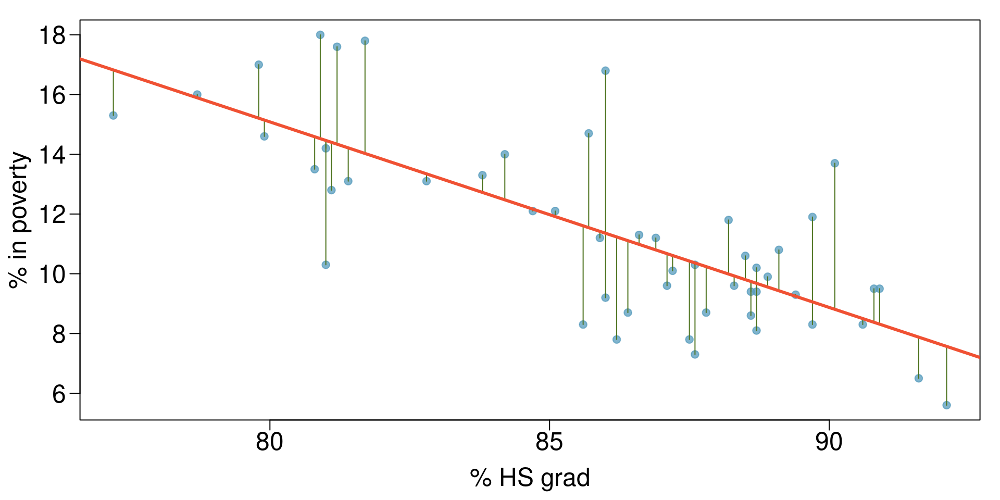</p>
</figure>

</div>
::::
:::::
:::::::

### A 4

::::::: columns
::: {.column style="width:50%;"}
A residual is the difference between the observed $y_i$ and predicted $\hat{y}\_i$.

$$\epsilon_i = y_i - \hat{y}\_i$$

-   living in poverty in DC is 5.44% more than predicted.

-   living in poverty in RI is 4.16% less than predicted.
:::

::::: {.column style="width:50%;"}
:::: cell
<div>

<figure>
<p>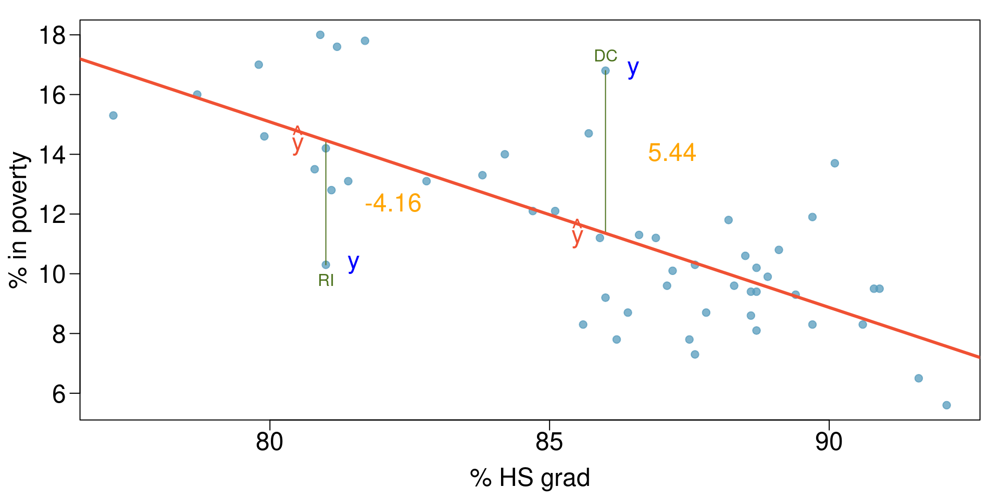</p>
</figure>

</div>
::::
:::::
:::::::

### A 5

How far off will that single estimate of $\hat{\mu}$ be?

-   In general, we answer this question by computing the standard error of $\hat{\mu}$, written as $SE(\hat{\mu})$.

We have the well-known formula:

$$Var(\hat{\mu}) = SE(\hat{\mu})^2 = \frac{\sigma^2}{n}$$ where $\sigma$ is the standard deviation of each of the realizations $y_i$ of $Y$.

Roughly speaking, the **standard error** tells us the average amount that this estimate $\hat{\mu}$ differs from the actual value of $\mu$.

The previous equation also tells us how this deviation shrinks with $n$ --- **the more observations** we have, **the smaller the standard error** of $\hat{\mu}$.

### A 6

In a similar vein, we can wonder how close $\hat{\beta}\_0$ and $\hat{\beta}\_1$ are to the true values $\beta_0$ and $\beta_1$?

-   To compute the standard errors associated with $\hat{\beta}\_1$, it comes down to the following formula:

$$ SE(\hat{\beta_1}) $$

### A 7

**Models: Assessing the adequacy of the coefficient estimates**

Standard errors can be used to compute our *confidence intervals*, i.e. that the true value of $\beta_1$, will within this interval with a 95% chance:

$$ \hat{\beta}\_1 - 1.96 \times SE(\hat{\beta}\_1),~\hat{\beta}\_1 + 1.96 \times SE(\hat{\beta}\_1) $$

Standard errors can also be used for *hypothesis tests*:

$$ H_0:~\beta_1=0 $$

$$ H_1:~\beta_1 \neq 0 $$

As already seen, we compute the the t-statistic, which measures the number of standard deviations that $\hat{\beta}\_1$ is away from 0 (see p-values from last session):

$$ t=\frac{\hat{\beta}\_1-0}{SE(\hat{\beta}\_1)} $$
:::::::::::::


:::::::: panel-tabset
### adequacy M 1

Assessing the **adequacy of the model** now:

Once we have rejected the null hypothesis in favor of the alternative hypothesis, we want to quantify the *extent to which the model fits the data*.

For that, we use:

-   the *residual standard error*, and

-   the $R^2$ statistic.

### AM 2

The RSE is an estimate of the standard deviation of $\epsilon$.

> Definition: It is the average amount that the response will deviate from the true regression line.

$$ RSE = \sqrt{\frac{RSS}{n-2}} = \sqrt{\frac{\sum\_{i=1}^{n}(y_i-\hat{y}\_i)^2}{n-2}} $$

recall:

$$ RSS= \sum\_{i=1}^{n}(y_i-\hat{y}\_i)^2 $$

### AM 3

::::::: columns
::: {.column style="width:50%;"}
Let's define TSS as the **total sum of squares**.

$$ TSS = \sum\_{i=1}^{n}(y_i - \bar{y})^2 $$

-   TSS measures the total variance in the response Y.

> Definition: The $R^2$ statistic is the proportion of variance explained.

To calculate $R^2$, we use the formula:

$$R^2 = \frac{TSS - RSS}{TSS} = 1 - \frac{RSS}{TSS}$$

-   It tells us what percent of variability in the dependent variable is explained by the model.

-   The remainder of the variability is explained by variables not included in the model or by inherent randomness in the data.
:::

::::: {.column style="width:50%;"}
:::: cell
<div>

<figure>
<p></p>
</figure>

</div>
::::
:::::
:::::::
::::::::

## Goodness-of-Fit --- $R^2$

$$ R^2 = 1 - \frac{RSS}{TSS} $$

-   Proportion of variance in Y explained by the model.
-   Example: $R^2$ = 0.62 means 62% of variance explained.

Limitation: $R^2$ always increases with more predictors.

Visual: bar chart comparing variance explained ($R^2$) across models.

## Adjusted $R^2$ and RSE

-   **Adjusted $R^2$:** corrects for number of predictors.
-   **RSE (Residual Standard Error):** average deviation from regression line.

::::::: cell
``` {.sourceCode .numberSource .python .number-lines .code-with-copy}
# In the VS Codium terminal, with .venv active:  python
import qmib
import statsmodels.formula.api as smf

core = qmib.load("core")
d = core.dropna(subset=["gdp_pc_eur", "productivity_idx"])

# the model Session 02 fitted — now we ask whether it can be trusted
fit = smf.ols("gdp_pc_eur ~ productivity_idx", data=d).fit()
fit.rsquared_adj
```

```text
[1] 0.5487727
```

``` {.sourceCode .numberSource .python .number-lines .code-with-copy}
import numpy as np

np.sqrt(fit.mse_resid)      # residual standard error
```

```text
[1] 2.08183
```
:::::::

Interpretation:

-   Adjusted $R^2$ can *decrease* if irrelevant variables are added.
-   RSE gives an absolute measure, in units of Y.


::::::::::::: panel-tabset
### Quiz

::::::: columns
::: {.column style="width:50%;"}
Which of the below is the correct interpretation of $R^2 = 0.38$?

-   38% of the variability in the % of HG graduates among the 51 states is explained by the model.

-   38% of the variability in the % of residents living in poverty among the 51 states is explained by the model.

-   38% of the time % HS graduates predict % living in poverty correctly.

-   62% of the variability in the % of residents living in poverty among the 51 states is explained by the model.
:::

::::: {.column style="width:50%;"}
:::: cell
<div>

<figure>
<p>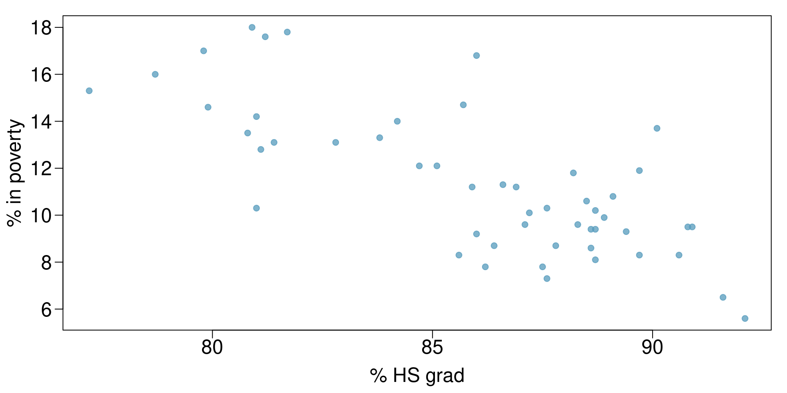</p>
</figure>

</div>
::::
:::::
:::::::

### Answer

::::::: columns
::: {.column style="width:50%;"}
Which of the below is the correct interpretation of $R^2 = 0.38$?

-   38% of the variability in the % of HG graduates among the 51 states is explained by the model.

-   **38% of the variability in the % of residents living in poverty among the 51 states is explained by the model.**

-   38% of the time % HS graduates predict % living in poverty correctly.

-   62% of the variability in the % of residents living in poverty among the 51 states is explained by the model.
:::

::::: {.column style="width:50%;"}
:::: cell
<div>

<figure>
<p></p>
</figure>

</div>
::::
:::::
:::::::
:::::::::::::

## Models: assessing the validity

## Models: assessing the validity

-   1.  Linearity
-   2.  Nearly normal residuals
-   3.  Constant variability


:::::::::: panel-tabset
### Validity: Linearity 1

-   The relationship between the explanatory and the dependent variable should be linear.

> Check using a scatterplot of the data, or a residuals plot.

:::: cell
<div>

<figure>
<p>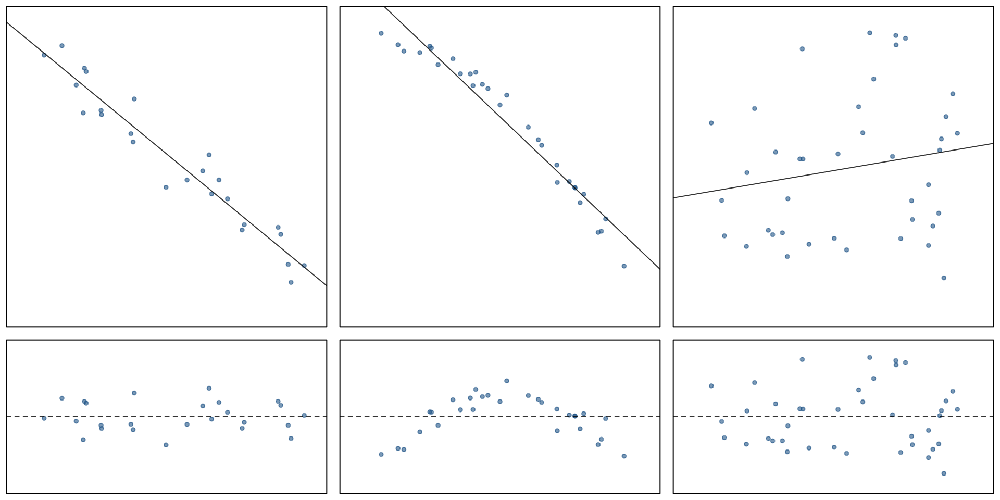</p>
</figure>

</div>
::::

### V: L 2

**Anatomy of a residuals plot**

::::::: columns
::: {.column style="width:50%;"}
$$\%~HSgrad = 81\%~\&~\%~in~poverty = 10.3$$

$$\widehat{\%~in~poverty} = 64.68 - 0.62 \times 81 = 14.46$$

$$\epsilon = {\%~in~poverty} - \widehat{\%~in~poverty}$$

$$\epsilon = 10.3 - 14.46 = -4.16$$

$$\%~HSgrad = 86\%~\&~\%~in~poverty = 16.8$$

$$\widehat{\%~in~poverty} = 64.68 - 0.62 \times 86 = 11.36$$

$$\epsilon = {\%~in~poverty} - \widehat{\%~in~poverty}$$

$$\epsilon = 16.8 - 11.36 = 5.44$$
:::

::::: {.column style="width:50%;"}
:::: cell
<div>

<figure>
<p>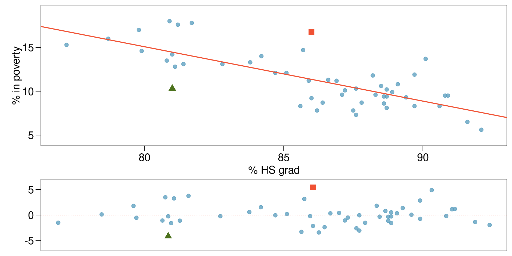</p>
</figure>

</div>
::::
:::::
:::::::

### V: L 3

-   The relationship between predictors and outcome should be linear.
-   Violations show up as **curved patterns** in residuals.

Remedies: add polynomial terms, interactions, or reconsider functional form.
::::::::::


**Validity: Nearly Normal Residuals**

::::::: columns
::: {.column style="width:50%;"}
-   The residuals should be nearly normal.

-   This condition may not be satisfied when there are unusual observations that don't follow the trend of the rest of the data.

> Check using a histogram.
:::

::::: {.column style="width:50%;"}
:::: cell
<div>

<figure>
<p>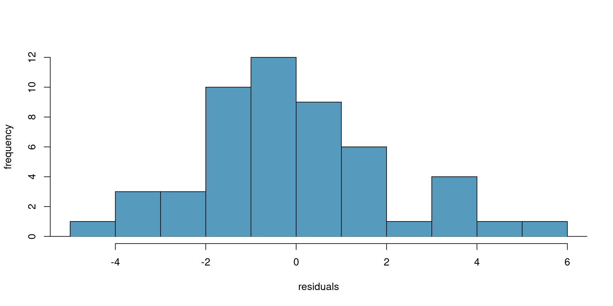</p>
</figure>

</div>
::::
:::::
:::::::

## Normality of Residuals

-   Errors should be normally distributed.
-   Important for valid t-tests and confidence intervals.

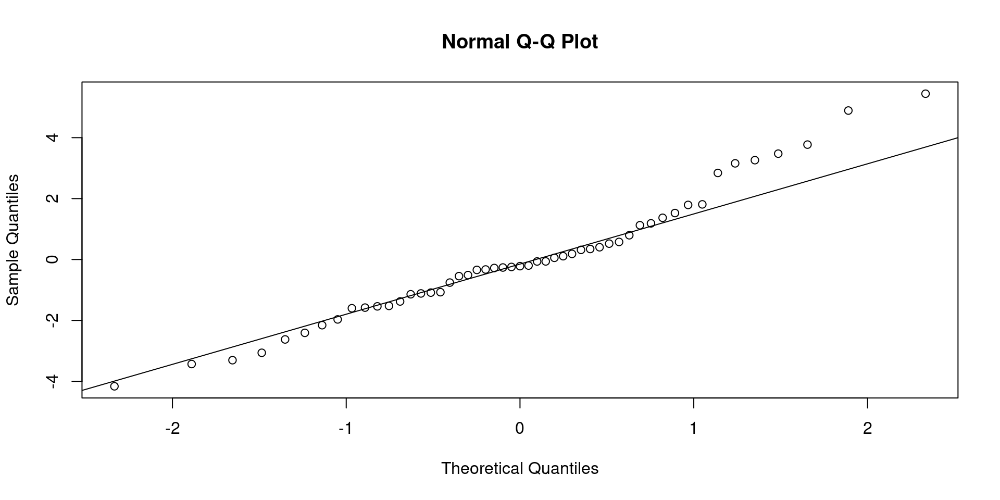{.r-stretch width="960"}

Visual: Q-Q plot --- left = good (points on line), right = heavy tails.


::::::::::: panel-tabset
### Homoscedasticity (Equal Variance)

-   Residuals should have **constant variance** across fitted values.
-   Violation = *heteroscedasticity* (funnel shape).

::::: cell
``` {.sourceCode .numberSource .python .number-lines .code-with-copy}
import matplotlib.pyplot as plt

# Scale-Location: is the spread of the residuals constant?
plt.scatter(fit.fittedvalues, np.sqrt(np.abs(fit.get_influence().resid_studentized_internal)),
            s=12, alpha=0.6)
plt.xlabel("Fitted values"); plt.ylabel("sqrt(|standardised residual|)")
plt.show()
```

<div>

<figure>
<p>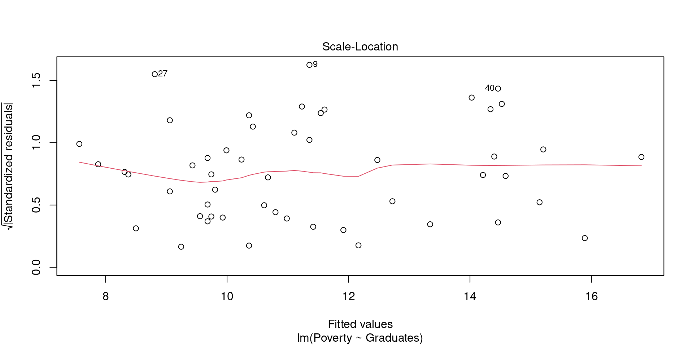</p>
</figure>

</div>
:::::

Remedies: transform Y, add missing predictors, or use robust errors.

### Validity: Constant Variability

::::::: columns
::: {.column style="width:50%;"}
-   The variability of points around the least squares line should be roughly constant.

-   This implies that the variability of residuals around the 0 line should be roughly constant as well.

-   Also called homoskedasticity.

> Check using a residuals plot.
:::

::::: {.column style="width:50%;"}
:::: cell
<div>

<figure>
<p>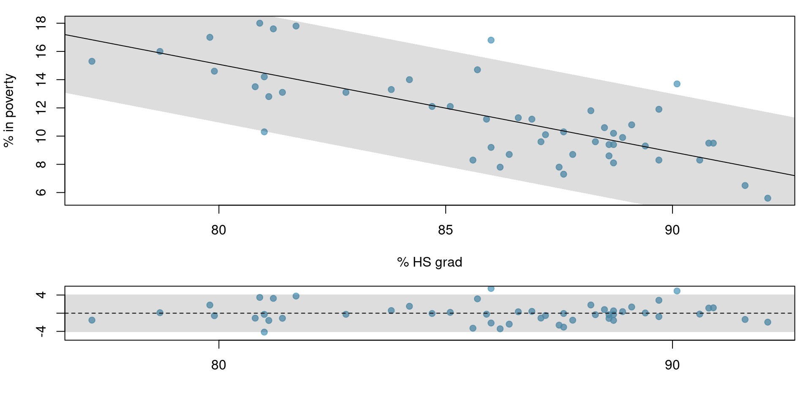</p>
</figure>

</div>
::::
:::::
:::::::
:::::::::::

## The Window Into Model Adequacy

Residual = observed $y_i$ -- predicted $\hat{y}\_i$.

-   Residuals contain all the information the model *did not explain*.\
-   Checking them reveals whether assumptions of linear regression hold.

:::: cell
``` {.sourceCode .numberSource .python .number-lines .code-with-copy}
# Residuals vs Fitted: is there structure the straight line missed?
plt.scatter(fit.fittedvalues, fit.resid, s=12, alpha=0.6)
plt.axhline(0, color="black", lw=1)
plt.xlabel("Fitted values"); plt.ylabel("Residuals")
plt.show()
```
::::

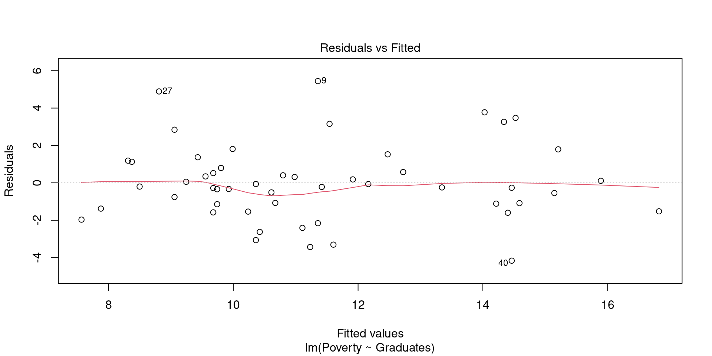{.r-stretch width="960"}

Visual: Residuals scattered randomly vs. curved pattern.


:::::::::::::::::: panel-tabset
### Quiz 1

::::: columns
::: {.column style="width:50%;"}
What condition is this linear model obviously violating?

-   Constant variability

-   Relationship

-   Normal residuals

-   No extreme outliers
:::

::: {.column style="width:50%;"}
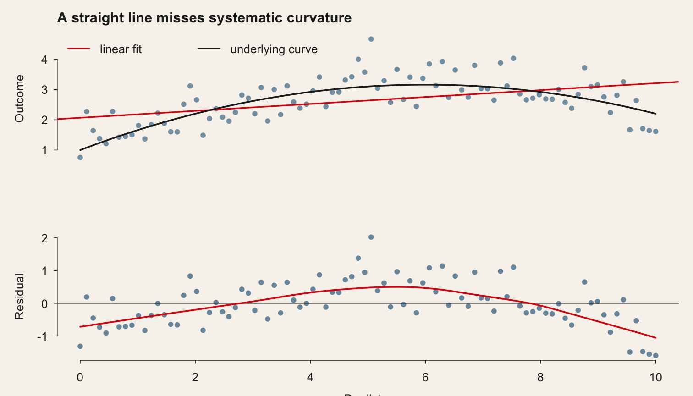{.r-stretch}
:::
:::::

### Answer

:::::: columns
::: {.column style="width:50%;"}
What condition is this linear model obviously violating?

-   Constant variability

-   **Relationship**

-   Normal residuals

-   No extreme outliers
:::

:::: {.column style="width:50%;"}
<figure>
<p></p>
</figure>
::::
::::::

### Quiz 3

:::::: columns
::: {.column style="width:50%;"}
What condition is this linear model obviously violating?

-   Constant variability

-   Linear relationship

-   Normal residuals

-   No extreme outliers
:::

:::: {.column style="width:50%;"}
<figure>
<p>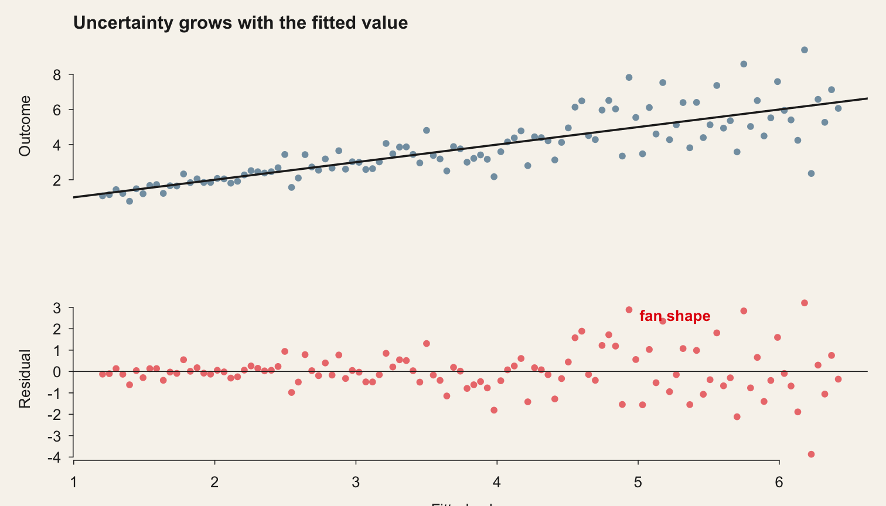</p>
</figure>
::::
::::::

### Answer

:::::: columns
::: {.column style="width:50%;"}
What condition is this linear model obviously violating?

-   **Constant variability** = heteroskedastic = non-homoskedastic

-   Linear relationship

-   Normal residuals

-   No extreme outliers
:::

:::: {.column style="width:50%;"}
<figure>
<p></p>
</figure>
::::
::::::
::::::::::::::::::

## Models: assessing the validity

::: {style="text-align:center"}
[Correlation and Regression Game](http://shiny.calpoly.sh/Corr_Reg_Game/)
:::

## Model Robustness/Parsimony and Selection

## Outliers vs. Influential Observations

-   **Outlier:** unusual Y given X.
-   **Leverage point:** unusual X values.
-   **Influential:** changes regression coefficients significantly.

Visual schematic: regression line with one leverage point pulling the slope.

## Leverage

-   Leverage measures how far X is from its mean.
-   Average leverage = (p+1)/n.

:::::: cell
``` {.sourceCode .numberSource .python .number-lines .code-with-copy}
influence = fit.get_influence()
leverage = influence.hat_matrix_diag

print(f"mean leverage {leverage.mean():.4f}, max {leverage.max():.4f}")
print(f"rule of thumb 2p/n = {2 * 2 / len(d):.4f}")
```

```text
         1          2          3          4          5          6          7 
0.07341971 0.04993531 0.02665514 0.05725104 0.05436305 0.03001853 0.02279856 
         8          9         10         11         12         13         14 
0.03001853 0.01960804 0.02208673 0.02080544 0.02852708 0.02650600 0.01962584 
        15         16         17         18         19         20         21 
0.01982498 0.03920450 0.02925840 0.03446830 0.07519505 0.02010632 0.02324176 
        22         23         24         25         26         27         28 
0.02131389 0.02324176 0.06459559 0.05296228 0.02715088 0.04368563 0.05263687 
        29         30         31         32         33         34         35 
0.01985210 0.07300617 0.01965889 0.04639058 0.02433662 0.05024716 0.03920450 
        36         37         38         39         40         41         42 
0.02164184 0.01974787 0.02074443 0.01960804 0.05579264 0.05873826 0.03001853 
        43         44         45         46         47         48         49 
0.05579264 0.13146676 0.03614618 0.03162523 0.02421459 0.03334717 0.09662531 
        50         51 
0.02925840 0.05403087 
```

``` {.sourceCode .numberSource .python .number-lines .code-with-copy}
# Residuals vs Leverage — the points with the power to move the line
plt.scatter(leverage, influence.resid_studentized_internal, s=12, alpha=0.6)
plt.axvline(2 * 2 / len(d), color="red", ls="--")
plt.xlabel("Leverage"); plt.ylabel("Standardised residual")
plt.show()
```
::::::

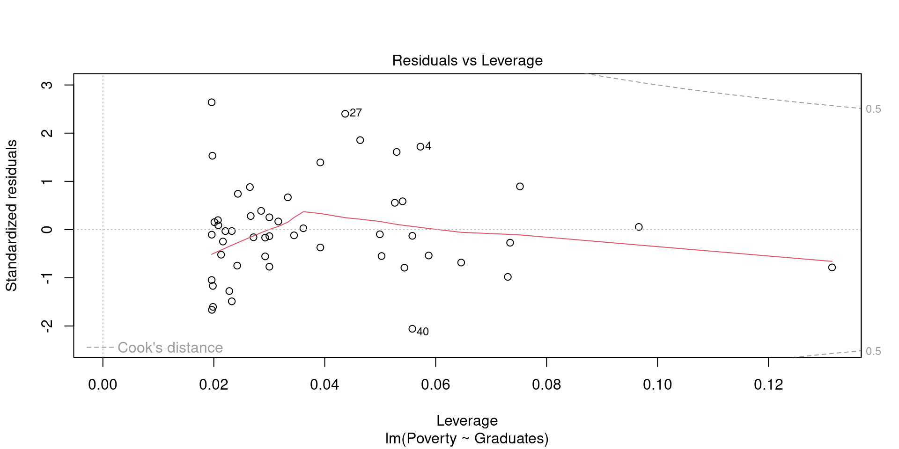{.r-stretch width="960"}

> Leverage matters because a data point with unusual predictor values can pull the regression line toward itself, changing the story the model tells.

## Cook's Distance

-   Combines leverage + residual size.
-   High Cook's D = observation heavily influences coefficients.

:::::: cell
``` {.sourceCode .numberSource .python .number-lines .code-with-copy}
cooks_d = influence.cooks_distance[0]

print(f"largest Cook's D {cooks_d.max():.4f}")
print(f"above 4/n ({4/len(d):.4f}): {(cooks_d > 4/len(d)).sum()} observations")
```

```text
           1            2            3            4            5            6 
2.938419e-03 2.520652e-04 1.080616e-03 8.976295e-02 1.796106e-02 2.866052e-04 
           7            8            9           10           11           12 
1.897199e-02 9.177618e-03 6.974262e-02 1.088291e-05 8.528512e-05 2.213503e-03 
          13           14           15           16           17           18 
1.057503e-02 1.124157e-04 1.380196e-02 2.813797e-03 4.169181e-04 2.544101e-04 
          19           20           21           22           23           24 
3.257667e-02 2.418426e-04 2.635681e-02 2.955606e-03 1.093662e-05 1.616129e-02 
          25           26           27           28           29           30 
7.248277e-02 3.550370e-04 1.318111e-01 8.571111e-03 2.603736e-02 3.791864e-02 
          31           32           33           34           35           36 
2.779714e-02 8.375544e-02 6.863630e-03 7.974102e-03 3.957810e-02 6.807620e-04 
          37           38           39           40           41           42 
2.363512e-02 4.048523e-04 1.094319e-02 1.250869e-01 9.031568e-03 9.989553e-04 
          43           44           45           46           47           48 
4.971505e-04 4.663828e-02 1.398058e-05 4.636273e-04 6.941264e-03 7.721221e-03 
          49           50           51 
1.616635e-04 4.664654e-03 9.825004e-03 
```

``` {.sourceCode .numberSource .python .number-lines .code-with-copy}
plt.stem(cooks_d)
plt.axhline(4 / len(d), color="red", ls="--")
plt.xlabel("Observation"); plt.ylabel("Cook's distance")
plt.show()
```
::::::

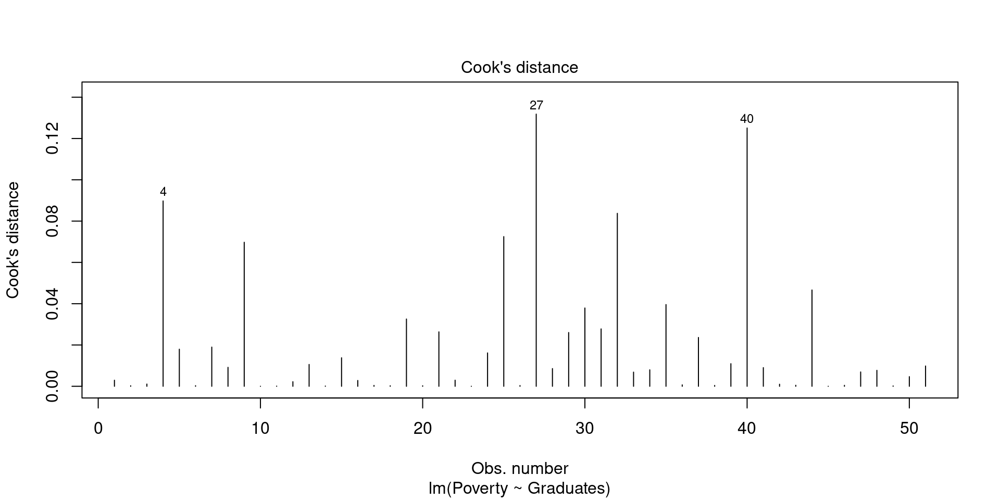{.r-stretch width="960"}

Cook's distance plot with threshold marked.

> Cook's distance matters because it shows which data points, if removed, would noticeably change the model's results.

## Information Criteria --- AIC

$$ AIC = -2\log(L) + 2k $$

-   Balances fit with penalty for number of parameters.
-   Lower AIC = better model (relative).

::::: cell
``` {.sourceCode .numberSource .python .number-lines .code-with-copy}
fit.aic
```

```text
[1] 223.4827
```
:::::

> AIC matters because it helps us avoid models that are too complicated by rewarding good fit but punishing unnecessary extra variables.

## Information Criteria --- BIC

$$ BIC = -2\log(L) + k\ln(n) $$

-   Similar to AIC but harsher penalty (depends on n).
-   Favors simpler models for large samples.

> BIC matters because it goes even further than AIC in preferring simpler models, especially when we have a lot of data.

## Stepwise Regression

-   Automated selection: forward, backward, or both.
-   Based on AIC (or BIC with k = log(n)).

:::::: cell
``` {.sourceCode .numberSource .python .number-lines .code-with-copy}
# Python has no step(); compare candidate models directly, which is
# clearer about what you are doing and why.
candidates = [
    "gdp_pc_eur ~ productivity_idx",
    "gdp_pc_eur ~ productivity_idx + gfcf_meur",
    "gdp_pc_eur ~ productivity_idx + gfcf_meur + employment_ths",
]
cols = ["gdp_pc_eur", "productivity_idx", "gfcf_meur", "employment_ths"]
dd = core.dropna(subset=cols)

for formula in candidates:
    m = smf.ols(formula, data=dd).fit()
    print(f"AIC {m.aic:9.1f}   adj R2 {m.rsquared_adj:.3f}   {formula}")
```

```text
Start:  AIC=76.75
Poverty ~ Graduates

            Df Sum of Sq    RSS     AIC
<none>                   212.37  76.751
- Graduates  1    267.88 480.25 116.366
```

```text
Call:
lm(formula = Poverty ~ Graduates, data = poverty)

Coefficients:
(Intercept)    Graduates  
    64.7810      -0.6212  
```
::::::

Magic exists... Your first entry into Machine Learning...

## Best Practices and Conclusion

## Key Aspects of Model Evaluation

-   Model Adequacy: $R^2$, Adjusted $R^2$, RSE.
-   Model Validity (Assumptions): Linearity, homoscedasticity, normality of residuals.
-   Model Robustness: Outliers, leverage, Cook's distance (sensitivity to unusual points).
-   Model Parsimony/Selection: AIC, BIC, stepwise methods.

## Best Practices

-   Check residuals first --- assumptions matter.
-   Use multiple fit criteria, not just $R^2$.
-   Always investigate influential points.
-   Use AIC/BIC to compare, but remember they are relative.
-   Stepwise is exploratory --- combine with theory.

Final message: **Balance predictive adequacy, interpretability, and parsimony.**

## Conclusion

## Conclusion

{.quarto-figure .quarto-figure-center .r-stretch style="width:90.0%"}

## One more thing...

::: cell
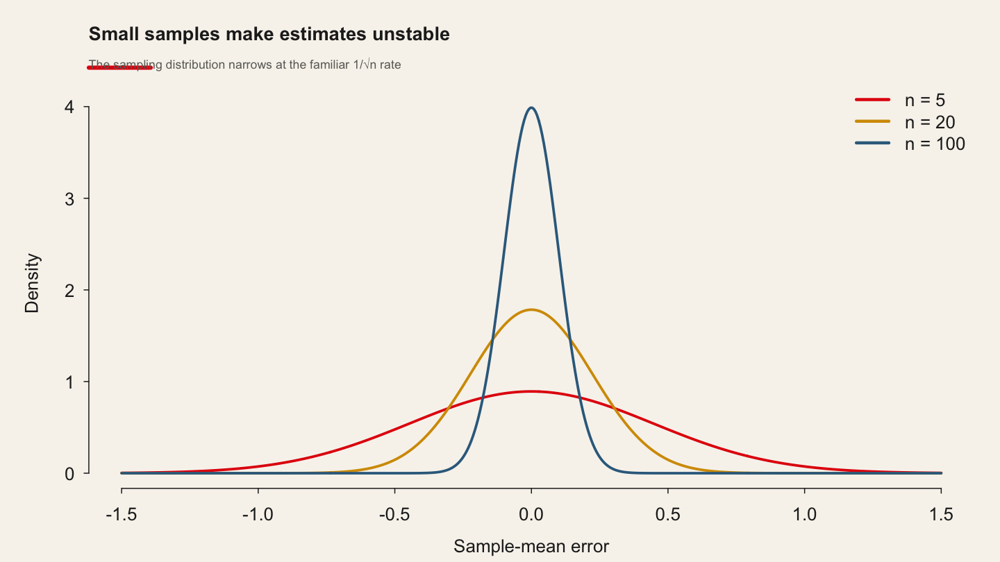{.r-stretch}
:::

https://blog.ephorie.de/the-most-dangerous-equation-or-why-small-is-not-beautiful?utm_source=rss&utm_medium=rss&utm_campaign=the-most-dangerous-equation-or-why-small-is-not-beautiful

## References

-   James, G., Witten, D., Hastie, T., & Tibshirani, R. (2021). *An Introduction to Statistical Learning with Applications in R* (2nd ed.). Springer.
-   Kutner, M. H., Nachtsheim, C. J., Neter, J., & Li, W. (2005). *Applied Linear Statistical Models* (5th ed.). McGraw-Hill Irwin.
-   Wooldridge, J. M. (2019). *Introductory Econometrics: A Modern Approach* (7th ed.). Cengage.

## In the practice

### Regression: Adequacy, Validity, and Robustness

> **[Open the practice slides](https://warint.github.io/quantitative-methods/session-03-practice.html)** ·
> source: [`MATH60033A-S03-Practice.qmd`](https://github.com/warint/quantitative-methods/blob/main/MATH60033A-S03-Practice.qmd)

---

#### The theme of this session

> # Which model would survive a referee?

All ten groups attack this question, each on **its own project**, and the last twenty minutes
assemble the answers.

---

#### What you are doing

The lecture showed the method on the session's dataset. You now apply it to **your own angle**, and
to the question your group is actually trying to answer
([`RESEARCH-MANDATES.md`](https://github.com/warint/quantitative-methods/blob/main/RESEARCH-MANDATES.md)).

The deliverable is not a printout. It is a **decision**, with the reason written down.

---

#### Before you start

Everyone in the group pushes at least once this session. Replace `XX` with your group number —
group 07 uses `group-07`.

```bash
git checkout -b group-XX
mkdir -p 03-regression-adequacy-and-validity/02-practice/submissions/group-XX
```

---

#### 1 · Reproduce one result from the paper — 20 min

Take the result the pre-session reading rests on, and reproduce it — or establish that you cannot,
and say precisely where it breaks. A failed reproduction that is diagnosed earns full marks; one
that is not attempted earns none.

The paper is **Amsili, van Es & Schindelbeck (2024), *Pedotransfer Functions for Field Capacity, Permanent Wilting Point, and Available Water Capacity***, and its replication package
([10.7910/DVN/U5DAEP](https://doi.org/10.7910/DVN/U5DAEP)) should already be unzipped at:

```text
03-regression-adequacy-and-validity/data/replication/
```

The session's own dataset, for comparison:

```python
import qmib
data = qmib.load("core")
```

---

#### 2 · Apply the method to your own angle — 35 min

```python
core = qmib.load("core")
mine = qmib.load("angle_c_country")     # your angle — see your dictionary
df   = core.merge(mine, on=["geo", "time"], how="inner")
```

Fit the session's method on your own data. Report what the lecture said to report, in the units of
your own variables.

---

#### 3 · Break one assumption — 15 min

Every method in this course rests on something. Find the assumption this one rests on hardest, break
it deliberately, and record what happened to your answer. **This is the part that carries the
marks.**

---

#### 4 · Write it down — 20 min

A 250-word note in your submissions folder:

- What you found, in units
- Which assumption you broke, and what it did
- What this result does **not** license you to claim

---

#### Submitting

```bash
git add 03-regression-adequacy-and-validity/02-practice/submissions/group-XX
git commit -m "Session 03 practice — group XX"
git push -u origin group-XX
```

Everyone pushes at least once. The log is the record of participation.

---

#### What loses marks

- Reporting $R^2$ without a single diagnostic plot
- Deleting an influential point without saying what it was
- Reading a residual plot as "looks fine" with no statement of what you looked for
- Choosing a model on AIC and reporting it as though the data selected it

---

[<- The lecture](#the-lecture) · [Session 03 overview](session-03.qmd)
