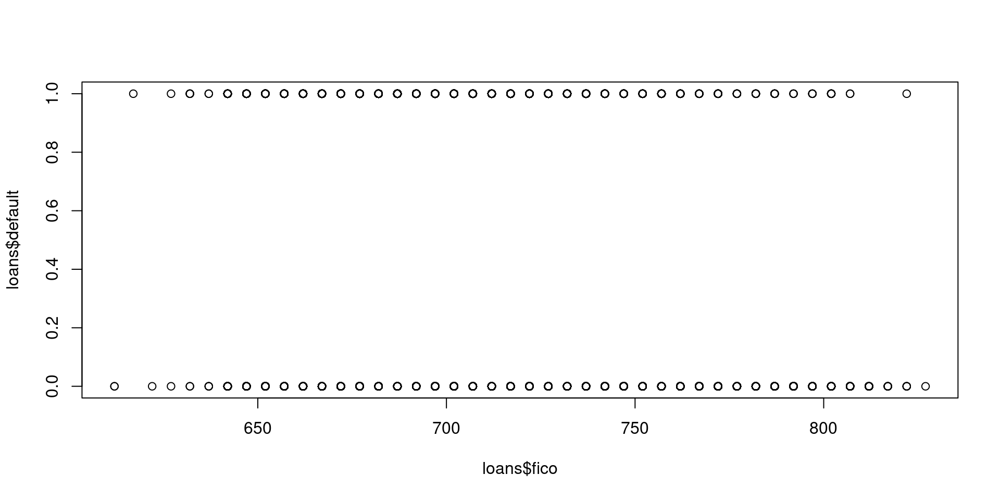
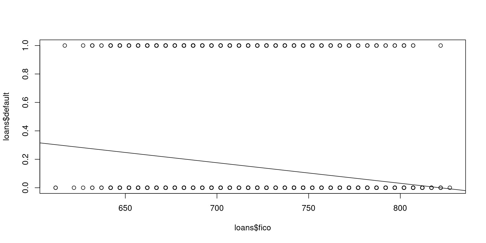
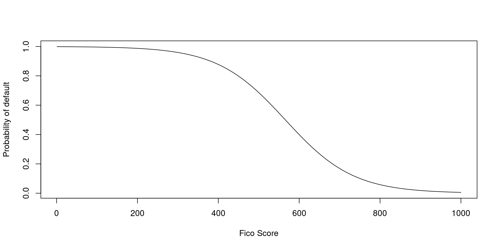
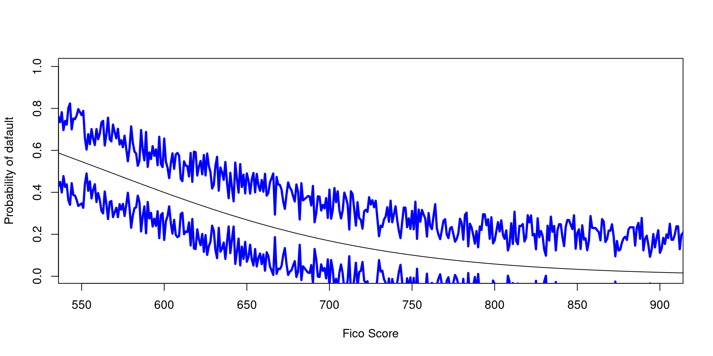
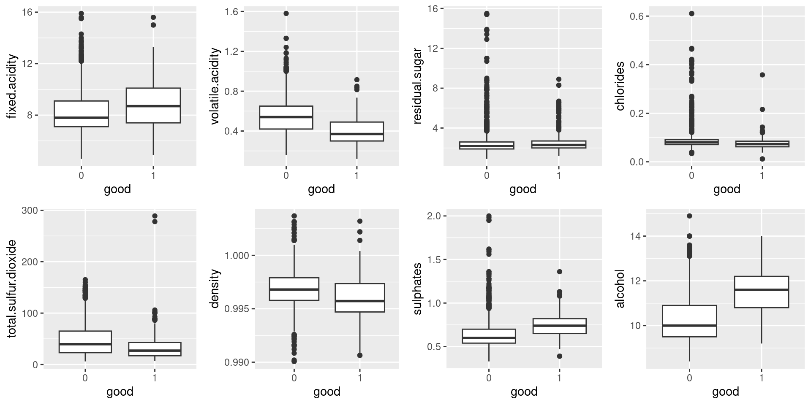
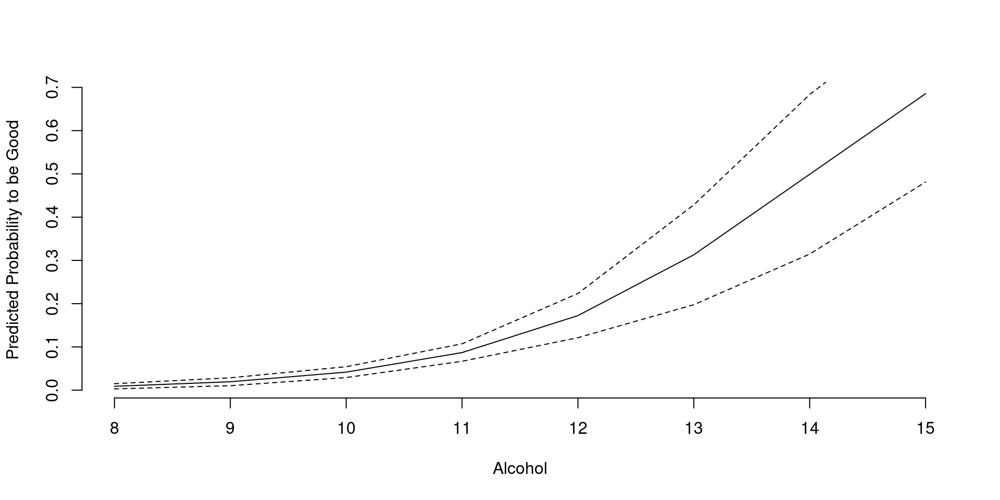
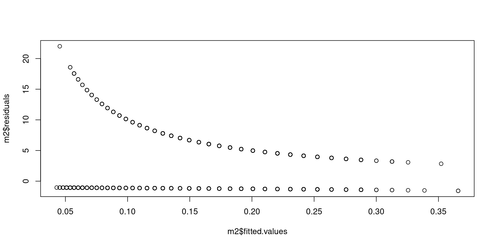
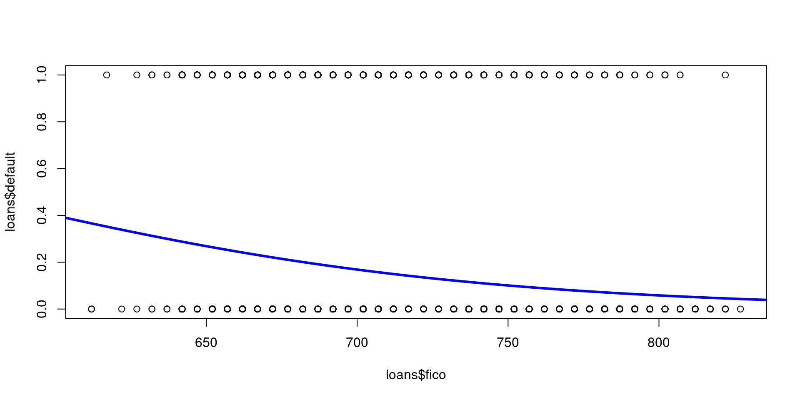
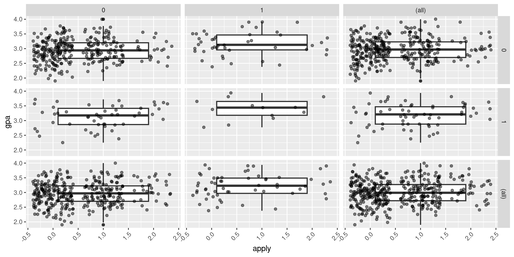

::: {.chapter-meta}
[Lecture slides](https://warint.github.io/quantitative-methods/session-04-lecture.html) · [Pre-session slides](https://warint.github.io/quantitative-methods/session-04-pre-session.html) · [Practice slides](https://warint.github.io/quantitative-methods/session-04-practice.html)
:::

> **The outcome is a category, not a number. Now what?**


| | |
|---|---|
| **Theme of the practice** | Can we predict a discrete outcome honestly? |
| **Reading** | Saganowski et al. (2019), *Analysis of group evolution prediction in complex networks* · [article](https://doi.org/10.1371/journal.pone.0224194) |
| **Replication package** | [10.7910/DVN/ONOFS7](https://doi.org/10.7910/DVN/ONOFS7) |
| **Data** | `qmib.load("loans")` — Lending Club — 9,578 three-year loans, FICO scores and default |


::: {.plate}
{fig-alt="Portrait of Pierre François Verhulst, 1804–1849."}

**Pierre François Verhulst** · 1804–1849

Named the logistic curve in 1845, modelling how populations stop growing.

[Flameng, Léopold, 1850. Public domain, via Wikimedia Commons.]{.plate-credit}
:::


## Before the session

> **The outcome is a category, not a number. Now what?**

> **[Open the pre-session slides](https://warint.github.io/quantitative-methods/session-04-pre-session.html)** ·
> source: [`MATH60033A-S04-Pre-Session.qmd`](https://github.com/warint/quantitative-methods/blob/main/MATH60033A-S04-Pre-Session.qmd)

Two things to do before class, and they are the two halves of the practice.
Budget **60–90 minutes**.

| | Before class | Used in the practice for |
|---|---|---|
| **1** | Read the paper | reproducing one of its results |
| **2** | Get both datasets | that, and applying the method to your own angle |

---

### 1. The reading — 45–60 min

**Saganowski et al. (2019), *Analysis of group evolution prediction in complex networks***
[Read the article](https://doi.org/10.1371/journal.pone.0224194)

Read for the **argument**, not for coverage:

| | What to look for |
|---|---|
| **1** | The research question, in one sentence |
| **2** | The method or design, and why they chose it |
| **3** | The strongest single piece of evidence |
| **4** | One limitation you would raise as a referee |

**Annotate as you go.** You will be asked what you underlined and why.

---

### 2. The data — 10 min

You need **two** datasets in the practice, and both should be on your machine before you arrive.

#### a) The paper's replication package

This is what you reproduce in the first twenty minutes of the practice.

**Harvard Dataverse: [10.7910/DVN/ONOFS7](https://doi.org/10.7910/DVN/ONOFS7)**

Download it once, and unzip it here — the folder is git-ignored, so nothing large is committed:

```text
04-logistic-ordinal-multinomial/data/replication/
```

Keep the authors' own folder structure and README.

#### b) The course data, for your own angle

This is what you apply the method to in the second half.

```python
import qmib

data = qmib.load("loans")      # what the lecture uses
core = qmib.load("core")                 # shared by every group
mine = qmib.load("angle_c_country")      # YOUR angle — see your dictionary

print(data.shape, core.shape, mine.shape)
```

Lending club — 9,578 three-year loans, fico scores and default.

> Run this **before** class. It downloads once and caches as parquet, so the practice works
> whatever the room's wifi is doing. `qmib.catalog()` lists everything available.

Your group's file, columns, units and traps are in your
[data dictionary](https://github.com/warint/quantitative-methods/blob/main/data/spine/dictionaries/).

---

### 3. Self-check — 15 min

Answer on paper. If you cannot, that is what the lecture is for.

1. In one sentence: what does this session's method let you claim that the previous one did not?
2. What must be true of your data for it to apply?
3. Which claim in the paper rests on this method — and how hard does it lean on it?

---

### Arrive with

- [ ] The paper read and annotated
- [ ] The replication package downloaded and unzipped
- [ ] `qmib.load()` run at least once, so the cache exists
- [ ] Your self-check answers, on paper

---

[Session 04 overview](session-04.qmd) · [The lecture](#the-lecture) ·
[The practice](#in-the-practice)

## The lecture

::: {.muted}
Delivered from [the slides](https://warint.github.io/quantitative-methods/session-04-lecture.html). What follows is the same material as prose.
:::

<!-- Source session 5 is taught as course session 4. Content is static so the deck renders without R or Python. -->

> The greatest adventure is what lies ahead. Today and tomorrow are yet to be said. The chances, the changes are all yours to make. The mold of your life is in your hands to break.

[J. R. R. Tolkien](https://en.wikipedia.org/wiki/J._R._R._Tolkien)

## Outline

-   Introduction
-   Business example (loan defaults)
-   Basics of logistic regression
-   Inference and goodness of fit
-   Comparing logistic models (χ² tests, AIC, stepwise)
-   Ordinal logistic regression
-   Multinomial logistic regression

## Learning objectives

By the end of this session:

-   students should be able to articulate the conceptual differences between linear and logistic regression for binary outcomes;

-   derive and interpret the logistic link, odds, log-odds, and odds ratios;

-   estimate simple and multiple logistic regression models in R and report coefficient estimates, standard errors, and confidence intervals;

-   compute and interpret predicted probabilities with associated uncertainty for specified covariate profiles; assess model fit using likelihood-based diagnostics, including McFadden's pseudo-R², and conduct inference using Wald tests and likelihood ratio (χ²) tests;

-   compare nested and non-nested specifications via likelihood ratio tests and AIC, including stepwise selection when appropriate;

-   generalize the binary logit to ordinal and multinomial settings and interpret coefficients within these frameworks;

-   and critically evaluate model assumptions, data limitations, and construct validity in applied international business research contexts.

## Introduction

## Introduction

:::: panel-tabset
### Reading

-   Musteen, Martina "[The influence of international networks on internationalization speed and performance: A study of Czech SMEs](https://www.sciencedirect.com/science/article/pii/S1090951609001138?via%3Dihub)", Journal of World Business, vol. 45 , no. 3

### Contrib

*The influence of international networks on internationalization speed and performance: A study of Czech SMEs*

-   **Speed of entry**: Firms with CEOs sharing a common language with international contacts internationalize faster.
-   **Performance**: Broader geographic diversity in networks improves outcomes; over-reliance on personal ties can hinder performance.
-   **Contribution**: Not all network ties are equally valuable --- structure, diversity, and quality of ties shape how SMEs succeed abroad.

### Hyp

-   CEOs' **international networks** influence both the **speed** of SME internationalization and the **performance** of the first foreign venture.
-   **Language commonality** between CEOs and their network partners accelerates international entry.
-   **Geographic diversity** of networks improves performance.
-   **Reliance on personal ties** may hinder performance by limiting access to diverse, novel resources.

### Models

-   Dependent variables:

    -   **Internationalization speed** (time until first foreign market entry).
    -   **Internationalization performance** (success of first international venture).

-   Independent variables:

    -   Network characteristics (language commonality, geographic diversity, reliance on personal ties, size of network).

-   Analytical framework: **social capital theory**; estimated with regression models on survey data from 155 Czech SMEs.

### Accuracy

-   Measures of accuracy focus on **statistical significance** of predictors and **model fit** in explaining variance in speed and performance.
-   Results show robust effects for language and diversity, but mixed/negative for personal ties.

### Validity

-   **Internal validity**: Reasonable given the focus on first internationalization and careful measurement of CEO networks.
-   **External validity**: Limited by context (Czech manufacturing SMEs in the late transition economy period).
-   **Construct validity**: Network measures are self-reported and retrospective, raising risks of recall bias.
-   **Conclusion validity**: Results support differentiated roles of network dimensions, but caution is needed in generalizing beyond early-stage internationalization.

### Conclusion

::: cell
```{dot}
digraph international_networks {

  graph [layout = dot, rankdir = LR]

  node [shape = box, fontname = Helvetica, style = filled, fillcolor = lightgrey]

  # Nodes
  language   [label = "Language Commonality"]
  diversity  [label = "Geographic Diversity"]
  personal   [label = "Reliance on Personal Ties"]
  speed      [label = "Speed of Internationalization"]
  performance[label = "Performance of First Venture"]

  # Edges with labels
  language   -> speed      [label = "faster entry", color = green, fontcolor = green]
  diversity  -> performance[label = "better outcomes", color = green, fontcolor = green]
  personal   -> performance[label = "weaker outcomes", color = red, fontcolor = red]

}
```
:::
::::

## Introduction

[Link to book](https://bookdown.org/roback/bookdown-BeyondMLR/)

## Introduction

::: cell
```{dot}
digraph a_nice_graph {

# node definitions with substituted label text
node [shape = box, fontname = Helvetica]
a [label = "Data Science"]
b [label = "Machine Learning"]
c [label = "Reinforcement Learning"]
d [label = "Supervised Learning"]
e [label = "Unsupervised Learning"]
f [label = "Classification"]
g [label = "Regression"]
h [label = "Generative Models"]
i [label = "Discriminative Models"]
j [label = "Logistic Regression"]

# edge definitions with the node IDs
a -> {b}
b -> {c, d, e}
d -> {f, g}
f -> {h, i}
i -> {j}

}
```
:::

## Introduction

As we saw in the two previous modules, linear regression allows us to model the relationship between a quantitative dependent variable Y and a set of independent variables.

> In this module we extend our modeling capabilities and learn how to model the relationship between a **binary dependent variable Y** (then ordinal, then multinomial) and a set of independent variables.

## Let's start with an example

## Lending Club

<https://www.lendingclub.com/>

-   Peer-to-peer network


:::::::::::::::::: panel-tabset
### 1

> Which loans are successfull and which one are not successful?

:::: cell
``` {.sourceCode .numberSource .python .number-lines .code-with-copy}
# In the VS Codium terminal, with .venv active:  python
import qmib

# One call. Downloaded once, then read from the local cache.
loans = qmib.load("loans")
loans.describe()
```
::::

### 2

-   We have data on 9,578 3-year loans that were funded through LendingClub.com between May 2007 and February 2010.

-   We have a variable called "default" that indicates that the loan was not paid back in full (the borrower either defaulted or the loan was "charged off," meaning the borrower was deemed unlikely to ever pay it back).

-   We also have the borrower's FICO (credit) score when they applied for the loan.

-   The dependent variable, $Y$, we want to model is "default" which measures whether or not the loan defaulted.

It is called a binary variable since it only takes on the values 0 or 1:

-   $default = 0$ indicates loan was paid back.
-   $default = 1$ indicates loan was not paid back.

### 3

When working with a binary dependent variable, a scatter plot is often not that useful.

:::: cell
``` {.sourceCode .numberSource .python .number-lines .code-with-copy}
# In the VS Codium terminal, with .venv active:  python
import qmib

# One call. Downloaded once, then read from the local cache.
loans = qmib.load("loans")
loans.describe()
```
::::

### 4

:::: cell
```text
 credit.policy     purpose             int.rate       installment    
 Min.   :0.000   Length:9578        Min.   :0.0600   Min.   : 15.67  
 1st Qu.:1.000   Class :character   1st Qu.:0.1039   1st Qu.:163.77  
 Median :1.000   Mode  :character   Median :0.1221   Median :268.95  
 Mean   :0.805                      Mean   :0.1226   Mean   :319.09  
 3rd Qu.:1.000                      3rd Qu.:0.1407   3rd Qu.:432.76  
 Max.   :1.000                      Max.   :0.2164   Max.   :940.14  
 log.annual.inc        dti              fico       days.with.cr.line
 Min.   : 7.548   Min.   : 0.000   Min.   :612.0   Min.   :  179    
 1st Qu.:10.558   1st Qu.: 7.213   1st Qu.:682.0   1st Qu.: 2820    
 Median :10.929   Median :12.665   Median :707.0   Median : 4140    
 Mean   :10.932   Mean   :12.607   Mean   :710.8   Mean   : 4561    
 3rd Qu.:11.291   3rd Qu.:17.950   3rd Qu.:737.0   3rd Qu.: 5730    
 Max.   :14.528   Max.   :29.960   Max.   :827.0   Max.   :17640    
   revol.bal         revol.util    inq.last.6mths    delinq.2yrs     
 Min.   :      0   Min.   :  0.0   Min.   : 0.000   Min.   : 0.0000  
 1st Qu.:   3187   1st Qu.: 22.6   1st Qu.: 0.000   1st Qu.: 0.0000  
 Median :   8596   Median : 46.3   Median : 1.000   Median : 0.0000  
 Mean   :  16914   Mean   : 46.8   Mean   : 1.577   Mean   : 0.1637  
 3rd Qu.:  18250   3rd Qu.: 70.9   3rd Qu.: 2.000   3rd Qu.: 0.0000  
 Max.   :1207359   Max.   :119.0   Max.   :33.000   Max.   :13.0000  
    pub.rec        not.fully.paid      default      
 Min.   :0.00000   Min.   :0.0000   Min.   :0.0000  
 1st Qu.:0.00000   1st Qu.:0.0000   1st Qu.:0.0000  
 Median :0.00000   Median :0.0000   Median :0.0000  
 Mean   :0.06212   Mean   :0.1601   Mean   :0.1601  
 3rd Qu.:0.00000   3rd Qu.:0.0000   3rd Qu.:0.0000  
 Max.   :5.00000   Max.   :1.0000   Max.   :1.0000  
```
::::

### 5

::::: cell
``` {.sourceCode .numberSource .python .number-lines .code-with-copy}
# In the VS Codium terminal, with .venv active:  python
import qmib

# One call. Downloaded once, then read from the local cache.
loans = qmib.load("loans")
loans.describe()
```

<div>

<figure>
<p></p>
</figure>

</div>
:::::

### 6

> If the only tool we have is a hammer, we are tempted to use it for every problem.

-   Let's see how linear regression would address this problem.

:::: cell
``` {.sourceCode .numberSource .python .number-lines .code-with-copy}
import statsmodels.formula.api as smf

# The linear probability model: a straight line through 0/1 outcomes
m1 = smf.ols("default ~ fico", data=loans).fit()
print(m1.summary())
```
::::

### 7

:::: cell
```text
Call:
lm(formula = default ~ fico, data = loans)

Residuals:
    Min      1Q  Median      3Q     Max 
-0.3029 -0.1945 -0.1512 -0.0789  1.0006 

Coefficients:
              Estimate Std. Error t value Pr(>|t|)    
(Intercept)  1.187e+00  6.946e-02   17.10   <2e-16 ***
fico        -1.445e-03  9.757e-05  -14.81   <2e-16 ***
---
Signif. codes:  0 '***' 0.001 '**' 0.01 '*' 0.05 '.' 0.1 ' ' 1

Residual standard error: 0.3626 on 9576 degrees of freedom
Multiple R-squared:  0.0224,    Adjusted R-squared:  0.0223 
F-statistic: 219.4 on 1 and 9576 DF,  p-value: < 2.2e-16
```
::::

### 8

Some observations:

-   Because the $p-value < 0.05$, FICO score is a significant predictor.

-   As FICO increases by 1 point, the average of the dependent variable decreases by $0.001445$.

> How do we interpret this in the case that Y only takes on 0 or 1 values?

### 9

:::: cell
<div>

<figure>
<p></p>
</figure>

</div>
::::

### 10

> We ran a linear regression, but what exactly are we modeling?

Recall that in the linear regression model we have:

$$ Y \approx N(\mu,~\sigma^2) $$

where

$$ \mu = \beta_0 + \beta_1 x $$

That is, the average of Y is modeled as a line.

### 11

The average of Y:

-   When Y only takes on $0$ or $1$ values, the linear regression model has an interesting interpretation.

In this case the linear regression model is equivalent to assuming:

$$ \pi = P(Y=1)=\beta_0+\beta_1x $$

### 12

Let's examine some predicted values from our regression model.

-   FICO score = 650, default probability = 0.25

$$\hat{y} = 1.187 - 0.001445(650) = 0.25$$

-   FICO score = 825, default probability = -0.005

$$\hat{y} = 1.187 - 0.001445(825) = -0.005$$

although a FICO score of 825 represents a great credit score, the probability can't be negative.

### Conclusion

-   If we model a binary dependent variable using linear regression, we are modeling probability as a linear relationship with a predictor.

-   Probabilities have to always be between 0 and 1, but the **linear regression model doesn't make this assumption**. So there is no guarantee predictions will make sense.

-   Probabilities computed by linear regressions can be negative or beyond 1.

> Fortunately there is another type of regression model better suited to model probabilities that we discuss now.
::::::::::::::::::

## The basics of logistic regression


::::::::::::: panel-tabset
### LR 1

Recall that a binary dependent variable can take on only one of two values; e.g. $Y = 0$ or $Y = 1$.

Conventionally $1$ represents a success and $0$ a failure, regardless of the outcome.

Examples of this type of variable in practice are:

-   $Y = 1$ if defaulted on loan, 0 otherwise.

-   $Y = 1$ if made online purchase, 0 otherwise.

-   $Y = 1$ if renewed car lease, 0 otherwise.

-   $Y = 1$ if employee promoted, 0 otherwise.

### LR 2

We showed in the previous segment that when a binary dependent variable is modeled using linear regression, the underlying model being estimated is

$$\pi = P(Y=1) = \beta_0 + \beta_1 x$$

As we saw, issues can arise when making predictions since this model does not prevent probabilities from being larger than 0 or less than 1.

### LR 3

Logistic regression is a way to model a binary dependent variable.

-   The logistic regression model states that:

$$ \pi = P(Y=1) = \frac{e^{(\beta_0+\beta_1x)}}{1+e^{(\beta_0+\beta_1x)}} $$

$$ \pi = P(Y=1) = \frac{1}{1+e^{-(\beta_0+\beta_1x)}} $$

### LR 4

:::::: columns
::: {.column style="width:50%;"}
The weird looking function is called the logistic function, and its purpose is to ensure that predictions will always be between 0 to 1.

It is called the S-shape function.
:::

:::: {.column style="width:50%;"}
<figure>
<p></p>
</figure>
::::
::::::

### LR 5

The logistic regression model can be estimated by the method of **maximum likelihood estimation**, a common approach for estimating parameters in statistical models.

-   The estimated probability that $Y = 1$ given $x$ is:

$$p = \frac{1}{1 + e^{-(b_0 + b_1 x)}}$$

-   $b_0$ is the estimate of $\beta_0$.

-   $b_1$ is the estimate of $\beta_1$.

### LR 6

For our loan default data, the R output from estimating a logistic regression is as follows:

:::: cell
``` {.sourceCode .numberSource .python .number-lines .code-with-copy}
# In the VS Codium terminal, with .venv active:  python
import qmib

# One call. Downloaded once, then read from the local cache.
loans = qmib.load("loans")
loans.describe()
```
::::

### LR 7

:::: cell
```text
Call:
glm(formula = default ~ fico, family = "binomial", data = loans)

Coefficients:
              Estimate Std. Error z value Pr(>|z|)    
(Intercept)  6.7188776  0.5768348   11.65   <2e-16 ***
fico        -0.0118775  0.0008231  -14.43   <2e-16 ***
---
Signif. codes:  0 '***' 0.001 '**' 0.01 '*' 0.05 '.' 0.1 ' ' 1

(Dispersion parameter for binomial family taken to be 1)

    Null deviance: 8424.0  on 9577  degrees of freedom
Residual deviance: 8196.1  on 9576  degrees of freedom
AIC: 8200.1

Number of Fisher Scoring iterations: 4
```
::::

### LR 8

Using the R output, the estimated equation for the probability of a loan default is:

$$ p = \frac{1}{1 + e^{-(6.72 - 0.012 x)}} $$

With this equation we can predict probability of loan default for any FICO score $x$.

### LR 9

-   Using the estimated equation, if someone's FICO score is 600 the probability of default is:

$$ p = \frac{1}{1 + e^{-(6.72 - 0.012 \times 600)}} = 0.38 $$

-   If someone's FICO score is 850 the probability of default is:

$$ p = \frac{1}{1 + e^{-(6.72 - 0.012 \times 850)}} = 0.03 $$

### LR 10

:::: cell
<div>

<figure>
<p></p>
</figure>

</div>
::::
:::::::::::::

## Let's use another example

## FICO Score

:::::::::::::::::: panel-tabset
### 1

::::: cell
``` {.sourceCode .numberSource .python .number-lines .code-with-copy}
# In the VS Codium terminal, with .venv active:  python
import qmib

# One call. Downloaded once, then read from the local cache.
loans = qmib.load("loans")
loans.describe()
```

```text
Call:
glm(formula = default ~ fico, family = "binomial", data = loans)

Coefficients:
              Estimate Std. Error z value Pr(>|z|)    
(Intercept)  6.7188776  0.5768348   11.65   <2e-16 ***
fico        -0.0118775  0.0008231  -14.43   <2e-16 ***
---
Signif. codes:  0 '***' 0.001 '**' 0.01 '*' 0.05 '.' 0.1 ' ' 1

(Dispersion parameter for binomial family taken to be 1)

    Null deviance: 8424.0  on 9577  degrees of freedom
Residual deviance: 8196.1  on 9576  degrees of freedom
AIC: 8200.1

Number of Fisher Scoring iterations: 4
```
:::::

### 2

The estimate $b_1 = - 0.0119$ is difficult to interpret exactly.

But an important question is whether the data provide evidence that $\beta_1 \neq 0$, which would imply that FICO scores are related to the probability of a loan default.

We could construct a confidence interval for $\beta_1$ using the same approach as we did with linear regression.

$$ b_1 \pm 1.96 \times SE(b_1) $$

-   Usually difficult to make sense out of the exact set of values.

-   However, we can assess whether $\beta_1$ is positive or negative through a confidence interval.

### 3

::::::: columns
::::: {.column style="width:50%;"}
:::: cell
```text
Call:
glm(formula = default ~ fico, family = "binomial", data = loans)

Coefficients:
              Estimate Std. Error z value Pr(>|z|)    
(Intercept)  6.7188776  0.5768348   11.65   <2e-16 ***
fico        -0.0118775  0.0008231  -14.43   <2e-16 ***
---
Signif. codes:  0 '***' 0.001 '**' 0.01 '*' 0.05 '.' 0.1 ' ' 1

(Dispersion parameter for binomial family taken to be 1)

    Null deviance: 8424.0  on 9577  degrees of freedom
Residual deviance: 8196.1  on 9576  degrees of freedom
AIC: 8200.1

Number of Fisher Scoring iterations: 4
```
::::
:::::

::: {.column style="width:50%;"}
-   95% confidence interval for $\beta_1$:

$$ -.0119 \pm 1.96 \times (0.000823) $$

$$ = (-0.0119 - 0.001646, - 0.0119 + 0.001646) $$

$$ = (-0.0135, -0.0103) $$
:::
:::::::

### 4

we are usually interested in the following test:

$$H_0: \beta_1 = 0$$

$$H_1: \beta_1 \neq 0$$

-   If we assume a significance level of $\alpha = 0.05$, then because the $p-value < 0.05$ we can reject the null hypothesis of $\beta_1 = 0$.

Therefore FICO score is a statistically significant predictor of the probability of a loan default.

### 5

Estimating $\pi$

> A natural type of question to ask is: What is the probability of a loan default for a FICO score of (say) 700?

-   As we have seen in the last segment, we can answer this from the formula of the **point estimate**, where $b_0$ and $b_1$ are the estimates of $\beta_0$ and $\beta_1$, and $x = 700$:

$$\pi = P(Y=1) = \frac{1}{1+e^{-(\beta_0+\beta_1x)}}$$

### 6

Instead of a point estimate of $\pi$, $p$, we can also compute a 95% confidence interval:

$$p \pm 1.96 \times SE(b_1)$$

The formula for SE(p) is complex, so we let R do the work:

::::: cell
``` {.sourceCode .numberSource .python .number-lines .code-with-copy}
import pandas as pd

pred = m2.get_prediction(pd.DataFrame({"fico": [700]})).summary_frame()
print(pred[["predicted", "ci_lower", "ci_upper"]].round(4))
```

```text
  Fit Lower Upper 
0.169 0.161 0.176 
```
:::::

The 95% confidence interval for $\pi$ is (0.161, 0.177).

> We are 95% confident that the probability that a borrower with a FICO score of 700 would default is between 0.161 and 0.177.

:::: cell
```text
                  2.5 %      97.5 %
(Intercept)  5.59461730  7.85621388
fico        -0.01350184 -0.01027486
```
::::

### 7

:::: cell
<div>

<figure>
<p></p>
</figure>

</div>
::::
::::::::::::::::::

## Inference and goodness of fit


:::::: panel-tabset
### IGF 1

In the last segment, we learned how to estimate the coefficients of a simple logistic regression and obtain predictions.

We now focus on:

-   **Hypothesis testing** for the coefficient of a predictor in logistic regression.

-   **Confidence intervals** for probabilities.

-   An **analogous measure** to $R^2$ in linear regression.

### IGF 2

Again, the simple logistic regression model is given by:

$$ \pi = P(Y=1) = \frac{1}{1+e^{-(\beta_0+\beta_1x)}} $$

-   We usually consider both confidence intervals and hypothesis tests for $\beta_1$ (btw, not $b_1$).

-   Because the value of $\beta_1$ is difficult to interpret, we will focus mainly on hypothesis testing for $\beta_1 = 0$.

### IGF 3

-   No agreed-upon method for summarizing goodness-of-fit for logistic regression.

-   The difficulty is that the notion of "percent variation explained" by the predictor is not as obvious as with linear regression.

### IGF 4

Various suggestions have been proposed -- we will use the pseudo-R2 measure (due to McFadden).

-   Logistic regression models are fitted using the method of maximum likelihood - i.e. the parameter estimates are those values which maximize the likelihood of the data which have been observed. McFadden's R squared measure is defined as:

$$ R^{2}\_{\text{McFadden}} = 1- \frac{log(L_c)}{log(L\_{\text{null}})} $$

-   where $L_c$ denotes the (maximized) likelihood value from the current fitted model, and $L\_{\text{null}}$ denotes the corresponding value but for the null model - the model with only an intercept and no covariates.

### IGF 5

This calculation looks similar to that of $R^2$ for linear regression.

-   Analysis of goodness-of-fit for loan default logistic regression:

::::: cell
``` {.sourceCode .numberSource .python .number-lines .code-with-copy}
m2 = smf.logit("default ~ fico", data=loans).fit()
null = smf.logit("default ~ 1", data=loans).fit()

# McFadden's pseudo R-squared
pseudo_r2 = 1 - m2.llf / null.llf
print(f"pseudo R2 = {pseudo_r2:.4f}")
```

```text
'log Lik.' 0.0271 (df=2)
```
:::::

Value is computed to be 0.0271

-   Very low pseudo-R2 -- roughly 2.7% of the "variation" explained by the FICO score.

-   Generally do not expect high $pseudo-R^2$ values.

-   Values as high as 0.4 or 0.5 indicate a very good fit for logistic regression.
::::::

## Let's see another example

## Portugal's Red Wines

-   Analogous to linear regression, logistic regression benefits from using multiple predictors simultaneously.

-   Pros and cons of multiple predictors:

    -   Greater accuracy in predictions

    -   Better use of data

    -   Much more difficult to visualize

    -   With large data, computing-intensive to fit


:::::::::::::::::::::::::::::::::::::: panel-tabset
### Wine 1

Can we use analytics to predict quality from physio-chemical content of red wine?

-   Data were collected on 1599 bottles of Portuguese red wines.

-   Each wine was evaluated by experts; wines were dichotomized into "bad" vs "good" based on quality.

### 2

:::: cell
``` {.sourceCode .numberSource .python .number-lines .code-with-copy}
import qmib

redwines = qmib.load("redwines")
redwines.describe()
```
::::

### 3

:::: cell
```text
 fixed.acidity   volatile.acidity residual.sugar     chlorides      
 Min.   : 4.60   Min.   :0.1200   Min.   : 0.900   Min.   :0.01200  
 1st Qu.: 7.10   1st Qu.:0.3900   1st Qu.: 1.900   1st Qu.:0.07000  
 Median : 7.90   Median :0.5200   Median : 2.200   Median :0.07900  
 Mean   : 8.32   Mean   :0.5278   Mean   : 2.539   Mean   :0.08747  
 3rd Qu.: 9.20   3rd Qu.:0.6400   3rd Qu.: 2.600   3rd Qu.:0.09000  
 Max.   :15.90   Max.   :1.5800   Max.   :15.500   Max.   :0.61100  
 total.sulfur.dioxide    density         sulphates         alcohol     
 Min.   :  6.00       Min.   :0.9901   Min.   :0.3300   Min.   : 8.40  
 1st Qu.: 22.00       1st Qu.:0.9956   1st Qu.:0.5500   1st Qu.: 9.50  
 Median : 38.00       Median :0.9968   Median :0.6200   Median :10.20  
 Mean   : 46.47       Mean   :0.9967   Mean   :0.6581   Mean   :10.42  
 3rd Qu.: 62.00       3rd Qu.:0.9978   3rd Qu.:0.7300   3rd Qu.:11.10  
 Max.   :289.00       Max.   :1.0037   Max.   :2.0000   Max.   :14.90  
     good          
 Length:1599       
 Class :character  
 Mode  :character  
                   
                   
                   
```
::::

### 4

::::: cell
``` {.sourceCode .numberSource .python .number-lines .code-with-copy}
import qmib

redwines = qmib.load("redwines")
redwines.describe()
```

```text
 [1] "No"  "No"  "No"  "No"  "No"  "No"  "No"  "Yes" "Yes" "No"  "No"  "No" 
[13] "No"  "No"  "No"  "No"  "Yes" "No"  "No"  "No" 
```
:::::

### 5

-   We will consider eight predictors listed above of good wine quality (No/Yes) for this example. We will let Y = 1 to represent "Yes" and Y = 0 to represent "No."

:::: cell
``` {.sourceCode .numberSource .python .number-lines .code-with-copy}
# qmib.load() already returns good as 0/1, so no recoding is needed.
redwines["good"].value_counts()
```
::::

### 6

::::::::: columns
::::: {.column style="width:50%;"}
:::: cell
``` {.sourceCode .numberSource .python .number-lines .code-with-copy}
import matplotlib.pyplot as plt

fig, axes = plt.subplots(1, 3, figsize=(11, 3.4))
for ax, col in zip(axes, ["fixed_acidity", "volatile_acidity", "alcohol"]):
    redwines.boxplot(column=col, by="good", ax=ax)
    ax.set_title(col); ax.set_xlabel("good")
plt.suptitle(""); plt.tight_layout(); plt.show()
```
::::
:::::

::::: {.column style="width:50%;"}
:::: cell
<div>

<figure>
<p></p>
</figure>

</div>
::::
:::::
:::::::::

### 7

We have predictors $x_1, x_2, x_3, ..., x_p$

Our model for the binary response is:

$$ \pi = P(Y=1) = \frac{1}{1+e^{-(\beta_0+\beta_1 x_1 + \beta_2 x_2 + ... + \beta_p x_p)}} $$

Same method to estimate the coefficients (i.e., the $\beta$s) by maximum likelihood estimation.

Similar goals:

-   Perform statistical inference for the $beta$s

-   Make probability predictions of the response based on predictor variable values

-   Slight difference comes in the interpretation of coefficients

### 8

:::: cell
``` {.sourceCode .numberSource .python .number-lines .code-with-copy}
predictors = ["fixed_acidity", "volatile_acidity", "residual_sugar", "chlorides",
              "total_sulfur_dioxide", "density", "sulphates", "alcohol"]

w1 = smf.logit("good ~ " + " + ".join(predictors), data=redwines).fit()
print(w1.summary())
```
::::

### 9

:::: cell
```text
Call:
glm(formula = good ~ fixed.acidity + volatile.acidity + residual.sugar + 
    chlorides + total.sulfur.dioxide + density + sulphates + 
    alcohol, family = "binomial", data = redwines)

Coefficients:
                       Estimate Std. Error z value Pr(>|z|)    
(Intercept)           2.268e+02  9.163e+01   2.475 0.013336 *  
fixed.acidity         2.812e-01  8.029e-02   3.502 0.000462 ***
volatile.acidity     -2.913e+00  6.467e-01  -4.504 6.66e-06 ***
residual.sugar        2.328e-01  7.009e-02   3.322 0.000893 ***
chlorides            -8.441e+00  3.259e+00  -2.590 0.009593 ** 
total.sulfur.dioxide -1.360e-02  3.447e-03  -3.946 7.95e-05 ***
density              -2.409e+02  9.202e+01  -2.618 0.008835 ** 
sulphates             3.699e+00  5.287e-01   6.997 2.62e-12 ***
alcohol               7.823e-01  1.120e-01   6.983 2.88e-12 ***
---
Signif. codes:  0 '***' 0.001 '**' 0.01 '*' 0.05 '.' 0.1 ' ' 1

(Dispersion parameter for binomial family taken to be 1)

    Null deviance: 1269.92  on 1598  degrees of freedom
Residual deviance:  872.08  on 1590  degrees of freedom
AIC: 890.08

Number of Fisher Scoring iterations: 6
```
::::

### 10

The estimated multiple logistic regression is therefore:

$$\pi = P(Y=1) = \frac{1}{1+e^{-(227 + 0.281 x_1 -0.291 x_2 + ... + 0.782 x_p)}}$$

A positive value of a coefficient means:

-   A one-unit increase in the predictor, holding the other predictors fixed, corresponds to an increase in the probability of "success."

A negative value of a coefficient means:

-   A one-unit increase in the predictor, holding the other predictors fixed, corresponds to an decrease in the probability of "success."

### 11

An increase in fixed acidity, residual sugar, sulphates, and alcohol content correspond to higher wine quality, holding all other variables fixed.

An increase in volatile acidity, chlorides, total sulfur dioxide and density correspond to lower wine quality, holding all other variables fixed.

### 12

:::: cell
```text
Call:
glm(formula = good ~ fixed.acidity + volatile.acidity + residual.sugar + 
    chlorides + total.sulfur.dioxide + density + sulphates + 
    alcohol, family = "binomial", data = redwines)

Coefficients:
                       Estimate Std. Error z value Pr(>|z|)    
(Intercept)           2.268e+02  9.163e+01   2.475 0.013336 *  
fixed.acidity         2.812e-01  8.029e-02   3.502 0.000462 ***
volatile.acidity     -2.913e+00  6.467e-01  -4.504 6.66e-06 ***
residual.sugar        2.328e-01  7.009e-02   3.322 0.000893 ***
chlorides            -8.441e+00  3.259e+00  -2.590 0.009593 ** 
total.sulfur.dioxide -1.360e-02  3.447e-03  -3.946 7.95e-05 ***
density              -2.409e+02  9.202e+01  -2.618 0.008835 ** 
sulphates             3.699e+00  5.287e-01   6.997 2.62e-12 ***
alcohol               7.823e-01  1.120e-01   6.983 2.88e-12 ***
---
Signif. codes:  0 '***' 0.001 '**' 0.01 '*' 0.05 '.' 0.1 ' ' 1

(Dispersion parameter for binomial family taken to be 1)

    Null deviance: 1269.92  on 1598  degrees of freedom
Residual deviance:  872.08  on 1590  degrees of freedom
AIC: 890.08

Number of Fisher Scoring iterations: 6
```
::::

### 13

Interpreting the magnitude of the coefficients:

-   As with simple logistic regression, the actual values of the estimated coefficients do have an interpretation, but they are not straightforward.

> It is more crucial to interpret when a coefficient is positive or negative.

### 14

The coefficients are called the log-odds

::::: cell
``` {.sourceCode .numberSource .python .number-lines .code-with-copy}
# Log-odds: the coefficients as fitted
w1.params
```

```text
         (Intercept)        fixed.acidity     volatile.acidity 
        226.75035047           0.28116907          -2.91283364 
      residual.sugar            chlorides total.sulfur.dioxide 
          0.23284320          -8.44080365          -0.01359982 
             density            sulphates              alcohol 
       -240.94649105           3.69873557           0.78225259 
```
:::::

### 15

To get the "odds", we just to take the exponential value of the coefficients:

::::: cell
``` {.sourceCode .numberSource .python .number-lines .code-with-copy}
import numpy as np

# Odds ratios: exponentiate. Above 1 raises the odds, below 1 lowers them.
np.exp(w1.params)
```

```text
         (Intercept)        fixed.acidity     volatile.acidity 
        2.995201e+98         1.324678e+00         5.432158e-02 
      residual.sugar            chlorides total.sulfur.dioxide 
        1.262184e+00         2.158766e-04         9.864922e-01 
             density            sulphates              alcohol 
       2.281752e-105         4.039619e+01         2.186392e+00 
```
:::::

> For one unit increase in alcohol, the odds of the wine being qualified as good increase by a factor of 2.18.

### 16

To get the predicted probabilities:

::::: cell
``` {.sourceCode .numberSource .python .number-lines .code-with-copy}
# Hold every other predictor at its mean and vary alcohol alone
grid = pd.DataFrame({c: [redwines[c].mean()] * 8 for c in predictors})
grid["alcohol"] = range(8, 16)

grid["p_good"] = w1.predict(grid)
print(grid[["alcohol", "p_good"]].round(3))
```

```text
          1           2           3           4           5           6 
0.009037878 0.019550710 0.041776513 0.087026502 0.172467214 0.313030560 
          7           8 
0.499065901 0.685360230 
```
:::::

### 17

To get the predicted probabilities:

:::: cell
``` {.sourceCode .numberSource .python .number-lines .code-with-copy}
# Hold every other predictor at its mean and vary alcohol alone
grid = pd.DataFrame({c: [redwines[c].mean()] * 8 for c in predictors})
grid["alcohol"] = range(8, 16)

grid["p_good"] = w1.predict(grid)
print(grid[["alcohol", "p_good"]].round(3))
```
::::

### 18

:::: cell
<div>

<figure>
<p></p>
</figure>

</div>
::::

### 19

Also we might want to know whether a coefficient is $0$ (i.e., whether the predictor is important).

Can formally address this question using hypothesis tests:

-   Interpretation: Each predictor individually is significant (at the α = 0.05 level) of wine quality relative to a model with all other predictors included.

There are no simple formulas for confidence intervals for the true probability, π, for a specific set of predictor values. But they are easily computable in R.

### 20

Consider a bottle of wine with the characteristics:

| fixed.acidity \| volatile.acidity \| residual.sugar \| chlorides

\|\|\|-\|\| \| 6.2 \| 0.36 \| 2.2 \| 0.095

| total.sulfur.dioxide \| density \| sulphates \| alcohol

\|-\|\|--\|-\| \| 42 \| 0.9946 \| 0.57 \| 11.7 \|

We can determine that the estimated probability that this wine is of good quality is 0.141.

By the way, this particular wine was rated as "not good" in the actual data set.

### 21

For wines with the following characteristics:

  fixed.acidity   volatile.acidity   residual.sugar   chlorides
  --------------- ------------------ ---------------- -----------
  6.2             0.36               2.2              0.095

  total.sulfur.dioxide   density   sulphates   alcohol
  ---------------------- --------- ----------- ---------
  42                     0.9946    0.57        11.7

A 95% confidence interval for $\pi$, the probability wine with these features would be rated good, is:

(0.089, 0.195)

> For wines with the listed physio-chemical composition, we are 95% confident that the probability of a "good" evaluation is between 0.089 and 0.195.

The pseudo-R2 can be computed for multiple logistic regression in the same way as in simple logistic regression.

> For the wine quality logistic regression, the pseudo-R2 is computed to be 0.313.

This suggests that a moderate amount of variability in the binary response can be explained by the physio-chemical predictors.
::::::::::::::::::::::::::::::::::::::

## Comparing logistic models

## Comparing logistic models

:::::::::::::::::::::::: panel-tabset
### Comparison 1

Recall that the simple logistic regression model used to model Y, a Bernoulli variable with probability of success $\pi$ is given by:

$$ \pi = P(Y=1) = \frac{1}{1+e^{-(\beta_0+\beta_1 x_1 + \beta_2 x_2 + ... + \beta_p x_p)}} $$

The estimates for the model then become:

$$ p = P(Y=1) = \frac{1}{1+e^{-(b_0+ b_1 x_1 + b_2 x_2 + ... + b_p x_p)}} $$

### 2

Residuals in logistic regression:

-   Residuals in logistic regression can then be calculated just like in linear regression:

$$e = y - p$$

Here, $p$ is the estimated probability of the response taking on the value 1, and $Y$ is either 0 or 1.

This results in the estimated residuals, $e$, only being able to take on two values for any predicted value.

### 3

::::::::: columns
::::: {.column style="width:50%;"}
Let us use our *loans* dataset.

:::: cell
``` {.sourceCode .numberSource .python .number-lines .code-with-copy}
# In the VS Codium terminal, with .venv active:  python
import qmib

# One call. Downloaded once, then read from the local cache.
loans = qmib.load("loans")
loans.describe()
```
::::
:::::

::::: {.column style="width:50%;"}
Below is the residual scatter plot for the logistic model predicting loan default from FICO score:

The pattern emerges because of the discreteness in the binary response.

:::: cell
<div>

<figure>
<p></p>
</figure>

</div>
::::
:::::
:::::::::

### 4

::::::::: columns
::::: {.column style="width:50%;"}
Because of this pattern (based on the response being binary), performing model diagnostics in logistic regression is not easy.

Using logistic regression as a predictive model is still valid.

:::: cell
``` {.sourceCode .numberSource .python .number-lines .code-with-copy}
grid = pd.DataFrame({"fico": range(550, 901)})
plt.scatter(loans["fico"], loans["default"], s=4, alpha=0.2)
plt.plot(grid["fico"], m2.predict(grid), color="blue", lw=3)
plt.xlabel("FICO"); plt.ylabel("P(default)")
plt.show()
```
::::
:::::

::::: {.column style="width:50%;"}
:::: cell
<div>

<figure>
<p></p>
</figure>

</div>
::::
:::::
:::::::::

### 5

Comparing logistic models is similar to the approach we took with linear regression.

-   If two models are nested, a formal significance test, the chi-squared test $\chi^2$, can be performed.

-   If two models are not nested, then Akaike Information Criterion (AIC) can be compared.

> Backward stepwise regression (using AIC) can be used to select a best predictive model.

### 6

We've seen that FICO score is predictive of whether a borrower defaults on a loan.

> Can we improve our model by using the purpose of the loan as an additional predictor?

The variable 'purpose' has 7 categories, so R will create 6 binary predictors to define it in a logistic regression model.

-   To determine if it is important, a single test for one coefficient is not possible since there are six of them, so we need a different approach.

### 7

#### Chi-squared test

Formally the hypotheses being tested in a chi-squared test in logistic regression are:

-   $H_0$: the $\beta$s associated with the extra variables are all zero

-   $H_1$: at least one of the extra $\beta$s is not zero.

> A large chi-squared statistic is in favor of the alternative hypothesis.

-   If the $p-value$ is small, then there is evidence to suggest that the extra variables are important.

-   The chi-squared test in logistic regression is the analog to the F-test in linear regression.

### 8

#### Chi-squared test

Comparing two models to predict defaulted loans in R:

:::: cell
``` {.sourceCode .numberSource .python .number-lines .code-with-copy}
m2 = smf.logit("default ~ fico", data=loans).fit()
m3 = smf.logit("default ~ fico + C(purpose)", data=loans).fit()
```
::::

:::: cell
``` {.sourceCode .numberSource .python .number-lines .code-with-copy}
from scipy import stats

# Likelihood-ratio test: does purpose earn its extra parameters?
lr = 2 * (m3.llf - m2.llf)
df = int(m3.df_model - m2.df_model)
print(f"chi2 = {lr:.2f}, df = {df}, p = {stats.chi2.sf(lr, df):.6f}")
```
::::

### 9

::::: cell
``` {.sourceCode .numberSource .python .number-lines .code-with-copy}
from scipy import stats

# Likelihood-ratio test: does purpose earn its extra parameters?
lr = 2 * (m3.llf - m2.llf)
df = int(m3.df_model - m2.df_model)
print(f"chi2 = {lr:.2f}, df = {df}, p = {stats.chi2.sf(lr, df):.6f}")
```

```text
Analysis of Deviance Table

Model 1: default ~ fico
Model 2: default ~ fico + purpose
  Resid. Df Resid. Dev Df Deviance  Pr(>Chi)    
1      9576     8196.1                          
2      9570     8077.9  6   118.16 < 2.2e-16 ***
---
Signif. codes:  0 '***' 0.001 '**' 0.01 '*' 0.05 '.' 0.1 ' ' 1
```
:::::

The chi-squared test has a very small p-value (certainly less than 0.0001).

> We can conclude that the purpose for their loan is an important predictor (beyond just FICO score).
::::::::::::::::::::::::

## Model selection


::::::::::::: panel-tabset
### Stepwise 1

Stepwise model selection can be used in logistic regression (just like in linear regression) using AIC as the criterion to choose the best predictive model.

The algorithm is the same. For backwards selection:

-   Start with the 'full' model

-   Remove the variable that would result in an model that improves AIC the most

-   Continue removing variables, one at a time, until AIC cannot be improved (smallest AIC).

### 2

To predict whether a borrower defaults on a loan, let's start with a 'full model' that uses the following predictors:

-   FICO score

-   Debt to income ratio (dti)

-   Annual income (on the log scale)

-   Interest rate

-   Purpose (7 categories: credit card, educational, etc.)

### 3

:::: cell
``` {.sourceCode .numberSource .python .number-lines .code-with-copy}
# Compare candidate models on AIC rather than running an automatic search:
# it is clearer what you chose, and why.
candidates = [
    "default ~ fico",
    "default ~ fico + int_rate",
    "default ~ fico + int_rate + log_annual_inc + dti",
]
for formula in candidates:
    m = smf.logit(formula, data=loans).fit(disp=0)
    print(f"AIC {m.aic:9.1f}   {formula}")
```
::::

### 4

:::: cell
```text
Call:
glm(formula = default ~ fico + dti + log.annual.inc + int.rate + 
    purpose, family = "binomial", data = loans)

Coefficients:
                           Estimate Std. Error z value Pr(>|z|)    
(Intercept)                4.697208   1.014115   4.632 3.62e-06 ***
fico                      -0.008248   0.001180  -6.990 2.74e-12 ***
dti                        0.005858   0.004299   1.363 0.172981    
log.annual.inc            -0.137702   0.048142  -2.860 0.004232 ** 
int.rate                   7.911574   1.567205   5.048 4.46e-07 ***
purposecredit_card        -0.470383   0.106820  -4.404 1.07e-05 ***
purposedebt_consolidation -0.261531   0.073679  -3.550 0.000386 ***
purposeeducational         0.125278   0.149362   0.839 0.401608    
purposehome_improvement    0.148847   0.123822   1.202 0.229321    
purposemajor_purchase     -0.388134   0.163949  -2.367 0.017913 *  
purposesmall_business      0.610618   0.114703   5.323 1.02e-07 ***
---
Signif. codes:  0 '***' 0.001 '**' 0.01 '*' 0.05 '.' 0.1 ' ' 1

(Dispersion parameter for binomial family taken to be 1)

    Null deviance: 8424.0  on 9577  degrees of freedom
Residual deviance: 8045.1  on 9567  degrees of freedom
AIC: 8067.1

Number of Fisher Scoring iterations: 5
```
::::

### 5

AIC was calculated to be 8067.1.

Looks like 'dti' is unimportant. Let's see what gets removed after performing a backward stepwise approach

### 6

:::: cell
``` {.sourceCode .numberSource .python .number-lines .code-with-copy}
# In the VS Codium terminal, with .venv active:  python
import qmib

# One call. Downloaded once, then read from the local cache.
loans = qmib.load("loans")
loans.describe()
```
::::

### 7

:::::: cell
```text
Call:
glm(formula = default ~ fico + dti + log.annual.inc + int.rate + 
    purpose, family = "binomial", data = loans)

Coefficients:
                           Estimate Std. Error z value Pr(>|z|)    
(Intercept)                4.697208   1.014115   4.632 3.62e-06 ***
fico                      -0.008248   0.001180  -6.990 2.74e-12 ***
dti                        0.005858   0.004299   1.363 0.172981    
log.annual.inc            -0.137702   0.048142  -2.860 0.004232 ** 
int.rate                   7.911574   1.567205   5.048 4.46e-07 ***
purposecredit_card        -0.470383   0.106820  -4.404 1.07e-05 ***
purposedebt_consolidation -0.261531   0.073679  -3.550 0.000386 ***
purposeeducational         0.125278   0.149362   0.839 0.401608    
purposehome_improvement    0.148847   0.123822   1.202 0.229321    
purposemajor_purchase     -0.388134   0.163949  -2.367 0.017913 *  
purposesmall_business      0.610618   0.114703   5.323 1.02e-07 ***
---
Signif. codes:  0 '***' 0.001 '**' 0.01 '*' 0.05 '.' 0.1 ' ' 1

(Dispersion parameter for binomial family taken to be 1)

    Null deviance: 8424.0  on 9577  degrees of freedom
Residual deviance: 8045.1  on 9567  degrees of freedom
AIC: 8067.1

Number of Fisher Scoring iterations: 5
```

```text
Start:  AIC=8067.13
default ~ fico + dti + log.annual.inc + int.rate + purpose

                 Df Deviance    AIC
- dti             1   8047.0 8067.0
<none>                8045.1 8067.1
- log.annual.inc  1   8053.3 8073.3
- int.rate        1   8070.4 8090.4
- fico            1   8095.5 8115.5
- purpose         6   8136.1 8146.1

Step:  AIC=8066.99
default ~ fico + log.annual.inc + int.rate + purpose

                 Df Deviance    AIC
<none>                8047.0 8067.0
- log.annual.inc  1   8055.4 8073.4
- int.rate        1   8073.9 8091.9
- fico            1   8098.9 8116.9
- purpose         6   8136.2 8144.2
```

```text
Call:
glm(formula = default ~ fico + log.annual.inc + int.rate + purpose, 
    family = "binomial", data = loans)

Coefficients:
                           Estimate Std. Error z value Pr(>|z|)    
(Intercept)                4.808434   1.007669   4.772 1.83e-06 ***
fico                      -0.008328   0.001175  -7.088 1.36e-12 ***
log.annual.inc            -0.138768   0.048014  -2.890 0.003850 ** 
int.rate                   8.114300   1.557021   5.211 1.87e-07 ***
purposecredit_card        -0.454342   0.106169  -4.279 1.87e-05 ***
purposedebt_consolidation -0.247504   0.072951  -3.393 0.000692 ***
purposeeducational         0.123510   0.149385   0.827 0.408357    
purposehome_improvement    0.145575   0.123755   1.176 0.239471    
purposemajor_purchase     -0.394170   0.163895  -2.405 0.016171 *  
purposesmall_business      0.604124   0.114593   5.272 1.35e-07 ***
---
Signif. codes:  0 '***' 0.001 '**' 0.01 '*' 0.05 '.' 0.1 ' ' 1

(Dispersion parameter for binomial family taken to be 1)

    Null deviance: 8424  on 9577  degrees of freedom
Residual deviance: 8047  on 9568  degrees of freedom
AIC: 8067

Number of Fisher Scoring iterations: 5
```
::::::

### 8

Removing 'dti' improved the AIC slightly (8067.1 to 8066.99).

We stop after dropping 'dti' because all other models with one fewer predictor have higher AIC.

Notice: 'purpose', with its six binary variables, is either entirely included or not included at all.
:::::::::::::

## Ordinal logistic regression

## Ordinal logistic regression

::::::::::::::::::::::::::::::: panel-tabset
### OLR 1

A study looks at factors that influence the decision of whether to apply to graduate school. College juniors are asked if they are unlikely, somewhat likely, or very likely to apply to graduate school. Hence, our outcome variable has three categories.

-   Data on parental educational status, whether the undergraduate institution is public or private, and current GPA is also collected. The researchers have reason to believe that the "distances" between these three points are not equal.

-   For example, the "distance" between "unlikely" and "somewhat likely" may be shorter than the distance between "somewhat likely" and "very likely".

:::: cell
``` {.sourceCode .numberSource .python .number-lines .code-with-copy}
import qmib

dat = qmib.load("ologit")
dat.head()
```
::::

### 2

::::::::::: columns
:::::: {.column style="width:50%;"}
::::: cell
``` {.sourceCode .numberSource .python .number-lines .code-with-copy}
dat.head()
```

```text
# A tibble: 6 × 4
  apply           pared public   gpa
  <chr>           <dbl>  <dbl> <dbl>
1 very likely         0      0  3.26
2 somewhat likely     1      0  3.21
3 unlikely            1      1  3.94
4 somewhat likely     0      0  2.81
5 somewhat likely     0      0  2.53
6 unlikely            0      1  2.59
```
:::::
::::::

:::::: {.column style="width:50%;"}
::::: cell
``` {.sourceCode .numberSource .python .number-lines .code-with-copy}
pd.crosstab([dat["public"], dat["pared"]], dat["apply"])
```

```text
                       pared   0   1
public apply                        
0      somewhat likely        98  26
       unlikely              175  14
       very likely            20  10
1      somewhat likely        12   4
       unlikely               25   6
       very likely             7   3
```
:::::
::::::
:::::::::::

### 3

:::: cell
``` {.sourceCode .numberSource .python .number-lines .code-with-copy}
# Keep the order — "unlikely" < "somewhat likely" < "very likely".
# An ordinal model needs the ordering, not just the labels.
order = ["unlikely", "somewhat likely", "very likely"]
dat["apply_c"] = pd.Categorical(dat["apply"], categories=order, ordered=True)
```
::::

### 4

:::: cell
<div>

<figure>
<p></p>
</figure>

</div>
::::

### 5

:::: cell
``` {.sourceCode .numberSource .python .number-lines .code-with-copy}
from statsmodels.miscmodels.ordinal_model import OrderedModel

om = OrderedModel(dat["apply_c"], dat[["pared", "public", "gpa"]],
                  distr="logit").fit(method="bfgs", disp=0)
print(om.summary())
```
::::

### 6

:::: cell
```text
Call:
polr(formula = as.factor(apply) ~ pared + public + gpa, data = dat, 
    Hess = TRUE)

Coefficients:
          Value Std. Error t value
pared   1.04769     0.2658  3.9418
public -0.05879     0.2979 -0.1974
gpa     0.61594     0.2606  2.3632

Intercepts:
    Value   Std. Error t value
0|1  2.2039  0.7795     2.8272
1|2  4.2994  0.8043     5.3453

Residual Deviance: 717.0249 
AIC: 727.0249 
```
::::

### 7

::::: cell
``` {.sourceCode .numberSource .python .number-lines .code-with-copy}
# Proportional-odds ratios
np.exp(om.params[["pared", "public", "gpa"]])
```

```text
    pared    public       gpa 
2.8510579 0.9429088 1.8513972 
```
:::::

Parental Education

-   For students whose parents did attend college, the **odds** of being **more likely** (i.e., **very or somewhat likely versus unlikely**) to apply is 2.85 times (i.e., increases 185%) that of students whose parents did not go to college, holding constant all other variables.

-   For students whose parents did not attend college, the **odds** of being **less likely** to apply (i.e., **unlikely versus somewhat or very likely**) is 2.85 times that of students whose parents did go to college, holding constant all other variables.

### 8

::::: cell
``` {.sourceCode .numberSource .python .number-lines .code-with-copy}
# Proportional-odds ratios
np.exp(om.params[["pared", "public", "gpa"]])
```

```text
    pared    public       gpa 
2.8510579 0.9429088 1.8513972 
```
:::::

School Type

-   For students in public school, the **odds** of being **more likely** (i.e., very or somewhat likely versus unlikely) to apply is 5.71% lower \[i.e., (1 -0.943) x 100%\] than private school students, holding constant all other variables.

-   For students in private school, the **odds** of being **more likely** to apply is 1.06 times \[i.e., 1/0.943\] that of public school students, holding constant all other variables (positive odds ratio).

-   For students in private school, the **odds** of being **less likely** to apply (i.e., unlikely versus somewhat or very likely) is 5.71% lower than public school students, holding constant all other variables.

-   For students in public school, the **odds** of being **less likely** to apply is 1.06 times that of private school students, holding constant all other variables (positive odds ratio).

### 9

::::: cell
``` {.sourceCode .numberSource .python .number-lines .code-with-copy}
# Proportional-odds ratios
np.exp(om.params[["pared", "public", "gpa"]])
```

```text
    pared    public       gpa 
2.8510579 0.9429088 1.8513972 
```
:::::

GPA

-   For every one unit increase in student's GPA the **odds** of being **more likely** to apply (very or somewhat likely versus unlikely) is multiplied 1.85 times (i.e., increases 85%), holding constant all other variables.

-   For every one unit decrease in student's GPA the **odds** of being **less likely** to apply (unlikely versus somewhat or very likely) is multiplied 1.85 times, holding constant all other variables.
:::::::::::::::::::::::::::::::

## Multinomial logistic regression

## Multinomial logistic regression

::::::::::::::::::::::::: panel-tabset
### MLR 1

People's occupational choices might be influenced by their parents' occupations and their own education level.

We can study the relationship of one's occupation choice with education level and father's occupation. The occupational choices will be the outcome variable which consists of categories of occupations.

:::: cell
``` {.sourceCode .numberSource .python .number-lines .code-with-copy}
import qmib

ml = qmib.load("hsbdemo")
ml.describe()
```
::::

### 2

:::: cell
```text
       id            female              ses               schtyp         
 Min.   :  1.00   Length:200         Length:200         Length:200        
 1st Qu.: 50.75   Class :character   Class :character   Class :character  
 Median :100.50   Mode  :character   Mode  :character   Mode  :character  
 Mean   :100.50                                                           
 3rd Qu.:150.25                                                           
 Max.   :200.00                                                           
     prog                read           write            math      
 Length:200         Min.   :28.00   Min.   :31.00   Min.   :33.00  
 Class :character   1st Qu.:44.00   1st Qu.:45.75   1st Qu.:45.00  
 Mode  :character   Median :50.00   Median :54.00   Median :52.00  
                    Mean   :52.23   Mean   :52.77   Mean   :52.65  
                    3rd Qu.:60.00   3rd Qu.:60.00   3rd Qu.:59.00  
                    Max.   :76.00   Max.   :67.00   Max.   :75.00  
    science          socst          honors              awards    
 Min.   :26.00   Min.   :26.00   Length:200         Min.   :0.00  
 1st Qu.:44.00   1st Qu.:46.00   Class :character   1st Qu.:0.00  
 Median :53.00   Median :52.00   Mode  :character   Median :1.00  
 Mean   :51.85   Mean   :52.41                      Mean   :1.67  
 3rd Qu.:58.00   3rd Qu.:61.00                      3rd Qu.:2.00  
 Max.   :74.00   Max.   :71.00                      Max.   :7.00  
      cid       
 Min.   : 1.00  
 1st Qu.: 5.00  
 Median :10.50  
 Mean   :10.43  
 3rd Qu.:15.00  
 Max.   :20.00  
```
::::

### 3

-   The data set contains variables on 200 students.

-   The outcome variable is $prog$, program type. The predictor variables are social economic status, $ses$, a three-level categorical variable and writing score, $write$, a continuous variable.

::::: cell
``` {.sourceCode .numberSource .python .number-lines .code-with-copy}
pd.crosstab(ml["ses"], ml["prog"])
```

```text
        prog
ses      academic general vocation
  high         42       9        7
  low          19      16       12
  middle       44      20       31
```
:::::

:::: cell
```text
             Mean       SD
academic 56.25714 7.943343
general  51.33333 9.397775
vocation 46.76000 9.318754
```
::::

### 4

First, we need to choose the level of our outcome that we wish to use as our baseline and specify this in the relevel function.

:::: cell
``` {.sourceCode .numberSource .python .number-lines .code-with-copy}
# academic is the reference outcome; middle is the reference ses
levels = ["academic", "general", "vocation"]
ml["prog_c"] = pd.Categorical(ml["prog"], categories=levels).codes

X = pd.get_dummies(ml[["ses"]].astype(str))[["ses_low", "ses_high"]].astype(float)
X["write"] = ml["write"].astype(float)
X = sm.add_constant(X)
```
::::

Then, we run our model using multinom. The multinom package does not include p-value calculation for the regression coefficients, so we calculate p-values using Wald tests (here z-tests).

:::: cell
``` {.sourceCode .numberSource .python .number-lines .code-with-copy}
import statsmodels.api as sm

mn = sm.MNLogit(ml["prog_c"], X).fit(disp=0)
print(mn.summary())
```
::::

### 5

::::: cell
```text
# weights:  15 (8 variable)
initial  value 219.722458 
iter  10 value 179.982880
final  value 179.981726 
converged
```

```text
Call:
multinom(formula = prog2 ~ ses2 + write, data = ml)

Coefficients:
         (Intercept)   ses2high ses2middle      write
general     2.852198 -1.1628226 -0.5332810 -0.0579287
vocation    5.218260 -0.9826649  0.2913859 -0.1136037

Std. Errors:
         (Intercept)  ses2high ses2middle      write
general     1.166441 0.5142196  0.4437323 0.02141097
vocation    1.163552 0.5955665  0.4763739 0.02221996

Residual Deviance: 359.9635 
AIC: 375.9635 
```
:::::

### 6

::::: cell
``` {.sourceCode .numberSource .python .number-lines .code-with-copy}
# z-tests come with the summary in statsmodels
mn.summary()
```

```text
z test of coefficients:

                      Estimate Std. Error z value  Pr(>|z|)    
general:(Intercept)   2.852198   1.166441  2.4452  0.014477 *  
general:ses2high     -1.162823   0.514220 -2.2613  0.023739 *  
general:ses2middle   -0.533281   0.443732 -1.2018  0.229438    
general:write        -0.057929   0.021411 -2.7056  0.006819 ** 
vocation:(Intercept)  5.218260   1.163552  4.4848 7.299e-06 ***
vocation:ses2high    -0.982665   0.595567 -1.6500  0.098950 .  
vocation:ses2middle   0.291386   0.476374  0.6117  0.540753    
vocation:write       -0.113604   0.022220 -5.1127 3.176e-07 ***
---
Signif. codes:  0 '***' 0.001 '**' 0.01 '*' 0.05 '.' 0.1 ' ' 1
```
:::::

### 7

The model summary output has a block of coefficients and a block of standard errors. Each of these blocks has one row of values corresponding to a model equation. Focusing on the block of coefficients, we can look at the first row comparing prog = "general" to our baseline prog = "academic" and the second row comparing prog = "vocation" to our baseline prog = "academic". If we consider our coefficients from the first row to be and our coefficients from the second row to be , we can write our model equations:

$$ ln\left(\frac{P(prog=general)}{P(prog=academic)}\right) = b\_{10} + b\_{11}(ses=2) + b\_{12}(ses=3) + b\_{13}write $$

$$ ln\left(\frac{P(prog=vocation)}{P(prog=academic)}\right) = b\_{20} + b\_{21}(ses=2) + b\_{22}(ses=3) + b\_{23}write $$

### 8

$b\_{13}$: A one-unit increase in the variable write is associated with the decrease in the log odds of being in general program vs. academic program in the amount of .058

$b\_{23}$: A one-unit increase in the variable write is associated with the decrease in the log odds of being in vocation program vs. academic program. in the amount of .1136

$b\_{12}$: The log odds of being in general program vs. in academic program will decrease by 1.163 if moving from ses="low" to ses="high"

$b\_{11}$: The log odds of being in general program vs. in academic program will decrease by 0.533 if moving from ses="low"to ses="middle", although this coefficient is not significant.

$b\_{22}$: The log odds of being in vocation program vs. in academic program will decrease by 0.983 if moving from ses="low" to ses="high"

$b\_{21}$: The log odds of being in vocation program vs. in academic program will increase by 0.291 if moving from ses="low" to ses="middle", although this coefficient is not significant.

### 9

::::: cell
``` {.sourceCode .numberSource .python .number-lines .code-with-copy}
# Column 0 is general vs academic; column 1 is vocation vs academic
np.exp(mn.params)
```

```text
         (Intercept)  ses2high ses2middle     write
general     17.32582 0.3126026  0.5866769 0.9437172
vocation   184.61262 0.3743123  1.3382809 0.8926116
```
:::::

-   The odds (also called the relative risk ratio) for a one-unit increase in the variable $write$ is $.9437$ for being in general program vs. academic program.

-   The odds (relative risk ratio) switching from $ses = 1$ to $3$ is $.3126$ for being in general program vs. academic program.
:::::::::::::::::::::::::

## Conclusion

## Conclusion

-   Logistic regression extends linear regression to binary, ordinal, and multinomial outcomes.

-   The logistic function constrains predicted probabilities between 0 and 1.

-   Coefficients are interpreted through odds and odds ratios, rather than direct changes in means.

-   Inference relies on likelihood-based methods (Wald tests, likelihood ratio tests) instead of variance decomposition.

-   Model fit can be evaluated using measures such as McFadden's pseudo-R².

-   Competing models can be compared via χ² tests for nested models and AIC for non-nested models, with stepwise procedures as an option.

-   Applications to credit risk and wine quality illustrated the interpretive and practical uses of logistic regression.

-   Ordinal and multinomial extensions allow richer modeling of categorical outcomes in business research.

-   Successful application requires attention to assumptions, data quality, and validity of interpretations.

## Conclusion - Key Takeaways

1.  Logistic regression provides a robust framework for modeling binary and categorical outcomes, ensuring probabilities are always between 0 and 1.

2.  Inference and model fit rely on likelihood-based methods (Wald tests, χ² tests, AIC, pseudo-R²), rather than variance decomposition.

3.  Extensions to ordinal and multinomial logit models allow richer analysis of categorical responses in applied business research.

## In the practice

### Logistic Regression: Binary, Ordinal, and Multinomial

> **[Open the practice slides](https://warint.github.io/quantitative-methods/session-04-practice.html)** ·
> source: [`MATH60033A-S04-Practice.qmd`](https://github.com/warint/quantitative-methods/blob/main/MATH60033A-S04-Practice.qmd)

---

#### The theme of this session

> # Can we predict a discrete outcome honestly?

All ten groups attack this question, each on **its own project**, and the last twenty minutes
assemble the answers.

---

#### What you are doing

The lecture showed the method on the session's dataset. You now apply it to **your own angle**, and
to the question your group is actually trying to answer
([`RESEARCH-MANDATES.md`](https://github.com/warint/quantitative-methods/blob/main/RESEARCH-MANDATES.md)).

The deliverable is not a printout. It is a **decision**, with the reason written down.

---

#### Before you start

Everyone in the group pushes at least once this session. Replace `XX` with your group number —
group 07 uses `group-07`.

```bash
git checkout -b group-XX
mkdir -p 04-logistic-ordinal-multinomial/02-practice/submissions/group-XX
```

---

#### 1 · Reproduce one result from the paper — 20 min

Take the result the pre-session reading rests on, and reproduce it — or establish that you cannot,
and say precisely where it breaks. A failed reproduction that is diagnosed earns full marks; one
that is not attempted earns none.

The paper is **Saganowski et al. (2019), *Analysis of group evolution prediction in complex networks***, and its replication package
([10.7910/DVN/ONOFS7](https://doi.org/10.7910/DVN/ONOFS7)) should already be unzipped at:

```text
04-logistic-ordinal-multinomial/data/replication/
```

The session's own dataset, for comparison:

```python
import qmib
data = qmib.load("loans")
```

---

#### 2 · Apply the method to your own angle — 35 min

```python
core = qmib.load("core")
mine = qmib.load("angle_c_country")     # your angle — see your dictionary
df   = core.merge(mine, on=["geo", "time"], how="inner")
```

Fit the session's method on your own data. Report what the lecture said to report, in the units of
your own variables.

---

#### 3 · Break one assumption — 15 min

Every method in this course rests on something. Find the assumption this one rests on hardest, break
it deliberately, and record what happened to your answer. **This is the part that carries the
marks.**

---

#### 4 · Write it down — 20 min

A 250-word note in your submissions folder:

- What you found, in units
- Which assumption you broke, and what it did
- What this result does **not** license you to claim

---

#### Submitting

```bash
git add 04-logistic-ordinal-multinomial/02-practice/submissions/group-XX
git commit -m "Session 04 practice — group XX"
git push -u origin group-XX
```

Everyone pushes at least once. The log is the record of participation.

---

#### What loses marks

- Reporting log-odds as though they were probabilities
- Interpreting an odds ratio as a relative risk
- Comparing non-nested models with a likelihood-ratio test
- Reporting accuracy on an imbalanced outcome with no base rate

---

[<- The lecture](#the-lecture) · [Session 04 overview](session-04.qmd)
