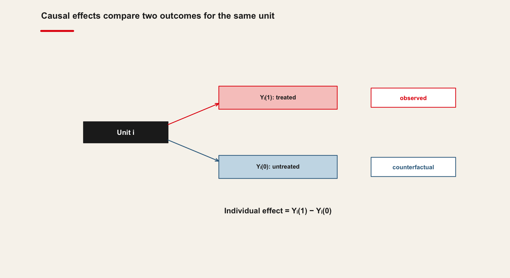
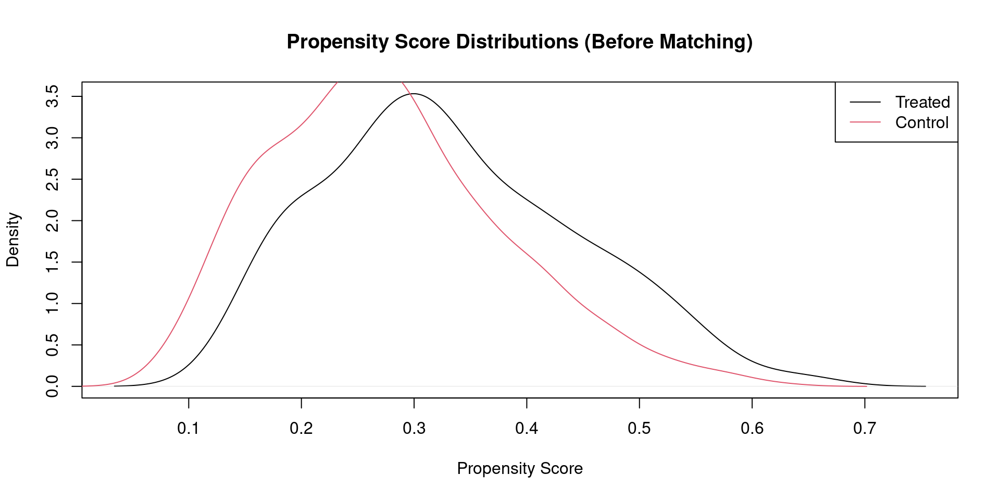
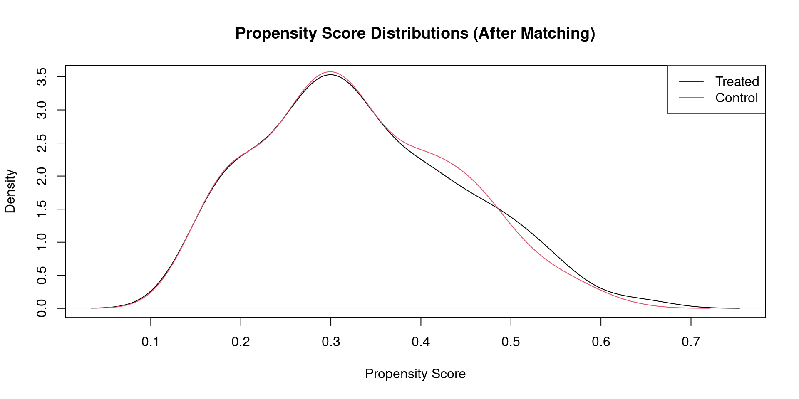
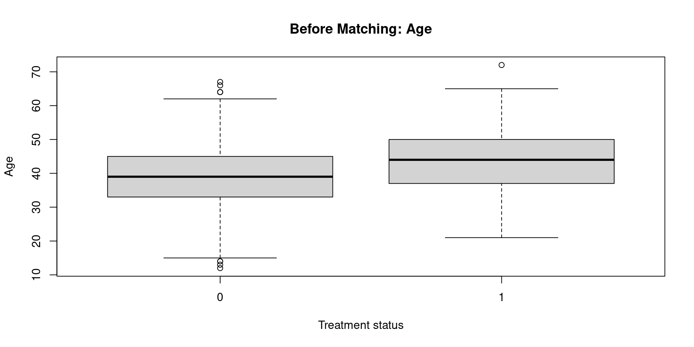
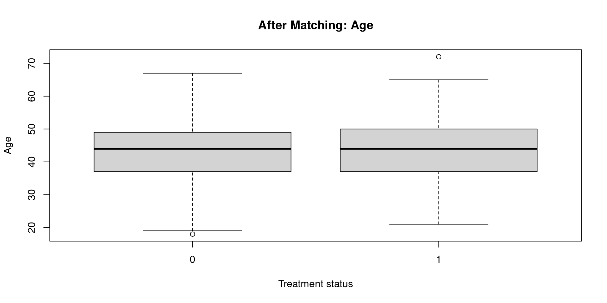

::: {.chapter-meta}
[Lecture slides](https://warint.github.io/quantitative-methods/session-10-lecture.html) · [Pre-session slides](https://warint.github.io/quantitative-methods/session-10-pre-session.html) · [Practice slides](https://warint.github.io/quantitative-methods/session-10-practice.html)
:::

> **Did the policy do anything, or were the groups different to begin with?**


| | |
|---|---|
| **Theme of the practice** | Can your project support a causal claim at all? |
| **Reading** | Bodory, Huber & Lafférs (2022), *Evaluating (weighted) dynamic treatment effects by double machine learning* · [article](https://doi.org/10.1093/ectj/utac018) |
| **Replication package** | [10.7910/DVN/FS0KBA](https://doi.org/10.7910/DVN/FS0KBA) |
| **Data** | `qmib.load("core")` — the spine's documented treatment, with a known effect to recover |


::: {.plate}
{fig-alt="Portrait of David Hume, 1711–1776."}

**David Hume** · 1711–1776

Asked what entitles us to say one thing causes another, and did not find a satisfying answer. Neither has anyone since.

[Allan Ramsay, 1766. Public domain, via Wikimedia Commons.]{.plate-credit}
:::


## Before the session

> **Did the policy do anything, or were the groups different to begin with?**

> **[Open the pre-session slides](https://warint.github.io/quantitative-methods/session-10-pre-session.html)** ·
> source: [`MATH60033A-S10-Pre-Session.qmd`](https://github.com/warint/quantitative-methods/blob/main/MATH60033A-S10-Pre-Session.qmd)

Two things to do before class, and they are the two halves of the practice.
Budget **60–90 minutes**.

| | Before class | Used in the practice for |
|---|---|---|
| **1** | Read the paper | reproducing one of its results |
| **2** | Get both datasets | that, and applying the method to your own angle |

---

### 1. The reading — 45–60 min

**Bodory, Huber & Lafférs (2022), *Evaluating (weighted) dynamic treatment effects by double machine learning***
[Read the article](https://doi.org/10.1093/ectj/utac018)

Read for the **argument**, not for coverage:

| | What to look for |
|---|---|
| **1** | The research question, in one sentence |
| **2** | The method or design, and why they chose it |
| **3** | The strongest single piece of evidence |
| **4** | One limitation you would raise as a referee |

**Annotate as you go.** You will be asked what you underlined and why.

---

### 2. The data — 10 min

You need **two** datasets in the practice, and both should be on your machine before you arrive.

#### a) The paper's replication package

This is what you reproduce in the first twenty minutes of the practice.

**Harvard Dataverse: [10.7910/DVN/FS0KBA](https://doi.org/10.7910/DVN/FS0KBA)**

Download it once, and unzip it here — the folder is git-ignored, so nothing large is committed:

```text
10-causal-inference-foundations/data/replication/
```

Keep the authors' own folder structure and README.

#### b) The course data, for your own angle

This is what you apply the method to in the second half.

```python
import qmib

data = qmib.load("core")      # what the lecture uses
core = qmib.load("core")                 # shared by every group
mine = qmib.load("angle_c_country")      # YOUR angle — see your dictionary

print(data.shape, core.shape, mine.shape)
```

The spine's documented treatment, with a known effect to recover.

> Run this **before** class. It downloads once and caches as parquet, so the practice works
> whatever the room's wifi is doing. `qmib.catalog()` lists everything available.

Your group's file, columns, units and traps are in your
[data dictionary](https://github.com/warint/quantitative-methods/blob/main/data/spine/dictionaries/).

---

### 3. Self-check — 15 min

Answer on paper. If you cannot, that is what the lecture is for.

1. In one sentence: what does this session's method let you claim that the previous one did not?
2. What must be true of your data for it to apply?
3. Which claim in the paper rests on this method — and how hard does it lean on it?

---

### Arrive with

- [ ] The paper read and annotated
- [ ] The replication package downloaded and unzipped
- [ ] `qmib.load()` run at least once, so the cache exists
- [ ] Your self-check answers, on paper

---

[Session 10 overview](session-10.qmd) · [The lecture](#the-lecture) ·
[The practice](#in-the-practice)

## The lecture

::: {.muted}
Delivered from [the slides](https://warint.github.io/quantitative-methods/session-10-lecture.html). What follows is the same material as prose.
:::

<!-- Imported from https://warin.ca/quant/en/session10_cours/. Content is static so the deck renders without R or Python. -->
## Causal Inference: Logic and Tools

## Session Overview

-   Motivation: Why regression isn't enough
-   Key Concepts: Counterfactuals, potential outcomes, Rubin Causal Model
-   Core Methods: RCTs, Matching, IV, DiD
-   Assumptions & Validity: Parallel trends, exclusion restriction, internal vs. external validity
-   Applications in Policy and Management

## Objectives

-   Distinguish correlation from causation
-   Explain potential outcomes and counterfactuals
-   Apply causal inference techniques in R
-   Evaluate assumptions and threats to identification
-   Interpret empirical strategies in applied research


{.r-stretch}

## Counterfactual Framework

## The Rubin Causal Model

Causal inference is fundamentally about comparison---understanding what would have happened to the same unit had it experienced a different condition.

In the potential outcomes framework, each unit $i$ has two potential outcomes:

-   $Y_i(1)$: the outcome if treated
-   $Y_i(0)$: the outcome if untreated

The causal effect for unit $i$ is defined as $Y_i(1) - Y_i(0)$.

> However, only one of these outcomes is ever observed; the other remains a counterfactual. This is the core problem that causal inference aims to address.

## Why It Matters

Without this framework, we cannot articulate what it means for a treatment to have an effect. Understanding causal effects requires us to think explicitly about what did *not* happen.


## Real Example of Observed and Counterfactual Outcomes

Consider a public policy intervention such as a **subsidy for electric-vehicle (EV) purchases**. Suppose the government introduces a financial incentive intended to increase EV adoption among households. For each household (i), we can define two potential outcomes:

$$ Y_i(1) = \text{EV adoption if the household receives the subsidy}, $$

$$ Y_i(0) = \text{EV adoption if the household does not receive the subsidy}. $$

## Observed vs. Counterfactual

Imagine a specific household, say **Household 27**. After the policy is implemented, Household 27 *does* receive the subsidy and purchases an electric vehicle. Therefore, we observe:

$$ Y\_{27}(1) = 1. $$

But we never observe the counterfactual outcome:

$$ Y\_{27}(0) = ? $$

## The Missing Counterfactual

This non-observed outcome represents what would have happened *to the same household* had it **not** received the subsidy. It is fundamentally unobservable, because the household cannot simultaneously be treated and untreated. Yet this is precisely the comparison needed to identify the causal effect for that household:

$$ \text{Causal Effect}*{27} = Y*{27}(1) - Y\_{27}(0). $$

Since $Y\_{27}(0)$ is missing by design---not due to lack of data but because of the logic of causality---researchers must rely on techniques such as randomized controlled trials, matching, instrumental variables, or difference-in-differences to recover credible approximations of this unobserved counterfactual.

This tension between **observed reality** and **missing counterfactuals** encapsulates the fundamental problem of causal inference articulated by Rubin (1974) and formalized in the potential-outcomes framework.

## How to Proceed

> We aim to estimate the average causal effect (ATE) by constructing designs or assumptions that allow us to approximate the missing counterfactuals.

How? By creating comparable groups through randomization, matching, or leveraging natural experiments.

## Randomized Controlled Trials (RCTs)

## Why Randomize?

Randomization is the most reliable method for ensuring that treated and control groups are comparable.

> It removes systematic differences between groups, which means that any observed difference in outcomes can be attributed to the treatment.

## What For?

RCTs allow us to isolate the effect of a single intervention, making them the gold standard for internal validity.

They are widely used in medicine, economics, and the social sciences.

## How It Works

Units are assigned to treatment or control groups purely by chance.

> This ensures balance on both observed and unobserved confounders.

## Example in R

Suppose an employer offers an intensive data-analytics training course aimed at improving employees' performance in tasks that rely on quantitative analysis and digital tools. The variable `treat` indicates whether an employee participated in the training (1) or not (0). The variables `age`, `education`, and `experience` describe each employee's profile: `age` in years, `education` as years of schooling, and `experience` as years of labour-market experience, approximately measured as age minus 18 with some noise, which is standard in labour economics.

## Data Generation Process

In this organization, employees who are slightly older and more educated are more likely to be selected or to self-select into the training programme. This is reflected in the way `treat` is generated: the probability of being treated increases with age and education through the propensity score `ps`. This captures realistic selection mechanisms, such as managers prioritizing "high-potential" workers or those already in more skilled positions.

The outcome variable, `outcome`, can be interpreted as an index of job performance or productivity, for example a standardized annual performance score used in internal evaluations, or an objective productivity measure (such as the number of correctly processed files, resolved cases, or successfully completed projects). The data-generating process assumes that performance increases with age, education, and experience, which is consistent with human capital theory. On top of these effects, the training programme has a true causal effect of +3 units on the performance index for those who participate. This models the idea that, after controlling for their characteristics, employees who receive the training perform systematically better than similar employees who do not.

## Data Simulation

::::: cell
``` {.sourceCode .numberSource .python .number-lines .code-with-copy}
# In the VS Codium terminal, with .venv active:  python
import numpy as np, pandas as pd
from scipy.special import expit

rng = np.random.default_rng(123)
n = 800

# Covariates
age        = np.round(rng.normal(40, 10, n))
education  = np.round(rng.normal(14, 2, n))
experience = np.maximum(0, age - 18 + rng.normal(0, 3, n))

# Treatment is NOT random: older, more educated people take it up more often.
ps_true = expit(-5 + 0.05 * age + 0.15 * education)
treat   = rng.binomial(1, ps_true)

# The true effect we are trying to recover is +2.5
outcome = 20 + 2.5 * treat + 0.3 * age + 0.8 * education + rng.normal(0, 5, n)

df = pd.DataFrame(dict(age=age, education=education, experience=experience,
                       treat=treat, outcome=outcome))
```

```text
  treat age education experience  outcome
1     0  34        15   15.13293 51.35139
2     0  38        13   21.96954 47.27609
3     1  56        16   36.63801 63.76421
4     0  41        16   21.21841 65.16926
5     0  41        15   17.86886 55.22382
6     0  57        14   38.37165 65.50069
```
:::::

## Estimating the Treatment Effect

::::: cell
``` {.sourceCode .numberSource .python .number-lines .code-with-copy}
rng = np.random.default_rng(42)
n = 100
treatment = rng.binomial(1, 0.5, n)          # randomised: no confounding
y = 50 + 5 * treatment + rng.normal(0, 10, n)

y[treatment == 1].mean() - y[treatment == 0].mean()
```

```text
[1] 6.975967
```
:::::

## Interpretation

Here, the difference in means provides an unbiased estimate of the Average Treatment Effect (ATE).

## Observational Data: Challenges

## Why Not Always Use RCTs?

RCTs are not always feasible due to ethical, financial, or logistical constraints. In many real-world settings, we rely on observational data.

## What's the Risk?

In observational studies, treatment assignment is not random. This introduces selection bias: treated and control units may differ systematically in ways that affect the outcome.

## What We Need

To estimate causal effects from observational data, we need methods that adjust for these differences or mimic randomization.

## Matching Methods

## Why Use Matching?

Matching is a technique designed to reduce selection bias in observational studies by creating a control group that is comparable to the treated group on observed characteristics.

## What For?

It aims to emulate the balance achieved in RCTs, making the treatment and control groups as similar as possible in terms of observable covariates.

## How It Works

We calculate a propensity score---the probability of receiving treatment given observed covariates---and match each treated unit to one or more control units with a similar score.

## R Example

Imagine that a large public-sector organization has implemented an advanced **data-analytics training programme** for its employees. Participation is voluntary but encouraged for individuals working in analytically demanding units. As a result, the employees who choose to enrol tend to be somewhat older, more educated, and more experienced---characteristics that are also associated with better job performance. This creates a **confounding problem**: treated and untreated employees differ in systematic ways that also predict outcomes.

## Objective

The HR analytics team wants to estimate whether the training actually **improves job performance**, measured by a standardized annual performance index. They cannot rely on simple mean comparisons, because employees who enrolled in the training differ on observable dimensions that are associated with performance. To obtain a more credible estimate of the causal effect, they apply **nearest-neighbour propensity score matching**.

## The model

::::: cell
``` {.sourceCode .numberSource .python .number-lines .code-with-copy}
from sklearn.neighbors import NearestNeighbors
import statsmodels.formula.api as smf

# 1:1 nearest-neighbour matching on the propensity score
treated, control = df[df.treat == 1], df[df.treat == 0]
nn = NearestNeighbors(n_neighbors=1).fit(control[["pscore"]])
_, idx = nn.kneighbors(treated[["pscore"]])
matched = pd.concat([treated, control.iloc[idx.ravel()]])

smf.ols("outcome ~ treat", data=matched).fit().summary()
```

```text
    Welch Two Sample t-test

data:  outcome by treat
t = -3.0569, df = 463.82, p-value = 0.002366
alternative hypothesis: true difference in means between group 0 and group 1 is not equal to 0
95 percent confidence interval:
 -4.4337743 -0.9638923
sample estimates:
mean in group 0 mean in group 1 
       57.18446        59.88329 
```
:::::

implements the following reasoning. The `matchit()` function constructs a matched sample in which treated and untreated employees are paired with others who have similar values of age, education, and experience. This aims to approximate the conditions of a randomized experiment by balancing key covariates. After matching, the organization compares the performance outcomes between the two groups using a t-test. The goal is to estimate how much of the performance difference can plausibly be attributed to the training rather than to pre-existing differences in employee characteristics.

## Interpretation

In this scenario, the matching procedure is understood as a method for approximating the unobserved counterfactual---what treated employees' performance would have been had they not participated.

> The resulting matched estimate provides a substantively meaningful measure of the programme's effectiveness under the assumption of conditional independence.

## Limitations

> Matching only accounts for observed variables. Any unmeasured confounder can still bias the results.

## Exercise: Propensity Score Matching and Post-Matching Estimation

## Problem Statement

You are given a dataframe named `df` with the following variables:

-   `treat`: a binary treatment indicator equal to 1 for treated units and 0 for control units.
-   `outcome`: a continuous outcome.
-   `age`, `education`, `experience`: pre-treatment covariates that may jointly influence both treatment assignment and the outcome.

Your task is to estimate the causal effect of the treatment on the outcome using propensity score matching. Use the **MatchIt** package to implement nearest-neighbor matching without replacement, and evaluate the quality of the matching using **PSAgraphics**. Then, run a linear regression of the outcome on the treatment in the matched sample.

## Steps to Follow

Perform the following steps:

1.  Estimate a propensity score using a logit model with covariates `x1`, `x2`, and `x3`.
2.  Perform nearest-neighbor matching (one-to-one) using the estimated propensity score.
3.  Assess covariate balance before and after matching using graphical diagnostics.
4.  Extract the matched dataset and estimate the average treatment effect on the treated (ATT) using a linear regression of `y` on `treat`.
5.  Interpret the results substantively.

## **Solution**

## **Step 1. Estimating the propensity score**

Propensity scores summarize the probability of receiving treatment conditional on observable covariates. Here, the probability is modeled via a logistic regression. This corresponds to the classical Rosenbaum and Rubin (1983) framework in which identification requires unconfoundedness and overlap.

::::: cell
``` {.sourceCode .numberSource .python .number-lines .code-with-copy}
import statsmodels.formula.api as smf

# Estimate the propensity score: the probability of treatment given covariates
ps_model = smf.logit("treat ~ age + education + experience", data=df).fit()
df["pscore"] = ps_model.predict(df)

print(ps_model.summary())
```

```text
Call:
glm(formula = treat ~ age + education + experience, family = binomial(), 
    data = df)

Coefficients:
            Estimate Std. Error z value Pr(>|z|)    
(Intercept) -4.47646    0.85261  -5.250 1.52e-07 ***
age          0.02815    0.02818   0.999 0.317732    
education    0.13609    0.04076   3.339 0.000841 ***
experience   0.02170    0.02669   0.813 0.416268    
---
Signif. codes:  0 '***' 0.001 '**' 0.01 '*' 0.05 '.' 0.1 ' ' 1

(Dispersion parameter for binomial family taken to be 1)

    Null deviance: 965.23  on 799  degrees of freedom
Residual deviance: 918.46  on 796  degrees of freedom
AIC: 926.46

Number of Fisher Scoring iterations: 4
```
:::::

This output provides the estimated influence of each covariate on the likelihood of receiving the treatment. Covariates should be selected based on theoretical arguments regarding confounding, rather than any predictive purpose.

## **Step 2. Performing nearest-neighbor matching**

Using the estimated scores, nearest-neighbor matching without replacement is implemented. This aligns each treated unit with a similar untreated unit based on the estimated propensity score.

::::: cell
``` {.sourceCode .numberSource .python .number-lines .code-with-copy}
from sklearn.neighbors import NearestNeighbors

treated, control = df[df.treat == 1], df[df.treat == 0]
nn = NearestNeighbors(n_neighbors=1).fit(control[["pscore"]])
_, idx = nn.kneighbors(treated[["pscore"]])
matched = pd.concat([treated, control.iloc[idx.ravel()]])

print(f"{len(treated)} treated matched to {len(set(idx.ravel()))} distinct controls")
```

```text
Call:
matchit(formula = treat ~ age + education + experience, data = df, 
    method = "nearest", distance = "logit", replace = FALSE)

Summary of Balance for All Data:
           Means Treated Means Control Std. Mean Diff. Var. Ratio eCDF Mean
distance          0.3319        0.2745          0.5083     1.1864    0.1450
age              43.2661       38.8025          0.4570     1.0457    0.0792
education        14.4206       13.9436          0.2416     0.9749    0.0370
experience       25.4287       20.7730          0.4478     1.0897    0.1282
           eCDF Max
distance     0.2264
age          0.1986
education    0.1070
experience   0.2060

Summary of Balance for Matched Data:
           Means Treated Means Control Std. Mean Diff. Var. Ratio eCDF Mean
distance          0.3319        0.3288          0.0277     1.0908    0.0035
age              43.2661       43.2661          0.0000     1.1483    0.0136
education        14.4206       14.3648          0.0283     1.0448    0.0109
experience       25.4287       25.1901          0.0230     1.1726    0.0188
           eCDF Max Std. Pair Dist.
distance     0.0429          0.0295
age          0.0472          5.6738
education    0.0258          0.9932
experience   0.0515          0.5554

Sample Sizes:
          Control Treated
All           567     233
Matched       233     233
Unmatched     334       0
Discarded       0       0
```
:::::

## **Interpreting the Balance Table Before Matching**

You have the following results:

  ------------------------------------------------------------------------------------------------
  Variable     Treated Mean   Control Mean   Std. Mean Diff.   Var. Ratio   eCDF Mean   eCDF Max
  ------------ -------------- -------------- ----------------- ------------ ----------- ----------
  distance     0.3319         0.2745         0.5083            1.1864       0.1450      0.2264

  age          43.2661        38.8025        0.4570            1.0457       0.0792      0.1986

  education    14.4206        13.9436        0.2416            0.9749       0.0370      0.1070

  experience   25.4287        20.7730        0.4478            1.0897       0.1282      0.2060
  ------------------------------------------------------------------------------------------------

These numbers reflect the **balance before matching**, meaning how different the treated and control groups are in the raw data.

## **Means (Treated vs. Control)**

These columns simply report the average value of each variable in the treated and control groups.

For example:

-   **Age**: Treated = 43.27, Control = 38.80 On average, treated individuals are **older**.

-   **Experience**: Treated = 25.43, Control = 20.77 Treated individuals have **more prior experience**.

These raw differences suggest **selection into treatment**: people with higher age and experience are more likely to be treated.

## **Standardized Mean Difference (SMD)**

This is the most important measure. It shows the difference in means in units of standard deviations. The rule of thumb:

-   \|SMD\| \< **0.10** → excellent balance
-   \|SMD\| \< **0.20** → acceptable
-   \|SMD\| \> **0.25** → problematic imbalance
-   \|SMD\| \> **0.40** → severe imbalance

our values:

-   **distance**: 0.5083 → severe imbalance
-   **age**: 0.4570 → severe imbalance
-   **experience**: 0.4478 → severe imbalance
-   **education**: 0.2416 → moderate imbalance

## **Interpretation**

Before matching, the treated and control groups differ substantially on the covariates and on the propensity score. The matching procedure has a lot of work to do.

## **Variance Ratio**

Variance ratio = Var(treated) / Var(control)

Guidelines:

-   Between **0.80 and 1.25** → good
-   Below 0.60 or above 1.40 → problematic

our values:

-   **age**: 1.0457 → good
-   **education**: 0.9749 → excellent
-   **experience**: 1.0897 → acceptable
-   **distance**: 1.1864 → acceptable

## **Interpretation**

Variances are fairly similar across groups. The main problem is **mean differences**, not dispersion.

## **eCDF Mean and eCDF Max**

These measure differences between the treated and control **entire distributions**:

-   **eCDF Mean**: average difference in cumulative distribution functions
-   **eCDF Max**: maximum difference between distributions (Kolmogorov--Smirnov distance)

Interpretation thresholds are less formal, but:

-   Values \< **0.10** → good
-   Values between **0.10 and 0.20** → moderate imbalance
-   Values \> **0.20** → problematic imbalance

our values:

-   **distance eCDF Max = 0.2264** → problematic
-   **experience eCDF Max = 0.2060** → problematic
-   **age eCDF Max = 0.1986** → moderate-to-high
-   **education eCDF Max = 0.1070** → acceptable

## **Interpretation**

Age, experience, and the propensity score distributions differ notably between groups.

## **Overall Interpretation**

our pre-matching table shows **substantial imbalance** between treated and control units:

1.  **Age** and **experience** show large standardized mean differences (\> 0.45).
2.  The **propensity score (distance)** also shows a very large SMD (\> 0.50).
3.  Distributional metrics (eCDF Max) confirm these differences.
4.  Variance ratios are acceptable, so the issue is not variance but **mean shifts**.


Before matching, treated and untreated groups are **not comparable**.

Matching is therefore **necessary** to construct a credible counterfactual.

This table is exactly what we expect in observational data: the treatment is not randomized, so individuals self-select into treatment based on characteristics like age and experience.

## **Step 3. Covariate balance assessment**

Diagnosing the quality of matching is essential. Graphical tools from **PSAgraphics** are particularly useful for evaluating whether the pre-treatment covariates are better aligned post-matching.

:::: cell
``` {.sourceCode .numberSource .python .number-lines .code-with-copy}
import matplotlib.pyplot as plt

# Before matching: do the two groups even overlap?
df[df.treat == 1]["pscore"].plot.density(label="Treated")
df[df.treat == 0]["pscore"].plot.density(label="Control")
plt.xlabel("Propensity score"); plt.title("Before matching"); plt.legend()
plt.show()
```
::::

{.r-stretch width="960"}

## **Step 4. Covariate balance assessment (continued)**

:::: cell
``` {.sourceCode .numberSource .python .number-lines .code-with-copy}
# After matching: the two distributions should sit on top of each other
matched[matched.treat == 1]["pscore"].plot.density(label="Treated")
matched[matched.treat == 0]["pscore"].plot.density(label="Control")
plt.xlabel("Propensity score"); plt.title("After matching"); plt.legend()
plt.show()
```
::::

{.r-stretch width="960"}

## **Step 5. Covariate balance assessment (continued)**

:::: cell
``` {.sourceCode .numberSource .python .number-lines .code-with-copy}
df.boxplot(column="age", by="treat")
plt.suptitle(""); plt.title("Before matching: age"); plt.show()
```
::::

{.r-stretch width="960"}

## **Step 6. Covariate balance assessment (continued)**

:::: cell
``` {.sourceCode .numberSource .python .number-lines .code-with-copy}
matched.boxplot(column="age", by="treat")
plt.suptitle(""); plt.title("After matching: age"); plt.show()
```
::::

{.r-stretch width="960"}

Other diagnostic visuals include mirrored histograms or the "love plot" from the cobalt package, though the exercise here focuses on PSAgraphics.

## **Step 4. Estimating the treatment effect on the matched sample**

After matching, the dataset contains reweighted or selected observations reflecting similarity in covariate distributions. The linear model now approximates the average treatment effect on the treated (ATT). The regression does not have a causal interpretation unless matching succeeded in balancing confounders.

::::: cell
``` {.sourceCode .numberSource .python .number-lines .code-with-copy}
# The ATT: the treatment effect on the matched sample
att = smf.ols("outcome ~ treat", data=matched).fit()
print(att.summary())

print(f"\nATT = {att.params['treat']:+.3f}   (the truth we simulated is +2.5)")
```

```text
Call:
lm(formula = outcome ~ treat, data = matched_df, weights = weights)

Residuals:
    Min      1Q  Median      3Q     Max 
-24.486  -6.996   0.210   6.624  33.139 

Coefficients:
            Estimate Std. Error t value Pr(>|t|)    
(Intercept)  57.1845     0.6243  91.599  < 2e-16 ***
treat         2.6988     0.8829   3.057  0.00237 ** 
---
Signif. codes:  0 '***' 0.001 '**' 0.01 '*' 0.05 '.' 0.1 ' ' 1

Residual standard error: 9.529 on 464 degrees of freedom
Multiple R-squared:  0.01974,   Adjusted R-squared:  0.01763 
F-statistic: 9.344 on 1 and 464 DF,  p-value: 0.002366
```
:::::

The coefficient on `treat` corresponds to the estimated ATT. Weighting is recommended because MatchIt may assign non-unit weights even under nearest-neighbor algorithms.

High R² is not the goal in causal inference; unbiased estimation of the treatment effect is.

## **Step 5. Interpretation**

If the coefficient on `treat` is positive and statistically significant, this indicates that, conditional on observable characteristics and after matching treated individuals with comparable untreated individuals, the treatment led to an increase in the outcome `y` for the treated group. The magnitude represents the estimated average causal effect among those who actually received the treatment.

Interpretation must emphasize the assumptions underlying matching: unconfoundedness cannot be tested statistically, and overlap must be verified graphically. When these assumptions are plausible, propensity score matching constitutes an effective strategy for reducing selection bias in observational studies.

## **Additional Note on Naive Difference-in-Means**

::::: cell
``` {.sourceCode .numberSource .python .number-lines .code-with-copy}
# The naive comparison, for contrast
df.loc[df.treat == 1, "outcome"].mean() - df.loc[df.treat == 0, "outcome"].mean()
```

```text
[1] 6.471933
```
:::::

This does not invalidate matching.

It demonstrates that:

-   although the two groups were imbalanced on age, education, and experience, these variables happened not to create a major numerical bias in the naive difference-in-means but matching greatly improves internal validity and design transparency

> Matching primarily improves credibility, not necessarily magnitude.

## Your turn

## Team Work

Team 1: <https://cran.r-project.org/web/packages/MatchIt/vignettes/MatchIt.html>

Team 2: <https://dlab.berkeley.edu/news/introduction-propensity-score-matching-matchit>

Team 3: <https://simonejdemyr.com/r-tutorials/statistics/tutorial8.html> [data here](https://github.com/warint/quantitative-methods/blob/main/imported-assets/mydata.RData)

Team 4: <https://psa.bryer.org/effects-of-tutoring-on-course-grades.html>

## In the practice

### Causal Inference I: Counterfactuals, Randomisation, Matching

> **[Open the practice slides](https://warint.github.io/quantitative-methods/session-10-practice.html)** ·
> source: [`MATH60033A-S10-Practice.qmd`](https://github.com/warint/quantitative-methods/blob/main/MATH60033A-S10-Practice.qmd)

---

#### The theme of this session

> # Can your project support a causal claim at all?

All ten groups attack this question, each on **its own project**, and the last twenty minutes
assemble the answers.

---

#### What you are doing

The lecture showed the method on the session's dataset. You now apply it to **your own angle**, and
to the question your group is actually trying to answer
([`RESEARCH-MANDATES.md`](https://github.com/warint/quantitative-methods/blob/main/RESEARCH-MANDATES.md)).

The deliverable is not a printout. It is a **decision**, with the reason written down.

---

#### Before you start

Everyone in the group pushes at least once this session. Replace `XX` with your group number —
group 07 uses `group-07`.

```bash
git checkout -b group-XX
mkdir -p 10-causal-inference-foundations/02-practice/submissions/group-XX
```

---

#### 1 · Reproduce one result from the paper — 20 min

Take the result the pre-session reading rests on, and reproduce it — or establish that you cannot,
and say precisely where it breaks. A failed reproduction that is diagnosed earns full marks; one
that is not attempted earns none.

The paper is **Bodory, Huber & Lafférs (2022), *Evaluating (weighted) dynamic treatment effects by double machine learning***, and its replication package
([10.7910/DVN/FS0KBA](https://doi.org/10.7910/DVN/FS0KBA)) should already be unzipped at:

```text
10-causal-inference-foundations/data/replication/
```

The session's own dataset, for comparison:

```python
import qmib
data = qmib.load("core")
```

---

#### 2 · Apply the method to your own angle — 35 min

```python
core = qmib.load("core")
mine = qmib.load("angle_c_country")     # your angle — see your dictionary
df   = core.merge(mine, on=["geo", "time"], how="inner")
```

Fit the session's method on your own data. Report what the lecture said to report, in the units of
your own variables.

---

#### 3 · Break one assumption — 15 min

Every method in this course rests on something. Find the assumption this one rests on hardest, break
it deliberately, and record what happened to your answer. **This is the part that carries the
marks.**

---

#### 4 · Write it down — 20 min

A 250-word note in your submissions folder:

- What you found, in units
- Which assumption you broke, and what it did
- What this result does **not** license you to claim

---

#### Submitting

```bash
git add 10-causal-inference-foundations/02-practice/submissions/group-XX
git commit -m "Session 10 practice — group XX"
git push -u origin group-XX
```

Everyone pushes at least once. The log is the record of participation.

---

#### What loses marks

- Reporting a matched estimate with no overlap diagnostic
- Matching on a variable affected by the treatment
- Calling an association causal because you controlled for something
- Omitting the balance table

---

[<- The lecture](#the-lecture) · [Session 10 overview](session-10.qmd)
