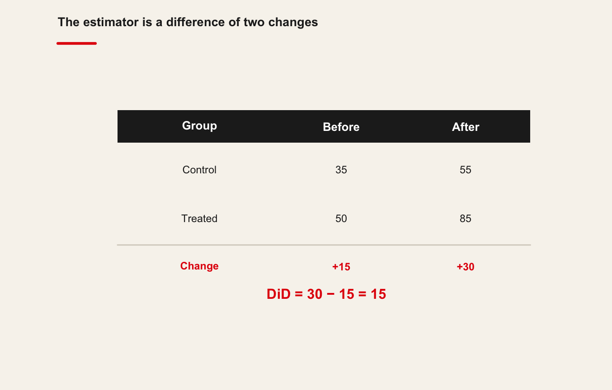

::: {.chapter-meta}
[Lecture slides](https://warint.github.io/quantitative-methods/session-11-lecture.html) · [Pre-session slides](https://warint.github.io/quantitative-methods/session-11-pre-session.html) · [Practice slides](https://warint.github.io/quantitative-methods/session-11-practice.html)
:::

> **What would have happened otherwise?**


| | |
|---|---|
| **Theme of the practice** | What is your counterfactual, and would anyone believe it? |
| **Reading** | Ferman & Pinto (2019), *Inference in Differences-in-Differences with Few Treated Groups and Heteroskedasticity* · [article](https://doi.org/10.1162/rest_a_00759) |
| **Replication package** | [10.7910/DVN/PIAZWN](https://doi.org/10.7910/DVN/PIAZWN) |
| **Data** | `qmib.load("core")` — the spine's post-2021 structural break, treated as a policy change |


::: {.plate}
{fig-alt="Portrait of John Snow, 1813–1858."}

**John Snow** · 1813–1858

Mapped cholera deaths in 1854 and read a natural experiment off the water supply — before the statistics existed to justify it.

[unknown, Autotype 1856, published in 1887. Public domain, via Wikimedia Commons.]{.plate-credit}
:::


## Before the session

> **What would have happened otherwise?**

> **[Open the pre-session slides](https://warint.github.io/quantitative-methods/session-11-pre-session.html)** ·
> source: [`MATH60033A-S11-Pre-Session.qmd`](https://github.com/warint/quantitative-methods/blob/main/MATH60033A-S11-Pre-Session.qmd)

Two things to do before class, and they are the two halves of the practice.
Budget **60–90 minutes**.

| | Before class | Used in the practice for |
|---|---|---|
| **1** | Read the paper | reproducing one of its results |
| **2** | Get both datasets | that, and applying the method to your own angle |

---

### 1. The reading — 45–60 min

**Ferman & Pinto (2019), *Inference in Differences-in-Differences with Few Treated Groups and Heteroskedasticity***
[Read the article](https://doi.org/10.1162/rest_a_00759)

Read for the **argument**, not for coverage:

| | What to look for |
|---|---|
| **1** | The research question, in one sentence |
| **2** | The method or design, and why they chose it |
| **3** | The strongest single piece of evidence |
| **4** | One limitation you would raise as a referee |

**Annotate as you go.** You will be asked what you underlined and why.

---

### 2. The data — 10 min

You need **two** datasets in the practice, and both should be on your machine before you arrive.

#### a) The paper's replication package

This is what you reproduce in the first twenty minutes of the practice.

**Harvard Dataverse: [10.7910/DVN/PIAZWN](https://doi.org/10.7910/DVN/PIAZWN)**

Download it once, and unzip it here — the folder is git-ignored, so nothing large is committed:

```text
11-causal-inference-did/data/replication/
```

Keep the authors' own folder structure and README.

#### b) The course data, for your own angle

This is what you apply the method to in the second half.

```python
import qmib

data = qmib.load("core")      # what the lecture uses
core = qmib.load("core")                 # shared by every group
mine = qmib.load("angle_c_country")      # YOUR angle — see your dictionary

print(data.shape, core.shape, mine.shape)
```

The spine's post-2021 structural break, treated as a policy change.

> Run this **before** class. It downloads once and caches as parquet, so the practice works
> whatever the room's wifi is doing. `qmib.catalog()` lists everything available.

Your group's file, columns, units and traps are in your
[data dictionary](https://github.com/warint/quantitative-methods/blob/main/data/spine/dictionaries/).

---

### 3. Self-check — 15 min

Answer on paper. If you cannot, that is what the lecture is for.

1. In one sentence: what does this session's method let you claim that the previous one did not?
2. What must be true of your data for it to apply?
3. Which claim in the paper rests on this method — and how hard does it lean on it?

---

### Arrive with

- [ ] The paper read and annotated
- [ ] The replication package downloaded and unzipped
- [ ] `qmib.load()` run at least once, so the cache exists
- [ ] Your self-check answers, on paper

---

[Session 11 overview](session-11.qmd) · [The lecture](#the-lecture) ·
[The practice](#in-the-practice)

## The lecture

::: {.muted}
Delivered from [the slides](https://warint.github.io/quantitative-methods/session-11-lecture.html). What follows is the same material as prose.
:::

<!-- Imported from https://warin.ca/quant/en/session11_cours/. Content is static so the deck renders without R or Python. -->

**Learning objectives**

-   Understand the scope of a difference-in-difference (DiD) model
-   Understand when a DiD design is appropriate
-   Understand how to structure data before estimating a DiD model
-   Identify and interpret the key coefficients in a DiD regression
-   Understand the parallel trends assumption
-   Apply a DiD model to data in R

## The key concept


The difference-in-difference model is used to estimate the effect of a policy intervention or treatment by comparing changes over time in an outcome for a treated group to changes over time for a comparison (control) group.

1.  It measures how the mean of an outcome changes before and after treatment for the treatment group.
2.  It compares this change with the mean change over time for a control group that is not exposed to the treatment.

We observe average outcomes for two groups, before and after the intervention.


Difference in difference model

{.r-stretch}


The DiD estimator is the difference between the average change in the treatment group and the average change in the control group:

$$ (\text{Treatment_post} - \text{Treatment_pre}) - (\text{Control_post} - \text{Control_pre}) = \widehat{\text{DiD}} $$

Using the values in :

$$ (85 - 50) - (55 - 35) = 15 $$


A more detailed representation is shown in the following table.

Difference in difference, an example

{.r-stretch}

The red number in the bottom-right cell represents the DiD estimator. When this estimator is different from zero, the treatment is interpreted as having an effect.


In this simple DiD setup:

> -   We work with grouped data, comparing a treatment and a control group.
> -   Coefficients represent group means and differences between group means; there is no time trend slope as in a standard time series regression.

## The statistical model

A basic DiD model can be written as:

$$ Y = \beta_0 + \beta_1 \cdot \text{Treatment} + \beta_2 \cdot \text{Post} + \beta_3 \cdot (\text{Treatment} \times \text{Post}) + e $$

Where:

-   Y.  is the outcome variable.
-   `Treatment` is a dummy variable equal to 1 for units in the treatment group and 0 for the control group.
-   `Post` is a dummy variable equal to 1 for the post-treatment period and 0 for the pre-treatment period.
-   `Treatment × Post` is an interaction term, equal to 1 only for treated units observed after the intervention.


A schematic dataset for a simple DiD design is:

  Subject   Outcome   Treatment   Post   Treatment × Post
  --------- --------- ----------- ------ ------------------
  1         74        1           1      1
  1         46        1           0      0
  2         96        1           1      1
  2         54        1           0      0
  3         50        0           1      0
  3         30        0           0      0
  4         60        0           1      0
  4         40        0           0      0

Two units belong to the treatment group and two units to the control group. For each unit there is one observation before and one observation after the treatment.

## The coefficients

We can estimate a simple DiD model corresponding to

  **Dependent variable:** Outcome   Estimate      Std. Error
  --------------------------------- ------------- ------------
  **Intercept (B0)**                35.00\*\*\*   (0.00)
  **Treatment (B1)**                15.00\*\*\*   (0.00)
  **Post-treatment (B2)**           20.00\*\*\*   (0.00)
  **Diff in Diff (B3)**             15.00\*\*\*   (0.00)

**Note:** p\<0.1; p\<0.05; p\<0.01


Each coefficient corresponds to a group mean or a difference between group means.

-   $\beta_0$ is the average outcome of the control group before treatment.

<figure>

<figcaption>Difference in difference, beta 0</figcaption>
</figure>

-   $\beta_1$ is the difference between the treatment and control group in the pre-treatment period. In the example, $\beta_1 = 15$, so $\beta_0 + \beta_1 = 50$, the pre-treatment mean for the treatment group.

<figure>

<figcaption>Difference in difference, beta 1</figcaption>
</figure>

-   $\beta_2$ captures the change in the average outcome of the control group from the pre-treatment to the post-treatment period. The post-treatment mean for the control group is $\beta_0 + \beta_2$.

<figure>

<figcaption>Difference in difference, beta 2</figcaption>
</figure>

{.r-stretch}

-   $\beta_3$ is the DiD estimator: it measures how much the average outcome in the treatment group changes in the post-treatment period relative to what would have happened in the absence of treatment.


Diff-in-Diff, beta 3

To obtain the post-treatment mean for the treatment group, we add:

$$ \beta_0 + \beta_1 + \beta_2 + \beta_3 $$

Each coefficient corresponds to a distinct hypothesis:

  --------------------------------------------------------------------------------------------------------------------------
  Coefficient                       Hypothesis
  --------------------------------- ----------------------------------------------------------------------------------------
  $\beta_0$   Is the average outcome of the control group before treatment different from 0?

  $\beta_1$   Is the pre-treatment difference between treatment and control groups different from 0?

  $\beta_2$   Is the change over time in the control group different from 0?

  $\beta_3$   DiD estimator: does the treatment have an effect?
  --------------------------------------------------------------------------------------------------------------------------

## The counterfactual

To interpret $\beta_3$, it is useful to consider the counterfactual.

The counterfactual is the outcome the treatment group would have experienced in the absence of the policy intervention. In the DiD framework, the counterfactual is inferred from the time trend observed in the control group.


DID counterfactual

{.r-stretch}


Using the simple four-cell example:

$$ (\text{Treatment_post} - \text{Treatment_pre}) = (\text{Control_post} - \text{Control_pre}) \\ (X - 50) = (55 - 35) \\ (X - 50) = 20 \\ X = 20 + 50 = 70 $$

So the counterfactual outcome for the treatment group in the post-treatment period is 70.


Using the regression coefficients, the counterfactual can also be written as:

$$ \text{Counterfactual} = \beta_0 + \beta_1 + \beta_2 $$

Counterfactual, betas

## A Difference-in-Difference model


Figure 1: A housing project in New York

{.r-stretch}

Governments at different levels subsidize housing projects to create affordable dwellings. This policy has gained prominence as housing costs have increased in many cities.

Critics of such programs often argue that the construction of affordable housing may reduce nearby property values. Possible mechanisms include:

-   Neighborhood preferences for proximity to high-income households
-   Congestion effects due to higher local population
-   Architectural mismatch between new projects and the existing housing stock


A DiD design can be used to examine whether housing projects reduce nearby house prices, as in Ellen et al. (2007).

We simulate data on housing prices for:

-   Houses located close to a subsidized housing project (treatment group)
-   Houses located far from such projects (control group)


Prices are observed before and after the construction of the subsidized housing site.

> **Research question:** Do affordable housing projects reduce the prices of nearby houses?
>
> **Hypothesis:** Houses near subsidized housing projects experience a larger decrease in prices over time.

## Data

::::: cell
``` {.sourceCode .numberSource .python .number-lines .code-with-copy}
# In the VS Codium terminal, with .venv active:  python
import pandas as pd

data = pd.DataFrame({
    "House_Price": [213679.8, 229355.4, 190580.1, 188669.0, 253573.7,
                    320094.0, 188525.7, 282998.4, 184424.0, 290409.4],
    "Group":          [0, 0, 1, 1, 0, 0, 1, 1, 0, 0],   # 1 = treated area
    "Post_Treatment": [0, 1, 0, 1, 0, 1, 0, 1, 0, 1],   # 1 = after the policy
})

data
```

```text
   House_Price Group Post_Treatment
1     213679.8     0              0
2     229355.4     0              1
3     190580.1     1              0
4     188669.0     1              1
5     253573.7     0              0
6     320094.0     0              1
7     188525.7     1              0
8     282998.4     1              1
9     184424.0     0              0
10    290409.4     0              1
```
:::::

Variables:

-   `House_Price`: house price
-   `Group`: 1 if close to a subsidized housing site, 0 otherwise
-   `Post_Treatment`: 1 if observed after the site opens, 0 otherwise

## Analysis

The DiD regression is:

$$ Y = \beta_0 + \beta_1 \cdot \text{Group} + \beta_2 \cdot \text{Post_Treatment} + \beta_3 \cdot (\text{Group} \times \text{Post_Treatment}) + e $$

:::: cell
``` {.sourceCode .numberSource .python .number-lines .code-with-copy}
import statsmodels.formula.api as smf

# The interaction IS the difference-in-differences estimate
reg_housing = smf.ols("House_Price ~ Group * Post_Treatment", data=data).fit()

print(reg_housing.summary())
print(f"\nDiD estimate = {reg_housing.params['Group:Post_Treatment']:+,.0f}")
```
::::


:::: cell
```text
================================================
                         Dependent variable:    
                     ---------------------------
                           Housing prices       
                                                
------------------------------------------------
Intercept (B0)              217,225.80***       
                             (24,879.25)        
                                                
Treatment group (B1)         -27,672.93         
                             (39,337.54)        
                                                
Post-treatment (B2)           62,727.10         
                             (35,184.57)        
                                                
Diff in Diff (B3)            -16,446.30         
                             (55,631.68)        
                                                
================================================
================================================
Note:                *p<0.1; **p<0.05; ***p<0.01
```
::::


Illustrative table (as in the original document):

-   Intercept ($\beta_0$): 216,672.60
-   Treatment group ($\beta_1$): 16,461.22
-   Post-treatment ($\beta_2$): 35,230.86
-   Diff in Diff ($\beta_3$): 34,066.02

## Discussion of the results

With the housing example, the main questions are:

-   Is the average price in the control group at time 1 different from zero?
-   Did the treatment and control groups differ in average price at time 1?
-   Did the control group experience a significant change in average price between time 1 and time 2?
-   Does the treatment group at time 2 differ from its counterfactual?


Interpretation (following the original text):

-   $\beta_0$ is statistically different from zero: average control-group price at time 1 is 216,672.60.
-   $\beta_1$ is statistically different from zero: treatment-group houses cost 16,461.22 more than control-group houses at time 1. The average price in the treatment group is 233,133.80.
-   $\beta_2$ is statistically different from zero: prices in the control group increase by 35,230.86, reaching 251,903.5 at time 2.
-   $\beta_3$ is statistically different from zero: the treatment group's prices increase by 34,066.02 more than they would have in the absence of treatment.

## The counterfactual

Using the coefficients, the counterfactual for the treatment group at time 2 is:

$$ \text{Counterfactual} = \beta_0 + \beta_1 + \beta_2 = 216,672.6 + 16,461.2 + 35,230.9 = 268,364.7 $$

Because the intervention occurred, the observed average price is:

$$ 268,364.7 + 34,066.0 = 302,430.7 $$


These values are summarized graphically:

Results from the working example

## Instrumental Variables: Your turn!


-   <https://rpubs.com/Sternonyos/913599>

::::: cell
``` {.sourceCode .numberSource .python .number-lines .code-with-copy}
data = pd.DataFrame({
    "Treatment":  [1, 0, 1, 1, 1, 0, 0, 1, 0, 1],
    "age":        [75, 62, 60, 60, 57, 55, 50, 48, 60, 51],
    "sex":        [1, 2, 1, 2, 2, 2, 2, 2, 1, 2],
    "education":  [3, 2, 1, 2, 1, 1, 1, 2, 2, 2],
    "marital":    [4, 4, 4, 4, 4, 4, 4, 4, 3, 3],
    "information":[1, 1, 1, 1, 1, 1, 1, 1, 1, 1],
    "income":     [3000, 3000, 11000, 1000, 1000, 4000, 3000, 2000, 2000, 3000],
    "newvar":     [1.45, 1.00, 1.45, 1.45, 1.45, 1.00, 1.00, 1.45, 1.00, 1.45],
    "info_index": [2.2967648, -0.6487551, 1.5254940, 1.5254940, 1.3712398,
                   -0.7515912, -0.8250455, 0.9084774, -0.6781368, 1.0627315],
})

data
```

```text
   Treatment age sex education marital information income newvar info_index
1          1  75   1         3       4           1   3000   1.45  2.2967648
2          0  62   2         2       4           1   3000   1.00 -0.6487551
3          1  60   1         1       4           1  11000   1.45  1.5254940
4          1  60   2         2       4           1   1000   1.45  1.5254940
5          1  57   2         1       4           1   1000   1.45  1.3712398
6          0  55   2         1       4           1   4000   1.00 -0.7515912
7          0  50   2         1       4           1   3000   1.00 -0.8250455
8          1  48   2         2       4           1   2000   1.45  0.9084774
9          0  60   1         2       3           1   2000   1.00 -0.6781368
10         1  51   2         2       3           1   3000   1.45  1.0627315
```
:::::

## Conclusion


-   The difference-in-difference model is a powerful tool for estimating causal effects in observational data.
-   It relies on the parallel trends assumption, which must be carefully considered and validated.
-   Proper data structuring and interpretation of coefficients are crucial for accurate analysis.
-   DiD models can be extended to include multiple time periods, covariates, and more complex designs.
-   Always visualize your data and results to ensure the validity of your findings.
-   IV models are another tool for causal inference when endogeneity is a concern.
-   Continue practicing with real-world datasets to solidify your understanding of these methods.


-   You have now an incredible toolbox to analyse social and business phenomena! I am really proud of you! You will change the world!

## In the practice

### Causal Inference II: Difference-in-Differences

> **[Open the practice slides](https://warint.github.io/quantitative-methods/session-11-practice.html)** ·
> source: [`MATH60033A-S11-Practice.qmd`](https://github.com/warint/quantitative-methods/blob/main/MATH60033A-S11-Practice.qmd)

---

#### The theme of this session

> # What is your counterfactual, and would anyone believe it?

All ten groups attack this question, each on **its own project**, and the last twenty minutes
assemble the answers.

---

#### What you are doing

The lecture showed the method on the session's dataset. You now apply it to **your own angle**, and
to the question your group is actually trying to answer
([`RESEARCH-MANDATES.md`](https://github.com/warint/quantitative-methods/blob/main/RESEARCH-MANDATES.md)).

The deliverable is not a printout. It is a **decision**, with the reason written down.

---

#### Before you start

Everyone in the group pushes at least once this session. Replace `XX` with your group number —
group 07 uses `group-07`.

```bash
git checkout -b group-XX
mkdir -p 11-causal-inference-did/02-practice/submissions/group-XX
```

---

#### 1 · Reproduce one result from the paper — 20 min

Take the result the pre-session reading rests on, and reproduce it — or establish that you cannot,
and say precisely where it breaks. A failed reproduction that is diagnosed earns full marks; one
that is not attempted earns none.

The paper is **Ferman & Pinto (2019), *Inference in Differences-in-Differences with Few Treated Groups and Heteroskedasticity***, and its replication package
([10.7910/DVN/PIAZWN](https://doi.org/10.7910/DVN/PIAZWN)) should already be unzipped at:

```text
11-causal-inference-did/data/replication/
```

The session's own dataset, for comparison:

```python
import qmib
data = qmib.load("core")
```

---

#### 2 · Apply the method to your own angle — 35 min

```python
core = qmib.load("core")
mine = qmib.load("angle_c_country")     # your angle — see your dictionary
df   = core.merge(mine, on=["geo", "time"], how="inner")
```

Fit the session's method on your own data. Report what the lecture said to report, in the units of
your own variables.

---

#### 3 · Break one assumption — 15 min

Every method in this course rests on something. Find the assumption this one rests on hardest, break
it deliberately, and record what happened to your answer. **This is the part that carries the
marks.**

---

#### 4 · Write it down — 20 min

A 250-word note in your submissions folder:

- What you found, in units
- Which assumption you broke, and what it did
- What this result does **not** license you to claim

---

#### Submitting

```bash
git add 11-causal-inference-did/02-practice/submissions/group-XX
git commit -m "Session 11 practice — group XX"
git push -u origin group-XX
```

Everyone pushes at least once. The log is the record of participation.

---

#### What loses marks

- A DiD with no evidence on parallel trends
- Reading the post-treatment dummy as the effect
- An instrument justified only by its first stage
- Claiming a causal effect the design cannot deliver

---

[<- The lecture](#the-lecture) · [Session 11 overview](session-11.qmd)
